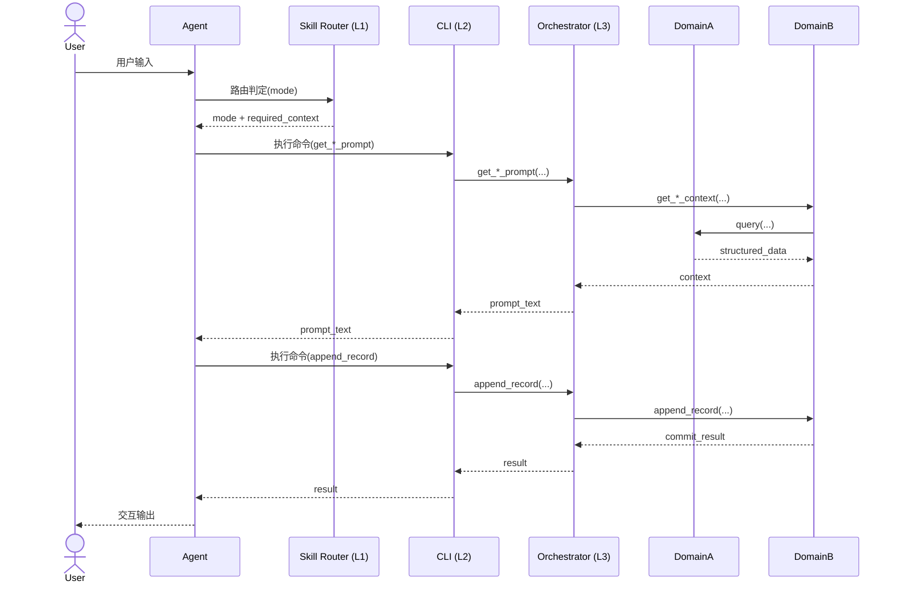

# 通用 AI Agent Skill 设计模板

> 基于 `docs/architecture-design.md` 抽象而来，用于快速设计具备「路由 -> 编排 -> 业务模块 -> 基础支撑」分层能力的 Agent Skill。

---

## 1. 目标与范围

### 1.1 Skill 基本信息（模板）

```yaml
---
name: <skill-name>
description: <一句话描述 Skill 解决的问题与核心能力>
args:
  type: string
  completions:
    - --mode=<mode-a>
    - --mode=<mode-b>
    - --context-id=
    - --payload-file=
---
```

### 1.2 适用场景

- **主要用户**：`<目标用户角色>`
- **核心任务**：`<Skill 支持完成的任务>`
- **交互模式**：`<mode-a>` / `<mode-b>` / `<mode-c>`（可扩展）
- **非目标范围**：`<明确不由 Skill 负责的内容>`

### 1.3 设计原则

1. **AI Agent 决策，脚本层供数**：策略推理与生成由 Agent + LLM 完成，脚本层提供结构化读写能力。
2. **编排层不承载业务聚合**：仅做参数校验、模块编排、文本封装；编排接口仅供内部调用。
3. **业务域通用化**：领域模块只提供可复用能力，不耦合具体会话话术。
4. **上下文最小化返回**：默认 `core + summary`，按需返回 `detail`，避免长上下文淹没模型。

---

## 2. 概要设计

### 2.1 分层架构（L1-L5，重定义）


| 层级            | 典型载体                                        | 职责                      |
| ------------- | ------------------------------------------- | ----------------------- |
| **L1 技能入口与模式契约** | `SKILL.md`、`modes/*.md`                     | Skill 元数据、意图路由、模式切换总规则，以及各模式输入/步骤/输出/失败处理定义。 |
| **L2 接口层（CLI）** | `scripts/cli/`                              | 供 AI Agent 调用的命令执行入口、参数解析、命令分发、结果标准化返回。 |
| **L3 编排层（内部）** | `scripts/orchestration/`                    | 内部编排接口、参数校验、模块编排、提示词封装。 |
| **L4 业务模块层**  | `scripts/<domain_a>/`、`scripts/<domain_b>/` | 领域能力与状态更新，不做模型推理。       |
| **L5 基础技术支撑** | `scripts/foundation/`                       | 存储适配、日志、通用基础能力。         |


### 2.2 核心流程



1. 用户提出目标或输入资料
2. AI Agent 内部 L1 路由层判定模式
3. AI Agent 调用 L2 CLI，CLI 解析参数并调用 L3 内部接口
4. L3 拉取/组装该模式上下文
5. Agent + LLM 生成交互响应
6. AI Agent 调用 L2 CLI 提交记录，L3 触发状态更新
7. AI Agent 输出 `summary + next_step`
8. 必要时触发下一模式（learn -> quiz -> review）

### 2.3 目录结构（模板）

```text
<skill-root>/
├─ SKILL.md
├─ modes/
│  ├─ shared.md
│  ├─ <mode-a>.md
│  ├─ <mode-b>.md
│  └─ <mode-c>.md
├─ data/
│  └─ <storage-backend-artifacts>
├─ scripts/
│  ├─ cli/
│  │  └─ main.<ext>
│  ├─ orchestration/
│  │  ├─ orchestration_app_service.<ext>
│  │  └─ prompt_templates.<ext>
│  ├─ <domain_a>/
│  │  ├─ api.<ext>
│  │  ├─ service.<ext>
│  │  └─ store.<ext>
│  ├─ <domain_b>/
│  │  ├─ api.<ext>
│  │  ├─ state.<ext>
│  │  └─ tasking.<ext>
│  ├─ foundation/
│  │  ├─ storage.<ext>
│  │  └─ logger.<ext>
│  └─ app.<ext>
├─ tests/
│  ├─ orchestration/
│  ├─ <domain_a>/
│  ├─ <domain_b>/
│  ├─ integration/
│  └─ prompt-validation/                    # 基于真实提示词会话的验收用例与证据快照
└─ docs/
   ├─ architecture-design.md
   └─ data-model-design.md
```

---

## 3. 路由与模式模板（L1）

### 3.1 SKILL 路由规则（模板）

1. 命中 `<mode-a>` 意图 -> 路由 `modes/<mode-a>.md`
2. 命中 `<mode-b>` 意图 -> 路由 `modes/<mode-b>.md`
3. 命中 `<mode-c>` 意图 -> 路由 `modes/<mode-c>.md`
4. 意图冲突/上下文不足 -> 路由 `modes/shared.md` 澄清一轮后回到路由
5. 会话内模式切换 -> 必须先回到 L1 重判后再分发

### 3.2 模式文档结构（统一模板）

每个 `modes/*.md` 建议统一为以下结构：

```markdown
# <mode-name>

## 触发条件
- <何时进入该模式>

## 输入
- required:
  - <field-a>
  - <field-b>
- optional:
  - <field-c>

## 步骤
1. <step-1>
2. <step-2>
3. <step-3>

## 输出
- mode: <mode-name>
- summary: <简要结论>
- next_step: <下一步动作>
- payload: <模式特有结构>

## 失败重试 / 降级
- <失败场景与重试策略>

## 下一步跳转
- <可跳转到哪些模式>
```

### 3.3 `shared.md` 最小职责

- 只做：意图澄清、上下文补齐、异常兜底、分流建议。
- 不做：具体业务流程执行、模式专属策略、数据持久化。
- 退出条件：一轮澄清后必须返回明确模式。

---

## 4. CLI 模板（L2 接口层）

### 4.1 CLI 角色定位

- CLI 是 AI Agent 在 `scripts/` 内部调用的命令执行入口。
- CLI 负责参数解析、命令分发、结果标准化返回给 AI Agent。
- CLI 作为 L2 接口层调用 L3 编排内部接口，不直接调用 L4/L5。

### 4.2 CLI 命令模板

```bash
<entry-command> fetch-mode-context \
  --mode <mode-a|mode-b|mode-c> \
  --context-id <id>

<entry-command> commit-interaction-record \
  --context-id <id> \
  --mode <mode-a|mode-b|mode-c> \
  --result-file <path>
```

### 4.3 AI Agent 调 CLI 的映射模板

| AI Agent 触发的 CLI 命令 | L3 内部接口 |
| --- | --- |
| `fetch-mode-context --mode <mode-a>` | `get_<mode-a>_context(...)` |
| `fetch-mode-context --mode <mode-b>` | `get_<mode-b>_context(...)` |
| `fetch-mode-context --mode <mode-c>` | `get_<mode-c>_context(...)` |
| `commit-interaction-record ...` | `append_<record>(...)` |
| `describe-capabilities` | `list_apis()` |
| `describe-capability --name ...` | `get_api_spec(api_name)` |

> 模板说明：以上命令为通用占位示例，不绑定任何具体项目；落地时请在项目文档中补充本项目的实际入口命令。

---

## 5. 编排内部接口模板（L3 编排层）

### 5.1 内部接口集（仅 AI Agent/L2 CLI 调用）

1. `list_apis()`
2. `get_api_spec(api_name)`
3. `list_<domain_a_objects>()`
4. `get_<domain_a_object>(id, ...)`
5. `create_<plan_or_session>(...)`
6. `get_<mode-a>_prompt(context_id, ...)`
7. `get_<mode-b>_prompt(context_id, ...)`
8. `get_<mode-c>_prompt(context_id, ...)`
9. `append_<record>(context_id, mode, payload)`

### 5.2 接口规格模板

```json
{
  "name": "<api_name>",
  "version": "v1",
  "summary": "<api 说明>",
  "input_schema": {
    "type": "object",
    "required": ["<required-field>"],
    "properties": {
      "<required-field>": { "type": "string" },
      "<optional-field>": { "type": "string" }
    }
  },
  "output_schema": {
    "type": "object",
    "required": ["summary"],
    "properties": {
      "summary": { "type": "string" },
      "detail": { "type": "object" }
    }
  }
}
```

### 5.3 编排层边界

- **应该做**：入参校验、跨模块编排、提示词模板封装、统一错误模型。
- **不应该做**：业务规则沉淀、直接操作底层存储、模型推理逻辑。
- **调用方约束**：L3 不直接暴露给最终用户；最终用户通过 AI Agent 触发能力，AI Agent 再调用 L2 CLI/L3。

---

## 6. 业务模块模板（L4）

### 6.1 `<domain_a>` 模块模板（例如内容治理、查询、校验）

- **模块职责**：`<对外提供的核心能力>`。
- **输入输出约束**：
  - 读接口默认返回 `summary + core`，按需展开 `detail`。
  - 集合接口必须提供 `pagination`（`limit/cursor/has_more`）。
- **写接口（如有）返回**：
  - `commit_result`
  - `state_delta_summary`（如适用）
  - `task_delta_summary`（如存在任务系统）
- **协作边界**：不直接承载编排逻辑，由 L3 统一调度调用。

### 6.2 `<domain_b>` 模块模板（例如计划、记录、状态、调度）

- **模块职责**：`<学习流程或业务状态聚合能力>`。
- **输入输出约束**：
  - 对上游（L3）返回场景化 `context`，默认 `summary + core`。
  - 需要时调用 `<domain_a>` 获取材料并在本模块完成聚合。
- **写接口返回**：
  - `commit_result`
  - `state_delta_summary`
  - `task_delta_summary`（如存在任务系统）
- **协作路径（示例）**：
  1. `<domain_b>` 根据 `scope/context` 调用 `<domain_a>` 获取材料。
  2. `<domain_b>` 聚合后返回场景化 `context` 给 L3。
  3. L3 将 `context` 转换为提示词文本给 Agent。
  4. Agent 回传结果后，L3 调用 `<domain_b>.append_*` 完成持久化与增量更新。

---

## 7. 基础支撑模板（L5）

- **存储适配**：统一在 `scripts/foundation/storage.py` 隔离底层存储差异（不绑定具体技术栈）。
- **日志规范**：记录路由结果、API 调用、错误上下文、关键写入事件。
- **最小可观测字段**：`trace_id`、`mode`、`api_name`、`elapsed_ms`、`status`。

---

## 8. 质量门禁与验收清单

### 8.1 架构一致性检查

- L1 统一承载路由与模式契约（`SKILL.md + modes/*.md`），`shared.md` 不越权
- L2 只做接口层职责（参数解析、命令分发、标准化返回），不沉淀业务规则
- L3 只做编排与封装，不沉淀业务规则
- 用户通过 AI Agent 触发能力；L2 CLI 仅供 AI Agent 调用，L3 不直接面向用户
- L4 返回结构化数据，默认 `core + summary`，支持按需 `detail`
- L5 统一存储与日志，不侵入业务语义

### 8.2 API 与数据检查

- 所有 L3 内部接口可被 L2 暴露的 `list_apis/get_api_spec` 自描述
- 入参与出参具备稳定 schema
- 写操作返回增量摘要（delta），不返回全量快照
- 集合查询具备分页控制，防止上下文爆炸

### 8.3 交互与体验检查

- 每轮输出包含 `summary` 与 `next_step`
- 失败路径有重试或降级策略
- 模式切换可追踪并可解释

### 8.4 基于提示词真实验证与用例约束

- 采用 **SKILL.md + modes/*.md 黑盒真实会话** 作为验收主路径。
- 必须使用真实提示词会话验证，不以单元测试、mock/stub 或逐字提示词匹配作为通过依据。
- 至少覆盖 `<mode-a>/<mode-b>/<mode-c>/shared` 的路由与切换，并验证会话契约字段（`mode/summary/next_step`）稳定存在。
- 应定义可量化阈值（如总轮次、跨天覆盖、方法论命中率、增量闭环次数），并在模板实例化时写入具体数字。
- 每条结论必须绑定证据：`prompt/response` 对话证据或生产状态证据（记录/任务/状态快照）。
- 建议维护结构化验证快照字段：`execution_mode`、`prompt_trace`、`methodology_evidence_map`、`contract_snapshot_per_turn`、`delta_from_previous`，支持持续回归比对。
- 在 `tests/prompt-validation/` 维护提示词验收用例，按模式与场景分组（如 `learn/quiz/review/shared`、跨模式切换、跨天场景）。
- 每个用例至少包含：`prompt`、`expected_contract`（最小校验 `mode/summary/next_step`）、`evidence_refs`（对话或状态证据引用）。
- 用例关注“行为与契约”而非逐字输出；允许语义等价表达。
- 建议同时维护人读报告与结构化快照，支持回归对比与退化定位。
- 提示词用例文件应使用 **Markdown**，内容可直接提交给大模型执行。
- 提示词用例不依赖任何单元测试代码、测试函数或测试框架；禁止通过 `pytest`/mock/stub 驱动用例执行。

最小化用例模板（Markdown，可直接给大模型）：

```markdown
# Case: pv-learn-001

## Mode
learn

## Prompt
请先讲解 TCP 三次握手，再给我一个检查理解的问题。

## Expected Contract
- mode: learn
- required_fields:
  - summary
  - next_step

## Evidence Refs
- turn:1
- state:record-<id>  <!-- 可选 -->
```

最小目录示例：

```text
tests/prompt-validation/
├─ learn/
│  └─ pv-learn-001.md
└─ review/
   └─ pv-review-001.md
```

---


