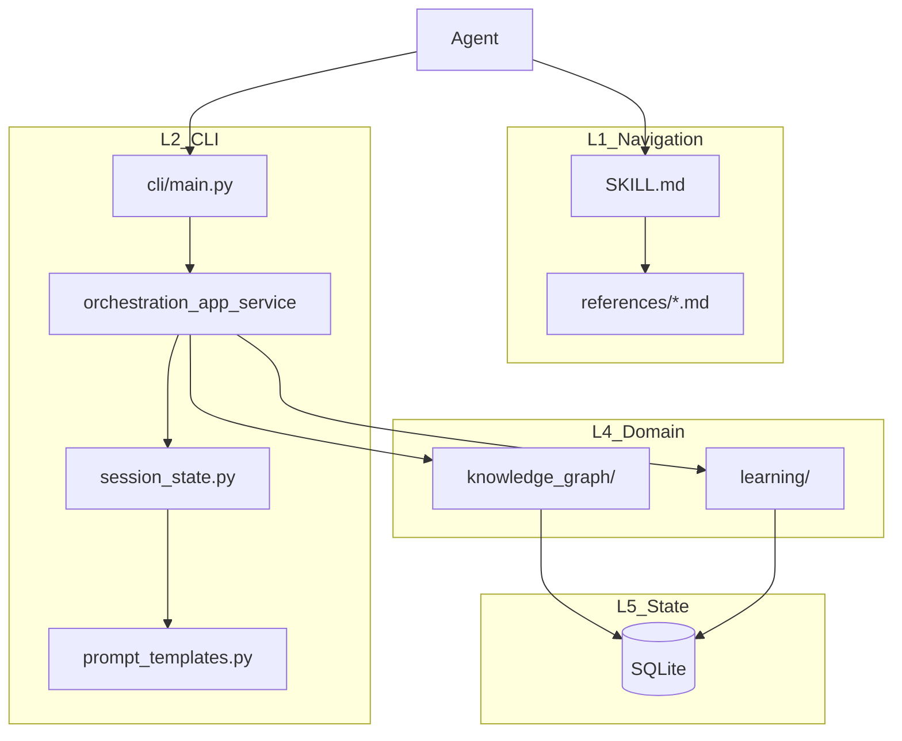
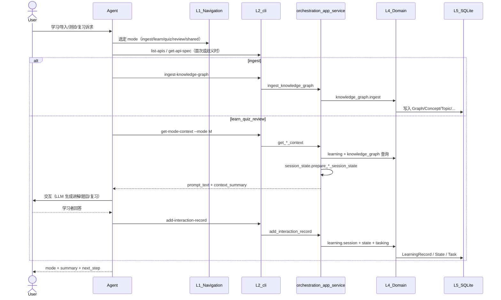
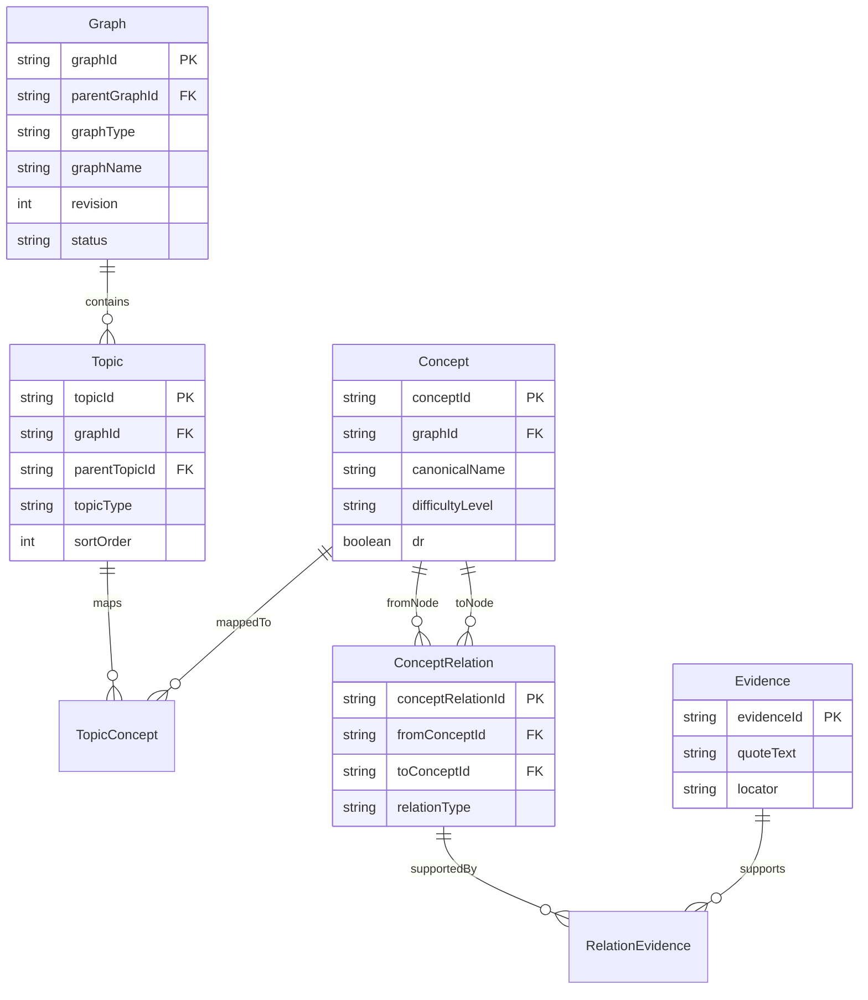
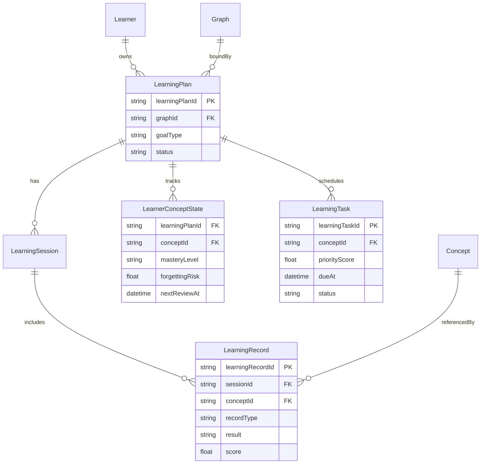

# learn-socratic — 架构设计文档

本文档为 learn-socratic 技能的**唯一权威设计说明**，对齐 [`skills/docs/ai-agent-skill-design-template.md`](../../docs/ai-agent-skill-design-template.md) 的 L1–L5 分层。模式执行契约以 `references/<mode>.md` 为准；本文不重复各 mode 的五节步骤全文。

---

## 1. 目标与范围

### 1.1 Skill 基本信息

```yaml
---
name: learn-socratic
description: Socratic learning from documents with graph ingest plus a learn/quiz/review loop, mastery tracking, spaced scheduling, and variant quizzing. Use when users ask to study, teach me, test me, review, memorize, make flashcards, or prep for exams.
---
```

- **CLI 入口**：`cd <skill-repo-root> && python -m scripts.cli.main <subcommand> …`
- **Python 入口**：`from scripts.app import create_app`

### 1.2 适用场景

- **主要用户**：自学者、备考者、资料维护者（导入/修订知识图谱）
- **核心任务**：资料结构化入图 → 苏格拉底式讲解 → 测验 → 间隔复习；掌握度诊断与薄弱点分析
- **交互模式**：`ingest` / `learn` / `quiz` / `review`（`shared` 仅澄清与恢复）
- **非目标范围**：文档 OCR/切片/抽取（由 Agent 调 LLM 完成）；对话长期记忆与上下文裁剪（由宿主 Agent 承担）；通用 RAG 检索服务

### 1.3 设计原则

1. **Agent 决策，分层定形**：路由、教学法与生成由 Agent 负责；可调用能力与参数契约由 L2（CLI + `API_SPECS`）定义；轮次输出字段由 L1 约定。
2. **CLI 薄层，域模块供数**：`scripts/cli/main.py` 暴露子命令；业务规则在 L4 域模块；`prompt_templates` 仅组装提示词结构，不承载 L1 轮次语义。
3. **业务能力模块化**：`knowledge_graph`、`learning`、`orchestration` 解耦；新增 API = `API_SPECS` 条目 + 域实现 + 可选 CLI 子命令。
4. **索引与语料**：本技能**不设** L3 `references/docs/` 语料层；动态语料来自入库图谱查询，静态方法论嵌入 `prompt_templates`。
5. **上下文最小充分**：列表 API 返回 `limit` / `offset` / `has_more`；Agent 每轮返回 `summary` + `next_step`。
6. **学习遥测门禁**（本技能特有）：`learn` / `quiz` / `review` 每判定一题须 `add-interaction-record` 成功后再推进队列或切换 mode（见 `SKILL.md` Session Guardrails）。

### 1.4 指导思想

本技能服务于「文档驱动的概念学习」业务域，方法论核心是**理解—表达—检验—复习**闭环：

1. **SOLO 递进**：测验问题从单点识别递进到关系整合与抽象迁移（由 `prompt_templates` 在 quiz 模式注入）。
2. **UBD 反向设计**：反馈关注可观察的理解证据（解释、阐释、应用），而非仅对错。
3. **费曼学习法**：learn 模式强调讲解 → 学习者复述 → 诊断缺口 → 简化重述。
4. **检索与变式练习**：quiz 先问后评；同一概念可轮换题型降低识别偏倚。
5. **间隔复习**：review 队列按逾期、遗忘风险、薄弱点加权排序（`learning/api.get_review_context` + `session_state.prepare_review_session_state`）。
6. **元认知校准**：`get-mastery-diagnostics` 对比掌握度与历史表现，支撑复习/再学决策。

---

## 2. 概要设计

### 2.1 统一逻辑分层（L1–L5）

| 逻辑层 | 主要实现载体 | learn-socratic 映射 |
| ------ | ------------ | ------------------- |
| **L1 导航层** | `SKILL.md`、`references/<mode>.md`、`references/shared.md` | 意图路由、Session Guardrails、各 mode 五节契约（适用场景/前置输入/执行步骤/停止条件/下一步调整） |
| **L2 CLI 层** | `scripts/cli/main.py`、`orchestration/orchestration_app_service.py`（`API_SPECS`）、`prompt_templates.py`、`session_state.py` | 能力发现、子命令执行、提示词与会话队列组装；**无** `regist.py` / 统一 `exec --method`（与通用模板等价能力由 `API_SPECS` + 具名子命令提供） |
| **L3 文档资料层** | `references/docs/<slice>/` | **未实现**；不入库静态讲义，学习材料来自 SQLite 图谱 |
| **L4 工具层** | `scripts/knowledge_graph/`、`scripts/learning/`、`scripts/orchestration/` | 图谱治理、学习计划/记录/状态/任务、编排门面 |
| **L5 状态层** | `~/.alavten/data/knowledge/knowledge_v1.sqlite3`（`scripts/foundation/storage.py`） | Graph / Plan / Record / State / Task 持久化 |



### 2.2 核心流程



端到端闭环：Agent/LLM 抽取结构化 payload → ingest 校验入图 → create/extend learning plan → get-mode-context 拉取上下文 → 交互 → add-interaction-record 更新掌握与调度 → 可选 get-mastery-diagnostics 报告。

---

## 3. 路由与模式（L1）

### 3.1 SKILL 路由规则

- **路由职责**：`SKILL.md` 定义 Intent Matrix、Session Guardrails、CLI 白名单；切换 mode 须先回 L1 重判。
- **索引路由**：无 `references/docs/indexes/content-index.md`；资料意图通过 `list-knowledge-graphs` / `get-knowledge-graph` 满足。
- **路由约束**：意图明确时直达 `references/<mode>.md`；冲突或缺上下文时进入 `references/shared.md` 一轮澄清后 handoff。

| 目标 mode | 关键词（示例） | 目标文档 | 前置条件 |
| --------- | -------------- | -------- | -------- |
| `ingest` | import, build graph, 章节顺序, reorder | `references/ingest.md` | `graph_id` + `structured_payload` |
| `learn` | teach me, learn, 讲解 | `references/learn.md` | `plan_id` |
| `quiz` | quiz, test me, 一题一题, 批量测验 | `references/quiz.md` | `plan_id` |
| `review` | review, recap, due | `references/review.md` | `plan_id` |
| `shared` | 意图冲突、薄弱点报告、缺 plan/graph | `references/shared.md` | — |

### 3.2 ingest 模式（`references/ingest.md`）

- **适用场景**：导入或更新知识图谱；一书一图、按章增量（`SKILL.md` Guardrails）；书序修正经 `reorder-graph-topics` 子流程（已合并进 ingest 契约，无独立 `reorder-topics.md`）。
- **成功标准**：`validation_summary.ok=true`。
- **权威契约**：`references/ingest.md`。

### 3.3 learn 模式（`references/learn.md`）

- **适用场景**：苏格拉底式讲解与带学。
- **成功标准**：讲授 `session_queue.current_item.concept_id` 且相关 record 已写入。
- **权威契约**：`references/learn.md`。

### 3.4 quiz 模式（`references/quiz.md`）

- **适用场景**：测验与掌握度检查；`quiz_pacing` 为 `per_concept` 或 `per_chapter`（脚本解析 `pacing_hint` / 近期 learn 粒度）。
- **成功标准**：每道已判定题各一条 `add_interaction_record`；`per_chapter` 时 `record_summary.written == expected`。
- **权威契约**：`references/quiz.md`。

### 3.5 review 模式（`references/review.md`）

- **适用场景**：间隔重复与薄弱巩固。
- **成功标准**：队列头概念完成复习且 record 已写入。
- **权威契约**：`references/review.md`。

### 3.6 shared 模式（`references/shared.md`）

- **职责**：`list-apis` / `get-api-spec` 发现；`list-knowledge-graphs` + `list-learning-plans` 双表澄清；Mode 选择表 handoff 至主 mode。**不**批量写 learning record。

### 3.7 轮次输出约定（L1）

| field | required | 说明 |
| ----- | -------- | ---- |
| `mode` | yes | 当前 mode |
| `summary` | yes | 本轮摘要 |
| `next_step` | yes | 下一步建议 |
| `quiz_pacing` | quiz | `per_concept` \| `per_chapter` |
| `record_summary` | quiz（有判定时） | `{ expected, written, failed }` |
| `validation_summary` | ingest | 入库校验结果 |
| `context_summary` | learn/quiz/review（CLI） | 含 `session_queue`、`next_session_context` |

列表类 payload 须含 `has_more` / `next_offset`（如图谱分页）。

---

## 4. CLI 层（L2）

### 4.1 角色定位

| 职责 | 载体 | 说明 |
| ---- | ---- | ---- |
| API 注册与自描述 | `orchestration_app_service.API_SPECS` | 与 `list-apis` / `get-api-spec` 同源 |
| CLI 暴露 | `scripts/cli/main.py` | 具名子命令（非模板 `exec --method`） |
| 提示词组装 | `prompt_templates.build_prompt` | learn/quiz/review 教学法提示 |
| 会话状态 | `session_state.py` | 队列、pacing、重试状态 |

与通用模板等价关系：`API_SPECS` ≈ `_METHOD_REGISTRY`；`python -m scripts.cli.main <cmd>` ≈ `exec --method`。

### 4.2 能力发现

```bash
python -m scripts.cli.main list-apis
python -m scripts.cli.main get-api-spec --api-name <kebab-case-name>
```

- API `name` 为 **kebab-case**（如 `create-learning-plan`）；JSON 字段为 **snake_case**（`graph_id`、`plan_id`）。
- 无 `references/docs/indexes/content-index.md`。

### 4.3 CLI 子命令表

| 子命令 | 对应 API（kebab） | 说明 |
| ------ | ----------------- | ---- |
| `list-apis` | `list-apis` | 可调用 API 列表 |
| `get-api-spec` | `get-api-spec` | 入参 JSON Schema |
| `list-knowledge-graphs` | `list-knowledge-graphs` | 图谱元数据分页 |
| `get-knowledge-graph` | `get-knowledge-graph` | 结构 + concept briefs |
| `ingest-knowledge-graph` | `ingest-knowledge-graph` | 结构化入图 |
| `reorder-graph-topics` | `reorder-graph-topics` | 兄弟 topic 排序 |
| `remove-knowledge-graph-entities` | `remove-knowledge-graph-entities` | 实体删除（含依赖检查） |
| `list-learning-plans` | `list-learning-plans` | 学习计划列表 |
| `create-learning-plan` | `create-learning-plan` | 创建计划 |
| `extend-learning-plan-topics` | `extend-learning-plan-topics` | 扩展 plan 主题范围 |
| `get-mode-context` | `get-learn-context` / `get-quiz-context` / `get-review-context` | `--mode learn\|quiz\|review` |
| `get-mastery-diagnostics` | `get-mastery-diagnostics` | 掌握度/薄弱点报告 |
| `add-interaction-record` | `add-interaction-record` | 写入 learn/quiz/review 记录 |

**仅 Python、无 CLI**：`get_discovery_context`（`create_app().get_discovery_context()`）。

### 4.4 API 注册（`API_SPECS` 全量）

| API name（kebab） | summary | tags |
| ----------------- | ------- | ---- |
| `list-apis` | List callable APIs | meta |
| `get-api-spec` | Get API input schema | meta |
| `list-knowledge-graphs` | List graph metadata | kg |
| `get-knowledge-graph` | Get graph structure and concept briefs | kg |
| `ingest-knowledge-graph` | Ingest structured graph payload | kg, write |
| `remove-knowledge-graph-entities` | Remove graph entities | kg, write |
| `reorder-graph-topics` | Reorder sibling topics | kg, write |
| `list-learning-plans` | List learning plans | learning |
| `get-discovery-context` | Discovery tables for shared mode | learning, meta |
| `create-learning-plan` | Create learning plan | learning, write |
| `extend-learning-plan-topics` | Extend plan topics | learning, write |
| `get-learn-context` | Build learning prompt from context | learning, prompt |
| `get-quiz-context` | Build quiz prompt from context | learning, prompt |
| `get-review-context` | Build review prompt from context | learning, prompt |
| `get-mastery-diagnostics` | Mastery and weak-point diagnostics | learning, read |
| `add-interaction-record` | Commit a learning record | learning, write |

**代表 payload（其余以 `get-api-spec` 为准）**

`ingest-knowledge-graph`：`graph_id` + 内层 `structured_payload`（禁止 `{graph_id, structured_payload}` 包装）；返回 `validation_summary`、`version`、`change_summary`。

`get-mode-context --mode learn`：返回 `prompt_text`、`context_summary.session_queue.current_item`、`next_session_context`。

`add-interaction-record`：`record_payload` 必填 `concept_id`；`result` 与 `score` 须一致（`blocked` ≤0.35，`partial` ≤0.55，由 `learning/validation.py` 校验）。

### 4.5 会话状态与 quiz pacing（`session_state.py`）

- `prepare_learn_session_state`：书序概念队列、章节进度、`suggested_plan_action`（`extend_learning_plan_topics`）。
- `prepare_quiz_session_state`：调用 `resolve_quiz_pacing(session_context, recent_learn_granularity=infer_learn_granularity(...))`。
- `prepare_review_session_state`：候选概念加权队列、`served_concept_ids`、一次错题重试。
- `session_context` 常用字段：`served_concept_ids`、`last_completed_concept_id`、`last_result`、`quiz_pacing`、`pacing_hint`、`batch_size`、`pending_items`。

---

## 5. 文档资料层（L3）

本技能**不维护** `references/docs/` 静态语料 slice。

| 需求 | 替代路径 |
| ---- | -------- |
| 概念定义与证据 | `get-knowledge-graph` / `get_learn_context` 内嵌的 `concept_pack_brief` |
| 教学法（SOLO/UBD/费曼） | `prompt_templates.py` |
| 用户文档 | `README.md`（用户向）；本文件（维护者向） |

---

## 6. 工具层（L4）

### 6.1 `knowledge_graph/`

| 模块 | 职责 |
| ---- | ---- |
| `api.py` | `list_knowledge_graphs`、`get_knowledge_graph`、`get_concepts`、`get_concept_relations`、`get_concept_evidence`、`ingest_knowledge_graph`、`reorder_graph_topics` |
| `ingest.py` | 结构化 payload 合并写入 |
| `validate.py` | 录入校验（含 wrapped payload 拒绝、relation evidence、`sort_order` 连续） |
| `store.py` | SQLite 访问、topic 排序归一化 |
| `reorder.py` | 兄弟节点完整集合重排 |

### 6.2 `learning/`

| 模块 | 职责 |
| ---- | ---- |
| `api.py` | 计划 CRUD、`get_*_context`、`get_mastery_diagnostics`、`add_interaction_record` 门面 |
| `session.py` | `LearningSession` / `LearningRecord` 写入 |
| `state.py` | `LearnerConceptState` 更新 |
| `tasking.py` | `LearningTask` 生成与重排 |
| `validation.py` | `record_payload` 与 plan/concept 归属校验 |

### 6.3 `orchestration/`

| 模块 | 职责 |
| ---- | ---- |
| `orchestration_app_service.py` | `OrchestrationAppService`、`API_SPECS`、payload 校验、域调用编排 |
| `prompt_templates.py` | `build_prompt(mode, context)` |
| `session_state.py` | learn/quiz/review 会话队列与 pacing |

### 6.4 `foundation/`

- `storage.py`：迁移、`query_*`、`transaction`；默认库路径 `Path.home() / ".alavten/data/knowledge/knowledge_v1.sqlite3"`，环境变量 `DOC_SOCRATIC_DB_PATH` 可覆盖。
- `logger.py`：结构化流程日志。

---

## 7. 状态与持久化（L5）

### 7.1 设计原则

1. **稳定标识 + 状态演进**：实体稳定 ID，变化落在状态表与 `dr` 版本字段。
2. **局部演进优先**：按 `graph_id` 增量 ingest，不要求整库单版本发布。
3. **双时间语义**：`TopicConcept.validFrom/validTo` 与记录 `occurredAt` 并存。
4. **证据可追溯**：关键 `ConceptRelation` 须关联 `RelationEvidence`。
5. **可解释推荐**：`LearningTask` 可回溯 `LearnerConceptState` 与学习记录。

### 7.2 命名约定

- **SQLite / ER 属性**：camelCase（如 `graphId`、`learningPlanId`）— 仅在本节 ER 与 schema 讨论中使用。
- **API / CLI / references**：snake_case（`graph_id`、`plan_id`）。

### 7.3 知识图谱域 ER



**核心实体职责**

| 实体 | 职责 |
| ---- | ---- |
| `Graph` | 图谱治理容器；`parentGraphId` 可选（遗留多图模式）；全书默认单一 `graph_id` |
| `Topic` | 章节目录树；`topic_type`: `chapter` / `section` |
| `Concept` | 可学习语义节点；`dr=0` 为当前版本 |
| `TopicConcept` | Topic 与 Concept 的 N:M 映射与 `rank` |
| `ConceptRelation` | 前置、组成、对比等语义边 |
| `Evidence` / `RelationEvidence` | 关系证据链 |

### 7.4 学习域 ER



**分工**

- **记录层** `LearningRecord`：`record_type` = learn / quiz / review；append-only 事件流。
- **状态层** `LearnerConceptState`：掌握度、遗忘风险、下次复习时间。
- **调度层** `LearningTask`：待办队列；`list-learning-plans` 的 `pending_tasks` 计数指 Task 行数，非「待复习题数」。

辅助表：`LearningPlanTopic`（计划聚焦主题范围）。

### 7.5 存储位置

| 项 | 值 |
| -- | -- |
| 默认库文件 | `~/.alavten/data/knowledge/knowledge_v1.sqlite3` |
| 测试覆盖 | `DOC_SOCRATIC_DB_PATH` 指向隔离库 |
| 迁移 | `scripts/foundation/migrations/` |

---

## 8. 目录结构

```text
learn-socratic/
├─ SKILL.md                              # L1
├─ README.md                             # 用户说明
├─ references/                           # L1 模式契约
│  ├─ shared.md
│  ├─ ingest.md
│  ├─ learn.md
│  ├─ quiz.md
│  └─ review.md
├─ docs/
│  └─ architecture-design.md             # 本文件（唯一设计文档）
├─ scripts/
│  ├─ cli/main.py                        # L2
│  ├─ app.py
│  ├─ orchestration/
│  │  ├─ orchestration_app_service.py
│  │  ├─ prompt_templates.py
│  │  └─ session_state.py
│  ├─ knowledge_graph/                   # L4
│  ├─ learning/                          # L4
│  └─ foundation/                        # L5 适配
└─ tests/
   ├─ contracts/
   ├─ knowledge_graph/
   ├─ learning/
   ├─ orchestration/
   ├─ integration/
   └─ prompt-validation/
```

---

## 9. 质量门禁与验收

### 9.1 架构一致性（按层）

- [x] **L1**：`SKILL.md` + 各 `references/<mode>.md` 含五节模板；`shared.md` 含 Mode 选择表
- [x] **L2**：`list-apis` / `get-api-spec` 与 `API_SPECS` 同源；CLI 白名单与 `main.py` 一致
- [x] **L3**：明确无 `references/docs/`；语料来自图谱 API
- [x] **L4**：域模块不维护平行 API 文档；校验在 `validate.py` / `validation.py`
- [x] **L5**：实体与 SQLite schema 一致；默认库路径可测

### 9.2 数据与 API

- [x] 图谱实体：`Graph`、`Topic`、`Concept`、`TopicConcept`、`ConceptRelation`、`Evidence`、`RelationEvidence`
- [x] 学习实体：`Learner`、`LearningPlan`、`LearningSession`、`LearningRecord`、`LearnerConceptState`、`LearningTask`、`LearningPlanTopic`
- [x] 端到端流：ingest → learn → quiz → review；`session_state` pacing；ingest 内嵌 reorder

### 9.3 自动化测试

- [x] 单元/集成：`pytest` 全量（`tests/knowledge_graph`、`tests/learning`、`tests/orchestration`、`tests/integration`）
- [x] 契约：`tests/contracts/test_methodology_contracts.py`、`test_docs_terminology.py`、`test_cli_docs_sync.py`
- [x] 黑盒提示词验收：`tests/prompt-validation/`（方法论基线见本文 §1.4）

### 9.4 术语

- [x] 运行时文档 snake_case API 字段；ER 图保留 camelCase 列名
- [x] 四主模式命名一致：`ingest / learn / quiz / review`
