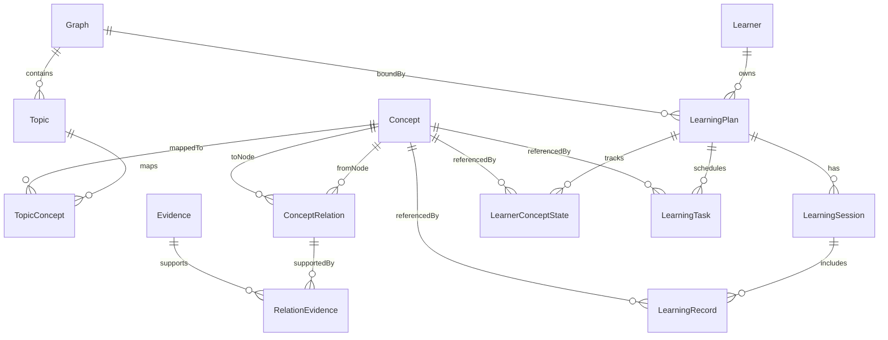
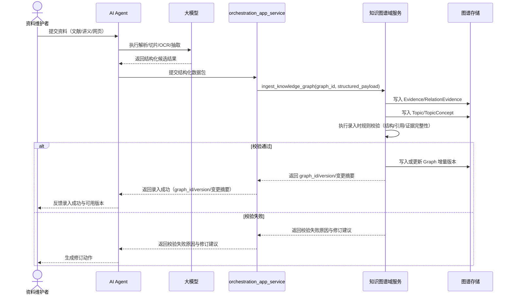
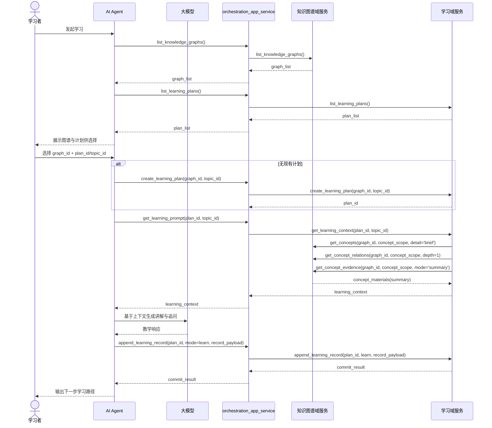
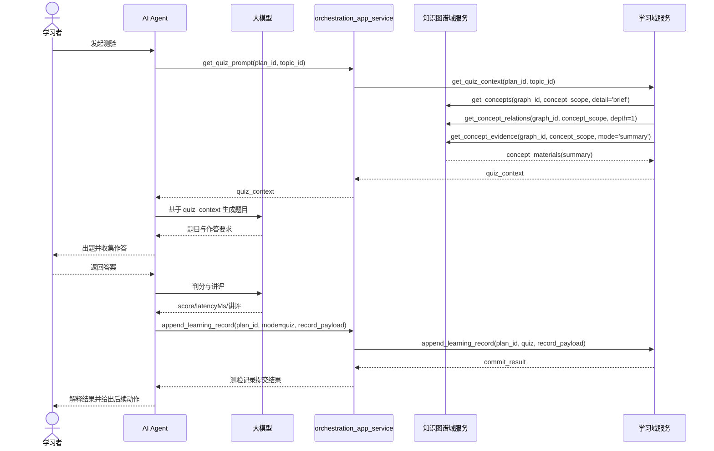
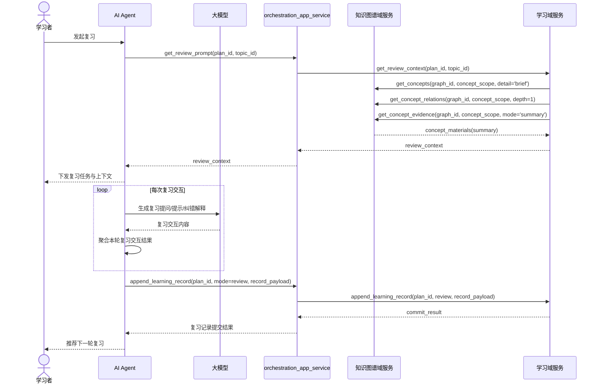
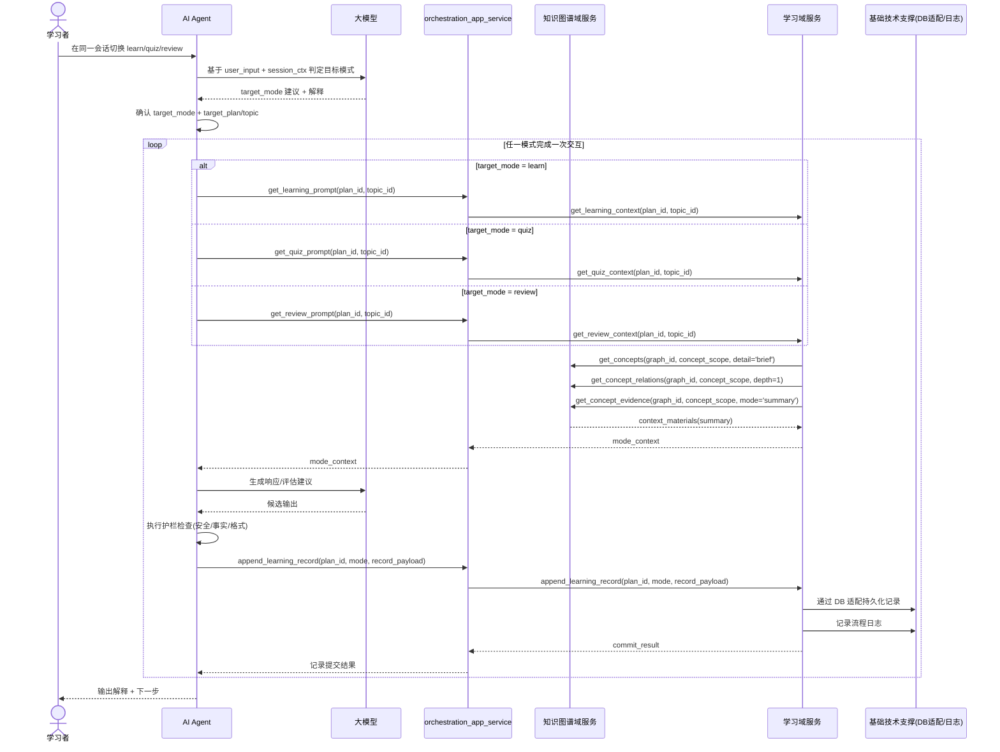
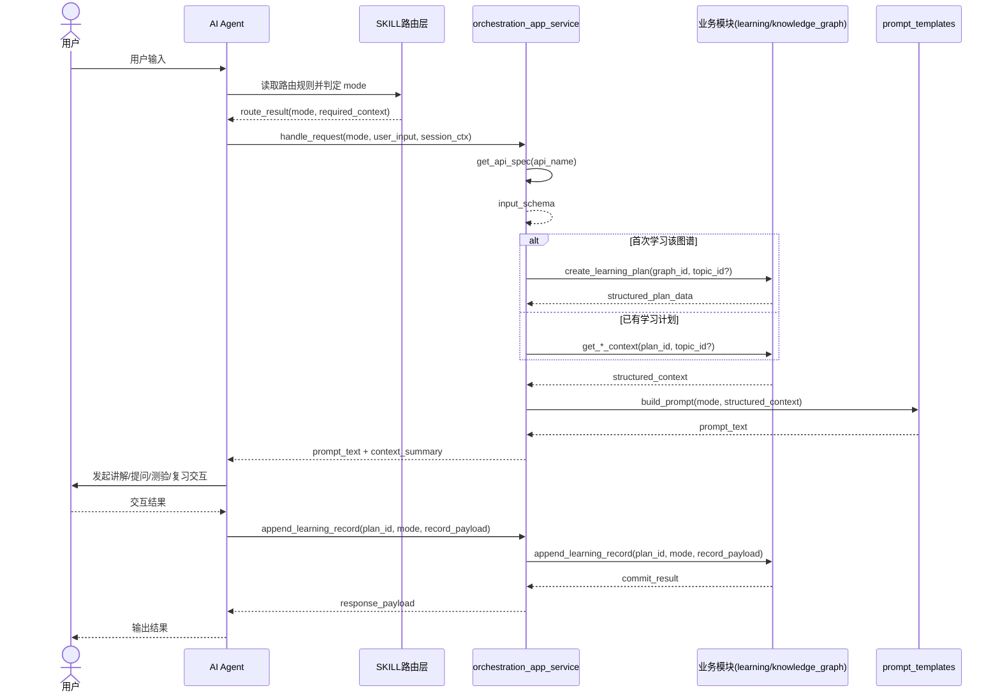

# Doc Socratic Learning — 架构设计文档

---

## 1. 概要架构设计

本技能采用“**知识图谱域 + 学习域 + 编排层**”的最小职责划分：知识图谱域负责内容与证据治理，学习域负责计划/记录/状态/任务，编排层负责向 AI Agent 暴露统一接口并串联流程。跨域衔接以 `graph_id` 与 `concept_id` 为主键锚点。

### 1.1 子系统与职责

| 模块 / 组件 | 职责 | 典型载体 / 产物 |
| --- | --- | --- |
| **路由与工作流组件** | 基于用户意图完成模式路由（ingest/learn/quiz/review）与工作流分发；仅定义流程，不直接读写业务存储。 | `SKILL.md`、`modes/*.md` |
| **应用编排与 API 组件** | 对外暴露统一 API，编排业务模块调用，做入参校验与提示词文本封装。 | `orchestration_app_service`、`list_apis/get_api_spec` |
| **知识图谱模块** | 负责图谱入库、概念/关系/证据治理与通用查询，提供学习域所需图谱材料。 | `Graph`、`Topic`、`Concept`、`TopicConcept`、`ConceptRelation`、`Evidence`、`RelationEvidence` |
| **学习模块** | 负责学习计划、学习记录、状态快照与任务调度，并聚合学习/测验/复习上下文。 | `Learner`、`LearningPlan`、`LearningSession`、`LearningRecord`、`LearnerConceptState`、`LearningTask` |


### 1.2 架构边界与协作原则

1. **AI Agent 决策，脚本层供数**：模式选择、讲解策略、题目生成由 AI Agent + LLM 负责；脚本层仅提供结构化数据与记录写入能力。
2. **编排层不承载业务聚合**：`orchestration_app_service` 只做接口封装、参数校验、模块编排与提示词文本封装。
3. **知识图谱域保持通用语义**：仅提供图谱入库与通用查询（concept/relation/evidence），不暴露学习语义方法。
4. **学习域负责场景聚合**：学习/测验/复习上下文由学习域聚合后输出，控制粒度为 Concept 级 + Summary。

### 1.3 端到端闭环（含资料入图）

1. **资料进入图谱**：AI Agent 调用 LLM 完成解析/切片/OCR，向知识图谱域提交结构化结果（concept/relation/evidence/topic）。
2. **图谱校验与持久化**：知识图谱域执行录入校验并写入 SQLite，形成可用 `graph` 版本增量。
3. **建立或扩展学习计划**：学习域基于 `graph_id` 创建计划，或按进展增量加入 `topic` 范围。
4. **发起学习交互**：学习域基于 plan/topic 聚合上下文（调用图谱通用查询），编排层封装提示词文本交给 AI Agent。
5. **记录与状态更新**：交互完成后写入 `LearningRecord`，并更新 `LearnerConceptState` 与 `LearningTask`。
6. **反馈反哺图谱**：学习过程中暴露的缺失概念、关系冲突、证据不足，回流为新一轮图谱补录输入，进入下一轮闭环。

### 1.4 方法论思想概要

本项目的方法论核心是“**理解-表达-检验-复习**”的认知闭环，强调学习质量而非仅完成流程：

1. **SOLO 递进（认知复杂度）**：问题从单点识别逐步提升到关系整合与抽象迁移，确保学习不是停留在记忆层，而是走向结构化理解与可迁移应用。
2. **UBD 反向设计（理解证据）**：先定义“学会后的可观察证据”，再设计提问与反馈。反馈不只判断对错，还关注是否能解释、阐释、应用与自我反思。
3. **费曼学习法（输出驱动理解）**：通过“用自己的话解释 + 举例 + 纠错重述”暴露知识盲点，把“听懂”转化为“能讲清、能教会”。
4. **检索练习与变式练习**：采用单题循环与多题型变式，强化主动回忆与情境迁移，降低“看起来会、独立不会”的错觉。
5. **间隔复习（遗忘曲线对齐）**：按掌握度和遗忘风险动态安排复习时机，复习顺序优先弱点与到期项，形成持续巩固机制。
6. **元认知校准**：定期进行“把握度-结果”对比与错因归类，帮助学习者校准自我判断，持续优化学习策略。

---

## 2. 数据模型（概念）

与 `[data-model-design.md](data-model-design.md)` 一致：知识图谱域刻画「学什么、如何组织与溯源」；学习域刻画「谁在学、学得怎样、下一步做什么」。以下仅列概念职责与关键锚点，属性与枚举以数据模型文档为准。

命名约定说明：
- 数据模型文档中的实体属性沿用其规范命名（包含既有 camelCase 字段）。
- 运行时 API 与模式文档优先使用 `snake_case` 作为外部调用字段命名。




### 2.1 知识图谱域（核心实体）

- **`Graph`**：知识体系治理容器；主图 / 子图层级、规则与增量修订锚点（如 `schemaVersion`、`revision`）。
- **`Topic`**：章节目录树；通过 `TopicConcept` 与 `Concept` 建立 **N:M** 映射，表达某主题下概念的角色、排序与别名语境。
- **`Concept`**：可学习的语义节点；标准名、定义、难度等；被学习域通过 `concept_id` 引用。
- **`ConceptRelation`**：概念间语义边（前置、组成、对比等）；可经 `RelationEvidence / Evidence` 关联摘录与来源，满足可解释与证据链。

### 2.2 学习域（核心实体）

- **`Learner`**：学习主体；时区、语言等基础偏好。
- **`LearningPlan`**：学习域聚合根；绑定 `graph_id`、周期与目标类型；下辖会话、状态快照与任务。
- **`LearningSession`**：一次学习活动的时间与上下文边界；聚合同一轮中的多条记录。
- **`LearningRecord`**：学习记录；`record_type`（`learn` / `quiz` / `review`）、`difficulty_bucket`、结果、分数、耗时、`occurred_at` 等；引用 `concept_id`。
- **`LearnerConceptState`**：在 `(learner_id, learning_plan_id, concept_id)` 上的快照；`target_level` / `target_score` 与当前掌握、遗忘风险、`next_review_at` 及聚合计数（学习 / 测验 / 复习次数与难度、正误分布等）。
- **`LearningTask`**：计划内待办（新学 / 复习等）；`priority_score`、`due_at`、`reason_type` 等，须能回溯到状态或既有学习记录。

### 2.3 状态、记录与任务分工

- **学习记录**：`LearningRecord`，逐条保存学习活动明细，作为掌握与调度算法的输入。
- **聚合决策层（快照）**：`LearnerConceptState`，支撑进度解释、风险与复习建议。
- **调度执行层（待办）**：`LearningTask`，承载优先级、截止时间与策略，由图谱结构、计划范围与状态差距共同驱动。

---

## 3. 核心业务流程（目标态）

本项目以 **AI Agent + LLM** 为核心执行体：Agent 负责模式路由、工具编排与状态提交，LLM 负责理解、生成与策略建议。以下流程按「资料解析建图 → 学习 → 测验 → 复习」展开；同一 `LearningSession` 可混排 `learn` / `quiz` / `review` 多条 `LearningRecord`。

### 3.1 资料解析与知识图谱构建（时序）

约束：文档解析、切片、OCR 由 **AI Agent 调用大模型**完成；本技能仅接收结构化结果（候选概念、关系、证据、主题映射）并执行入库与录入时校验治理。




### 3.2 学习业务流程（时序）




### 3.3 测验业务流程（时序）




### 3.4 复习业务流程（时序）




### 3.5 流程切换与跨流程衔接逻辑（时序）

约束：本节仅保留跨流程的非业务共性能力，即 **DB 适配** 与 **日志记录**；不在此层承载审计、标识、多租户、可观测等扩展治理能力。




---

## 4. 代码结构分层（目标态）

在实现仓库中，将上述流程落实为**可读的分层目录与模块边界**，便于演进与测试；层间依赖自上而下，领域层不依赖具体技能 Markdown 文件名。

### 4.1 分层总览与完整目录结构


| 层级                        | 典型形态                                           | 职责                                                  |
| ------------------------- | ---------------------------------------------- | --------------------------------------------------- |
| **L1 技能入口**               | 根级 `SKILL.md`                                  | 元数据、模式路由、渐进式披露顺序。                                   |
| **L2 模式契约**               | `modes/*.md`                                   | 新学 / 测验 / 复习的步骤与人机措辞；声明调用的运行时能力（不写死存储格式）。           |
| **L3 编排与接口层**             | `scripts/orchestration/`                       | 承载编排应用服务与接口自描述能力（`list_apis/get_api_spec`），并协调业务模块。 |
| **L4 业务模块（module-first）** | `scripts/knowledge_graph/`、`scripts/learning/` | 按模块组织能力：图谱治理、学习回合数据、学习记录与状态更新。                      |
| **L5 基础技术支撑**             | `scripts/foundation/`                          | DB 适配与日志等非业务共性能力（不含模型推理）。                           |


不属于脚本层的能力（由 AI Agent 或宿主环境提供）：

- LLM 推理调用与模型参数调优
- 对话长期记忆与上下文裁剪策略
- Agent 级别的系统提示词治理与策略编排

```text
doc-socratic-learning-optimized/
├─ SKILL.md                                   # L1 技能入口
├─ modes/                                     # L2 模式契约
│  ├─ shared.md
│  ├─ learn.md
│  ├─ quiz.md
│  └─ review.md
├─ data/                                      # 与 scripts 同级：持久化数据目录
│  ├─ skill.sqlite3                           # SQLite 主库文件
│  ├─ skill.sqlite3-wal                       # WAL 日志文件（运行时生成，不纳入版本控制）
│  └─ skill.sqlite3-shm                       # 共享内存文件（运行时生成，不纳入版本控制）
├─ scripts/
│  ├─ orchestration/                          # L3 编排与接口层
│  │  ├─ orchestration_app_service.py         # 编排应用服务（含 list_apis/get_api_spec）
│  │  ├─ prompt_templates.py                  # 提示词模板封装
│  ├─ knowledge_graph/                        # L4 module-first: 图谱模块
│  │  ├─ api.py                               # list_knowledge_graphs/get_knowledge_graph/get_concepts/get_concept_relations/get_concept_evidence
│  │  ├─ ingest.py                            # 结构化数据入图
│  │  ├─ validate.py                          # 录入时规则校验
│  │  └─ store.py                             # 图谱存储访问
│  ├─ learning/                               # L4 module-first: 学习模块
│  │  ├─ api.py                               # list_learning_plans/create_learning_plan/extend_learning_plan_topics/get_*_context/append_learning_record
│  │  ├─ session.py                           # LearningSession/LearningRecord
│  │  ├─ state.py                             # LearnerConceptState 更新
│  │  └─ tasking.py                           # LearningTask 重排
│  ├─ foundation/                             # L5 基础技术支撑
│  │  ├─ storage.py                           # SQLite 存取适配（可扩展其他 DB）
│  │  ├─ logger.py                            # 流程日志记录
│  └─ app.py                                  # 启动与依赖装配
├─ tests/
│  ├─ orchestration/
│  ├─ knowledge_graph/
│  ├─ learning/
│  └─ integration/
└─ docs/
   ├─ architecture-design.md
   └─ data-model-design.md
```

### 4.2 路由与工作流（L1～L2）

- **L1 (`SKILL.md`)：技能入口与路由中枢**
  - **技能描述职责**：定义技能目标、适用边界、默认行为（学习/测验/复习的总原则），并声明该技能依赖的运行时能力（调用 L3 接口即可，不写死内部实现）。
  - **路由职责**：基于用户意图、会话状态与最近任务上下文，完成**模式选择与模式切换路由**（learn/quiz/review 之间切换也是 L1 路由的一部分）。
  - **路由优先原则**：优先直接路由到 `learn.md` / `quiz.md` / `review.md`；仅在无法判定时才进入 `shared.md`。
  - **路由规则建议（最小）**：
    - 命中“学习/讲解/理解”意图 -> `modes/learn.md`
    - 命中“测试/检查掌握/出题”意图 -> `modes/quiz.md`
    - 命中“复习/到期/回顾”意图 -> `modes/review.md`
    - 无明确意图或冲突意图 -> `modes/shared.md` 先做一次意图澄清，再回到 L1 重新分流
    - 会话内模式切换（如 learn -> quiz -> review）-> 先走 L1 路由判定，再进入目标模式文档
  - **约束**：`SKILL.md` 只承载“描述与路由”，不承载具体问答脚本细节（细节下沉到 L2）。
- **L2 (`modes/*.md`)：模式工作流定义**
  - **`shared.md`（放这些）**：
    - 跨模式公共兜底：意图澄清、上下文补齐、异常处理、重试与降级规则
    - 跨模式公共后置：回合提交后的下一步衔接（继续学习/测验/复习）
    - 公共最小输出壳：如 `mode`、`summary`、`next_step`（可选）
    - 预留项声明：身份相关字段可预留为内部上下文，但当前不作为对外输入要求
  - **`shared.md`（不放这些）**：
    - 不承载“计划选择/确认”主流程（应由目标模式或 L1 前置决策处理）
    - 不定义 learn/quiz/review 的具体教学步骤
    - 不强制各模式统一细节输出格式与话术模板
    - 不承载模式特有判分/讲评/复习策略
    - 不直接触发业务状态写入（如 `append_learning_record`），仅负责澄清与分流建议
  - **`shared.md` 最小化约束**：
    - 进入条件：仅当意图冲突、上下文缺失、或路由失败时进入
    - 退出条件：必须在一次澄清后返回明确模式，避免常驻在 shared 流程
    - 若长期高频触发 shared，优先把稳定规则上移到 `SKILL.md` 或下沉到具体模式文档
  - **`learn.md`**：学习模式工作流（选择目标 -> 获取学习回合上下文 -> 讲解与追问 -> 提交回合结果 -> 输出下一步）。
  - **`quiz.md`**：测验模式工作流（确定测验范围 -> 出题与作答 -> 判分与讲评 -> 提交回合结果 -> 给出补强建议）。
  - **`review.md`**：复习模式工作流（读取复习任务/到期项 -> 复述或抽问 -> 记录结果 -> 更新复习队列 -> 推荐下一轮）。
  - **文档结构建议（统一模板）**：`触发条件`、`输入`、`步骤`、`输出`、`失败重试/降级`、`下一步跳转`。其中“输出”允许各模式自定义 payload。
### 4.3 编排与接口层（L3）

`orchestration_app_service.py` 作为编排应用服务，由 AI Agent 在读取 L1 路由规则后按目标模式调用，并协调 L4 业务模块完成一次完整交互。各业务模块仅返回结构化数据；在编排层由 `prompt_templates` 统一封装为可直接供 AI Agent 使用的提示词文本。作为 AI Agent 的一部分，它不直接承担模型推理调用，并对外统一提供 `list_apis/get_api_spec` 的自描述接口能力。




- **具体职责**：
  - 以“业务模块”抽象对接学习与图谱能力，不在编排层固化单模块语义。
  - 获取业务模块返回的结构化数据，并通过 `prompt_templates` 组装提示词文本。
  - 接收并持久化学习记录（learn/quiz/review），触发状态与任务更新。
  - 依据 L3 的 `input_schema` 进行请求参数校验与基础错误返回。
  - 保持“数据服务化”边界：不承担模型推理，仅负责数据编排与文本封装。
- **对外方法（最小集合）**：
  1. `list_apis()`：返回可调用 API 列表（`name`、`version`、`summary`、`tags`、`stability`）。
  2. `get_api_spec(api_name)`：返回指定 API 的入参规范（`input_schema`）。
  3. `list_knowledge_graphs()`：返回可用知识图谱列表（graph_id、name、revision、status）。
  4. `get_knowledge_graph(graph_id)`：返回指定图谱内容，重点包含 `Topic` 层级结构与 `TopicConcept` 映射。
  5. `ingest_knowledge_graph(graph_id, structured_payload)`：接收结构化图谱数据包并执行录入（含规则校验与增量更新）。
  6. `list_learning_plans()`：返回当前上下文可用的学习计划列表。
  7. `create_learning_plan(graph_id, topic_id=None)`：基于选定图谱创建学习计划并返回 `plan_id`；可选 `topic_id` 用于限定初始学习范围。
  8. `extend_learning_plan_topics(plan_id, topic_ids, reason=None)`：按学习进展向既有计划增量加入主题范围，返回新增结果与范围摘要。
  9. `get_learning_prompt(plan_id, topic_id=None)`：内部调用 `learning.get_learning_context(...)` 拉取结构化上下文，并经 `prompt_templates` 封装后返回学习提示词文本；可选 `topic_id` 用于聚焦当前学习主题。
  10. `get_quiz_prompt(plan_id, topic_id=None)`：内部调用 `learning.get_quiz_context(...)` 拉取结构化上下文，并经 `prompt_templates` 封装后返回测验提示词文本；可选 `topic_id` 用于限定测验主题范围。
  11. `get_review_prompt(plan_id, topic_id=None)`：内部调用 `learning.get_review_context(...)` 拉取结构化上下文，并经 `prompt_templates` 封装后返回复习提示词文本；可选 `topic_id` 用于限定复习主题范围。
  12. `append_learning_record(plan_id, mode, record_payload)`：写入学习记录并返回提交结果。
- **边界**：
  - 仅通过 L4 模块 API 访问业务数据，不直接操作存储。
  - 不直接承担模型推理调用；模型调用由 AI Agent 或上层执行环境负责。
  - 不承载 AI 学习流程控制逻辑；仅提供结构化数据编排、提示词文本封装与记录能力。
  - 保持读写职责分离：计划范围变更使用 `extend_learning_plan_topics`，提示词读取由 `get_*_prompt` 承担（内部仍调用 `learning.get_*_context`）。
  - 护栏与输出校验逻辑先内聚在 `orchestration_app_service.py`，复杂度上升后再拆分。

### 4.4 业务模块（L4，module-first）

- **模块设计原则**：
  - 仅提供业务能力，不承担提示词拼装与模型推理。
  - 对外统一返回结构化数据（JSON 风格对象），由 L3 的 `prompt_templates` 进行文本封装。
  - 模块间通过显式 API 协作（`learning` 可调用 `knowledge_graph`），避免隐式耦合。
  - 返回粒度默认采用 **Concept 级 + Summary**，仅在必要时按需下钻到 Evidence 级，避免一次性上下文过重影响大模型分析。
- **统一返回粒度约束（适用于全部方法）**：
  - **默认返回**：`core + summary`（完成本轮决策所需最小字段）。
  - **按需扩展**：`detail`（仅在用户追问依据、或 Agent 明确请求时返回）。
  - **分页与限流**：集合结果必须支持 `limit/cursor`；默认限制 `concepts` 数量，返回 `has_more`。
- **`knowledge_graph` 模块（对应 3.1，支撑 3.2～3.5）必须提供的方法**：
  1. `list_knowledge_graphs()`
    - 默认返回：`graph_id`、`name`、`revision`、`status`、`topic_count`、`concept_count`、`updated_at`。
    - 按需扩展：无。
    - 不建议返回：图谱内 `concept/evidence` 明细。
  2. `get_knowledge_graph(graph_id, topic_id=None, concept_limit=20, cursor=None)`
    - 默认返回：`topics`、`topic_concepts`、`concept_briefs`（`concept_id`、`canonical_name`、`short_definition`、`difficulty`）。
    - 按需扩展：`detail.concepts`（完整定义、更多属性）。
    - 不建议返回：Evidence 原文列表（除非明确请求）。
  3. `ingest_knowledge_graph(graph_id, structured_payload)`
    - 默认返回：`graph_id`、`version`、`change_summary`、`validation_summary`。
    - 按需扩展：`detail.failed_items`（校验失败明细）。
    - 不建议返回：全量写入后的图谱快照。
  4. `get_concepts(graph_id, concept_scope, detail='brief', concept_limit=20, cursor=None)`
    - 默认返回：`concept_briefs`（`concept_id`、`canonical_name`、`short_definition`、`difficulty`）。
    - 按需扩展：`detail.concepts`（完整定义、更多属性）。
    - 不建议返回：无 scope 限制的全量概念集合。
  5. `get_concept_relations(graph_id, concept_scope, depth=1, relation_limit=50)`
    - 默认返回：`relation_briefs`（`from_concept_id`、`to_concept_id`、`relation_type`、`strength`）。
    - 按需扩展：`detail.relations`（方向、权重、版本状态等）。
    - 不建议返回：多跳深层关系全量展开。
  6. `get_concept_evidence(graph_id, concept_scope, mode='summary', evidence_limit=20)`
    - 默认返回：`evidence_summary`（每 concept 1~2 条摘要与来源标识）。
    - 按需扩展：`detail.evidence`（原文片段与定位信息）。
    - 不建议返回：全量 Evidence 原文（默认禁止）。
- **`learning` 模块（对应 3.2～3.5）必须提供的方法**：
  1. `list_learning_plans()`
    - 默认返回：`plan_id`、`graph_id`、`progress`、`status`、`focus_topics`、`updated_at`。
    - 按需扩展：`summary.goal_snapshot`。
    - 不建议返回：计划下全量记录与任务明细。
  2. `create_learning_plan(graph_id, topic_id=None)`
    - 默认返回：`plan_id`、`graph_id`、`initial_scope_summary`。
    - 按需扩展：`detail.bootstrap_tasks`（初始化任务摘要）。
    - 不建议返回：完整任务队列。
  3. `extend_learning_plan_topics(plan_id, topic_ids, reason=None)`
    - 默认返回：`plan_id`、`added_topics`、`skipped_topics`、`new_scope_summary`。
    - 按需扩展：`detail.rejected_topics`（不可加入主题的原因）。
    - 不建议返回：更新后的全量任务/状态快照。
  4. `get_learning_context(plan_id, topic_id=None)`
    - 默认返回：`goal_summary`、`state_summary`、`task_summary`、`concept_scope`、`concept_pack_brief`。
    - 按需扩展：`detail.concept_pack`（更完整 Concept 信息）。
    - 不建议返回：Evidence full（默认不返回）。
  5. `get_quiz_context(plan_id, topic_id=None)`
    - 默认返回：`quiz_scope`、`history_performance_summary`、`difficulty_hint`、`constraints`。
    - 按需扩展：`detail.concept_pack_brief`（仅出题必要概念材料）。
    - 不建议返回：与出题无关的长文本上下文。
  6. `get_review_context(plan_id, topic_id=None)`
    - 默认返回：`due_items`、`forgetting_risk_summary`、`priority_reasons`、`constraints`。
    - 按需扩展：`detail.concept_refresh_brief`。
    - 不建议返回：全量历史记录流。
  7. `append_learning_record(plan_id, mode, record_payload)`
    - 默认返回：`commit_result`、`state_delta_summary`、`task_delta_summary`。
    - 按需扩展：`detail.updated_tasks`（必要时）。
    - 不建议返回：更新后的全量 `LearnerConceptState/LearningTask`。
- **模块协作关系（对齐 3.2～3.5）**：
  - `learning.extend_learning_plan_topics(...)` 负责计划范围变更；成功后由 Agent 再调用 `get_*_prompt(...)` 获取新范围提示词。
  - `learning.get_*_context(...)` 内部按 `graph_id + concept_scope` 调用 `knowledge_graph.get_concepts/get_concept_relations/get_concept_evidence(mode='summary')` 组装场景化上下文。
  - `orchestration_app_service` 只调用上述模块方法并汇总结果，不下沉到模块内部存储细节。

### 4.5 基础技术支撑（L5）

- **DB 适配**：采用 **SQLite** 进行持久化；由 `scripts/foundation/storage.py` 统一封装存取，库文件默认落在 `data/skill.sqlite3`（与 `scripts/` 同级目录）。
- **日志记录**：记录关键流程节点与错误上下文，支持问题定位与最小化运行追踪。

