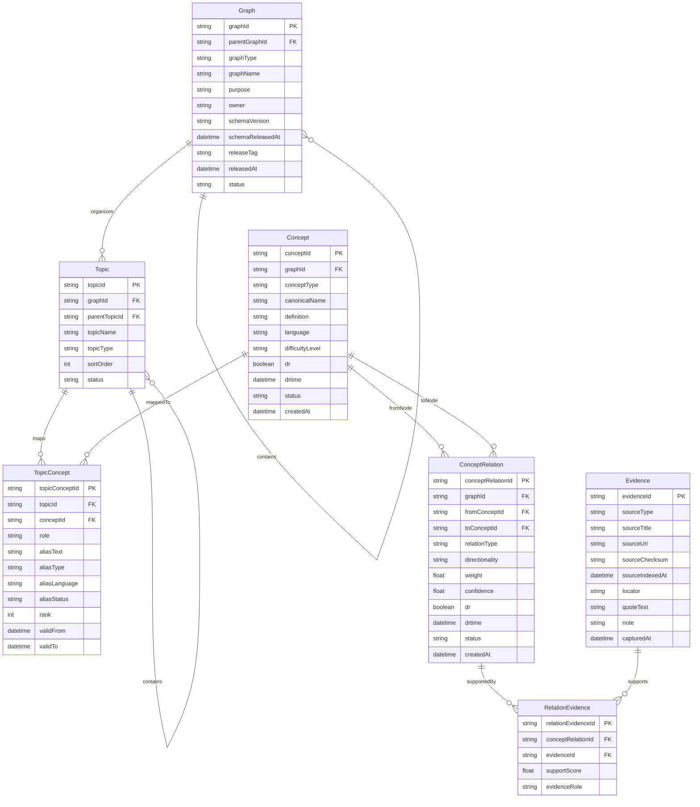
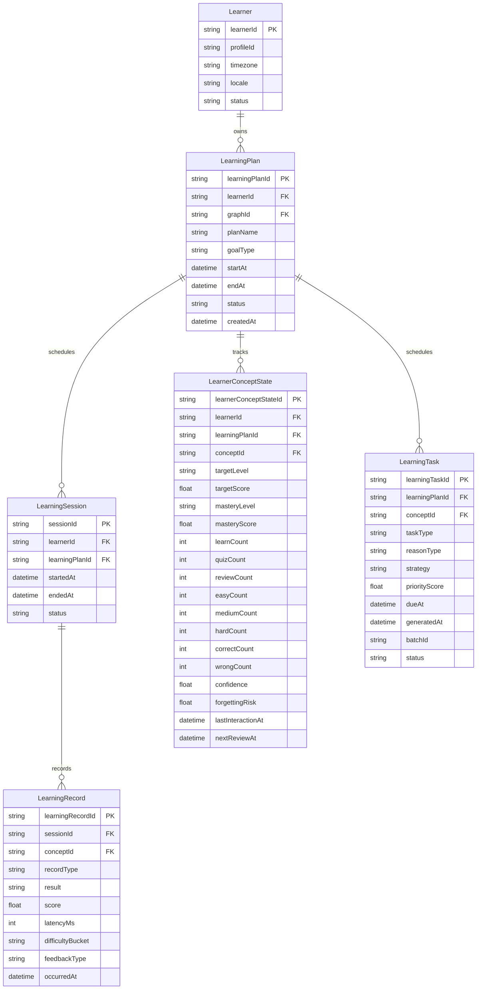
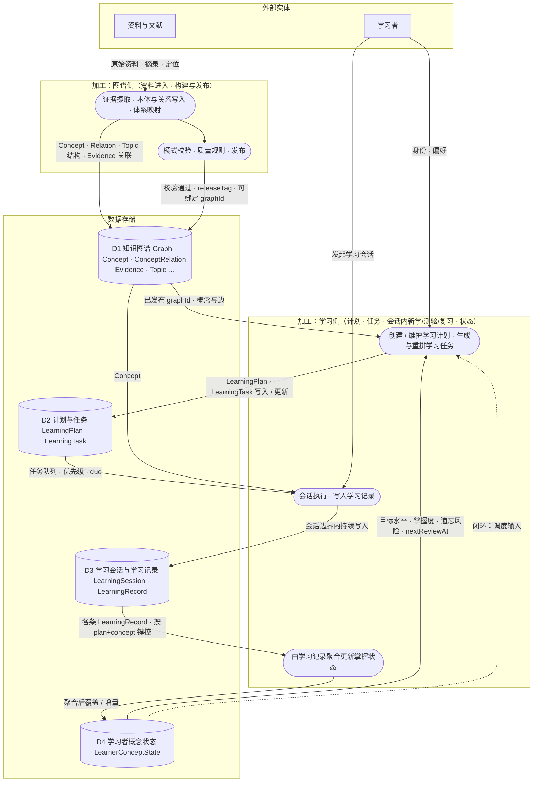

# Doc Socratic Learning — 数据模型设计

**范围**：目标态数据模型（不考虑向下兼容），采用「知识图谱 + 学习状态与调度 + 学习记录」三层结构。  
**目标**：支持知识图谱分模块演进，避免“整图单版本”带来的发布与治理瓶颈。

---

## 1. 设计原则

1. **稳定标识 + 状态演进**：实体使用稳定 ID，变化落在状态表中。
2. **局部演进优先**：按主图/子图发布，不要求整图同步升版。
3. **双时间语义**：同时支持业务有效时间（valid time）与记录时间（system time）。
4. **证据可追溯**：关键关系必须关联证据链。
5. **可解释推荐**：复习任务必须可回溯到状态或既有学习记录。

---

## 2. 数据模型（ER）

### 2.1 知识图谱领域（ER）

#### 2.1.1 从知识体系到知识点的拆解关系

1. **体系边界（Graph）**：先确定知识体系边界与版本锚点（`schemaVersion`、`releaseTag`）。
2. **结构分解（Topic）**：通过 `Topic.parentTopicId` 自上而下拆成章/节/小节树。
3. **主题映射（TopicConcept）**：将每个 `Topic` 映射到若干 `Concept`，并用 `role`、`rank` 表达主次和顺序。
4. **语义关联（ConceptRelation）**：在 `Concept` 间建立前置/组成/对比等关系（`relationType`）。
5. **证据回溯（RelationEvidence + Evidence）**：为 `ConceptRelation` 关联证据片段，保证关系可解释。

对应关系总览：

- `Graph` `1:N` `Topic`
- `Topic` `1:N` `Topic`（主子主题）
- `Topic` `N:M` `Concept`（通过 `TopicConcept`）
- `Concept` `N:M` `Concept`（通过 `ConceptRelation`）
- `ConceptRelation` `N:M` `Evidence`（通过 `RelationEvidence`）

#### 2.1.2 实体说明

##### `Graph`

**实体职责**：作为知识图谱的治理容器，承载主子图层级、规则版本锚点与发布版本锚点，用于统一归属、发布和状态管理。

| 属性               | 说明                                |
| ------------------ | ----------------------------------- |
| `graphId`          | 图容器唯一标识。                    |
| `parentGraphId`    | 父图标识，用于主图/子图层级。       |
| `graphType`        | 图类型（如 `domain/module/view`）。 |
| `graphName`        | 图名称。                            |
| `purpose`          | 图用途说明。                        |
| `owner`            | 图负责人或维护方。                  |
| `schemaVersion`    | 当前规则版本标识。                  |
| `schemaReleasedAt` | 规则版本生效时间。                  |
| `releaseTag`       | 当前发布标签。                      |
| `releasedAt`       | 当前发布标签时间。                  |
| `status`           | 图状态（启用、冻结、下线等）。      |

##### `Concept`

**实体职责**：承载知识点语义与版本状态，是知识图谱中的核心节点实体，支持当前版本与历史版本并存管理。

| 属性              | 说明                                             |
| ----------------- | ------------------------------------------------ |
| `conceptId`       | 概念唯一标识。                                   |
| `graphId`         | 概念所属图标识。                                 |
| `conceptType`     | 概念类型。                                       |
| `canonicalName`   | 标准名称。                                       |
| `definition`      | 概念定义。                                       |
| `language`        | 概念语种。                                       |
| `difficultyLevel` | 难度等级。                                       |
| `dr`              | 当前/历史版本标记（`false` 当前，`true` 历史）。 |
| `drtime`          | 历史版本时间戳。                                 |
| `status`          | 概念状态。                                       |
| `createdAt`       | 记录创建时间。                                   |

##### `Topic`

**实体职责**：承载知识体系的目录结构（章/节/单元），用于组织学习视图与导航，不直接表达概念语义关系。

| 属性            | 说明                         |
| --------------- | ---------------------------- |
| `topicId`       | 体系节点唯一标识。           |
| `graphId`       | 节点所属图标识。             |
| `parentTopicId` | 父节点标识。                 |
| `topicName`     | 节点名称。                   |
| `topicType`     | 节点类型，必填，枚举：`chapter`（章/根级节点）、`section`（节/子节点）。校验时为强制字段，缺失或非枚举值会被 `validate_structured_payload` 拒收。 |
| `sortOrder`     | 同层级排序值。               |
| `status`        | 节点状态。                   |

##### `TopicConcept`

**实体职责**：作为 `Topic` 与 `Concept` 的桥接实体，定义知识点在特定主题下的角色、排序和别名语义。

| 属性             | 说明                                  |
| ---------------- | ------------------------------------- |
| `topicConceptId` | 映射记录唯一标识。                    |
| `topicId`        | 主题节点标识。                        |
| `conceptId`      | 映射概念标识。                        |
| `role`           | 概念在该主题中的角色（核心/扩展等）。 |
| `aliasText`      | 该主题语境下的别名文本。              |
| `aliasType`      | 别名类型。                            |
| `aliasLanguage`  | 别名语种。                            |
| `aliasStatus`    | 别名状态。                            |
| `rank`           | 主题内概念排序权重。                  |
| `validFrom`      | 映射生效时间。                        |
| `validTo`        | 映射失效时间。                        |

##### `ConceptRelation`

**实体职责**：定义概念与概念之间的语义关系边，并承载关系强度、方向与版本状态。

| 属性                | 说明                                             |
| ------------------- | ------------------------------------------------ |
| `conceptRelationId` | 关系唯一标识。                                   |
| `graphId`           | 关系所属图标识。                                 |
| `fromConceptId`     | 关系起点概念。                                   |
| `toConceptId`       | 关系终点概念。                                   |
| `relationType`      | 关系类型（前置、组成、对比等）。                 |
| `directionality`    | 关系方向性。                                     |
| `weight`            | 关系权重。                                       |
| `confidence`        | 关系置信度。                                     |
| `dr`                | 当前/历史版本标记（`false` 当前，`true` 历史）。 |
| `drtime`            | 历史版本时间戳。                                 |
| `status`            | 关系状态。                                       |
| `createdAt`         | 关系记录创建时间。                               |

##### `Evidence`

**实体职责**：保存关系证据及其来源引用信息，支撑概念关系的可追溯与可解释。

| 属性              | 说明                                       |
| ----------------- | ------------------------------------------ |
| `evidenceId`      | 证据唯一标识。                             |
| `sourceType`      | 来源类型（书籍、网页、论文等）。           |
| `sourceTitle`     | 来源标题。                                 |
| `sourceUri`       | 来源地址。                                 |
| `sourceChecksum`  | 来源内容校验值。                           |
| `sourceIndexedAt` | 来源入库/索引时间。                        |
| `locator`         | 证据片段定位信息（页码、段落、时间码等）。 |
| `quoteText`       | 证据摘录文本。                             |
| `note`            | 证据备注。                                 |
| `capturedAt`      | 证据采集时间。                             |

##### `RelationEvidence`

**实体职责**：作为 `ConceptRelation` 与 `Evidence` 的桥接实体，表达证据对关系的支持角色与支持强度。

| 属性                 | 说明                                   |
| -------------------- | -------------------------------------- |
| `relationEvidenceId` | 桥接记录唯一标识。                     |
| `conceptRelationId`  | 关系标识。                             |
| `evidenceId`         | 证据标识。                             |
| `supportScore`       | 证据对关系的支持强度。                 |
| `evidenceRole`       | 证据角色（主证据、补充证据、反例等）。 |

### 2.2 学习领域（ER）

#### 2.2.1 从学习者到学习闭环的拆解关系

1. **学习主体（Learner）**：确定学习者身份与基础配置（时区、语言等）。
2. **计划聚合根（LearningPlan）**：绑定知识图谱（`graphId`）与学习目标、周期；在同图版本语境下聚合会话、任务与掌握状态。
3. **任务调度（LearningTask）**：在计划内落到具体 `conceptId`，区分新学/复习等任务类型；依据图谱结构（如先修）、计划范围与 `LearnerConceptState` 生成或更新。
4. **会话与学习记录（LearningSession + LearningRecord）**：`LearningSession` 界定一次时间与上下文边界；每条 `LearningRecord` 用 `recordType`（`learn` / `quiz` / `review`）与 `difficultyBucket`（`easy` / `medium` / `hard`）表达本条活动，同一会话可混合。
5. **掌握状态（LearnerConceptState）**：在 `(learnerId, learningPlanId, conceptId)` 上同时维护目标水平（`targetLevel` / `targetScore`）、当前状态（掌握度、置信度、遗忘风险、复习建议）与聚合统计（学习/测验/复习次数、难度分布、正误次数），支持同一概念在不同计划中的差异化深度与节奏。
6. **目标评估（基于 LearnerConceptState）**：通过比较 `targetLevel` / `targetScore` 与 `masteryLevel` / `masteryScore` 的差距，驱动任务优先级与学习进度解释。

本小节聚焦学习域结构拆解；后文继续给出全链路数据流图与业务流程说明。

对应关系总览：

- `Learner` `1:N` `LearningPlan`
- `LearningPlan` `1:N` `LearningSession`
- `LearningSession` `1:N` `LearningRecord`
- `LearningPlan` `1:N` `LearnerConceptState`
- `LearnerConceptState.conceptId` → 知识图谱 `Concept`
- `LearningPlan` `1:N` `LearningTask`
- `LearningTask.conceptId` → 知识图谱 `Concept`

#### 2.2.2 实体说明

##### `Learner`

**实体职责**：作为学习域主体实体，承载学习者最小身份与时区/语言等基础偏好。

| 属性        | 说明                  |
| ----------- | --------------------- |
| `learnerId` | 学习者唯一标识。      |
| `profileId` | 外部用户档案标识。    |
| `timezone`  | 学习者时区。          |
| `locale`    | 学习者语言/地区设置。 |
| `status`    | 学习者状态。          |

##### `LearningPlan`

**实体职责**：作为学习域聚合根，定义学习目标与周期，并统一关联学习会话、学习任务和掌握状态。

| 属性             | 说明                               |
| ---------------- | ---------------------------------- |
| `learningPlanId` | 学习计划唯一标识。                 |
| `learnerId`      | 学习者标识。                       |
| `graphId`        | 关联知识图谱标识。                 |
| `planName`       | 学习计划名称。                     |
| `goalType`       | 目标类型（考试/课程/能力提升等）。 |
| `startAt`        | 计划开始时间。                     |
| `endAt`          | 计划结束时间。                     |
| `status`         | 计划状态。                         |
| `createdAt`      | 计划创建时间。                     |

##### `LearningSession`

**实体职责**：定义一次学习会话的**时间与上下文边界**，聚合同一轮中的多条 `LearningRecord`；同一会话内可混合 `learn` / `quiz` / `review`，不互斥。

| 属性             | 说明               |
| ---------------- | ------------------ |
| `sessionId`      | 会话唯一标识。     |
| `learnerId`      | 所属学习者标识。   |
| `learningPlanId` | 所属学习计划标识。 |
| `startedAt`      | 会话开始时间。     |
| `endedAt`        | 会话结束时间。     |
| `status`         | 会话状态。         |

##### `LearningRecord`

**实体职责**：逐条记载学习活动，作为掌握度更新与复习调度的输入依据。

| 属性               | 说明                                                                          |
| ------------------ | ----------------------------------------------------------------------------- |
| `learningRecordId` | 学习记录唯一标识。                                                            |
| `sessionId`        | 所属会话标识。                                                                |
| `conceptId`        | 目标概念标识（引用知识图谱 `Concept`）。                                      |
| `recordType`       | 本条记录的活动类型（`learn` / `quiz` / `review`）；同一会话可多条、类型可混。 |
| `difficultyBucket` | 本条记录的难度分桶（`easy` / `medium` / `hard`）。                                |
| `result`           | 记录结果（正确/错误等）。                                                     |
| `score`            | 得分。                                                                        |
| `latencyMs`        | 响应耗时（毫秒）。                                                            |
| `feedbackType`     | 反馈类型。                                                                    |
| `occurredAt`       | 记录发生时间。                                                                |

##### `LearnerConceptState`

**实体职责**：维护学习者在学习计划-概念维度的目标与掌握状态快照，支持同一概念在不同学习计划中的差异化深度与复习策略。

| 属性                    | 说明                                 |
| ----------------------- | ------------------------------------ |
| `learnerConceptStateId` | 状态记录唯一标识。                   |
| `learnerId`             | 学习者标识。                         |
| `learningPlanId`        | 所属学习计划标识。                   |
| `conceptId`             | 概念标识（引用知识图谱 `Concept`）。 |
| `targetLevel`           | 计划期望掌握等级。                   |
| `targetScore`           | 计划期望掌握分值。                   |
| `masteryLevel`          | 掌握等级。                           |
| `masteryScore`          | 掌握度分值。                         |
| `learnCount`            | 累计新学记录次数。                     |
| `quizCount`             | 累计测验记录次数。                     |
| `reviewCount`           | 累计复习记录次数。                     |
| `easyCount`             | 累计低难度记录次数。                   |
| `mediumCount`           | 累计中难度记录次数。                   |
| `hardCount`             | 累计高难度记录次数。                   |
| `correctCount`          | 累计正确次数。                         |
| `wrongCount`            | 累计错误次数。                         |
| `confidence`            | 掌握置信度。                         |
| `forgettingRisk`        | 遗忘风险分值。                       |
| `lastInteractionAt`     | 最近交互时间。                       |
| `nextReviewAt`          | 下次建议复习时间。                   |

##### `LearningTask`

**实体职责**：作为学习计划下的任务明细，统一承载学习任务与复习任务并定义执行优先级。

| 属性             | 说明                                         |
| ---------------- | -------------------------------------------- |
| `learningTaskId` | 学习任务唯一标识。                           |
| `learningPlanId` | 所属学习计划标识。                           |
| `conceptId`      | 目标概念标识（引用知识图谱 `Concept`）。     |
| `taskType`       | 任务类型（`learn` / `review`）。             |
| `reasonType`     | 触发原因类型。                               |
| `strategy`       | 任务生成策略。                               |
| `priorityScore`  | 优先级分值。                                 |
| `dueAt`          | 建议完成时间。                               |
| `generatedAt`    | 任务生成时间。                               |
| `batchId`        | 任务批次标识（用于一次调度生成的一组任务）。 |
| `status`         | 任务状态。                                   |

---

## 3. 分层职责

| 层               | 核心实体                                            | 职责                                           |
| ---------------- | --------------------------------------------------- | ---------------------------------------------- |
| 治理与发布层     | `Graph`                                             | 管理主子图、规则版本与发布标签                 |
| 知识图谱层       | `Concept`、`ConceptRelation`、`Topic`               | 描述知识本体、关系网络与体系视图               |
| 证据层           | `Evidence`、`RelationEvidence`                      | 保证关系可追溯与可解释                         |
| 学习行为层       | `LearningSession`、`LearningRecord`                 | 记录学习过程数据                               |
| 学习状态与调度层 | `LearnerConceptState`、`LearningTask` | 维护目标/掌握状态与任务调度并驱动学习闭环 |

---

## 4. 关键枚举建议

- `graphType`：`domain`、`module`、`view`
- `recordType`（`LearningRecord`）：`learn`、`quiz`、`review`；**逐条记录**的活动类型，作为统计与状态更新的权威粒度；同一会话可混合多种取值。
- `difficultyBucket`：`easy`、`medium`、`hard`
- `masteryLevel`：`New`、`Learning`、`Proficient`、`Mastered`
- `taskType`：`learn`、`review`
- `relationType`：`prerequisite_of`、`part_of`、`contrast_with`、`applied_in`、`related_to`
- `reasonType`：`overdue`、`upcoming`、`weak_point`、`manual`

---

## 5. 数据约束与质量规则

1. `Concept` 采用单表版本策略：同一业务概念（`graphId + canonicalName + language + conceptType`）仅允许一条 `dr=false` 的当前记录。
2. 同一业务概念原则上仅保留一条 `dr=true` 的历史记录，且 `drtime` 必填并晚于当前记录的 `createdAt`。
3. `ConceptRelation` 采用单表版本策略：同一业务关系（`graphId + fromConceptId + toConceptId + relationType`）仅允许一条 `dr=false` 的当前记录。
4. 同一业务关系原则上仅保留一条 `dr=true` 的历史记录，且 `drtime` 必填并晚于当前记录的 `createdAt`。
5. `LearnerConceptState` 在 `(learnerId, learningPlanId, conceptId)` 上唯一。
6. `LearnerConceptState` 的目标字段约束：`targetLevel` 或 `targetScore` 至少一个非空（建议同时填充以支持等级和分值双视图）。
7. `LearnerConceptState` 的统计字段（`learnCount`、`quizCount`、`reviewCount`、`easyCount`、`mediumCount`、`hardCount`、`correctCount`、`wrongCount`）应为非负整数。
8. `ConceptRelation` 进入可发布状态前至少关联一条 `RelationEvidence`。
9. `Graph.releaseTag` 只允许在校验通过后更新（发布流程约束）。
10. 默认禁止关系自环，特殊关系需白名单。
11. 学习域关键实体（`LearningPlan`、`LearningSession`、`LearningRecord`、`LearnerConceptState`、`LearningTask`）需维护 `createdAt` / `updatedAt` 等 system-time 元数据，保证状态回放与审计可追溯。

---

## 6. 生命周期与数据流

### 6.1 数据流图（目标存储与加工）

### 6.2 业务流程与数据流说明

以下为按**真实业务流程**编排的说明（实现上会对 `D1`～`D4` 多次读写，与 **6.1** 上图对应）：

1. **资料进入 → 图谱可绑定**：教材、文献、讲义等进入证据链（`Evidence`），抽取并维护知识点（`Concept`）、语义边（`ConceptRelation`），经 `RelationEvidence` 把摘录挂到边上以便溯源；可按章节目录整理 `Topic` / `TopicConcept`。上述内容归属 `Graph`，通过校验与发布后带上可用 `releaseTag`，学习者创建的 `LearningPlan` **只能绑定**这类已发布图（`graphId`），否则计划缺乏稳定教纲范围。

2. **学习计划**：在确定 `Learner` 身份与偏好后，创建或调整 `LearningPlan`（周期、目标类型等），在同一 `graphId` 下汇聚后续的会话、任务与状态。计划内每个知识点的期望水平直接写入 `LearnerConceptState.targetLevel / targetScore`。

3. **学习任务排队（新学 / 复习）**：调度依据图谱（如先修 `ConceptRelation`）、计划范围与当前 `LearnerConceptState`（掌握度、遗忘风险、`nextReviewAt`）生成或重排 `LearningTask`，区分「接下来要学的新内容」与「到期要复习的内容」；同一知识点在不同计划中可有不同深度与节奏。

4. **学习会话**：学习者进入一次连续的学习时段，对应 `LearningSession`（时间与上下文边界）；**不设**「整段只会做一件事」——会话内可以同时穿插多种活动类型。

5. **新学**：会话内产生的每条行为写入 `LearningRecord`，`recordType = learn`（讲授、阅读、苏格拉底引导等均落在记录层表达）。

6. **测验**：与会话内其他活动可**交错**进行；每条测验交互同样写入 `LearningRecord`，`recordType = quiz`，并通过 `difficultyBucket` 标记难度层级（`easy` / `medium` / `hard`）。

7. **复习**：既可由复习类 `LearningTask` 驱动进入会话，也可在会话内随时发生；每条复习交互写入 `LearningRecord`，`recordType = review`。复习优先级与间隔由状态与任务调度共同体现。

8. **掌握状态**：所有 `LearningRecord` 按 `learningPlanId + conceptId` 聚合，更新 `LearnerConceptState`（目标水平、当前掌握度、置信度、遗忘风险、建议下次复习时刻等）。

9. **闭环**：更新后的状态作为调度输入，再次生成或调整 `LearningTask`（尤其复习队列），学习者进入新的 `LearningSession`，回到步骤 4～7；数据流上即 `LearningRecord → LearnerConceptState → LearningTask → LearningSession → LearningRecord → …`。

