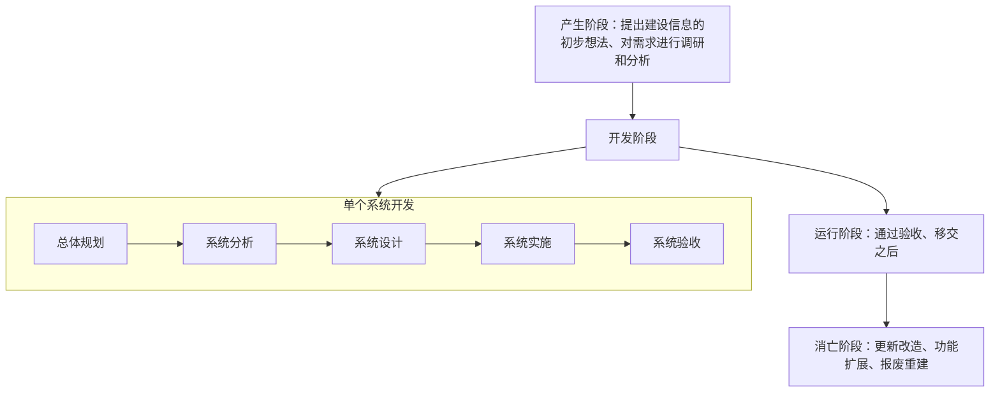

# 第一章 绪论

## 一、信息和信息化的概念

### 1. 信息的定义

- **克劳德·香农（Claude E. Shannon）**：信息就是不确定性的减少。

### 2. 信息的特点

1. **客观性【真伪性】**  
   真实性是信息的核心价值。信息分为主观信息（如决策、指令、计划）和客观信息（如国际形势、经济发展、四季更替）。主观信息必须转化为客观信息。

2. **普遍性**  
   物质决定精神；物质的普遍性决定了信息存在的普遍性。

3. **无限性**  
   客观世界是无限的，信息的总量是无限的，每一具体事物所产生的信息也是无限的。

4. **动态性**  
   信息随时间而变化。

5. **相对性**  
   不同主体从同一事物中可能获得不同的信息及信息量。

6. **依附性**  
   信息是对客观世界的反映，必须依附于一定的载体；信息不能完全脱离物质而独立存在。

7. **变换性**  
   信息通过加工实现变换或转换。

8. **传递性**  
   信息在时间上的传递是存储；在空间上的传递是转移或扩散。

9. **层次性**  
   客观世界是分层次的，信息也是分层次的。

10. **系统性**  
    不同类型的信息可以构成不同的整体。

11. **转化性**  
    信息可以转化为物质或能量。

---

## 二、系统工程方法论

### 1. 系统工程定义

- 从整体出发、从系统观念出发，以求**【整体最优】**。

### 2. 系统工程方法

| 系统工程方法                           | 关键点                                                                                                                                   |
| :------------------------------------- | :--------------------------------------------------------------------------------------------------------------------------------------- |
| **霍尔三维结构** （“硬科学”方法论） | **逻辑维**：解决问题的逻辑过程。 **时间维**：工作进度。 **知识维**：专业科学知识。 **应用场景**：大型工程建设项目的组织与管理。 |
| **切克兰德方法** （“软科学”方法论） | 核心不是“最优化”，而是**“比较”**和**“探寻”7 步骤：** 认识问题、根底定义、建立概念模型、比较及探寻、选择、设计与实施、评估与反馈。\*\*。  |

| 逻辑维                                      | 时间维                                        | 知识维     |
| :------------------------------------------ | :-------------------------------------------- | :--------- |
| **1.** 明确问题                             | **1. 规划阶段**：调研，谋求活动的规划与战略   | 工程、医药 |
| **2.** 确定目标 — 建立价值体系或评价体系 | **2. 拟定方案**：提出具体的计划方案           | 建筑、商业 |
| **3.** 系统综合                             | **3. 研制阶段**：完成研制方案及生产计划       | 法律、管理 |
| **4.** 系统分析                             | **4. 生产阶段**：生产零部件及提出安装计划     |            |
| **5.** 优化 — 系统方案的优化选择         | **5. 安装阶段**：安装完毕，完成系统的运行计划 |            |
| **6.** 系统决策                             | **6. 运行阶段**：系统按照预期的用途开展服务   |            |
| **7.** 实施计划                             | **7. 更新阶段**：改进原有系统或消亡原有系统   |            |

---

## 三、信息系统生命周期

---

## 四、信息系统建设原则

- **高层管理人员介入原则**：如：CIO 介入。
- **用户参与开发原则**：用户确定范围、核心用户全程参与、用户深度参与。
- **自顶向下规划原则**：以此减少信息不一致的现象。
- **工程化原则**：引入**【软件工程】**。
- **其它原则**：创新性原则、整体性原则、发展性原则、经济性原则。
