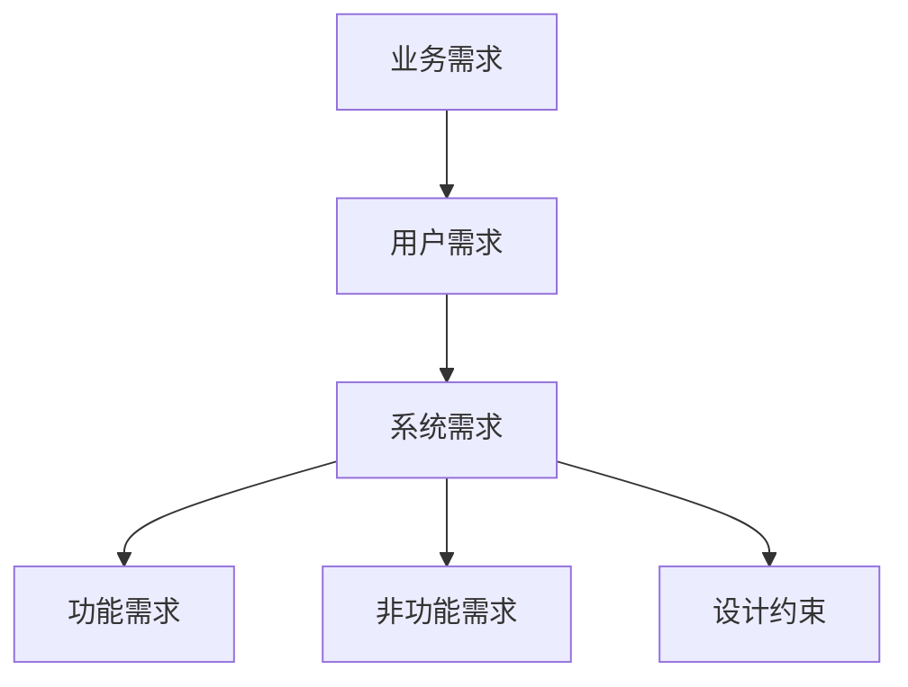
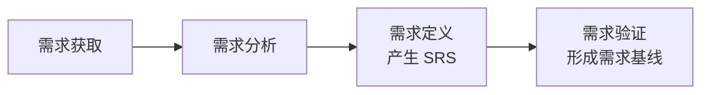
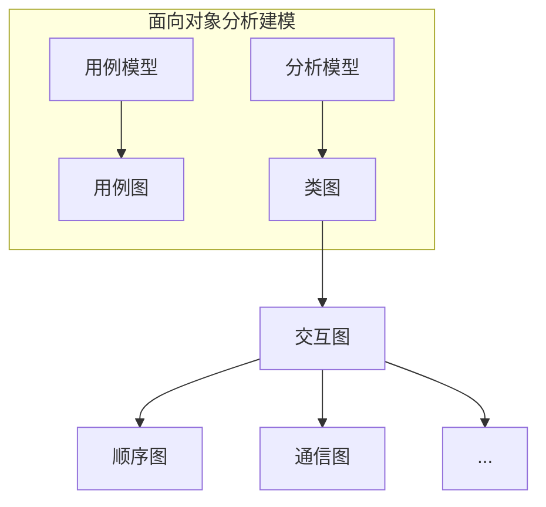
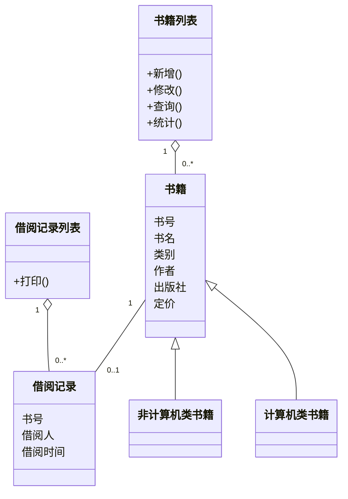
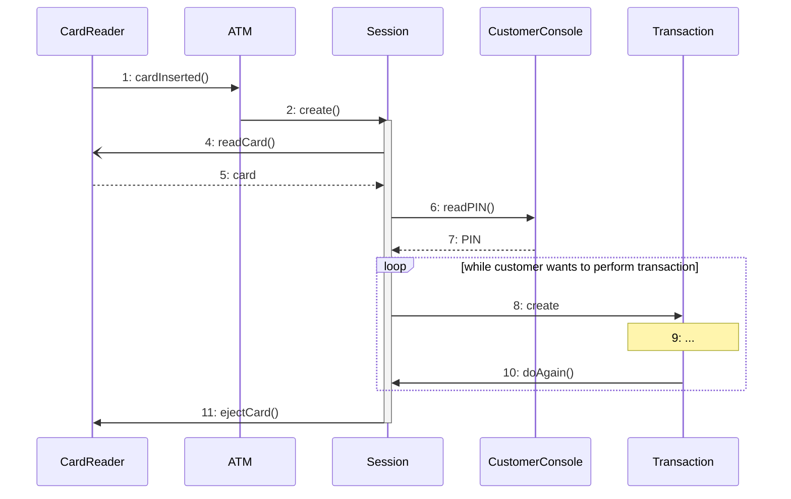
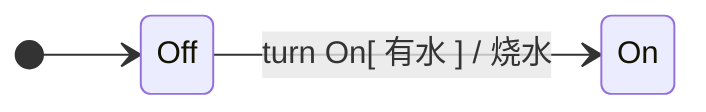
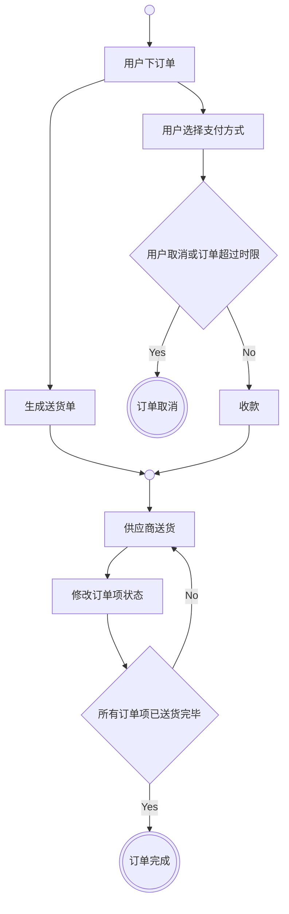
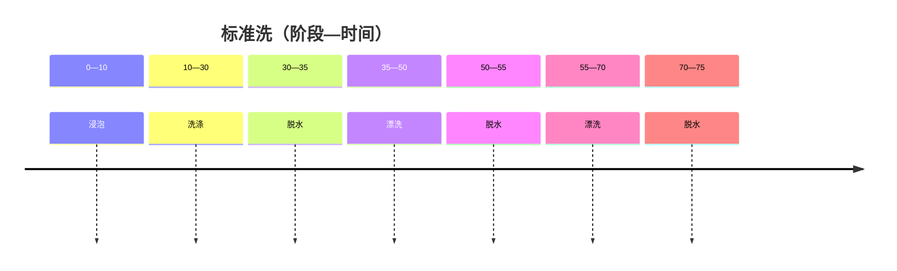
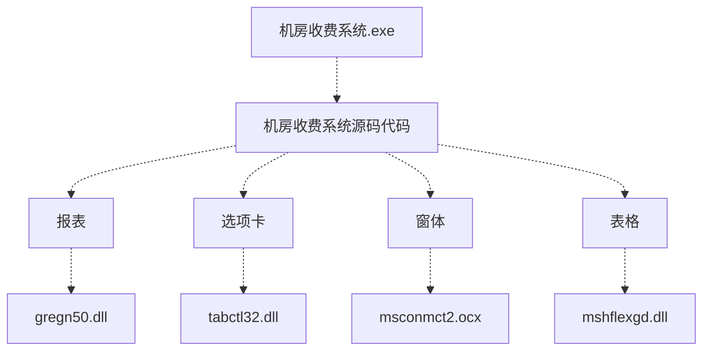
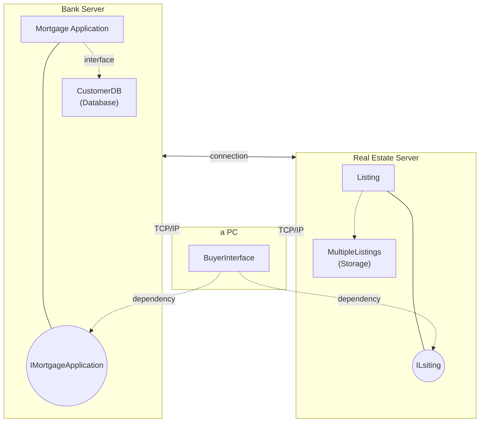

# 第十一章 软件需求工程

## 一、需求工程概述

### 1. 概念

软件需求是指用户对系统在功能、行为、性能、设计约束等方面的期望。

考虑**“做什么”**，而不考虑**“怎么做”**，不关注开发平台和程序语言。

### 2. “FURPS+” 模型

在统一过程（UP）中，需求按照“FURPS+”模型进行分类。

- **【功能性 (Functional)】**：特性、功能、安全性。
- **【可用性 (Usability)】**：人性化因素、帮助、文档。
- **【可靠性 (Reliability)】**：故障频率、可恢复性、可预测性。
- **【性能 (Performance)】**：响应时间吞吐量、准确性、有效性、资源利用率。
- **【可支持性 (Supportability)】**：适应性、可维护性、国际化、可配置性。

**FURPS+ 结构示意（ASCII）**

```text
                     “FURPS+” 模型（UP）
                              |
    +--------+--------+--------+--------+--------+
    |        |        |        |        |        |
    F        U        R        P        S
  功能性   可用性   可靠性   性能    可支持性
```

### 3. 需求的层次

**（1）业务需求（Business Requirements）**：是指反映企业或客户对系统高层次的目标要求，通常来自项目投资人、购买产品的客户、客户单位的管理人员、市场营销部门或产品策划部门等。通过业务需求可以确定项目视图和范围，为以后的开发工作奠定了基础。

**（2）用户需求（User Requirements）**：描述的是用户的具体目标，或用户要求系统必须能完成的任务。也就是说，用户需求描述了用户能使用系统来做些什么。

**（3）系统需求（System Requirements）**：是从系统的角度来说明软件的需求，包括功能需求、非功能需求（性能需求）和设计约束等。

- **功能需求（Functional Requirements）**：也称为行为需求，它规定了开发人员必须在系统中实现的软件功能，用户利用这些功能来完成任务，满足业务要求。
- **非功能需求（Non-functional Requirements）**：是指系统必须具备的属性或品质，又可细分为软件质量属性和其它非功能需求。
- **设计约束（Design Constraints）**：也称为限制条件或补充规约，通常是对系统的一些约束说明。

**需求层次示意（Mermaid）**




**需求层次示意（ASCII）**

```text
业务需求（高层次目标、项目视图与范围）
    |
    v
用户需求（用户目标与可完成的任务）
    |
    v
系统需求
    +-- 功能需求（行为需求：须实现的软件功能）
    +-- 非功能需求（属性与品质；含软件质量属性等）
    `-- 设计约束（限制条件 / 补充规约）
```

### 4. QFD（Quality Function Deployment）

质量功能部署 QFD 是一种将用户要求转化成软件需求的技术，其目的是最大限度地提升软件工程过程中用户的满意度。

QFD 将软件需求分为三类：

**（1）常规需求（基本需求）**：用户认为系统应该做到的功能或性能，实现越多用户会越满意。

**（2）期望需求（Expected Requirements）**：用户想当然认为系统应具备的功能或性能，但并不能正确描述自己想要得到的这些功能或性能需求。如果期望需求没有得到实现，会让用户感到不满意。

**（3）兴奋需求（意外需求）**：是用户要求范围内的功能或性能，实现这些需求用户会更高兴，但不实现也不影响其购买的决策。

### 5. 需求工程

软件需求工程是包括创建和维护软件需求文档所需的一切活动的过程，可分为需求开发和需求管理两大工作。

**（1）【需求开发活动】**：需求获取、需求分析、需求定义（产生 SRS）、需求验证（形成需求基线【经过评审的 SRS】）。

**（2）【需求管理活动】**：需求变更、需求跟踪。需求管理包括需求文档的追踪管理、变更控制、版本控制等管理性活动。

**注**：需求管理是对需求基线进行管理。

**需求工程两大工作（ASCII）**

```text
软件需求工程（创建和维护软件需求文档的活动）
          |
    +-----+---------------------+
    |                           |
需求开发活动                 需求管理活动
需求获取、需求分析、        需求变更、需求跟踪
需求定义（产生 SRS）、      （需求文档的追踪管理、变更控制、版本控制等）
需求验证（形成需求基线【经过评审的 SRS】）
```

**需求开发活动过程（Mermaid）**




## 二、需求开发

### 1. 需求获取方法


| 方法              | 特点                                                                  |
| --------------- | ------------------------------------------------------------------- |
| **用户访谈**        | 1对1-3，有代表性的用户，了解主观想法，交互好。成本高，要有领域知识支撑。                              |
| **问卷调查**        | 用户多，无法一一访谈，成本低。                                                     |
| **采样 (抽样调查)**   | 基于数理统计，降低成本，快速获取。采样技术包括：随机采样、分层采样、聚类采样等，具体采用哪种方法根据文档数量、样本大小和实际情况决定。 |
| **情节串联板【原型前身】** | 一系列图片，通过这些图片来讲故事。类型包括：被动式、主动式和交互式。                                  |
| **联合需求计划**      | 高度组织的群体会议，各方参与，了解想法，消除分歧，交互好，成本高。                                   |
| **需求记录技术**      | 需求记录工具有：任务卡片、场景说明、用户故事和 Volere 白卡等。                                 |


### 1.1 用户访谈

**用户访谈工作阶段示意（ASCII）**

```text
一、准备访谈  -->  二、访谈过程  -->  三、访谈的后续工作
```


| 工作内容          | 要点                                                                                        |
| ------------- | ----------------------------------------------------------------------------------------- |
| **一、准备访谈**    | **步骤：** 1、确定访谈目的。 2、确定访谈哪些用户。 3、准备一些详细的访谈问题【开放式和封闭式相结合】。 4、作出最终的访谈安排。 此外：领域知识培训，充分阅读相关材料。 |
| **二、访谈过程**    | **注意事项：** 1、限制访谈时间。 2、寻找异常和错误情况。 3、深入调查细节。 4、认真作好记录。                                      |
| **三、访谈的后续工作** | 1、后续工作的首要任务是吸收、理解和记录访谈所得的信息。 2、当次错过的问题，记录下来，下次再访谈。                                        |


### 1.2 问卷调查

通过精心设计问卷并发放和收集，获取用户需求。


| 工作内容        | 要点                                                                                                                                    |
| ----------- | ------------------------------------------------------------------------------------------------------------------------------------- |
| **三个重要活动**  | 1、确定问题及其类型。开放式和封闭式结合问题。能预见用户可能的回答。 2、编写问题。注意使用“用户的语言”，问题简短、不含糊，但避免过度明确。 3、设计问卷调查表的格式。                                                 |
| **缺陷或挑战**   | 1、未见面，无法从用户的表情等其它动作来获取一些更隐性的信息，用户也没机会立即澄清对问题有含糊或错误的回答。 2、用户不重视，不认真对待，使得反馈的信息不全面。 3、不利于对问题进行展开的回答，无法了解一些细节问题。 4、无法保证用户会回答问题或进一步说明所有问题。 |
| **提升问卷返还率** | 1、向所有的工作人员解释问卷的目的，以及如何填。 2、强调这份问卷哪些人员必须填写。 3、拜托相关领导督促填写并及时返还。 4、合理设计，尽量减少回答问卷所花费的时间。 5、设置一些奖品或奖励，激励大家及时返还问卷。                          |


**问卷调查表内结构（ASCII）**

```text
工作内容（行主题）
├── 三个重要活动
├── 缺陷或挑战
└── 提升问卷返还率
```

### 1.3 联合需求计划（JRP）

通过高度组织的群体会议来分析企业内的问题并获取需求。


| 工作内容     | 要点                                                                                                                                     |
| -------- | -------------------------------------------------------------------------------------------------------------------------------------- |
| **工作步骤** | 1、实施前，制订详细议程，并严格遵照议程进行。 2、按照既定的时间安排进行。 3、尽量完整的会议纪要。 4、避免使用专业术语。 5、运用解决冲突的技能。 6、会议期间应设置间歇时间。 7、鼓励团队取得一致意见。 8、保证参加 JRP 的所有人员能够遵守事先约定的规则。 |


### 2. 需求分析


| 需求分析                |                               |
| ------------------- | ----------------------------- |
| **【结构化】需求分析（SA）**   | 【结构化开发中的需求分析阶段】               |
| **【面向对象】需求分析（OOA）** | 【面向对象开发中的需求分析阶段】              |
| **面向问题域的分析（PDOA）**  | 强调描述，较少强调建模。关注问题域，关注解释系统的待求行为 |
| **维也纳设计方法（VDM）**    | 【形式化分析方法】                     |


#### 2.1 结构化需求分析（SA）

**2.1.1 结构化需求分析过程**

**结构化分析模型关系**

```text
                         数据字典（核心）-----包含：数据元素、数据结构、数据流、数据存储、加工逻辑、外部实体
                    /         |         \
              行为模型    功能模型    数据模型
                  |          |          |
            状态转换图   数据流图    E-R 图
            ·状态        ·数据流     ·实体
             (初态、终态) ·加工       ·联系
            ·事件        ·数据存储
                        ·外部实体

```

**2.1.2 数据流图（DFD）**


| 元素           | 说明                                            | 图元                     |
| ------------ | --------------------------------------------- | ---------------------- |
| **数据流**      | 由一组固定成分的数据组成，表示数据的流向。每个数据流通常有一个合适的名词，反映数据流的含义 | →                      |
| **加工**       | 加工描述了输入数据流到输出数据流之间的变换，也就是输入数据流做了什么处理后变成了输出数据流 | 圆形或圆角矩形                |
| **数据存储（文件）** | 用来表示暂时存储的数据，每个文件都有名字。流向文件的数据流表示写文件，流出的表示读文件   | 两条平行的水平线与左侧竖线；或左侧开口的矩形 |
| **外部实体**     | 指存在于软件系统外的人员或组织                               | 矩形                     |


**DFD 主要图元关系（ASCII）**

```text
外部实体 ——数据流——> (加工) ——数据流——> 外部实体
                          | ^
                          v |
                      数据存储（文件）
```

**2.1.3 数据字典**

| 符号              | 含义     | 举例说明                                    |
| ----------------- | -------- | ------------------------------------------- | --------------- | ---------------------------- |
| `=`               | 被定义为 |                                             |
| `+`               | 与       | `x=a+b`，表示 x 由 a 和 b 组成              |
| `[..., ...]或[... | ...]`    | 或                                          | `x=[a, b], x=[a | b]`，表示 x 由 a 或由 b 组成 |
| `{...}`           | 重复     | `x={a}`，表示 x 由 0 个或多个 a 组成        |
| `(...)`           | 可选     | `x=(a)`，表示 a 可在 x 中出现，也可以不出现 |

### 2.2 面向对象需求分析

#### 2.2.1 面向对象基本概念

**（1）对象：** 属性（数据）+ 方法（操作）+ 对象 ID。

**（2）类的分类：** 实体类/控制类/边界类。

- **实体类：** 映射需求中的每个实体，实体类保存需要存储在永久存储体中的信息，例如，在线教育平台系统可以提取出学员类和课程类，它们都属于实体类。
- **控制类：** 用于控制用例工作的类，一般是由动宾结构的短语（“动词+名词”或“名词+动词”）转化来的名词，例如，用例“身份验证”可以对应于一个控制类“身份验证器”，它提供了与身份验证相关的所有操作。
- **边界类：** 用于封装在用例内、外流动的信息或数据流。边界类位于系统与外界的交接处，包括所有窗体、报表、打印机和扫描仪等硬件的接口，以及与其他系统的接口。

**（3）继承与泛化：** 复用机制，一般和特殊的关系。继承是一种复用机制，一个类继承有多个父类，称为【多重继承】。

**（4）封装：** 隐藏对象的属性和实现细节，仅对外公开接口。

**（5）多态：** 不同对象收到同样的消息产生不同的结果。

**（6）重载：** 一个类可以有多个同名而参数类型不同的方法。

#### 2.2.2 UML 相关概念

**UML（统一建模语言）：平台无关、语言无关**

```text
┌──────────────────────────────────────────────────────────────────────────────┐
│ 构造块    规则    公共机制                                                    │
└──────────────────────────────────────────────────────────────────────────────┘
       │                │                │
       v                v                v

【构造块】──> 事物、关系、图
       │
       └── 事物（四类）
            ├ 结构事物：最静态的部分，包括：类、接口、协作、用例、活动类、构件和节点。
            ├ 行为事物：代表时间和空间上的动作，包括：消息、动作次序、连接。
            ├ 分组事物：看成是个盒子，如：包、构件。
            └ 注释事物：UML 模型的解释部分。描述、说明和标注模型的元素。

【规则】──> 范围、可见性、完整性、执行
       ├ 范围：给一个名字以特定含义的语境。
       ├ 可见性：怎样使用或看见名字。
       ├ 完整性：事物如何正确、一致地相互联系。
       └ 执行：运行或模拟动态模型的含义是什么。

【公共机制】──> 规格说明、修饰、公共分类、扩展机制
       ├ 规格说明：事物语义的细节描述，它是模型真正的核心。
       ├ 修饰：通过修饰来表达更多的信息。
       ├ 公共分类：类与对象、接口与实现。
       └ 扩展机制：允许添加新的规则。
```

1. **类：** 是描述具有相同属性、方法、关系和语义的对象的集合，一个类实现一个或多个接口。
2. **接口：** 是指类或构件提供特定服务的一组操作的集合，接口描述了类或构件的对外可见的动作。
3. **构件：** 是物理上或可替换的系统部分，它实现了一个接口集合。
4. **包：** 是一种将有组织的元素分组的机制。
5. **用例：** 是描述一系列的动作，产生有价值的结果。
6. **协作：** 定义了交互的操作，是一些角色和其它事物一起工作，提供一些合作的动作，这些动作比事物的总和要大。
7. **节点：** 是一个物理元素，它在运行时存在，代表一个可计算的资源，通常占用一些内存和具有处理能力。

#### 2.2.3 UML 图分类

**UML 图**

```text
UML图
├── 静态图（结构图）
│   ├── 类图：一组类、接口、协作和它们之间的关系
│   ├── 对象图：一组对象及它们之间的关系
│   ├── 构件图：一个封装的类和它的接口
│   ├── 部署图：软硬件之间的映射
│   ├── 制品图：系统的物理结构
│   ├── 包图：由模型本身分解而成的组织单元，以及它们之间的依赖关系
│   └── 组合结构图
│
└── 动态图（行为图）
    ├── 用例图：系统与外部参与者的交互
    ├── 交互图
    │   ├── 顺序图：强调按时间顺序
    │   ├── 通信图（协作图）
    │   ├── 定时图：强调实际时间
    │   └── 交互概览图
    ├── 活动图：类似程序流程图，并行行为
    └── 状态图：状态转换变迁
```

UML 2.0 包括 14 种图，分别如下：

1. **类图（class diagram）：** 类图描述一组类、接口、协作和它们之间的关系。类图给出了系统的静态设计视图，活动类的类图给出了系统的静态进程视图。
2. **对象图（object diagram）：** 对象图描述一组对象及它们之间的关系。对象图描述了在类图中建立的事物实例的静态快照。对象图是从真实案例或原型案例的角度建立的。
3. **构件图（component diagram）：** 构件图描述一个封装的类和它的接口、端口，以及由内嵌的构件和连接件构成的内部结构。构件图用于表示系统的静态设计实现视图。
4. **组合结构图（composite structure diagram）：** 组合结构图描述结构化类（例如，构件或类）的内部结构，包括结构化类与系统其余部分的交互点。组合结构图用于画出结构化类的内部内容。
5. **用例图（use case diagram）：** 用例图描述一组用例、参与者及它们之间的关系。用例图给出系统的静态用例视图。
6. **顺序图（sequence diagram，序列图）：** 顺序图是一种交互图（interaction diagram），交互图展现了一种交互，它由一组对象或参与者以及它们之间可能发送的消息构成。交互图专注于系统的动态视图。顺序图是强调消息的时间次序的交互图。
7. **通信图（communication diagram）：** 通信图也是一种交互图，它强调收发消息的对象或参与者的结构组织。
8. **定时图（timing diagram，计时图）：** 定时图也是一种交互图，它强调消息跨越不同对象或参与者的**实际时间**，而不仅仅只是关心消息的相对顺序。
9. **状态图（state diagram）：** 状态图描述一个状态机，它由状态、转移、事件和活动组成。状态图给出了对象的动态视图。它对于接口、类或协作的行为建模尤为重要，而且它强调事件导致的对象行为，这非常有助于对反应式系统建模。
10. **活动图（activity diagram）：** 活动图将进程或其它计算结构展示为计算内部一步步的控制流和数据流。活动图专注于系统的动态视图。它对系统的功能建模和业务流程建模特别重要，并强调对象间的控制流程。
11. **部署图（deployment diagram）：** 部署图描述对运行时的处理节点及在其中生存的构件的配置。部署图给出了架构的静态部署视图，通常一个节点包含一个或多个部署图。
12. **制品图（artifact diagram）：** 制品图描述计算机中一个系统的物理结构。制品包括文件、数据库和类似的物理比特集合。制品图通常与部署图一起使用。制品也给出了它们实现的类和构件。
13. **包图（package diagram）：** 包图描述由模型本身分解而成的组织单元，以及它们之间的依赖关系。
14. **交互概览图（interaction overview diagram）：** 交互概览图是活动图和顺序图的混合物。

#### 2.2.4 UML-4+1 视图

```text
                    展示系统功能                         源代码结构
    ┌─────────────────────────────┐     ┌─────────────────────────────┐
    │ 系统分析、设计人员             │     │ 程序员                       │
    │ 逻辑视图 (logical view)      │ ═══>│ 实现视图 (implementation view) │
    │ 类与对象                     │     │ 物理代码文件和组件            │
    └──────────────┬──────────────┘     └──────────────┬──────────────┘
                   │                                   │
                   │         ╭──────────────────╮      │
                   │         │ 最终用户          │      │
                   │         │ 用例视图          │      │
                   │         │ (use-case view)  │      │
                   │         │ 需求分析模型       │      │
                   │         ╰──────────────────╯      │
                   │                                   │
                   v                                   v
    ┌──────────────┴──────────────┐     ┌──────────────┴──────────────┐
    │ 系统集成人员                  │     │ 系统和网络工程师              │
    │ 进程视图 (process view)      │ ═══>│ 部署视图 (deployment view)   │
    │ 线程、进程、并发               │     │ 软件到硬件的映射              │
    └─────────────────────────────┘     └─────────────────────────────┘
              并发与同步结构                         软件构件到物理结点映射
```

UML 采用 4+1 视图来描述软件和软件开发过程：

1. **（1）逻辑视图（Logical View）：** 以问题域的语汇组成的类和对象集合。
2. **（2）进程视图（Process View）：** 可执行线程和进程作为活动类的建模，它是逻辑视图的一次执行实例，描绘了所设计的并发与同步结构。
3. **（3）实现视图（Implementation View）：** 对组成基于系统的物理代码的文件和组件进行建模。
4. **（4）部署视图（Deployment View）：** 把构件部署到一组物理的、可计算的节点上，表示软件到硬件的映射及分布结构。
5. **（5）用例视图（Use Case View）：** 最基本的需求分析模型。

#### 2.2.5 OOA 需求建模

```text
  （用例模型）                                    （分析模型）
       │                                               │
  ┌────┴───────────────────────────────────┐      ┌─────┴──────────────────────────────────┐
  │ ✓ 识别参与者                             │      │ ✓ 定义概念类                            │
  │ ✓ 合并需求获得用例                        │      │ ✓ 识别类之间的关系                       │
  │ ✓ 调整用例模型 ──────────────────┐       │      │ ✓ 为类添加职责                           │
  │ ✓ 细化用例描述 ──────────┐       │       │      │ ✓ 建立交互图                             │
  └────────────────────────│───────│───────┘      └────────────────────────────────────────┘
                           │       │                                       │
              ┌────────────┘       └────────────┐                          │
              ▼                                 ▼                          ▼
  ┌───────────────────────────────┐   ┌─────────────────────┐   ┌─────────────────────────────────┐
  │ • 用例名称                     │   │ • 包含关系           │   │ • 依赖关系                        │
  │ • 简要说明                     │   │ • 扩展关系           │   │ • 关联关系                        │
  │ • 事件流                       │   │ • 泛化关系           │   │ • 聚合关系                       │
  │ • 非功能需求                   │   └─────────────────────┘   │ • 组合关系                        │
  │ • 前置条件                     │                             │ • 泛化关系                       │
  │ • 后置条件                     │                             │ • 实现关系                       │
  │ • 扩展点                       │                             └────────────────────────────────┘
  │ • 优先级                       │
  └───────────────────────────────┘
```

### 3. 需求定义

1. **（1）严格定义法：**

- 所有需求都能够被预先定义
- 开发人员与用户之间能够准确而清晰地交流
- 采用图形/文字可以充分体现最终系统

1. **（2）原型法：**

- **并非所有的需求都能在开发前被准确地说明**
- 项目参加者之间通常都存在交流上的困难；
- 需要实际的、可供用户参与的系统模型；
- 有合适的系统开发环境；
- 反复是完全需要和值得提倡的，需求一旦确定，就应遵从严格的方法。

### 4. 需求验证

需求验证包括需求评审和需求测试，其中，需求评审又可分为正式评审和非正式评审。

---

## 三、需求管理

### 1. 需求变更管理过程

**需求变更控制流程的十大步骤：**

1. 明确问题
2. 书面申请
3. 判断变更需求类别
4. 评估变更影响
5. 判断变更的紧急级别
6. 沟通确认
7. 明确解决方案
8. 审批管理
9. 执行变更
10. 版本控制

### 2. 需求跟踪

需求跟踪是将单个需求和其它系统元素之间的依赖关系和逻辑联系建立跟踪，这些元素包括各种类型的需求、业务规则、系统架构和构件、源代码、测试用例，以及帮助文件等。

---

## 四、需求工程案例扩展

### 1. 结构化需求分析

#### 1.1 数据流图常见的 3 种错误

- **黑洞：** 一个加工只有输入数据流而无输出数据流。
- **奇迹：** 一个加工只有输出数据流而无输入数据流。
- **灰洞：** 若一个加工的输入数据流无法通过加工产生对应的输出数据流。

#### 1.2 数据流图题答题技巧

**（1）** 详细分析试题说明；

**（2）** 利用数据平衡原则

##### 1.2.1 补充实体

**实体可能是：**

- **人物角色：** 如客户、管理员、主管、经理、老师、学生
- **组织机构：** 如银行、供应商、募捐机构
- **外部系统：** 如银行系统、工资系统、后台数据库（当要开发的是中间件时）

##### 1.2.2 补充存储

**存储的文字方面特征：** `"**文件" "**表" "**库" "**清单" "**档案"`

##### 1.2.3 补充数据流

**（1）数据平衡原则**

- 对照顶层图与 0 层图，检查是否存在一方有、另一方缺失的数据流。
- 检查图中每个加工是否存在「黑洞」（仅有输入无输出）、「奇迹」（仅有输出无输入），或输入数据流经该加工无法产生对应输出。

**（2）按题目说明与图进行匹配**

- 说明中的每一句话都应在图中有对应关系。先根据说明识别实体与数据流，便于缩小范围、发现遗漏。

##### 1.2.4 补充加工名

加工用于处理数据流。补充加工名时，先在说明中找出涉及的数据流，再在包含该数据流名称的句子中寻找「动词 + 名词」结构，判断其是否可作加工名。

「动词 + 名词」示例：生成报告、发出通知、批改作业、记录分数。也有例外，如「物流跟踪」「用户管理」等。

##### 1.2.5 数据流图绘制基本原则

**（1）** DFD 只使用四类图元：**外部实体、数据流、加工、存储**。每个元素均须命名。

**（2）** 每个加工至少须有一条输入数据流和一条输出数据流，并保持**【数据守恒】**。

**（3）** DFD 中加工按层编号（编号表示所在层次及父子关系）。

**（4）** 任一层子图须与上一层中某一加工对应，且二者输入、输出数据流须一致，即父子图平衡。

**（5）** 在一套完整的 DFD 中，每个数据存储都应有读、写数据流；但在某一具体子图中，可能只出现读或写之一。

**（6）** 可为帮助理解在 DFD 中增加**物理流**，但**不允许出现控制流**。

##### 1.2.6 高质量数据流图绘制原则

**（1）复杂性最小化原则：** DFD 的分层结构将信息划分为较小、相对独立的子集合，便于单独审视每一张图；若要了解某加工的更多细节，可下钻至下一层。图相关联，可以跳转到上一层的数据流图进行考察。

**（2）接口最小化原则。** 接口最小化是复杂性最小化的一种具体规则。在设计模式时，应使得模型中各个元素之间的接口数或连接数最小化。

**（3）数据流一致性原则。** 一个过程和它的过程分解在数据流内容中是否有差别？是否存在有数据流出但没有相应的数据流入的加工？是否存在有数据流入但没有相应的数据流出的加工？

### 2. 面向对象分析




#### 2.1 用例模型建立流程

**（1）用例模型建立流程：**

- **第一步：** 识别参与者【参与者：用户、组织、外部系统、时间】
- **第二步：** 合并需求获得用例
- **第三步：** 细化用例描述
- **第四步：** 调整用例模型（可选步骤）【关系包括：包含关系、扩展关系、泛化关系】

**（2）用例关系包括：包含关系、扩展关系、泛化关系**

- **包含关系【使用关系】：** 从多个用例中提取公共行为，提取出来的公共用例称为抽象用例，而把原始用例称为基本用例。
- **扩展关系：** 一个用例明显地混合了两种或两种以上的不同场景，即根据情况可能发生多种分支，则可以将这个用例分为一个基本用例和一个或多个扩展用例。
- **泛化关系：** 当多个用例共同拥有一种类似的结构和行为的时候，可以将它们的共性抽象成为父用例，其它的用例作为泛化关系中的子用例。子用例继承了父用例所有的结构、行为和关系。

#### 2.2 分析模型建立流程

**（1）第一步：定义概念类**

- ✓ 阅读和理解需求文档或用例描述
- ✓ 筛选出名词或名词短语，建立初始类清单（候选类）
- ✓ 将候选类分成三类，分别是显而易见的类、明显无意义的类和不确定类别的类
- ✓ 舍弃明显无意义的类：去除相同含义的、去除不属于系统范围内的、去除没有特定独立行为的、去除含义解释不清楚的、去除属于另一个类属性或行为的
- ✓ 小组讨论不确定类别的类，直到将它们都合并或调整到其它两个类别，并进行相应的操作

**（2）第二步：确定类之间的关系**

- **依赖关系（Dependency）：** 一个事物发生变化影响另一个事物。
- **关联关系（Association）：** 描述了一组链，链是对象之间的连接。
  - **聚合关系（Aggregation）：** 整体与部分生命周期不同。
  - **组合关系（Composition）：** 整体与部分生命周期相同。
- **实现关系（Realization）：** 接口与类之间的关系。
- **泛化（继承）关系（Generalization/Inheritance）：** 特殊/一般关系。

**（3）第三步：为类添加职责**

**（4）第四步：建立交互图**

**（5）第五步：分析模型的详细程度问题**

#### 2.3 UML 图考查形式

##### 2.3.1 用例图考查形式

- 用例图描述一组用例、参与者及它们之间的关系。
- 用户角度描述系统功能；参与者是外部触发因素；用例是功能单元。

```mermaid
useCaseDiagram
  actor "读者" as reader
  actor "VIP读者" as vip
  reader <|-- vip
  package "图书管理系统" {
    usecase "借阅图书" as borrow
    usecase "馆际借阅" as inter
    usecase "验证读者资格" as validate
    usecase "发出续借提示" as renew
  }
  reader --> borrow
  vip --> borrow
  borrow ..> validate : "<<include>>"
  renew ..> borrow : "<<extend>>"
  borrow <|-- inter
```

（1）补充参与者：参与者通常是外部实体（人或系统）。

（2）补充用例：根据问题描述。

（3）分析用例之间的关系。

（4）其他：补充新的用例等。

##### 2.3.2 类图 / 对象图考查形式

**类图（class diagram）：** 类图描述一组类、接口、协作和它们之间的关系。类图给出了系统的静态设计视图，活动类的类图给出了系统的静态进程视图。

**对象图（object diagram）：** 对象图描述一组对象及它们之间的关系。对象图描述了在类图中建立的事物实例的静态快照。对象图是从真实案例或原型案例的角度建立的。



（1）根据问题描述补充名称（名词）、方法、属性。

（2）补充多重性（如 0..1、1..1、1..* 等）。

（3）关系：分析类与类（或对象与对象）之间的关系。

##### 2.3.3 顺序图（序列图）

**顺序图（sequence diagram，序列图）：** 顺序图是一种交互图（interaction diagram），交互图展现了一种交互，它由一组对象或参与者以及它们之间可能发送的消息构成。交互图专注于系统的动态视图。顺序图是强调消息的时间次序的交互图。

**顺序图示例（ATM）：**

图注：**对象**；**生命线**；**同步消息**（实心箭头、实心三角）；**异步消息**（实心箭头、开放箭头）；**返回消息**（虚线箭头）；**简单消息**；**序列片段**（`loop [while customer wants to perform transaction]`）；**参与者创建消息**；**生命结束**（生命线末端 X）；**参与者销毁消息**。

| 序号 | 说明 |
| :--- | :--- |
| 1 | `cardInserted()`：`:CardReader` → `:ATM`（同步消息） |
| 2 | `create()`：`:ATM` 创建 `:Session`（参与者创建消息） |
| 3 | `performSession()`：`:ATM` → `:Session`（同步消息） |
| 4 | `readCard()`：`:Session` → `:CardReader`（异步消息） |
| 5 | `card`：`:CardReader` → `:Session`（返回消息，虚线） |
| 6 | `readPIN()`：`:Session` → `CustomerConsole`（简单消息） |
| 7 | `PIN`：`CustomerConsole` → `:Session`（返回消息，虚线） |
| 8 | `<<create>>`：`:Session` 在循环片段内创建 `:Transaction` |
| 9 | `…` |
| 10 | `doAgain()`：`:Transaction` → `:Session`；循环内 `:Transaction` 生命结束（X） |
| 11 | `ejectCard()`：`:Session` → `:CardReader`（参与者销毁消息）；`:Session` 生命结束（X） |



（1）补充类名/对象名

（2）补充消息

（3）顺序图的组合片段：

- **Loop【循环】：** 如果满足「循环条件」，则重复执行本框中的内容。
- **Alt【条件分支】：** 满足条件1，则执行条件1对应的内容，满足条件2则执行条件2对应的内容。
- **Opt【可选分支】：** 如果条件满足，则执行框中内容，否则跳过不执行。

##### 2.3.4 通信图考查形式

**通信图（communication diagram）。** 通信图也是一种交互图，它强调对象之间存在的消息收发关系，而不专门突出这些消息发送的时间顺序。

**通信图示例（对象与消息）：**

| 链路与消息 |
| :--- |
| `dispatchForm:Form` → `aOrder:Order`：`1: dispatch()` |
| `aOrder:Order` → `dispatchForm:Form`：`1.5: Summary` |
| `aOrder:Order` → `:OrderItem`：`*[for each orderItem] 1.1: getPeddleryId()` |
| `:OrderItem` → `aOrder:Order`：`1.2: PeddleryId` |
| `aOrder:Order` → `:DeliverOrder`：`[PeddleryId Not Exist] 1.3: create(PeddleryId)` |
| `aOrder:Order` → `:DeliverOrder`：`1.4: Add(ProductId)` |
| `:OrderItem` → `:Product`：`1.1.1: getPeddleryId()` |
| `:Product` → `:OrderItem`：`1.1.2: PeddleryId` |

```mermaid
flowchart LR
  df["dispatchForm:Form"] -->|1: dispatch()| ao["aOrder:Order"]
  ao -.->|1.5: Summary| df
  ao -->|"*[for each orderItem] 1.1: getPeddleryId()"| oi["OrderItem"]
  oi -.->|1.2: PeddleryId| ao
  ao -->|"[PeddleryId Not Exist] 1.3: create(PeddleryId)"| del["DeliverOrder"]
  ao -->|1.4: Add(ProductId)| del
  oi -->|1.1.1: getPeddleryId()| pr["Product"]
  pr -.->|1.1.2: PeddleryId| oi
```

##### 2.3.5 状态图考查形式

**状态图（State Diagram）** 是对类描述的补充。用于展现此类对象所具有的所有可能状态，以及某些事件发生时其状态转移情况。

图注：**源状态**；**目标状态**；**转换**；**触发事件**；**监护条件**；**动作**。



（**Off** → **On**：触发事件 **turn On**；监护条件 **[ 有水 ]**；动作 **烧水**。）

（1）补充状态

（2）补充触发事件、监护条件、动作

##### 2.3.6 活动图考查形式

**活动图（Activity Diagram）** 是一种特殊的状态图。活动图描述一个操作中要进行的各项活动的执行流程。同时，也常被用来描述一个用例的处理流程或者某种交互流程。

活动图将进程或其它计算结构展示为计算内部一步步的控制流和数据流。它强调对象间的控制流程。



（1）补充动作名称

（2）补充监护表达式

（3）分析并发关系

（4）活动图与流程图关系：

- 活动图描述的是对象活动的顺序关系所遵循的规则，它着重表现系统的行为，而非处理过程；而流程图着重描述处理过程。
- 流程图一般都限于顺序进程，而活动图则可以支持并发进程。

活动图是面向对象的，而流程图是面向过程的。

**（5）活动图与状态图的比较**

- **状态图：** 主要用于描述一个对象在其生命周期内的动态行为。它展示了对象所经历的**状态序列**、**导致状态转换的事件**，以及伴随这些转换的**动作**。
- **活动图：** 用于描述系统的**工作流**和**并发行为**。可以看作是状态图的一种特殊形式：在一个活动完成后，系统立即进入下一个活动（而在状态图中，转换往往需要**外部事件**触发）。
- **主要区别：**
  1. 状态图注重行为的**结果**，活动图注重行为的**动作**。
  2. 活动图可以描述**并发行为**，而状态图不能。

##### 2.3.7 定时图考查形式

**定时图（timing diagram，计时图）** 是一种交互图。用于显示交互过程中的**实时信息**，具体描述对象状态变化的**时间点**以及**特定状态维持的持续时间**。

**示例：标准洗（洗衣机）** — 纵轴自下而上为状态：**浸泡**、**洗涤**、**脱水**、**漂洗**；横轴时间刻度：**0、10、30、35、50、55、70、75**。迁移处标有「**状态改变**」；漂洗段峰顶处有「**状态**」标注。

| 时间段 | 状态 |
| :--- | :--- |
| 0～10 | 浸泡 |
| 10～30 | 洗涤 |
| 30～35 | 脱水 |
| 35～50 | 漂洗 |
| 50～55 | 脱水 |
| 55～70 | 漂洗 |
| 70～75 | 脱水 |



##### 2.3.8 构件图与包图考查形式

**构件图（component diagram）：** 构件图描述一个封装的类和它的接口、端口，以及由内嵌的构件和连接件构成的内部结构。构件图用于表示系统的静态设计实现视图。对于由**小组件**搭建而成的系统尤为重要。可以看作是**类图的一种变体**。

**包图（package diagram）：** 图标形如带标签的文件夹。基本思想是将**协同工作**的相关元素归到同一个「文件夹」中。**示例：** 构成子系统的多个类或多个构件可以放进同一个包中。

**构件依赖示例（机房收费系统）：**



##### 2.3.9 部署图考查形式

**部署图（Deployment Diagram）。** 部署图描述对运行时的处理节点及在其中生存的构件的配置。部署图给出了架构的静态部署视图，通常一个节点包含一个或多个部署图。

**部署图示例：**

- **Bank Server** 节点：构件 `<<Database>> CustomerDB`、`Mortgage Application`；`Mortgage Application` 以虚线 **interface** 指向 `CustomerDB`；接口 **IMortgageApplication**。
- **Real Estate Server** 节点：构件 **Listing**、`<<Storage>> MultipleListings`；**Listing** 以虚线指向 **MultipleListings**；接口 **ILsiting**。
- **a PC** 节点：构件 **BuyerInterface**；以虚线 **dependency** 指向 **IMortgageApplication**（Bank Server）、**ILsiting**（Real Estate Server）。
- **Bank Server** 与 **a PC**、**Real Estate Server** 与 **a PC** 之间：**TCP/IP**。**Bank Server** 与 **Real Estate Server** 之间：**connection**。图注：**node**、**component**。


