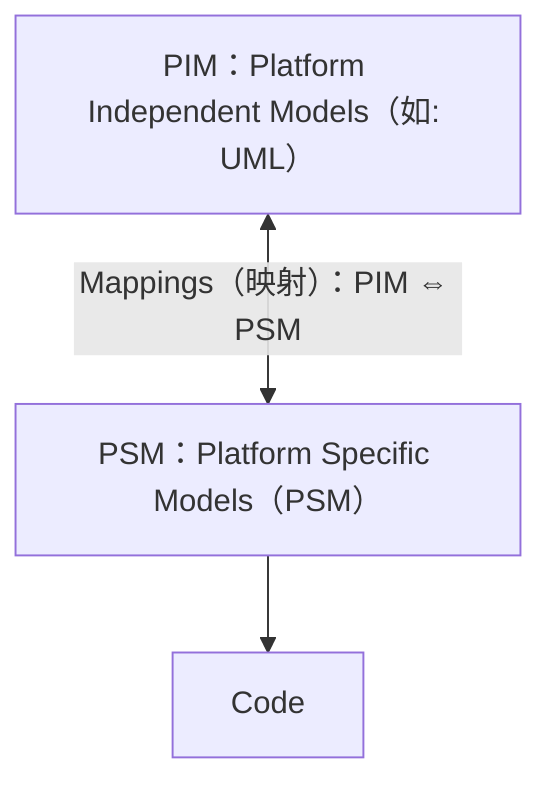
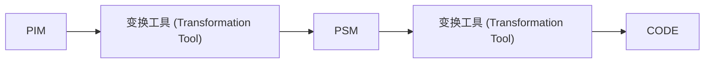
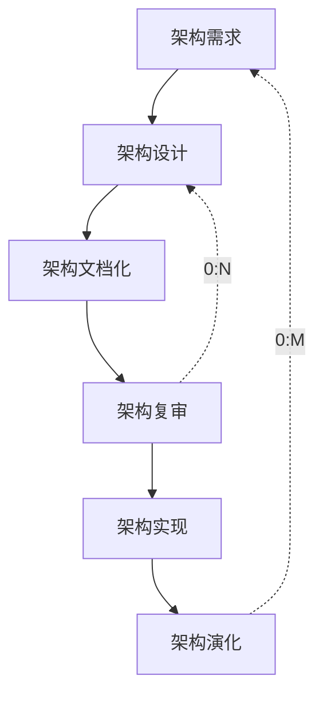
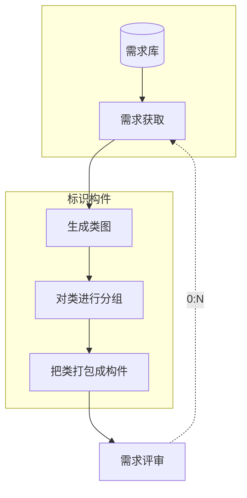
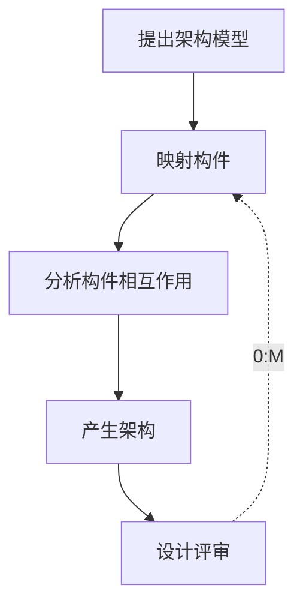
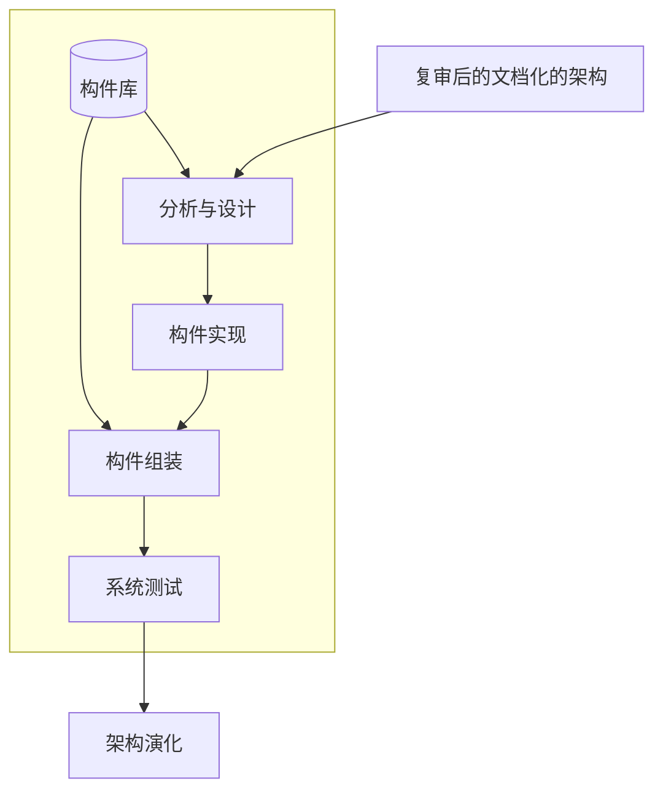
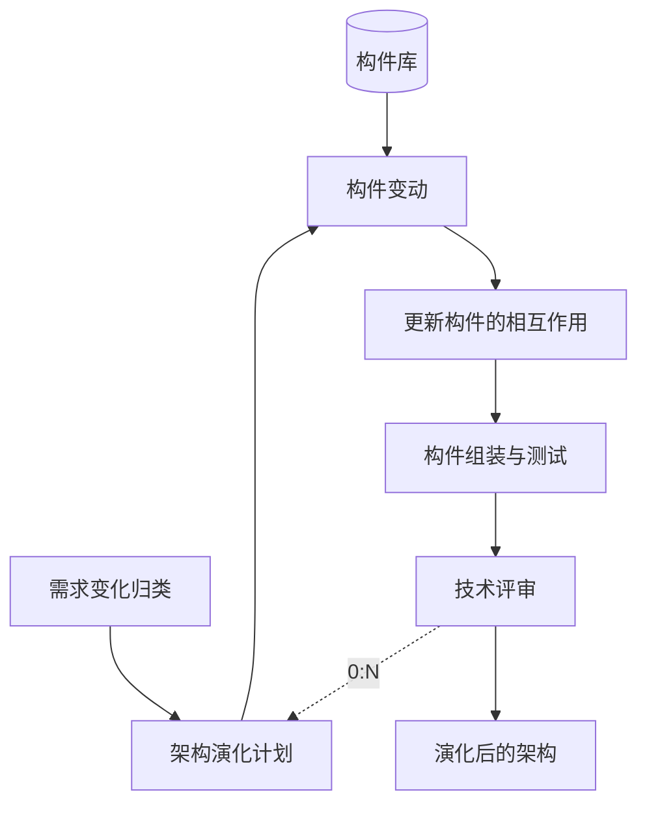
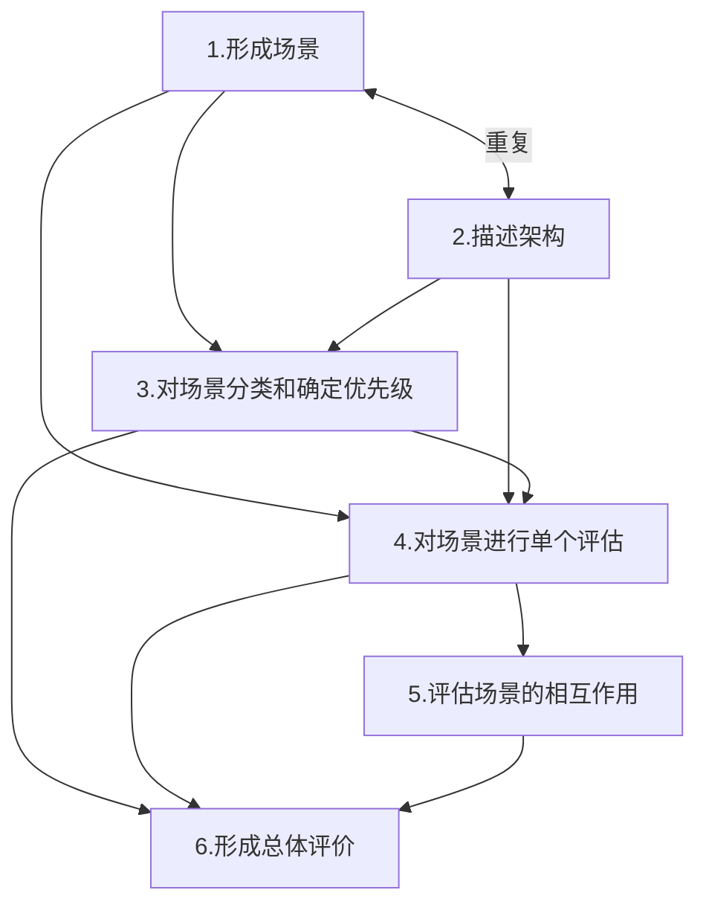
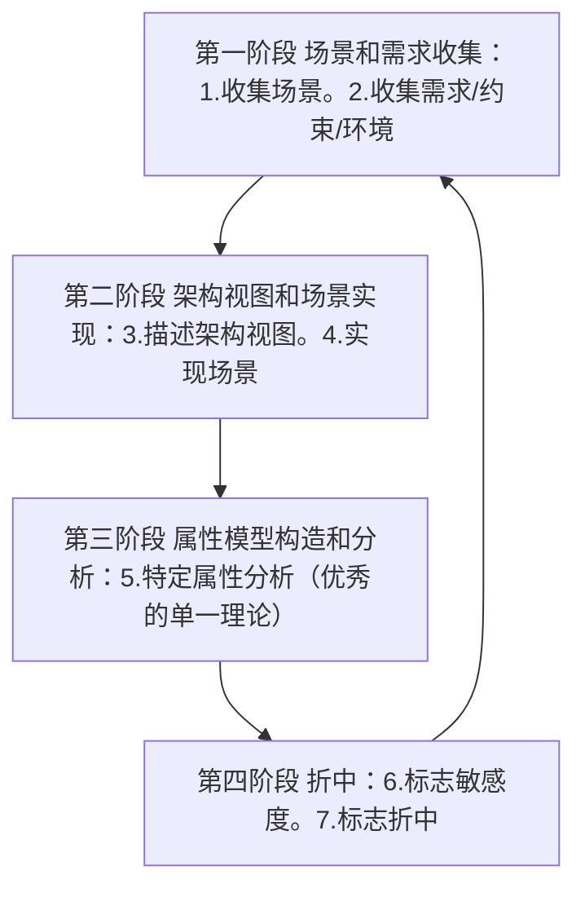

# 第十二章 架构设计

## 一、软件架构概述

### 1. 架构的概念

（1）软件架构为软件系统提供了一个结构、行为和属性的高级抽象。

### 2. 软件架构的意义

- ✓ 软件架构是项目干系人进行交流的手段
- ✓ 架构是早期设计决策的体现
- ✓ 架构明确了对系统实现的约束条件
- ✓ 架构决定了开发和维护组织的组织结构
- ✓ 架构制约着系统的质量属性
- ✓ 架构使推理和控制更改更简单
- ✓ 架构有助于循序渐进的原型设计
- ✓ 架构可以作为培训的基础
- ✓ 软件架构是可传递和可复用的模型，通过研究软件架构可能预测软件的质量

### 3. 架构设计

- 软件架构 = 软件体系结构
- 架构设计就是需求分配，即将满足需求的职责分配到组件上。

## 二、架构风格

### 1. 架构风格概念

- 架构风格反映了领域中众多系统所共有的结构和语义特性，并指导如何将各个构件有效地组织成一个完整的系统。
- 架构风格定义了用于描述系统的术语表和一组指导构建系统的规则。

### 2. 五大架构风格

| 五大架构风格                            | 子风格                                                                                           | 核心特点及注意事项                                              |
| :-------------------------------------- | :----------------------------------------------------------------------------------------------- | :-------------------------------------------------------------- |
| **数据流风格 Data Flow**                | 批处理 Batch Sequential 管道-过滤器 Pipes and Filters                                         | 数据驱动，适合用于前一步处理结果作为后一步数据处理输入的场景。  |
| **调用/返回风格 Call/Return**           | 主程序/子程序 Main Program and Subroutine 面向对象 Object-oriented 分层架构 Layered System | 层次型就属于这种，通过分层做内容的解耦。如：网络七层模型，B/S。 |
| **独立构件风格 Independent Components** | 进程通信 Communicating Processes 事件驱动系统（隐式调用）Event system                         | 强调不直接调用，事件触发是典型。如：订阅-发布模式。             |
| **虚拟机风格 Virtual Machine**          | 解释器 interpreter 规则系统 Rule-based System                                                 | 用于自定义场景。能不写代码自定义业务流程并执行。如：解释器。    |
| **以数据为中心 Data-centered**          | 数据库系统 Database System 黑板系统 Blackboard System 超文本系统 Hypertext System          | 各种构件围绕【数据中心】工作。如：数据库系统、黑板风格。        |

### 3. 基于服务的架构（SOA）

**（1）服务（Service）**

服务是一种为了满足某项业务需求的操作、规则等的逻辑组合，它包含一系列有序活动的交互，为实现用户目标提供支持。

服务的特点是：松散耦合、粗粒度、标准化接口。

**（2）SOA 的实现方式-Web Service**

Web Service 中服务提供者与消费者之间可以静态绑定，也可以动态绑定，若动态绑定则需要用到注册中心，注册中心的引入能提升可扩展性。

**【Web Service】应用系统的六大层次：**

1. 底层传输层
2. 服务通信协议层
3. 服务描述层
4. 服务层
5. 业务流程层
6. 服务注册层

**（3）SOA 的实现方式-ESB 【事件驱动的 EAI】：**

**ESB 的功能：**

- 提供位置透明性的消息路由和寻址服务
- 提供服务注册和命名的管理功能
- 支持多种的消息传递范型
- 支持多种可以广泛使用的传输协议
- 支持多种数据格式及其相互转换
- 提供日志和监控功能

**（4）SOA 的关键技术**

- **【UDDI】：** 服务发布、查找和定位的方法。
- **【WSDL】：** 对服务进行描述的语言。
- **【SOAP】：** 服务请求者和服务提供者之间的消息传输规范。

### 4. MDA（Model Driven Architecture）

**（1）MDA 的主要目标：** Portability（可移植性）、interoperability（互通性）、Reusability（可重用性）。

**（2）MDA 的核心模型**

- **计算无关模型（CIM）：** 对某具体行业内一个项目的业务需求及其系统功能需求进行分析。
- **平台独立模型（PIM）：** 具有高抽象层次、独立于任何实现技术的模型。
- **平台相关模型（PSM）：** 为某种特定实现技术量身定做，让你用这种技术中可用的实现构造来描述系统的模型。PIM 会被变换成一个或多个 PSM。
- **代码（Code）：** 用源代码对系统的描述（规约）。每个 PSM 都将被变换成代码。

**MDA 纵向映射示意（mermaid）**

**MDA 变换流程示意（mermaid）**

## 三、ABSD（基于架构的软件开发模型）

### 1. 概念

- ABSD 方法是架构驱动，即强调由**业务【商业】、质量和功能需求**的组合驱动架构设计。
- ABSD 方法有三个基础：
  1. 第一个基础是**功能的分解**。在功能分解中，ABSD 方法利用已有的基于模块的内聚和耦合技术。
  2. 第二个基础是**通过选择架构风格来实现质量和业务需求**。
  3. 第三个基础是**软件模板的使用**。
- **视角与视图：** 从不同的视角来检查，所以会有不同的视图。
- **用例**用来捕获**功能需求**、**特定场景【刺激、环境、响应】**用来捕获**质量需求**。

### 2. 流程

- ABSD 能很好的 **【支持软件重用】**。
- ABSD 方法是一个**自顶向下，递归细化**的方法。
- 软件系统的体系结构通过该方法得到细化，直到能产生**软件构件和类**。

## 四、架构生命周期

### 2.1 架构需求过程

### 2.2 架构设计过程

### 2.3 架构文档化

**（1）** 架构文档化过程的主要输出结果是**架构规格说明**和**测试架构需求的质量设计说明书**这两个文档。

**（2）** 文档的**完整性和质量**是软件架构成功的关键因素。

**（3）** 关于文档的三大注意事项：文档要从使用者的角度进行编写；必须分发给所有与系统有关的开发人员；必须保证开发者手上的文档是最新的。

### 2.4 架构复审

架构复审【架构评估】的目的是**标识潜在的风险**，及早发现架构设计中的缺陷和错误。

### 2.5 架构实现

### 2.6 架构演化

## 四、软件架构质量属性

### 1. 【开发期】质量属性

**（1）易理解性（Understandability）：** 指设计被开发人员理解的难易程度。

**（2）可扩展性（Extensibility）：** 软件因适应新需求或需求变化而增加新功能的能力，也称为**灵活性**。

**（3）可重用性（Reusability）：** 指重用软件系统或某一部分的难易程度。

**（4）可测试性（Testability）：** 对软件测试以证明其满足需求规范的难易程度。

**（5）可维护性（Maintainability）：** 修改缺陷、增加功能、提高质量属性时，识别修改点并修改的难易程度。

**（6）可移植性（Portability）：** 将软件系统从一个运行环境转移到另一个不同的运行环境的难易程度。

### 2. 【运行期】质量属性

**（1）性能（Performance）：** 性能是指软件系统及时提供相应服务的能力，如速度、吞吐量和容量等的要求。

**（2）安全性（Security）：** 指软件系统同时兼顾向合法用户提供服务，以及阻止非授权使用的能力。

**（3）可伸缩性（Scalability）：** 用户数和数据量增加时，软件系统维持高服务质量的能力。例如，通过增加服务器来提高能力。

**（4）互操作性（Interoperability）：** 指本软件系统与其它系统交换数据和相互调用服务的难易程度。

**（5）可靠性（Reliability）：** 软件系统一定时间内持续无故障运行的能力。

**（6）可用性（Availability）：** 系统在一定时间内正常工作时间所占的比例。可用性会受到系统错误，恶意攻击，高负载等问题的影响。

**（7）鲁棒性（Robustness）：** 软件系统在非正常情况（非法操作、软硬件故障等）下仍能够正常运行的能力，也称健壮性或容错性。

## 五、架构评估方法

### 1. 基于场景的方式

场景是从风险承担者的角度与系统交互的简短描述，它通常作为描述质量属性的手段。

场景可从六个方面进行描述：刺激源、刺激、制品、环境、响应、响应度量。

- **【刺激源（Source）】** 这是某个生成该刺激的实体（人、计算机系统或者任何其他刺激器）。
- **【刺激（Stimulus）】** 该刺激是当刺激到达系统时需要考虑的条件。
- **【制品（Artifact）】** 某个制品被激励。这可能是<u>整个系统（或系统的一部分）</u>。
- **【环境（Environment）】** 该刺激在某些条件下发生。当激励发生时，系统可能处于<u>过载、运行</u>或者其他情况。
- **【响应（Response）】** 该响应是在激励到达后所采取的行动。
- **【响应度量（Measurement）】** 当响应发生时，应当能够以某种方式对其进行度量，以对需求进行测试。

#### （1）SAAM

**（1）SAAM：** 最初用于分析架构的<u>可修改性</u>，后扩展到其它质量属性。

**SAAM 过程（mermaid）**

#### （2）ATAM

**（2）ATAM：** 在 SAAM 的基础上发展起来的。ATAM 希望揭示出架构满足特定质量目标的情况，使架构设计师更清楚地认识到质量目标之间的联系，即<u>如何权衡多个质量目标</u>。

主要针对性能、可用性、安全性和可修改性。

**行动计划**

（四阶段顺时针循环：第一阶段 → 第二阶段 → 第三阶段 → 第四阶段 → 第一阶段。）

## 六、构件

### 1. 概念

【构件】又称为组件，是一个自包容、可复用的程序集，通过源程序或二进制代码的方式提供。构件外部只能通过接口来访问构件，不能直接操作构件的内部。

构件最重要的特性是【自包容】和【可重用】。

### 2. 构件模型要素

- **【接口】：** 构件通过构件接口来定义，构件模型规定应如何定义构件接口以及在接口定义中应该包含的要素，如操作名、参数以及异常等。
- **【使用信息】：** 为使构件远程分布和访问，必须给构件一个特定的、全局唯一的名字或句柄。**构件元数据是构件本身相关的数据**，比如构件的接口和属性信息。用户可以通过元数据找到构件提供的服务。构件模型的实现通常包括访问构件的元数据的特定方法。**构件是通用实体**，在部署的时候，必须对构件进行配置来适应应用系统。
- **【部署】：** 构件模型包括一个规格说明，指出应该如何打包构件使其部署成为一个独立的可执行实体。部署信息中包含有关包中内容的信息和它的二进制构成的信息。

### 3. 构件的组装（一般都要借助胶水代码）

- **顺序组装：** 按顺序调用已经存在的构件，可以用两个已经存在的构件来创造一个新的构件。
- **层次组装：** 被调用构件的“提供”接口必须和调用构件的“请求”接口兼容。
- **叠加组装：** 多个构件合并形成新构件，新构件整合原构件的功能，对外提供新的接口。

### 4. 组装可能出现 3 种不兼容

- **【参数不兼容】** 接口每一侧的<u>操作有相同的名字，但参数类型或参数个数不相同</u>。
- **【操作不兼容】** 提供接口和请求接口的操作名不同。
- **【操作不完备】** <u>一个构件的提供接口是另一个构件请求接口的一个子集</u>，或者相反。

## 七、中间件

### 1. 概念

- 中间件是一类构件
- 中间件是一类系统软件
- 简化结构、屏蔽差异、利于复用

### 2. 中间件分类

| 中间件分类             | 特点                                               |
| :--------------------- | :------------------------------------------------- |
| 通信处理 (消息) 中间件 | 可靠、高效、实时跨平台通信，eLink, MQSeries        |
| 事务处理 (交易) 中间件 | 事务分发，负载均衡，Tuxedo                         |
| 数据存取管理中间件     | 为虚拟缓冲存取、格式转换、解压等带来方便           |
| Web 服务器中间件       | 有负载均衡、缓存、安全性等功能                     |
| 安全中间件             | 如：加密，认证等                                   |
| 跨平台和架构的中间件   | 解决跨平台问题，如：CORBA                          |
| 专用平台中间件         | 为特定应用领域设计领域参考模式，建立相应架构       |
| 网络中间件             | 功能包括网管、接入、网络测试、虚拟社区和虚拟缓冲等 |

### 3. 采用中间件技术的优点

1. <u>**面向需求**</u>。即设计师集中精力于业务逻辑本身。
2. <u>**业务的分隔和包容性**</u>。应用开发人员可以按照不同的业务进行功能的划分，体现为不同的接口或交互模式。
3. <u>**设计与实现隔离**</u>。构件对外发生作用或构件间的交互，都是通过接口进行的，构件使用者只需要知道构件的接口，而不必关心其内部实现，这是设计与实现隔离的关键。
4. <u>**隔离复杂的系统资源**</u>。架构很重要的一个功能就是将系统资源与应用构件隔离，这是保证构件可复用甚至“即插即用”的基础，与中间件的意图也是一致的。
5. <u>**符合标准的交互模型**</u>。中间件则实现了架构的模型，实现了标准的协议。
6. <u>**软件复用**</u>。中间件提供了构件封装、交互规则、与环境的隔离等机制，这些都为软件复用提供了方便的解决方案。
7. <u>**提供对应用构件的管理**</u>。基于中间件的软件可以方便地进行管理，因为构件总可以通过标识机制进行划分。
