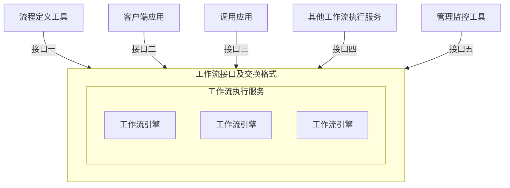

# 第十三章 系统设计

## 一、工作流设计

### 1. 工作流管理系统（Workflow Management System，WFMS）

基本功能：

（1）**对工作流进行建模：** 定义工作流，包括具体的活动以及流程之间的规则。创建的模型既要让人能够读懂，又要能够让计算机处理。工作流对应现实世界中的业务处理过程，不改变业务流程的实质性业务逻辑。

（2）**工作流执行：** 依照工作流模型来创建和执行工作流，可以通过工作流管理系统同时执行多个工作流。

（3）**业务过程的管理和分析：** 对正在执行的工作流业务过程进行监控和管理，例如进度完成情况、数据的状态、任务的分配与轻重平衡等。

### 2. 工作流参考模型（Workflow Reference Model，WRM）



（1）**工作流执行服务：** 核心模块。用来创建并管理工作流的定义信息，以及建立、管理和执行工作流的实例。

（2）**工作流引擎：** 为工作流的实例提供运行环境的软件模块，解释并执行工作流的实例。

（3）**流程定义工具：** 管理过程定义的工具，可以以图形化的形式展现复杂的流程定义，并对其进行操作。流程定义工具与工作流执行服务交互，通常给设计人员提供流程设计的图形化用户界面。

（4）**客户端应用：** 通过请求的方式与工作流执行服务交互的应用程序。

（5）**调用应用：** 被工作流执行服务调用的应用程序，与工作流执行服务进行交互。

（6）**管理监控工具：** 主要是指对组织机构与参加者等数据进行维护管理，对过程实例的监督与控制。管理监控工具与工作流执行服务交互。

## 二、结构化设计

**概要设计【外部设计】：** 把功能需求分配到软件的各模块，确定每个模块的功能和调用关系，形成模块结构图。

**详细设计【内部设计】：** 为各具体任务选择适当的技术手段和处理方法。

### 1. 结构化设计的原则

- **模块独立性原则：** 高内聚、低耦合。
- **保持模块的大小适中。**
- **扇入/扇出系数合理：** 多扇入，少扇出。
- **深度和宽度均不宜过高。**

### 2. 模块独立性的度量

#### （1）聚合：衡量模块内部各元素结合的紧密程度

| 内聚类型 | 描述 |
| :-- | :-- |
| **功能内聚** | 完成一个单一功能，各个部分协同工作，缺一不可。 |
| **顺序内聚** | 处理元素相关，并且必须顺序执行。 |
| **通信内聚** | 所有处理元素集中在一个数据结构区域上。 |
| **过程内聚** | 处理元素相关，并且必须按特定的次序执行。 |
| **瞬时内聚（时间内聚）** | 所包含的任务必须在同一时间内执行。 |
| **逻辑内聚** | 完成逻辑上相关的一组任务。 |
| **偶然内聚（巧合内聚）** | 完成一组没有关系或关系很松散的的任务。 |

#### （2）耦合：度量不同模块间互相依赖的程度

| 耦合类型 | 描述 |
| :-- | :-- |
| **非直接耦合** | 两个模块之间没有直接关系，它们的联系完全是通过主模块的控制和调用来实现的。 |
| **数据耦合** | 一组模块借助参数表传递简单数据。 |
| **标记耦合** | 一组模块借助参数表传递记录信息（数据结构）。 |
| **控制耦合** | 模块之间传递的信息中含有用于控制模块内部逻辑的信息。 |
| **外部耦合** | 一组模块都访问同一全局简单变量，而且不是通过参数表传递的。 |
| **公共耦合** | 多个模块都访问同一公共数据环境。 |
| **内容耦合** | 一个模块直接访问另一个模块的内部数据；一个模块不通过正常入口转到另一个模块的内部；两个模块有一部分程序代码重叠；一个模块有多个入口。 |

### 3. 模块的四个要素

- **输入和输出：** 模块的输入来源和输出去向都是同一个调用者，即一个模块从调用者那取得输入，进行加工后再把输出返回调用者。
- **处理功能：** 指模块把输入转换成输出所做的工作。
- **内部数据：** 指仅供该模块本身引用的数据。
- **程序代码：** 指用来实现模块功能的程序。

## 三、面向对象设计

### 1. 设计原则

- **单一职责原则：** 设计目的单一的类。
- **开放-封闭原则：** 对扩展开放，对修改封闭。
- **李氏（Liskov）替换原则：** 子类可以替换父类。
- **依赖倒置原则：** 要依赖于抽象，而不是具体实现；针对接口编程，不要针对实现编程。
- **接口隔离原则：** 使用多个专门的接口比使用单一的总接口要好。
- **组合重用原则：** 要尽量使用组合，而不是继承关系达到重用目的。
- **迪米特（Demeter）原则（最少知识法则）：** 一个对象应当对其它对象有尽可能少的了解。

### 2. 设计模式

#### 2.1 概念

- **架构模式：** 软件设计中的高层决策，例如 C/S 结构就属于架构模式，架构模式反映了开发软件系统过程中所作的基本设计决策。
- **设计模式：** 主要关注软件系统的设计，与具体的实现语言无关。
- **惯用法：** 是最低层的模式，关注软件系统的设计与实现，实现时通过某种特定的程序设计语言来描述构件与构件之间的关系。每种编程语言都有它自己特定的模式，即语言的惯用法。例如引用-计数就是 C++ 语言中的一种惯用法。

#### 2.2 设计模式

**（1）分类**

**创建型模式：** 与对象的创建有关，抽象了实例化过程；它们帮助一个系统独立于如何创建、组合和表示它的那些对象。创建型类模式使用继承改变被实例化的类，而创建型对象模式则把实例化委托给另一个对象。

**结构型模式：** 涉及如何组合类和对象以获得更大的结构。结构型类模式采用继承机制来组合接口或实现。结构型对象模式不是对接口和实现进行组合，而是描述了如何对一些对象进行组合，从而实现新功能的一些方法。

**行为型模式：** 涉及算法和对象间职责的分配。行为型模式不仅描述对象或类的模式，还描述它们之间的通信模式。行为型类模式使用继承机制在类间分派行为；例如，模板方法模式和解释器模式。行为型对象模式使用对象复合而不是继承。一些行为型对象模式描述了一组对等的对象怎样相互协作以完成其中任一个对象都无法单独完成的任务。

**无标注的，均为对象模式。**

**创建型模式：创建对象**

- 工厂方法（Factory Method）模式 **【纯类模式】**
- 抽象工厂（Abstract Factory）模式
- 原型（Prototype）模式
- 单例（Singleton）模式
- 构建器（Builder）模式

**结构型模式：更大的结构**

- 适配器（Adapter）模式 **【既是对象模式又是类模式】**
- 桥接（Bridge）模式
- 组合（Composite）模式
- 装饰（Decorator）模式
- 外观（Facade）模式
- 享元（Flyweight）模式
- 代理（Proxy）模式

**行为型模式：交互及职责分配**

- 职责链（Chain of Responsibility）模式
- 命令（Command）模式
- 解释器（Interpreter）模式 **【纯类模式】**
- 迭代器（Iterator）模式
- 中介者（Mediator）模式
- 备忘录（Memento）模式
- 观察者（Observer）模式
- 状态（State）模式
- 策略（Strategy）模式
- 模板方法（Template Method）模式 **【纯类模式】**
- 访问者（Visitor）模式

**（2）创建型模式适用场景**

| 设计模式名称 | 简要说明 | 速记关键字 |
| :-- | :-- | :-- |
| **Factory Method**<br>工厂方法模式 | 定义了创建对象的接口，它允许子类决定实例化哪个类 | 动态生产对象 |
| **Abstract Factory**<br>抽象工厂模式 | 提供一个接口，可以创建一系列相关或相互依赖的对象，而无需指定它们具体的类 | 生产系列对象 |
| **Builder**<br>构建器模式 | 将一个复杂对象的表示与其构造相分离，使得相同的构建过程能够得出不同的表示 | 复杂对象构造 |
| **Prototype**<br>原型模式 | 允许对象在不了解要创建对象的确切类以及如何创建等细节的情况下创建自定义对象。通过拷贝原型对象来创建新的对象 | 克隆对象 |
| **Singleton**<br>单例模式 | 确保一个类只有一个实例，并且提供了对该类的全局访问入口 | 单实例 |

**（3）结构型模式适用场景**

| 设计模式名称 | 简要说明 | 速记关键字 |
| :-- | :-- | :-- |
| **Adapter**<br>适配器模式 | 将一个类的接口转换成用户希望得到的另一种接口。它使原本不相容的接口得以协同工作 | 转换接口 |
| **Bridge**<br>桥接模式 | 将一个复杂的组件分成两个独立的但又相关的继承层次结构。将类的抽象部分和它的实现部分分离开来，使它们可以独立地变化 | 继承树拆分 |
| **Composite**<br>组合模式 | 创建树型层次结构来改变复杂性，同时允许结构中的每一个元素操作同一个接口。用于表示「整体-部分」的层次结构 | 树形目录结构 |
| **Decorator**<br>装饰模式 | 在不修改对象外观和功能的情况下添加或者删除对象功能。即动态地给一个对象添加一些额外的职责 | 动态附加职责 |
| **Facade**<br>外观模式 | 为子系统中的一组接口提供了一个统一的接口 | 对外统一接口 |
| **Flyweight**<br>享元模式 | 可以通过共享对象减少系统中低等级的、详细的对象数目。提供支持大量细粒度对象共享的有效方法 | 汉字编码 |
| **Proxy**<br>代理模式 | 为控制对初始对象的访问提供了一个代理或者占位符对象 | 快捷方式 |

**（4）行为型模式适用场景**

| 设计模式名称 | 简要说明 | 速记关键字 |
| :-- | :-- | :-- |
| **Chain of Responsibility**<br>职责链模式 | 可以在系统中建立一个链，这样消息可以在首先接收到它的级别处被处理，或者可以定位到可以处理它的对象 | 传递职责 |
| **Command**<br>命令模式 | 将一个请求封装为一个对象，从而使用户可以用不同的请求对客户进行参数化；对请求排队或记录请求日志，以及支持可撤销的操作 | 记录日志、可撤销 |
| **Interpreter**<br>解释器模式 | 给定一个语言，定义它的文法的一种表示，并定义一个解释器，这个解释器使用该表示来解释语言中的句子 | 虚拟机机制 |
| **Iterator**<br>迭代器模式 | 提供一种方法顺序访问一个聚合对象中的各个元素，而又不需要暴露该对象的内部表示 | 数据集 |
| **Mediator**<br>中介者模式 | 用一个中介对象来封装一系列的对象交互。中介者使各对象不需要显式地相互引用，从而使其耦合松散，而且可以独立地改变它们之间的交互 | 间接引用 |
| **Memento**<br>备忘录模式 | 在不破坏封装性的前提下，捕获一个对象的内部状态，并在该对象之外保存这个状态。这样以后就可将该对象恢复到原先保存的状态 | 游戏存档（快照） |
| **Observer**<br>观察者模式 | 定义对象间的一种一对多的依赖关系，当一个对象的状态发生改变时，所有依赖于它的对象都得到通知并被自动更新 | 订阅、广播、联动 |
| **State**<br>状态模式 | 允许一个对象在其内部状态改变时改变它的行为。对象看起来似乎修改了它的类 | 状态成为类 |
| **Strategy**<br>策略模式 | 定义一系列的算法，把它们一个个封装起来，并且使它们可相互替换。本模式使得算法可独立于使用它的客户而变化 | 多方案切换 |
| **Template Method**<br>模板方法模式 | 定义一个操作中的算法的骨架，而将一些步骤延迟到子类中。使得子类可以不改变一个算法的结构即可重定义该算法的某些特定步骤 | 框架 |
| **Visitor**<br>访问者模式 | 表示一个作用于某对象结构中的各元素的操作。它使你可以在不改变各元素的类的前提下定义作用于这些元素的新操作 | 数据与操作分离 |

## 四、人机交互设计

### 1. 人机交互设计目标

- **满足用户的需要：** 功能有用、内容齐全、对用户有帮助。
- **易用性：** 产品容易上手、容易操作、容易理解、容易学习。
- **效率：** 降低用户出错率，降低学习成本。

### 2. 用户体验的五层模型

```text
                        ┌─────────────────────────────────────┐
                        │ 表现层：统一的视觉语言                │
                        │ （产品风格、视觉表现）                │
                    ┌───┴─────────────────────────────────────┴───┐
                    │ 框架层：重构视觉动线 优化信息布局              │
                    │ （界面布局、导航、控件位置）                    │
                ┌───┴───────────────────────────────────────────────┴───┐
                │ 结构层：定义交互框架，梳理信息结构                      │
                │ （交互设计与信息架构）                                  │
            ┌───┴───────────────────────────────────────────────────────┴───┐
            │ 范围层：升级产品功能、重塑产品性格                              │
            │ （产品应该提供给用户怎样的功能与特性）                          │
        ┌───┴───────────────────────────────────────────────────────────────┴───┐
        │ 战略层：灵活、人本、一体化招聘云平台（示例）                          │
        │ （解决用户什么需求，达到怎样的产品目标）                              │
        └───────────────────────────────────────────────────────────────────────┘
```

（自下而上依次为战略层 → 范围层 → 结构层 → 框架层 → 表现层；括号内为各层在模型中的关注点说明。）

### 3. 人机界面设计（黄金三准则）

**（1）置于用户控制之下**

- 以不强迫用户进入不必要的或不希望的动作的方式来定义交互方式。
- 提供灵活的交互。
- 允许用户交互可以被中断和撤销。
- 当技能级别增加时可以使交互流水化并允许定制交互。
- 使用户隔离内部技术细节。
- 设计应允许用户和出现在屏幕上的对象直接交互。

**（2）减少用户的记忆负担**

- 减少对短期记忆的要求。
- 建立有意义的缺省。
- 定义直觉性的捷径。
- 界面的视觉布局应该基于真实世界的隐喻。
- 以不断进展的方式揭示信息。

**（3）保持界面的一致性**

- 允许用户将当前任务放入有意义的语境。
- 在应用系列内保持一致性。
- 如过去的交互模型已建立起了用户期望，除非有迫不得已的理由，不要改变它。
