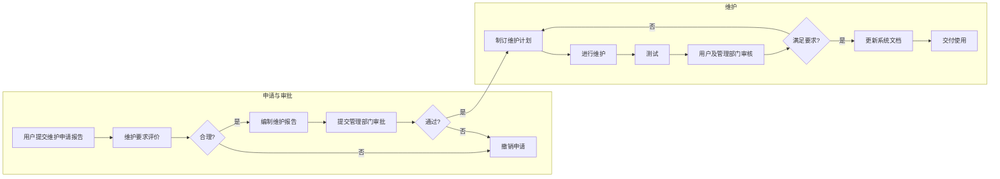

# 第十五章 系统运行与维护

## 一、运维技术指标

1. **平均故障修复时间（Mean Time To Repair）→ MTTR**

   MTTR ＝ 【给定时间周期】系统修复总时间 ÷ 维修次数

   从故障发生到成功修复的时间，衡量系统的修复能力。

2. **平均故障间隔时间（Mean Time Between Failures）→ MTBF**

   MTBF ＝ 多次故障之间系统总运行时间 ÷ 故障总数

   反映系统运行可靠性的程度。

3. **平均无故障时间（Mean Time To Failure）→ MTTF**

   MTTF ＝ 【给定时间周期】正常运行总时间 ÷ 故障总数

   系统无故障运行的平均时间，决定系统或硬件的业务连续性或寿命。

4. **平均应答时间（Mean Time To Answer）→ MTTA**

   MTTA ＝ 【给定时间周期】系统出现警告到警告确认之间累计总时间 ÷ 事件总数

   对投诉、业务中断、异常事件的平均响应时间。

**关系：** MTBF ＝ MTTF ＋ MTTR

---

## 二、系统运行管理

目的是对信息系统运行进行控制与管理，记录运行状态，进行必要的修改与扩充，为更好地管理与决策提供支持。

| 类别 | 要点 |
| :-- | :-- |
| **系统用户管理** | • **【统一用户管理】** 便于用户使用、安全控制力强、减轻管理负担。 • **【身份认证的方法】** 用户名／密码、IC 卡、动态口令、USB Key。 • **【用户安全审计】** 收集、保护、分析审计数据并形成报告。 |
| **网络资源管理** | • **【网络资源管理的功能】** 性能、故障、配置、计费、安全管理（FCAPS）。 • **【网络资源管理系统】** 提供地图方式的查询、统计分析、拓扑管理等。 |
| **软件资源管理** | • **【软件构件管理】** • **【软件分发管理】** 部署、安全补丁分发、远程管理／控制。 • **【文档管理】** |

---

## 三、系统故障管理

主要目标是尽快恢复系统运行，减少故障对业务运营的负面影响。

| 任务 | 要点 |
| :-- | :-- |
| **故障监视** | • **【设备待监视项目】** 注意区分；不同故障的操作手册不同。 • **【监视的内容和方法】** 人员、操作规范化、系统硬件与软件是监视重点。 |
| **故障调查** | • **【收集故障信息】** 人工收集与自动收集。 |

| 任务 | 要点 |
| :-- | :-- |
| **故障排查和恢复处理** | • **【确定故障位置】** 硬件故障定位较易；软件与数据故障定位相对复杂。 • **【调查故障原因】** 按计划操作造成的故障、应用软件故障、人为操作故障、系统软件故障、系统硬件故障、相关设备故障、灾难等。 • **【硬件设备故障的恢复】** 启用系统备份进行恢复。 • **【数据库故障的恢复】** 分为事务故障、系统故障、介质故障。 • **【应用软件故障的恢复】** 查找错误代码并修复。 |
| **故障收尾** | 与用户一起确认故障是否解决，并更新故障信息与记录。 |

---

## 四、软件系统维护

软件维护阶段占整个软件生命周期 60% 以上的时间。

### 1. 软件维护的影响因素

- **业务因素：** 例如部分系统需要 7×24 小时运行。
- **理解的局限性：** 50% 的维护工作量花在理解软件上。
- **对待维护的优先级问题：** 开发方（维护既有功能）与客户期望（开发新功能）不一致。
- **维护人员的积极性：** 多数程序员认为设计开发比维护更有挑战。
- **测试的困难：** 难以准确复现真实环境，使测试受限。

### 2. 提高软件的可维护性

**（1）采用软件工程方法：** 软件工程规范化开发过程，迫使产出一系列文档，提高可维护性。

**（2）注重可维护性的开发过程：**

- **需求分析阶段：** 明确将来可能改进、修改的部分；讨论软件跨平台可移植性并形成方案。
- **设计阶段：** 高内聚、低耦合；容易扩充的设计方案；跨平台可移植设计；可复用的构件。
- **编码阶段：** 编码规范；加强注释；增加可复用构件。
- **测试阶段：** 做好测试工作（这可减少以后的维护）；完备的测试文档。
- **维护阶段：** 严格的配置管理。

### 3. 软件维护管理

**概念：** 维护的重点是保持对系统日常功能的控制和对系统变更的控制，改进现有的可接受的功能，防止系统性能下降到不能接受的水平。

| 类别 | 说明 |
| :-- | :-- |
| **软件维护组织** | 建维护队伍、建维护部门；多系统可设维护管理员。 |
| **软件维护工作流程** | 参看维护工作流程图。 |
| **保存维护记录** | 用于考察维护技术的有效性，估计软件的「优良」程度，确定维护的实际代价。 |
| **评价维护管理** | 基于维护记录。度量维度：不同维护类型百分比、每类维护总人时数、前期维护引发的新维护比例、每次程序运行平均失效的次数等。 |

### 4. 软件维护工作流程

### 5. 软件维护分类

- **正确性维护【修 BUG】：** 识别和纠正软件错误／缺陷；测试不可能发现所有错误。
- **适应性维护【应变】：** 为使应用软件适应环境变化【外部环境、数据环境】而进行的修改。
- **完善性维护【新需求】：** 为扩充功能、改善性能而进行的修改。
- **预防性维护【针对未来】：** 为适应未来软硬件环境变化，应主动增加预防性的新功能，使系统适应各类变化而不被淘汰。经典实例：【专用】改【通用】。

---

## 五、遗留系统演化策略

|  | **业务价值低** | **业务价值高** |
| :-- | :--: | :--: |
| **技术水平高** | 集成 | 改造 |
| **技术水平低** | 淘汰 | 继承 |

**（1）改造策略【高水平，高价值】：** 改造包括系统功能的增强和数据模型的改造两个方面。

**（2）集成策略【高水平，低价值】：** 针对「信息孤岛」。

**（3）淘汰策略【低水平，低价值】**

**（4）继承策略【低水平，高价值】：** 开发新系统时，需要完全兼容遗留系统的功能模型和数据模型。

---

## 六、新旧系统转换策略

**（1）直接转换【风险高，成本低】**

**（2）并行转换【风险低，成本高】：** 新旧系统并行运行一段时间。

**（3）分段转换【折中方案】：** 如：分地域上新系统、分子系统分阶段上线新系统。

---

## 七、数据转换与迁移

**迁移方式：**

- 系统切换前通过工具迁移
- 系统切换前采用手工录入
- 系统切换后通过新系统生成
