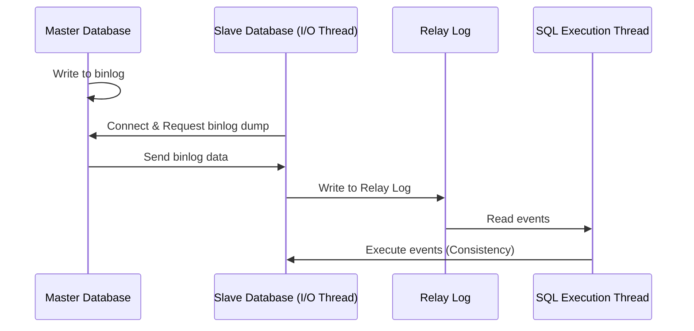
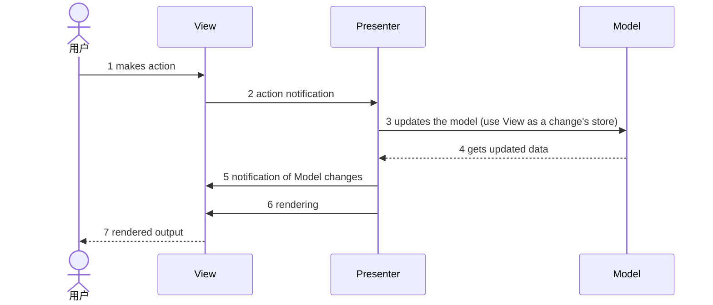
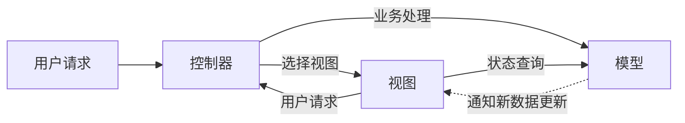

# 第十六章 Web 应用系统分析与设计

## 一、Web 开发

Web 开发涉及技术的综合应用。

| 维度                      | 涉及技术内容                                                                          |
| :------------------------ | :------------------------------------------------------------------------------------ |
| **从架构来看**            | MVC、MVP、MVVM、REST、Webservice、微服务                                              |
| **从并发分流来看**        | 集群（负载均衡）、CDN                                                                 |
| **从缓存来看**            | MemCache、Redis、Squid                                                                |
| **从数据来看**            | 主从库（主从复制）、内存数据库、反规范化技术、NoSQL、分区（分表）技术、视图与物化视图 |
| **从持久化来看**          | Hibernate、Mybatis                                                                    |
| **从分布式存储来看**      | Hadoop、FastDFS、区块链                                                               |
| **从数据编码看**          | XML、JSON                                                                             |
| **从 Web 应用服务器来看** | Apache、WebSphere、WebLogic、Tomcat、JBOSS、IIS                                       |
| **从安全性看**            | SQL 注入攻击                                                                          |
| **其它**                  | 静态化、有状态与无状态、响应式 Web 设计、中台                                         |

---

## 二、负载均衡

### 1. 应用层负载均衡

**（1）http 重定向**

HTTP 重定向是应用层的请求转发。用户的请求到达 HTTP 重定向负载均衡服务器后，负载均衡服务器通过某种算法告诉用户重定向，用户再向实际集群发送新的请求。

**特点：** 实现简单，但性能相对较差。

**（2）反向代理服务器**

用户的请求到达反向代理服务器（已在网站数据中心），代理服务器根据某种算法将请求转发到某台具体服务器。Apache、Nginx 等常作为反向代理服务器。

**特点：** 部署简单，但代理服务器本身可能成为性能瓶颈。

### 2. 传输层负载均衡

**（1）DNS 域名解析负载均衡**

用户请求 DNS 服务器解析域名时，DNS 服务器直接给出经负载均衡选定的某台服务器的 IP 地址。

**特点：** 相对 HTTP 重定向效率更高，减轻负载均衡服务器的维护成本。但若应用服务器故障，DNS 无法及时获知；且 DNS 负载均衡的控制权在域名服务商，网站难以做更多改进或更强管控。

**（2）基于 NAT 的负载均衡**

将一对外部 IP 映射为多个内部 IP，将每个连接请求动态转换为某内部节点地址。

**特点：** 技术较成熟，一般位于网关；可用硬件实现；四层交换机多采用此类技术。

### 3. 硬件负载均衡

- F5

### 4. 软件负载均衡

- LVS、Nginx、HAproxy

### 5. 静态算法（不考虑动态负载）

1. **轮转算法：** 将服务请求（任务）轮流调度到不同节点（服务器）。
2. **加权轮转算法：** 考虑不同节点处理能力差异。
3. **源地址哈希散列算法：** 以请求源 IP 为哈希键，从静态分配的哈希表找到对应节点。
4. **目标地址哈希散列算法：** 对请求目标 IP 做哈希，找到对应节点。
5. **随机算法：** 随机分配；简单但不可控。

### 6. 动态算法（考虑动态负载）

1. **最小连接数算法：** 各节点处理能力相同时，将新请求分给当前活跃连接数最少的节点。
2. **加权最小连接数算法：** 考虑节点处理能力不同，按最小连接数分配。
3. **加权百分比算法：** 结合节点利用率、磁盘速度、进程数等，用利用率表示剩余处理能力。

---

## 三、有状态和无状态

**无状态服务：** 单个请求的处理不依赖其它请求；处理请求所需的全部信息要么在请求中，要么可从外部（如数据库）获得；服务器本身不保存这些信息。

**有状态服务：** 在本地保存部分数据，后续请求彼此关联。

---

## 四、持久化技术

### （一）ORM（对象关系映射）

**（1）定义：** 对象与关系数据之间的映射。

**（2）映射关系表：**

| 面向对象                | 关系数据库          |
| :---------------------- | :------------------ |
| 类（class）             | 数据库的表（table） |
| 对象（object）          | 记录（行数据）      |
| 对象的属性（attribute） | 字段（field）       |

**（3）实现技术对比：**

| 维度         | Hibernate                    | MyBatis（iBatis）          |
| :----------- | :--------------------------- | :------------------------- |
| 简单对比     | 强大、复杂、间接，也支持 SQL | 小巧、简单、直接，SQL 相关 |
| 可移植性     | 好（不关心具体数据库）       | 差（根据数据库 SQL 编写）  |
| 复杂多表关联 | 不支持                       | 支持                       |

---

## 五、主从数据库

**（1）主从数据库结构特点**

- 常见为一主多从；也可多主多从。
- **主库**执行写操作。
- **从库**执行读操作。

**（2）主从复制步骤**

1. 主库在数据更新完成前，将操作写入 **binlog** 日志文件。
2. 从库开启 **I/O 线程** 连接主库，进行 **binlog dump**，将事件写入 **中继日志（relay log）**。
3. 从库执行中继日志中的事件，与主库保持一致。



---

## 六、缓存

### 1. 常见缓存技术

**（1）MemCache：** 高性能分布式内存对象缓存系统，用于减轻动态 Web 应用的数据库负载；在内存中维护统一的大型哈希表存储数据。

**（2）Redis：** 开源、ANSI C 编写、支持网络、基于内存或可持久化的日志型 Key-Value 数据库；支持多种数据结构（key-value、string、set、list 等），提供多语言 API。

**（3）Squid：** 高性能代理缓存服务器，支持 FTP、gopher、HTTPS、HTTP 等协议。

### 2. Redis 和 Memcache 能力比较

| 工作           | MemCache                   | Redis                                |
| :------------- | :------------------------- | :----------------------------------- |
| **数据类型**   | 简单 key/value 结构        | 丰富的数据结构                       |
| **持久性**     | 不支持                     | 支持                                 |
| **分布式存储** | 客户端哈希分片／一致性哈希 | 多种方式，主从、Sentinel、Cluster 等 |
| **多线程支持** | 支持                       | 不支持（Redis 6.0 开始支持）         |
| **内存管理**   | 私有内存池／内存池         | 无                                   |
| **事务支持**   | 不支持                     | 有限支持                             |
| **数据容灾**   | 不支持，不能做数据恢复     | 支持，可以在灾难发生时恢复数据       |

### 3. Redis 分布式存储方案

| 分布式存储方案               | 核心特点                                                    |
| :--------------------------- | :---------------------------------------------------------- |
| **主从（Master/Slave）模式** | 一主多从，故障时手动切换。                                  |
| **哨兵（Sentinel）模式**     | 有哨兵的一主多从，主节点故障自动选择新的主节点。            |
| **集群（Cluster）模式**      | 分节点对等集群，分 slots，不同 slots 的信息存储到不同节点。 |

### 4. Redis 常见集群切片方式

| 集群切片方式             | 核心特点                                                                                     |
| :----------------------- | :------------------------------------------------------------------------------------------- |
| **客户端分片**           | 在客户端通过 key 的 hash 值对应到不同的服务器。                                              |
| **中间件实现分片**       | 在应用软件与 Redis 之间，例如 Twemproxy、Codis 等，由中间件实现到后台 Redis 节点的路由分派。 |
| **客户端服务端协作分片** | 客户端与服务端协作完成分片处理。                                                             |

### 5. Redis 数据分片方案

| 分片方案           | 分片方式                      | 说明                                                                      |
| :----------------- | :---------------------------- | :------------------------------------------------------------------------ |
| **范围分片**       | 按数据范围值来做分片          | 例：按用户编号分片，0–999999 映射到实例 A；1000000–1999999 映射到实例 B。 |
| **哈希分片**       | 通过对 key 进行 hash 运算分片 | 可把数据分配到不同实例，类似取余，余数相同的放在同一实例上。              |
| **一致性哈希分片** | 哈希分片的改进                | 利于扩展节点，可有效缓解重新分配节点带来的无法命中问题。                  |

### 6. Redis 数据类型

| 类型                             | 特点                                                                      | 示例                                          |
| :------------------------------- | :------------------------------------------------------------------------ | :-------------------------------------------- |
| **String（字符串）**             | 存二进制、任意类型数据，最大 512MB                                        | 缓存、计数、共享 Session                      |
| **Hash（字典）**                 | 无序字典，数组＋链表，适合存对象；一个 Key 对应一个 HashMap，面向一组数据 | 用户属性的存、读、改                          |
| **List（列表）**                 | 双向链表，有序，插入删除快，查询慢                                        | 消息队列、文章列表、最近 N 个登录用户 ID 列表 |
| **Set（集合）**                  | 键值无序且唯一；增删查复杂度 O(1)；支持交、并、差                         | 独立 IP、共同爱好、标签                       |
| **Sorted Set（Zset，有序集合）** | 键值有序且唯一；带权重排序                                                | 排行榜                                        |

### 7. Redis 持久化方式

主要有 **RDB** 与 **AOF** 两种。

- **RDB：** 类似传统数据库快照，按指定时间间隔将数据保存为快照。
- **AOF：** 类似传统数据库日志，把每个改变数据集的命令追加到 AOF 文件末尾；出问题时重放 AOF 中的命令可重建数据集。

**RDB 与 AOF 对比：**

| 对比维度         | RDB 持久化                               | AOF 持久化                             |
| :--------------- | :--------------------------------------- | :------------------------------------- |
| **备份量**       | 重量级全量备份，保存整个库               | 轻量级增量备份，每次只保存一条修改命令 |
| **保存间隔时间** | 保存间隔长                               | 间隔短，默认 1 秒                      |
| **还原速度**     | 恢复快                                   | 恢复慢                                 |
| **阻塞情况**     | `save` 会阻塞，`bgsave` 或自动保存不阻塞 | 正常运行与 AOF 重写一般不阻塞          |
| **数据体积**     | 相同数据量下体积小                       | 相同数据量下体积大                     |
| **安全性**       | 低，易丢数据                             | 高，视策略而定                         |

### 8. Redis 内存淘汰机制

| 淘汰作用范围           | 机制名              | 策略                                                             |
| :--------------------- | :------------------ | :--------------------------------------------------------------- |
| 不淘汰                 | **noeviction**      | 禁止驱逐数据；内存不足以容纳新写入时，新写入报错。系统默认策略。 |
| 设置了过期时间的键空间 | **volatile-random** | 随机移除某个 key                                                 |
|                        | **volatile-lru**    | 优先移除最近未使用的 key                                         |
|                        | **volatile-ttl**    | TTL 小的 key 优先移除                                            |
| 全键空间               | **allkeys-random**  | 随机移除某个 key                                                 |
|                        | **allkeys-lru**     | 优先移除最近未使用的 key                                         |

### 9. Redis 常见难题

#### 9.1 缓存雪崩

**（1）描述：** 大部分缓存失效 → 数据库崩溃。

**（2）解决方案：**

- **使用锁或队列：** 避免大量线程同时对数据库读写，防止失效瞬间并发集中打穿底层存储。
- **为 key 设置不同的缓存失效时间：** 在固定过期时间基础上加随机偏移。
- **二级缓存：** 一层带时限、一层不带时限，减少大规模直查数据库。

#### 9.2 缓存穿透

**（1）描述：** 查询无数据返回 → 直接查数据库。

**（2）解决方案：**

- **默认值：** 若查询结果为空，将默认值写入缓存，后续命中缓存即有值；过期时间不超过 5 分钟，便于更新。
- **布隆过滤器：** 将可能存在的数据哈希进足够大的 bitmap，一定不存在的数据被拦截，减轻底层存储压力。

**（3）布隆过滤器**

- 用于快速判断某元素**不在**集合中。
- 通过长二进制向量与一组随机映射函数记录、识别数据是否在集合中。

| 优点                                          | 缺点                                                    |
| :-------------------------------------------- | :------------------------------------------------------ |
| 1、占用内存小                                 | 1、有一定误判率（假阳性），不能准确判断元素是否在集合中 |
| 2、查询效率高                                 | 2、一般不能从布隆过滤器中删除元素                       |
| 3、不存储元素本身，在保密要求严格的场合有优势 | 3、不能获取元素本身                                     |

#### 9.3 缓存预热

**（1）** 系统上线后，将需要缓存的数据直接加入缓存。

**（2）解决方案：**

- 直接写缓存并刷新页面，上线时手工操作。
- 数据量不大时可在项目启动时自动加载。
- 定时刷新缓存。

#### 9.4 缓存更新

除 Redis 自带失效策略外，常见还有：

- 定时清理过期缓存。
- 请求到达时判断缓存是否过期，过期则查底层取新数据并更新缓存。

#### 9.5 缓存降级

降级目的是保证核心服务可用，即使有损；部分服务无法降级（如电商购物流程）。降级前需梳理系统，区分必须保护与可降级部分。

---

## 七、CDN 内容分发网络

CDN 全称 Content Delivery Network，即内容分发网络。基本思路是尽可能避开互联网上影响传输速度与稳定性的瓶颈与环节，使内容传输更快、更稳定。

---

## 八、XML 与 JSON

### 1. 扩展标记语言（Extensible Markup Language，XML）

**（1）概念：** 用于标记电子文件使其具有结构性的标记语言；可标记数据、定义数据类型；是允许用户自定义标记的源语言。

**（2）优点：**

- 格式统一，符合标准；
- 易于与其它系统远程交互，数据共享方便。

**（3）缺点：**

- XML 文件庞大，文件格式复杂，传输占带宽；
- 服务器端和客户端都需要花费大量代码来解析 XML，导致服务器端和客户端代码变得异常复杂且不易维护；
- 客户端不同浏览器之间解析 XML 的方式不一致，需要重复编写很多代码；
- 服务器端和客户端解析 XML 花费较多的资源和时间。

### 2. JSON（JavaScript Object Notation）

**（1）概念：** JSON 一种轻量级的数据交换格式，具有良好的可读和便于快速编写的特性。可在不同平台之间进行数据交换。

**（2）优点：**

- 数据格式比较简单，易于读写，格式都是压缩的，占用带宽小；
- 易于解析，客户端 JavaScript 可以简单的通过 `eval()` 进行 JSON 数据的读取；
- 支持多种语言，包括 ActionScript、C、C#、ColdFusion、Java、JavaScript、Perl、PHP、Python、Ruby 等服务器端语言，便于服务器端的解析；
- 因为 JSON 格式能直接为服务器端代码使用，大大简化了服务器端和客户端的代码开发量，且完成任务不变，并且易于维护。

**（3）缺点：** 没有 XML 格式这么推广的深入人心和应用广泛，没有 XML 那么通用。

---

## 九、Web 应用服务器

### 1. 概念

WEB 应用服务器可以理解为两层意思：

**（1）WEB 服务器：** 其职能较为单一，就是把浏览器发过来的 Request 请求，返回 Html 页面。

**（2）应用服务器：** 进行业务逻辑的处理。

### 2. 常见服务器

- **Apache：** Web 服务器，市场占有率 60% 左右。它可以运行在几乎所有的 Unix、Windows、Linux 系统平台上。

- **IIS：** 早期 Web 服务器，目前小规模站点仍有应用。

- **Tomcat：** 开源、运行 servlet 和 JSP Web 应用软件的基于 Java 的 Web 应用软件容器。

- **JBOSS：** JBOSS 是一个基于 J2EE 的开源应用服务器。一般与 Tomcat 或 Jetty 配合使用。

- **WebSphere：** 功能较完善、开放的 Web 应用服务器。基于 Java 应用环境，用于构建、部署和管理 Internet 和 Intranet 的 Web 应用程序。

- **WebLogic：** BEA WebLogic Server 是一个多功能、基于标准的 Web 应用服务器，为企业构建自己的应用程序提供坚实基础。

- **Jetty：** Jetty 是一个开源的 servlet 容器，为基于 Java 的 Web 内容（如 JSP 和 servlet）提供运行环境。

---

## 十、响应式 Web 设计

### 1. 概念

响应式 WEB 设计是一种网络页面设计布局。其概念是：集中创建页面的图片布局大小，可以根据用户的行为以及使用的设备环境智能地进行相应布局。

### 2. 方法与策略

**（1）采用流式布局和弹性化设计：** 使用相对单位，以百分比而不是具体数值来设置页面元素的大小。

**（2）响应式图片：** 不仅按比例缩放图片，在小设备上还应降低图片本身的分辨率。

---

## 十一、中台

### 1. 概念

中台是一套企业架构，将互联网技术与行业特点相结合，把企业核心能力以共享服务的形式沉淀下来，形成「大中台、小前台」的组织与业务机制，使企业能够低成本、快速地开展业务创新。中台还可进一步细分，如业务中台、数据中台、XX 中台等；本质上都是在不同层次对企业通用能力的沉淀，并对外开放能力。

### 2. 业务中台、数据中台和技术中台

- **【业务中台】** 提供可复用服务，如开箱即用的学生中心、课程中心等。

- **【数据中台】** 提供数据整合与分析能力，帮助企业从数据中学习、改进并调整方向。

- **【技术中台】** 提供可复用的技术组件能力，帮助解决基础技术平台的复用问题。例如：中间件、分布式存储、AI、负载均衡等基础设施。

### 3. 数据中台必备的 4 个核心能力

- 数据汇聚整合能力；
- 数据提纯加工能力；
- 数据服务可视化；
- 价值变现方面。

---

## 十二、云计算

### 1. 概念

云计算是集合了大量计算设备和资源，对用户屏蔽底层差异的分布式处理架构，其用户与提供实际服务的计算资源是相分离的。

### 2. 优点

超大规模、虚拟化、高可靠性、高可伸缩性、按需服务、成本低（前期投入低、综合使用成本也低）

### 3. 分类

#### 3.1 按服务类型分类

- **软件即服务（SaaS）：** 基于多租户技术实现，直接提供应用程序。

- **平台即服务（PaaS）：** 虚拟中间件服务器、运行环境和操作系统。

- **基础设施即服务（IaaS）：** 包括服务器、存储和网络等服务。

#### 3.2 按部署方式分类

- **公有云：** 面向互联网用户需求，通过开放网络提供云计算服务。

- **社区云：** 云基础设施分配给一些社区组织所专有。

- **私有云：** 面向企业内部提供云计算服务。

- **混合云：** 兼顾以上两种情况的云计算服务。

---

## 十三、云原生架构

云原生（Cloud Native）一开始就是基于云环境、专门为云端特性而设计，可充分利用和发挥云平台的弹性＋分布式优势，最大化释放云计算生产力。

---

## 十四、物联网分层架构

### （1）概念

物联网（The Internet of Things）是实现物物相连的互联网，其内涵包含两个方面：第一，物联网的核心和基础仍然是互联网，是在互联网基础上延伸和扩展的网络；第二，其用户端延伸和扩展到了任何物体与物体之间，使其进行信息交换和通信。

### （2）物联网分层架构

- **感知层：** 识别物体、采集信息。如：传感器、芯片、通信模组、感知类智能设备／装置。

- **网络层：** 传递信息和处理信息。接入网、核心网、业务网、专有网络、通信标准／协议。

- **平台层：** 操作系统、软件开发、设备管理平台、连接管理平台。

- **应用层：** 解决信息处理和人机交互的问题。应用服务、智能终端。

---

## 十五、WEB 应用系统

### 1. 优点

易于访问、开发高效、使用简单、扩展性强。

### 2. Web 应用特征

- **【云托管和可扩展性】** 依托云可以很容易扩展。

- **【跨平台】** 大部分新式 Web 应用具有跨平台性，可在 Linux、Windows 系统上运行。

- **【自动化测试】** 通过编写脚本模拟用户在 Web 页面上的操作，提高效率，降低成本、缩短测试周期。

- **【支持传统应用和 SPA】** SPA 即单页应用程序。

- **【简单的开发和部署】** 可以很容易的做自动化部署。

### 3. Web 应用架构设计原则

- **【分离关注点】** 分层架构背后的核心设计思想就是关注点分离。

- **【封装】** 强调应用程序各个部分应进行封装。

- **【依赖关系反转】** 依赖抽象而不是实现。

- **【显式依赖关系】** 方法和类应显式要求正常工作所需的任何协作对象。

- **【单一责任】** 对象应只有一个责任，并且只能因为一个原因更改对象。

- **【避免自我重复】** 将逻辑封装在编程构造中，而不要重复该逻辑。

- **【持久性无知】** 应用层的组件或服务不应该直接了解或关心数据的持久化机制（即数据是如何存储在数据库或其它存储系统中的）。

- **【有界上下文】** 各 Web 应用程序应努力成为自己的有界上下文，为其业务模型提供自己的持久性存储，而不是与其它应用程序共享数据库。

### 4. Web 应用架构分类

- **【整体式架构】** 整个代码视为单个程序，所有组件相互依赖和互连。测试部署容易，代码量大时更新困难，有单点故障。

- **【微服务架构】** 代码被开发为松散耦合的独立服务，通过 RESTful API 进行通信。

### 【无服务器架构】

底层基础结构由服务提供商提供并管理。用户只需要为正在使用的基础架构付费，无须为空闲的 CPU 时间付费，降低了成本。后端代码也得到了简化，减少了开发工作和成本，加快了上市时间。

### 5. Web 应用架构模式

#### 【微服务架构】

去中心化的数据管理：每个微服务拥有自己的数据库。

```
                    ┌──────────┐
                    │ 用户接口  │
                    └────┬─────┘
         ┌──────────┬──────┼──────┬──────────┐
         ▼          ▼      ▼      ▼          ▼
      ┌──────┐ ┌──────┐ ┌──────┐ ┌──────┐
      │ 微服务 │ │ 微服务 │ │ 微服务 │ │ 微服务 │
      └──┬───┘ └──┬───┘ └──┬───┘ └──┬───┘
         ▼          ▼      ▼      ▼
      ┌──────┐ ┌──────┐ ┌──────┐ ┌──────┐
      │ 数据库 │ │ 数据库 │ │ 数据库 │ │ 数据库 │
      └──────┘ └──────┘ └──────┘ └──────┘
```

（用户接口 ↔ 各微服务；各微服务 ↔ 各自数据库。）

#### 【B/S 架构】

```
第一层 表现层  ──►  客户端
        │
        ▼
第二层 逻辑层  ──►  Web 服务器
        │
        ▼
第三层 数据层  ──►  数据库服务器
                      │
                      ▼
              ┌───────────────┐
              │ MySQL … Oracle DB │
              └───────────────┘
```

#### 【P2P 架构】

每个节点都作为源节点和种子节点。

```
        A节点 ────── B节点
         │  ╲      ╱ │
         │    ╲  ╱   │
         │      ╳     │
         │    ╱  ╲   │
         │  ╱      ╲ │
        D节点 ────── C节点
                 │
                 E节点
```

（示意：A、B、C、D、E 各节点互联成网状。）

#### 【MVP】

组件：**Presenter**、**View**、**Model**。

交互流程（与示意图一致）：

1. **makes action：** 用户 → **View**
2. **action notification：** **View** → **Presenter**
3. **updates the model（use View as a change's store）：** **Presenter** → **Model**
4. **gets updated data：** **Presenter** ← **Model**
5. **notification of Model changes：** **Presenter** → **View**
6. **rendering：** **Presenter** → **View**
7. **rendered output：** **View** → 用户



#### 【MVC】

**【控制器】** 接受用户请求；调用模型响应用户请求；选择视图显示响应结果。

**【视图】** 显示模型状态；接受数据更新请求；把用户输入数据传给控制器。

**【模型】** 代表应用程序状态；响应状态查询；处理业务流程；通知视图业务状态更新。

**交互关系（示意）：**

- **用户请求** → **控制器**
- **控制器** ——→ **视图**（选择视图）
- **控制器** ——→ **模型**（业务处理）
- **视图** ——→ **控制器**（用户请求）
- **视图** ——→ **模型**（状态查询）
- **模型** ⋯⋯→ **视图**（通知新数据更新）

**图例：**

- 实线箭头（——→）：**方法调用**
- 虚线箭头（⋯⋯→）：**事件**



### 6. Web 应用开发框架

#### 6.1 Java EE 开发框架

**（1）【SSH】**

- **Spring：** 使用方便，可集成多种框架；具有<u>统一配置和部署</u>、灵活、可扩展、测试简单、开发成本低等特点。

- **Struts：** <u>基于 MVC</u>，主要采用 Servlet、JSP、XML 等技术实现。

- **Hibernate：** 开源 <u>ORM 框架</u>，对 JDBC 进行轻量级对象封装；也支持使用<u>原始 SQL 表达查询</u>。

- **延伸：SSM 框架：** SSM 为 Spring + Spring MVC + MyBatis 的缩写；相较 SSH 更为主流的 Java EE 企业框架，适用于构建各类大型企业应用系统。

**（2）【JSF】：** 用于构建 Web 应用程序的标准 Java 框架。

#### 6.2 .NET 开发框架

由<u>微软</u>推出的软件开发平台，面向敏捷软件开发、快速应用开发、平台无关与网络透明等目标。

#### 6.3 Web 层开发框架

- **【WebPage 3.0】：** 基于标准技术、组件化、可视化、轻量级 Web 开发框架；稳定性与可扩展性好；基于 MVC 模式，侧重 View 部分。

- **【AJAX 框架】：** 作为 Web 2.0 重要技术被广泛采用。例如：Prototype、jQuery、Mootools、DOJO、Ext JS、Ajax.NET、AFAX。

### 7. Web 应用系统开发

#### 7.1 Web 应用系统通信协议

| 协议             | 说明                                                                                                                        |
| :--------------- | :-------------------------------------------------------------------------------------------------------------------------- |
| **【HTTP】**     | 应用层面向对象协议，是 **<u>面向文本的无状态协议</u>**。HTTP 无连接、无状态；客户端与服务器交互不保留客户端状态信息。       |
| **【RTP/RTSP】** | 应用层协议，IP 电话的技术基础；定义一对多应用如何在 IP 网上有效传送多媒体数据，用于控制音视频实时传输，并可同时控制多路流。 |
| **【SMTP】**     | 简单邮件传输协议（**发送邮件**），建立在 FTP 之上的可靠邮件服务。                                                           |
| **【POP3】**     | **接收邮件**，使用 TCP 端口 110；是 Internet 电子邮件的第一个离线协议标准。                                                 |

#### 7.2 Web 应用系统数据存储

- **【缓存系统】** 常见模型包括：应用服务器缓存、全局缓存、分布式缓存、内容分发网络（CDN）。

- **【云存储】** 采用集群、网格、分布式文件系统等技术。

- **【CDN】** 在多地部署服务器组成的网络，使用户可从最近的 CDN 服务器获取缓存内容。

- **【负载均衡器】** 在不同服务器之间均衡流量负载。

- **【消息队列】** 异步存储消息的缓冲区；可提供细粒度扩展能力，简化解耦过程，并提升可靠性与性能。

#### 7.3 Web 应用系统客户端技术

| 技术                | 说明                                                                                        |
| :------------------ | :------------------------------------------------------------------------------------------ |
| **HTML/HTML5**      | HTML5＝H5，简单易实现；但表达复杂表单能力偏弱、可扩展性差、检索慢、链接易中断、缺乏语义性。 |
| **XML**             | W3C 制定的简单、跨平台、与内容相关的技术；可扩展性强但相对较重。                            |
| **DHTML**           | 动态 HTML，通过 JS、VBScript、DOM、Layers、CSS 等实现。                                     |
| **CSS**             | 用于为结构化文档（HTML、XML 等）添加样式的计算机语言。                                      |
| **Flash/Flex 技术** | Flex 是重要的 RIA（Rich Internet Application）技术。                                        |
| **DOM**             | 常与 JavaScript 配合用于交互。                                                              |
| **JavaScript**      | 动态、弱类型、基于原型的语言；安全性相对较差。                                              |
| **AJAX**            | Asynchronous JavaScript and XML（异步 JavaScript 与 XML）。                                 |

#### 7.4 Web 应用系统服务器端技术

| 技术            | 说明                                                                                                                                                                                                                                                                                                                                     |
| :-------------- | :--------------------------------------------------------------------------------------------------------------------------------------------------------------------------------------------------------------------------------------------------------------------------------------------------------------------------------------- |
| **CGI**         | Common Gateway Interface，多用于动态生成 Web 内容；开发与执行效率不高、开发难度大、使用不便。                                                                                                                                                                                                                                            |
| **PHP**         | 嵌入 HTML、在服务器端执行的脚本语言；易学、与 Apache 等扩展库结合紧密，安全性较好。                                                                                                                                                                                                                                                      |
| **ASP/ASP.NET** | 微软开发的、嵌入网页中以替代 CGI 脚本程序的服务器端执行脚本。                                                                                                                                                                                                                                                                            |
| **Servlet**     | ASP.NET 是 .NET 体系下用于构建动态 Web 应用的免费 Web 框架，包含开发 Web 应用所需的多种服务。Servlet 是用 Java 编写的服务器端程序，可动态生成 Web 页面，是 JavaEE 的组成部分。在 MVC 中，Servlet 充当控制器角色，用于处理 HTTP 请求并管理应用工作流。优点：Java 语言的优点（可移植性、内存自动回收等）、执行效率高、构造的控制器功能强。 |
| **JSP**         | 将 Java 代码嵌入 HTML 页面实现的服务器端 Web 开发技术；在服务端解析，动态生成页面并传给客户端；本质上是高层的 Servlet。                                                                                                                                                                                                                  |
| **Perl**        | 自由且功能强大的脚本语言，用于 Web 编程、数据库处理、XML 处理及系统管理等；广泛用于多种操作系统。                                                                                                                                                                                                                                        |
| **Ruby**        | 面向对象、解释型脚本语言，综合 Perl、Python 与 Java 等特点；语法简单，擅长文本处理与系统管理等任务。                                                                                                                                                                                                                                     |
| **Python**      | 面向对象、解释型语言，也是功能强大而完善的通用型语言。                                                                                                                                                                                                                                                                                   |

#### 7.5 Web 应用系统部署

**（1）部署粒度**

由于 Web 开发是增量迭代进行的，所以部署也会发生很多次。Web 应用发布以细粒度方式完成，但这种方式很多情况下可能并不合适。所以最好把<u>一组变化打包进行发布</u>。

**（2）部署原则**

- 管理客户对 Web 应用增量的期望，很可能完不成就不要承诺。
- 安装与测试交付包，部署前在不同硬件平台、不同配置及不同安全性设置下完成测试。
- 交付前建立支持制度。
- <u>先改正有缺陷的 Web 应用，然后再交付。</u>

**（3）部署环境**

Web 应用发布的软件系统主要包括操作系统与 Web 应用服务器软件两方面；目前几乎所有操作系统均可支持 Web 应用发布。

**【版本控制和 CMS】** 两者均为变更管理工具。

---

### 8. Web 应用系统测试

#### 8.1 Web 应用测试面临的挑战

1. 用户数量巨大；
2. 「内容」中的错误通常只能靠人工完成；
3. Web 应用一般采用<u>多层架构</u>，因此需要对测试结果进行综合分析，才能定位缺陷的具体位置；
4. Web 应用中常常**集成不同的软件**，这就需要配套测试第三方软件和组件及其集成；
5. Web 浏览器提供的**导航**（如：回退、前进、刷新），经常引发各种错误；
6. 实现 Web 应用的**不同种类技术**的出现，使得以适当粒度定义和验证 Web 测试模型的各个组件变得非常困难；
7. Web 应用具有**分布式、动态性、多平台、交互式和超文本**等特点，这使测试变得困难。

#### 8.2 Web 应用测试过程和步骤

- **【过程】** 功能测试、内容测试和评审、Web 页面测试、导航测试、接口测试、配置测试、安全测试、性能测试等。

- **【步骤】**
  1. 对被测试的 Web 应用进行需求分析，<u>明确测试目标和范围</u>；
  2. <u>定义测试策略和方法</u>；
  3. 确定<u>测试环境的要求</u>；
  4. 针对测试行为，<u>描述测试的细节</u>，包括测试用例列表、进度表、错误等级分析等。

#### 8.3 Web 应用功能测试

- **【链接测试】** 链接测试可分为 3 个方面：1. 测试所有链接是否按指示的那样<u>确实链接到了该链接的页面</u>。2. 测试所链接的<u>页面是否存在</u>。3. 保证 Web 应用系统上没有<u>孤立的页面</u>。

- **【表单测试】** 进行表单正确性和有效性校验。

- **【数据校验】** 测试数据校验功能是否能正常工作。与交互测试可能产生重复。

- **【Cookies 测试】** Cookies 是否起作用，是否按预定时间进行保存，刷新 Web 页面对 Cookies 是否有影响、有什么影响。可用 Browser History View 工具。

- **【数据库测试】** 测试实际内容及其完整性，以确保数据没有损坏且模式正确。其中完整性错误主要是用户提交的<u>表单信息不正确</u>造成的，<u>输出错误</u>主要是由在<u>数据提取和操作数据指令</u>过程中发生的错误引起的。

#### 8.4 Web 应用性能测试

- **【速度测试】** Web 应用响应时间太长（如超过 3s），可能导致用户没耐心等待而离开。

- **【负载测试】** 在用户可接受的响应时间内，确定系统可承受的<u>并发用户数量</u>。

- **【压力测试】** 用来发现什么条件下会让 Web 应用承担不可承受的压力，即找出<u>性能瓶颈</u>。

- **【强度测试】** 检查极限状态下运行时性能下降幅度是否在允许的范围内，包括<u>超负荷情况下的表现和最差工作环境下的工作能力</u>。

- **【并发测试】** <u>多用户同时访问同一个 Web 应用</u>，以核实是否存在线程同步问题、死锁或其它性能问题。

- **【大数据量测试】** 主要测试运行数据量较大或历史数据量较大时 Web 应用的性能情况。一般在<u>投产环境</u>下进行。

- **【配置测试】** 通过测试确定系统各资源的最优分配原则，为调优提供依据。

- **【可靠性测试】** 在给系统增加<u>一定业务压力</u>的情况下，让系统运行一段时间，检测<u>系统是否稳定</u>。

#### 8.5 性能测试方法

- **【虚拟用户方法】** <u>模拟真实用户</u>的行为施加预期工作负载。测试人员要有<u>相当高的专业技能</u>，才能准确设计测试场景，以较好的模拟工作负载进行测试。

- **【WUS 方法】**
  - **做法：** 强调建立真实负载（衡量测试负载与真实负载的接近程度）。
  - **缺点：** Web 应用<u>正常运作一段时间后</u>才能进行测试（需要真实运行日志）。

#### 8.6 Web 应用安全性测试

- **【数据加密测试】** 关键数据是否经过加密，<u>加密算法是否合适</u>等。

- **【用户身份验证测试】** 检查<u>无效用户名和密码能否登录</u>，密码是否大小写敏感，是否有验证次数限制，是否存在不验证直接进入 Web 应用的问题。

- **【日志文件测试】** Web 运行的相关访问和状态信息<u>是否写进了日志文件</u>，是否可追踪。

- **【Session 测试】** 主要检查 Web 应用是否有超时的限制，超时后能否自动退出，退出后浏览器回退是否可以回到登录页等。

- **【备份与恢复测试】** 评估多种备份与恢复是否能正常进行，还评估备份与恢复方式是否满足 Web 应用的安全性需求。

- **【访问控制策略测试】** 管理界面是否仅授权管理员可访问；是否有完整访问控制策略文档，规定各类用户可访问的功能与内容。

- **【安全漏洞测试】** 使用安全扫描工具测试和发现隐藏的跨站脚本（XSS）、命令注入、SQL 注入等安全漏洞。

- **【TCP 端口测试】** 使用端口扫描软件对部署环境做 TCP 端口测试，确保仅开放必要端口。

- **【服务器端脚本漏洞检查】** 检查服务端脚本是否存在安全漏洞，脚本是否可被未授权放置与编辑。

- **【防火墙测试】** 测试防火墙功能和设置，确定是否满足 Web 应用的安全性要求。

#### 8.7 Web 服务测试

| 测试因素       | Web 服务测试                                                                                                                                       |
| :------------- | :------------------------------------------------------------------------------------------------------------------------------------------------- |
| **测试参与者** | 测试过程需要服务提供者、代理与请求者共同参与。                                                                                                     |
| **测试分布**   | 分布式、远程、多阶段。                                                                                                                             |
| **测试模型**   | 不具备服务代码（服务开发者除外），有限的测试模型（可控性和可观测性低）。                                                                           |
| **测试覆盖**   | 除服务开发者具有传统覆盖范围外，服务提供者、集成者、请求者、代理往往仅有黑盒覆盖范围。                                                             |
| **测试执行**   | 在线、及时测试。                                                                                                                                   |
| **测试客户端** | 需构建测试客户端以调用被测服务。                                                                                                                   |
| **测试预测**   | Web 服务**动态绑定**，难以预测实际运行行为，测试预测生成困难。                                                                                     |
| **回归测试**   | 在线、基于运行时收集的数据进行测试；除服务开发者和服务提供者外：服务请求者、服务集成者和服务代理不掌握服务的演变，因此回归测试需要额外的信息支持。 |

**【Web 服务测试内容】** Web 服务基础设施的验证与确认、Web 服务独立测试、Web 服务集成测试。
