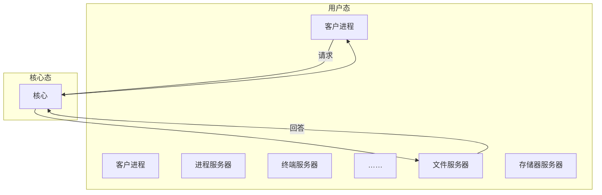

# 第十七章 嵌入式系统分析与设计

## 一、嵌入式系统概述

### 1. 嵌入式系统定义

嵌入式系统是一种以**应用为中心**，以**计算机技术为基础**，可以适应不同应用的功能、可靠性、成本、体积和功耗等方面的要求，集**可配置、可裁剪**的软硬件于一体的**专用计算机系统**。

### 2. 嵌入式系统特点

| 序号 | 特点 | 简要说明 |
| :--- | :--- | :--- |
| 1 | 专用性强 | 针对具体应用设计，软硬件结合紧密，寿命长 |
| 2 | 实时性强 | 要求及时响应外来事件，大部分为实时系统 |
| 3 | 软硬件依赖性强 | 软硬件协同设计，实现预定功能，满足严格要求 |
| 4 | 专用处理器 | 可靠性高、功耗低、体积小、集成度高，有利于小型化和移动性 |
| 5 | 多种技术紧密结合 | 计算机技术、半导体技术、电子技术、机械技术紧密结合 |
| 6 | 系统透明性 | 用户可能感觉不到嵌入式系统的存在，无需关心其情况 |
| 7 | 系统资源受限 | 存储容量、I/O 设备数量、处理器处理能力有限 |

### 3. 嵌入式系统的组成

嵌入式系统是一种嵌入对象体的结构中或带有执行装置的应用环境中的专用系统，它主要由 5 个核心功能部件组成，即**传感器、处理单元（PE）、作动器、输入接口和输出接口**。

### 4. 嵌入式系统初始化

嵌入式系统初始化过程：**片级初始化 → 板级初始化 → 加载内核**。

**（1）片级初始化**

- **【核心任务】**：微处理器初始化
- **【关键步骤】**：
  - ➢ 设置核心寄存器与控制寄存器
  - ➢ 配置核心工作模式与局部总线模式
- **【目的】**：将微处理器设置为系统要求的工作状态（纯硬件过程）

**（2）板级初始化**

- **【核心任务】**：其它硬件设备初始化
- **【关键步骤】**：
  - ➢ 设置硬件寄存器
  - ➢ 配置软件数据结构与参数
- **【目的】**：确保板卡上所有硬件资源正常工作并与处理器正确通信（软硬件结合过程）

**（3）加载内核**

- **【核心任务】**：启动操作系统与应用程序
- **【关键步骤】**：
  - ➢ 从 Flash 复制映象到系统内存
  - ➢ 跳转到系统内核的第一条指令
- **【目的】**：启动操作系统和应用程序，提供系统功能和服务

### 5. 基于多核处理器的嵌入式系统

多核技术在提升计算能力、降低功耗、体积与成本的同时，也会在系统确定性方面产生不利因素，对体系结构、软件、功耗与安全等方面带来挑战。

目前较常见的处理器体系结构有：

1. 单核结构
2. 多处理器结构
3. 超线程结构
4. 多核结构
5. 共享 Cache 的多核结构
6. 采用超线程技术的多核结构

### 6. 嵌入式系统软件分类

**按对时间的敏感程度：**

1. 嵌入式（非实时）系统
2. 嵌入式实时系统：强实时系统、弱实时系统

**按安全要求：**

1. 安全攸关系统
2. 非安全攸关系统

---

## 二、嵌入式操作系统

### 1. 嵌入式操作系统特点

嵌入式操作系统（EOS）是运行在嵌入式系统上，支持嵌入式应用软件的，用以控制和管理系统中的软硬件资源，提供系统服务的软件集合。

| 序号 | 特点 | 简要说明 |
| :--- | :--- | :--- |
| 1 | 微型化 | 小巧，占用资源少，适应嵌入式系统 |
| 2 | 代码质量高 | 代码精简，质量高，节省存储空间 |
| 3 | 专业化（适应性和易移植性） | 适应性强，支持多种硬件和开发平台 |
| 4 | 实时性强 | 实时响应，满足过程控制、数据采集等需求 |
| 5 | 可裁剪和可配置（可定制） | 灵活配置，适应应用多样性 |

### 2. 嵌入式操作系统分类

嵌入式操作系统通常根据系统对时间的响应能力分为两类：

| 分类 | 简要说明 | 操作系统 |
| :--- | :--- | :--- |
| **嵌入式硬实时操作系统** | 响应时间严格，不满足则系统崩溃或致命错误 | VxWorks、Nucleus 等；国产：天脉、瑞华等 |
| **嵌入式软实时操作系统** | 响应时间有要求，不满足则带来可接受代价 | Android、iOS、WinCE 等；国产：麒麟、鸿蒙、翼辉等 |

### 3. 嵌入式实时操作系统实时性的评价指标

在评估实时嵌入式操作系统的设计性能时，时间是最重要的一个性能指标，常用的时间性能指标主要有如下几个：

| 分类 | 简要说明 |
| :--- | :--- |
| **任务切换时间（上下文切换时间）** | CPU 控制权由一个运行任务转到另一个就绪任务所需的时间 |
| **中断处理相关的时间指标** | **中断延迟时间**：中断发生到系统获知的时间，受关中断时间影响。 **中断响应时间**：中断发生到开始执行用户中断服务例程的时间 |
| **系统响应时间** | 系统从发出处理请求到做出应答的时间，由内核任务调度算法决定 |
| **信号量混洗时间** | 从一个任务释放信号量到另一个等待该信号量的任务被激活的时间延迟 |

### 4. 嵌入式实时操作系统调度算法分类

1. **（1）基于优先级的抢占调度**：基于优先级的抢占调度在任何时候运行的任务都是所有就绪任务中具有最高优先级的任务。优先级可以分为**静态优先级**和**动态优先级**。
2. **（2）时间轮转调度算法**：为每个任务提供**确定份额**的 CPU 执行时间。
3. **（3）单调速率调度（Rate Monotonic Scheduling，RMS）算法**：**静态固定优先级**算法，任务周期越短优先级越高，是**静态调度**中最优的。
4. **（4）截止时间优先（Earliest Deadline First，EDF）调度算法（最早截止期调度算法）**：根据**任务的截止时间**来确定其优先级，对于时间期限最近的任务，分配最高的优先级。在**动态调度算法**中 CPU 的利用率达到了最高。
5. **（5）最低松弛度优先（Least Laxity First，LLF）算法：** 根据任务紧急（或松弛）的程度，来确定任务的优先级。任务的紧急程度愈高，为该任务所赋予的优先级就愈高，使之优先执行。**动态调度算法。**
6. **（6）基于分区（partition）化的分区 APPS 调度算法：** 将处理器时间资源划分成多个独立时间片资源，以供多个分区实体独立享用。通过遵循特定的分区调度原则和时间优先调度（TPS）策略，该算法可以确保系统的稳定性和性能。**静态调度算法。**

### 5. 多核操作系统

对于多核 CPU，优化操作系统任务调度算法是保证效率的关键。一般任务调度算法有全局队列调度和局部队列调度。

**（1）全局队列调度：** 指操作系统维护一个全局的任务等待队列，当系统中有一个 CPU 核心空闲时，操作系统就从全局任务等待队列中选取就绪任务开始在此核心上执行。这种方法的优点是 **CPU 核心利用率较高**。

**（2）局部队列调度：** 指操作系统为每个 CPU 内核维护一个局部的任务等待队列，当系统中有一个 CPU 内核空闲时，便从该核心的任务等待队列中选取恰当的任务执行，这种方法的优点是任务基本上无需在多个 CPU 核心间切换，有利于提高 **CPU 核心局部 Cache 命中率**。目前多数多核 CPU 操作系统采用的是基于全局队列的任务调度算法。

### 6. 嵌入式操作系统的分类

**（1）内核是操作系统的核心部分**，它管理着系统的各种资源。内核可以看成连接应用程序和硬件的一座桥梁，是直接运行在硬件上的最基础的软件实体。目前从内核架构来划分，可分为**宏内核（Monolithic Kernel）**和**微内核（Micro Kernel）**。

**（2）操作系统内核架构的比较**

| | 实质 | 优点 | 缺点 |
| :--- | :--- | :--- | :--- |
| **宏内核** | 高度集成。用户服务和内核服务在同一空间中实现。 | 实时性高；结构比较简单，易于设计。 | 代码耦合度高，缺少移植性。 |
| **微内核［鸿蒙操作系统］** | 模块化。用户服务和内核服务不在同一空间中实现。 | 结构清晰，有利于协作开发；有良好的移植性，代码量非常少；有相当好的伸缩性、扩展性；可用于分布式系统。 | 系统性能偏低。 |

**（3）微内核操作系统**

现代操作系统大多具有两种工作状态：**核心态**与**用户态**。一般应用程序工作在用户态，内核模块及操作系统最核心部分工作在核心态。

将传统操作系统中尽可能多的代码上移到更高层次，操作系统中只保留尽可能小的核心，称为微内核，其结构常采用客户/服务器（C/S）模式。

操作系统内核服务包括异常与中断、定时器、I/O 管理等。

---

## 三、嵌入式设计与开发

### 1. 嵌入式软件开发与传统软件开发方法的差异

嵌入式软件开发与传统软件开发存在明显差异，主要体现在：

- 生成二进制代码后，需要借助工具下载到目标机或固化到目标机存储器中运行；
- 更强调软硬件协同工作的效率与稳定性；
- 开发成果通常需固化到目标系统存储器或处理器内部存储资源中；
- 一般需要专用开发工具、目标系统与测试设备；
- 对实时性、安全性、可靠性要求更高；
- 嵌入式软件开发应充分考虑代码体积；
- 在安全攸关系统中，嵌入式软件开发还必须满足某些领域的设计与代码审计要求；
- 模块化设计：按功能将大程序划分为若干程序模块，各模块实现特定功能。

### 2. 低功耗设计

| 基于硬件的低功耗 | 基于软件的低功耗 |
| :--- | :--- |
| 板级电路低功耗设计 | 编译优化技术 |
| 选择低功耗处理器 | 软件与硬件的协同设计 |
| 总线的低功耗设计 | 算法优化 |
| 接口驱动电路的设计 | |
| 分区分时供电技术 | |

---

## 四、嵌入式硬件

### 1. 嵌入式微处理器体系结构

#### （1）体系结构分类比较

| 体系结构分类 | 定义 | 特点 | 典型应用 |
| :--- | :--- | :--- | :--- |
| **冯·诺依曼结构（普林斯顿结构）** | 将程序指令存储与数据存储合并在一起的存储结构。 | 指令与数据的存储合并，指令与数据通过同一数据总线传送。 | 一般用于 PC 机处理器，如 I3、I5、I7 等处理器。**说明：通用计算机属于冯·诺依曼结构。** |
| **哈佛结构** | 一种并行系统体系结构，其主要特点是将程序与数据存放在不同的存储空间中；程序存储与数据存储是两个相互独立的存储器，各自具有独立的编址与独立的访问能力。 | 指令与数据分开存储，可并行读出，数据吞吐率高；具有指令与数据的数据总线、地址总线共 4 条总线。 | 一般用于嵌入式系统处理器。**说明：DSP 属于哈佛结构。** |

#### （2）嵌入式微处理器工作温度范围

嵌入式微处理器常用于特定场合，使用环境差异较大，芯片选型除功能外，主要依据**工作温度范围**等，一般将器件分为三个等级：

- **民用级器件：** 0 ~ 70°C
- **工业级器件：** -40 ~ 85°C
- **军用级器件：** -55 ~ 150°C

此外还应综合考虑环境湿度、振动、加速度等因素。

#### （3）I/O 控制方式

1. **程序控制（查询）方式：** 分为无条件传送与程序查询。该方法简单、硬件开销小，但 I/O 能力低，严重影响 CPU 利用率。
2. **程序中断方式：** 相对程序控制方式，可提高传输请求的响应速度，因为 CPU 不必等待。【CPU 与 I/O 传送可并行】
3. **DMA 方式：** 为实现主存与外设之间高速、成批数据交换而设置，效率高于程序控制方式与中断方式。【CPU 与 I/O 传送可并行】
4. **通道方式**
5. **I/O 处理机**

### 4. 总线系统

**（1）总线基本概念**

总线是一组能为多个部件分时共享的信息传送线，用来连接多个部件并为之提供信息交换通路。

**（2）总线的分类**

| 分类依据 | 类型 |
| :--- | :--- |
| 功能划分 | 数据总线、地址总线和控制总线 |
| 位置划分 | 机内总线（芯片内总线、系统总线）、机外总线 |
| 功用划分 | 局部总线（ISA 总线和 CPU 之间）、系统总线（系统内部各插件信息线）、通信总线（远程、测试连接等） |
| 总线数据线数量 | 并行总线和串行总线 |

**（3）总线性能指标**

- **总线宽度：** 指的是总线的线数，它决定了总线所占的物理空间和成本。
- **总线带宽：** 指总线的最大数据传输速率，即每秒传输的字节数，单位可以用字节/秒（B/s）表示。**公式：总线带宽 = 总线宽度 × 总线频率**
- **总线负载：** 总线负载是指连接在总线上的最大设备数量。
- **总线分时复用：** 指在不同时段利用总线上同一个信号线传送不同信号。
- **总线猝发传输：** 在一个总线周期中可以传输存储地址连续的多个数据。

### 5. I/O 接口

**（1）概念**

I/O 接口也称为 I/O 控制器，它是主机和外设（外部设备）之间的界面，通过接口可以实现主机和外设之间的信息交换。

**（2）I/O 接口的功能与接口分类**

| I/O 接口的功能 | I/O 接口分类 |
| :--- | :--- |
| （1）实现主机和外设的通信联络控制 | （1）信号：数字接口和模拟接口 |
| （2）进行地址译码和设备选择 | （2）通用性：通用接口和专用接口 |
| （3）实现数据缓冲 | （3）功能灵活性：可编程接口和不可编程接口 |
| （4）数据格式的变换 | （4）交换数据方式：并行接口和串行接口 |
| （5）传递控制命令和状态信息 | 串行通信又分为异步通信和同步通信 |

**（3）常见 I/O 接口**

| 常见接口 | 说明 |
| :--- | :--- |
| IDE | IDE 用于连接硬盘、光驱等存储设备，传输速度慢。 |
| ATA | 高级技术附件 ATA 接口通过并行方式传输数据，发展至今经过多次修改和升级，保持着向后兼容性。ATA-7 是 ATA 接口的最后一个版本，也称为 Ultra DMA 133，支持 1064Mbps（133MBps）的数据传输速度。 |
| SATA | 串行高级技术附件 SATA 是一种基于行业标准的串行硬件驱动器接口，用于连接硬盘、光驱等存储设备。SATA 接口通过串行方式传输数据，相比于传统的并行接口（如 IDE）具有更高的传输速度和更高的执行效率。SATA 的优势是支持热插拔、传输速度快、执行效率高。 |
| eSATA | 外部串行高级技术附件 eSATA 是基于标准的 SATA 线缆和接口，能够插拔数千次。eSATA 仅仅是一种扩展的 SATA 接口，是用来连接外部而不是内部 SATA 设备。eSATA 支持 3.2Gbps 的传输速率。 |
| PCMCIA | PCMCIA 是个人计算机内存卡国际联合会简称，是一种广泛用于笔记本电脑的接口标准，体积小，扩展较方便、灵活，最初主要用于笔记本电脑扩展内存，目前常用作一种存储器卡接口或进行传真、调制解调器功能扩展接口。 |
| IEEE-1394 | 1394 是构建在菊花链或树状的拓扑结构上的，它支持 63 个节点，每个节点可以支持多达 16 台设备的菊花链。如果还不够用的话，该标准还支持最多 1023 条桥接的总线，这样就可以互连 1023 × 63 = 64449 个节点。另外，与 SCSI 一样，1394 能够在同一条总线上支持不同速率的设备。1394 支持热插拔，即允许计算机在未关机带电的情况下，插入或拔除所连接的外设而不会造成损害。 |
| USB | USB 接口是一种串行总线式的接口，在串行接口中可达到较高的数据传输率，并且也允许设备以雏菊链形式接入，最多可连接 127 个设备。USB 的最大特点是允许热插拔，目前在便携式计算机和台式计算机中已成为标准配置。USB1.0 的速度是 12Mbps（1.5MB/s），USB2.0 的速度达到了 480Mbps，USB3.0 的速度将达到 4.8Gbps。 |

