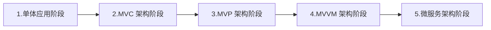
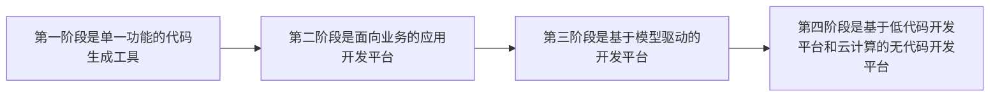

# 第十八章 移动应用系统分析与设计

## 一、移动应用平台基础概念

### 1. 移动端应用开发平台

**（1）应用研发平台**（Enterprise Mobile Application Studio，简称 **EMAS**）

EMAS 是阿里巴巴的应用研发平台，是全端场景（Mobile App、H5、小程序、Web、PC 等）的一站式平台。其技术底座主要基于以 **BaaS**（后端即服务）、**Serverless**、**DevOps**、低代码等为代表的云原生技术，面向企业与开发者提供覆盖应用全生命周期（研发、测试、运维、运营）的一站式研发、运维与管理服务。

**（2）移动开发平台**（Mobile PaaS，简称 **mPaaS**）

起源于支付宝的移动端开发平台，面向移动端开发、测试、运维等环节提供云端到终端的一站式解决方案，降低技术门槛，减少研发成本，提高研发效率，助力企业与开发者打造稳定、优质的移动应用。

**（3）腾讯移动开发平台**（Tencent Mobile Framework，简称 **TMF**）

面向企业的一站式移动端开发与运维平台，整合腾讯十余年的移动端研发经验，提供以 **X5 内核**、**热修复**等为代表的业界领先能力，并支持微信生态；配套开发框架、专家指标与丰富工具库等，支撑灵活发布与业务快速上线，助力企业打造超级应用、构建私域流量生态，推进数字化转型。

**（4）企业级移动研发平台**（Enterprise Mobile Develop Platform，简称 **EMOP**）

依托多年移动互联网行业技术沉淀与京东 **App** 研发实践，提供一站式解决方案，助力企业打造强健的移动端中台，快速构建高质量 **App** 与小程序，支撑企业数字化转型。

**（5）小程序容器技术**（**FinClip**）

将科技巨头的「小程序运行能力」抽离出来，形成独立的小程序容器技术；通过集成 **FinClip SDK**，**App** 可以快速获得运行小程序的能力，实现 **App** 解耦、模块拆分与动态热更新等。

**（6）移动低代码开发平台**（**APICloud**）

基于 MADP（移动开发平台）构建一款应用时，企业可将 UI 设计、前端开发、后端开发等环节紧密衔接，减少大批重复性工作，并有效提升 30%～60% IT 项目效率。

### 2. 移动端应用部署平台

**（1）小程序部署平台**

常见的移动端应用部署平台包括微信小程序、QQ 小程序、抖音小程序、支付宝小程序等。

**（2）App 部署平台**

主流的 App 部署平台——Android 系统和 iOS 系统自带的官方应用商店（如 Google Play 和 App Store）。

| 比较维度                 | iOS                  | Android                |
| :----------------------- | :------------------- | :--------------------- |
| 开源和闭源               | 闭源                 | 开源                   |
| 硬件资源的使用效率不同   | 运行效率高           | 使用效率低             |
| 对应的扩展程序优化不同   | 需要优化到位         | 多数无法优化到位       |
| 运行机制                 | 沙盒运行机制         | 虚拟机运行机制         |
| 后台程序运行             | 自动关闭后台，释放空间 | 不会自动关闭后台，占用内存 |
| 屏幕响应优先级           | 最先响应屏幕         | 第三层级响应           |
| 系统开放性               | 严格的审核机制       | 缺乏监管               |

---

## 二、移动应用开发环境

### 1. App 开发环境

安卓开发环境：JDK、JRE、JVM、Eclipse/IDEA、Android Studio 等。

iOS 开发环境：Xcode、iOS SDK、Objective-C 或 Swift 等。

### 2. 小程序开发环境

wxml、wxss、js、json 等。

### 3. 网页应用开发环境

HTML5 开发工具（如 DevExtreme）、移动设备开发技术、移动端开发技术（如 Native App、Hybrid App 等）。

---

## 三、移动应用架构

**微服务架构阶段**

- 基于服务实现模块化
- 基于 SOA 的服务拆分
- 基于容器和服务框架
- 基于云原生的微服务架构

---

## 四、移动应用开发

### 1. 小程序开发方式

**（1）基于微信小程序框架开发。**

**（2）原生开发方式：** 基于原生语言（如 Java、Object-C）开发，使用微信官方平台提供的 SDK 进行开发，能够实现更多高级功能，可以拥有更好的性能。

**（3）网页开发方式：** 基于网页语言（如 HTML、CSS、JavaScript）开发，使用微信官方提供的 API 进行小程序开发，可以节省大量开发时间，小程序可以兼容不同平台，使用更方便。

**（4）跨平台开发方式：** 基于跨平台语言（如 React Native、Weex）开发，可以节省大量开发时间，实现跨平台的功能，使用更方便。

**（5）云开发方式：** 基于微信小程序云开发，可以节省大量开发时间，实现快速搭建开发小程序。

### 2. 原生 APP 开发方式

| 开发方式                                                         | 关键技术                                                                                 | 备注                                           |
| :--------------------------------------------------------------- | :--------------------------------------------------------------------------------------- | :--------------------------------------------- |
| **原生应用** Native Application, Native App                 | Objective-C/Swift、oc、Java 等                                                         | 与操作系统集成、性能好、用户体验好             |
| **Web 应用** WebApplication, Web App                      | **前端：** HTML、CSS、JavaScript 等语言 **后端：** Java、PHP、ASP 等                  | 跨平台、成本低、维护方便、发布灵活             |
| **混合应用** Hybrid Application, Hybrid App                 | WebView、框架、web 技术                                                                  | 跨平台、效率高、用户体验较好                   |

---

## 五、无代码开发

### （1）概念

允许非专业开发人员通过图形界面和可视化工具来创建应用程序，而无需编写传统的计算机代码。

### （2）发展阶段

- **第一阶段是单一功能的代码生成工具**  
  如：报表生成工具、表单生成工具等

- **第二阶段是面向业务的应用开发平台**  
  如：PowerBuilder、Visual Basic 等

- **第三阶段是基于模型驱动的开发平台**  
  如：Mendix、OutSystems 等

- **第四阶段是基于低代码开发平台和云计算的无代码开发平台**  
  如：Salesforce、Airtable 等
