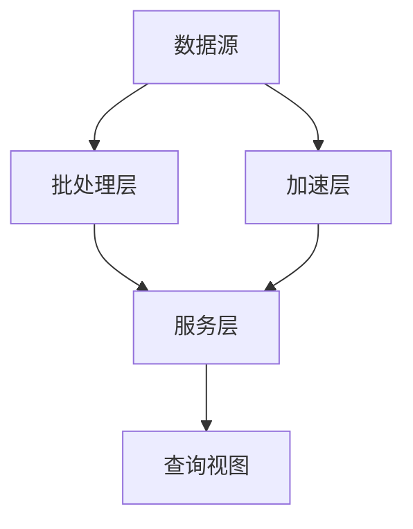
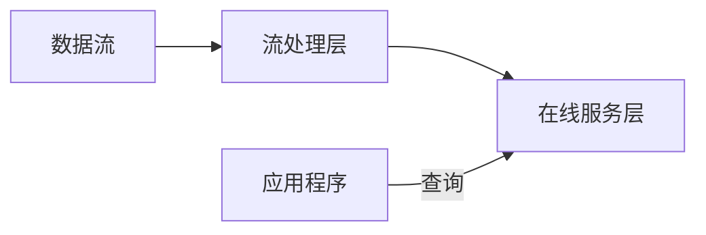

# 第十九章 大数据处理系统分析与设计

## 一、大数据处理系统概述

### 1. 概念

大数据是具有数量巨大、来源多样、生成极快、多变等特征且难以使用传统数据体系结构有效处理的包含大量数据集的数据。

### 2. 大数据的 4 个 V

- **大规模（Volume）**
- **高速度（Velocity）**
- **多样化（Variety）**
- **价值密度低（Value）**
- **真实性（Veracity）**

### 3. 通用设计原则

- **可扩展**（分布式、模块化）
- **可管理**（管理策略和方法）
- **数据安全**（数据加密、访问控制、数据备份与恢复、审计日志、持续监控）
- **高性能**（数据分区、分布式计算、并行处理、内存计算）
- **高可用**（数据冗余、自动故障转移、负载均衡）
- **稳定性**（监控和预警、性能调优、故障排除、升级和维护）

### 4. 大数据面临着 5 个主要问题

异构性、规模、时间性、复杂性和隐私性。

---

## 二、大数据处理系统架构

### 1. 结构类型与数据处理场景对比

| 维度                 | 批处理架构                             | 流处理架构                       | 混合架构                        |
| :------------------- | :------------------------------------- | :------------------------------- | :------------------------------ |
| **核心特征**         | 离线处理/高吞吐量                      | 实时处理/低延时                  | 批流融合/灵活切换               |
| **处理逻辑**         | 定时/定量分批处理（如每 5 分钟或 1MB） | 逐条连续处理（数据到达即时计算） | 历史数据批处理 + 实时数据流处理 |
| **典型技术**         | MapReduce，Spark Batch                 | Flink，Storm，Kafka Streams      | Spark Structured Streaming      |
| **数据处理场景对比** | **离线报表/数据仓库 ETL** | **实时监控/告警** | **实时分析 + 历史回溯** |
| **应用场景**         | （如：每日销售统计）                   | （如：金融欺诈识别）             | （如：用户行为画像）            |
| **数据模块**         | 采集 → 存储 → 处理 → 输出              | 持续输入 → 实时计算 → 输出       | 双通道并行处理                  |
| **优点**             | 稳定性高、资源利用率高                 | 毫秒级响应、即时决策             | 兼顾历史与实时，场景覆盖全面    |
| **局限**             | 延时高（小时级），无法实时响应         | 难处理历史数据，状态管理复杂     | 架构复杂，运维成本高            |

### 2. 大数据处理系统架构模式——Lambda 架构

数据自**数据源**分流为上下两支：**批处理层**与**加速层**并行处理；两支的输出汇入**服务层**，再统一形成对外的**查询视图**。

- **批处理层**：以 MapReduce 等进行大规模离线处理；存储数据集并生成批处理视图（Batch Views）；批处理结果视图精确、完整，但处理延时很高。
- **加速层**：仅处理最近产生的实时数据，维护实时视图并生成流处理结果视图；流层数据在收敛前可能尚不准确或不完整，但处理延时很低。
- **服务层**：对流处理视图与批处理视图进行汇聚、合并，将两类视图的结果数据集合并为最终数据集，并据此响应用户查询。

| 优点 | 缺点 |
| :--- | :--- |
| 能够同时支持批处理与实时流处理；吞吐量大，并可应对多样化数据源。 | 需要维护多层数据存储并进行复杂的数据集成，增加系统复杂度与维护成本。 |
| Lambda 架构具备实时数据处理能力，使用户能够较快获得数据分析结果。 | 由于数据需同时在批处理层与加速层存储，会造成数据冗余并提高存储成本。 |
| | Lambda 架构的实时性能有限，难以应对实时性要求极高的处理场景。 |

### 3. 大数据处理系统架构模式——Kappa 架构

数据流进入**流处理层**（内含流处理引擎），再进入**在线服务层**（内含流处理数据库）；**应用程序**通过查询访问在线服务层。

- **流处理层**：对数据流做实时处理与计算，将结果写入实时数据库或分布式文件系统；在 Kappa 架构中多采用无状态流处理算法（不保存中间结果），以简化逻辑并降低计算成本。
- **在线服务层**：存放处理后的实时数据与计算结果，通常采用实时数据库或分布式文件系统；在 Kappa 架构中还可同时承载历史数据，供查询使用。

| 优点 | 缺点 |
| :--- | :--- |
| 简化系统架构与维护成本；提升实时性与可扩展性。 | 难以支持批处理与离线分析；部分场景仍需对大量历史数据进行离线处理。 |
| 能够对数据流进行实时处理与计算，并将结果存入实时数据库或分布式文件系统。 | 由于 Kappa 架构仅有单一的流处理层，数据存储成本可能较高，需审慎考虑存储策略。 |

### 4. Lambda 架构与 Kappa 架构对比和设计选择

| 对比内容                   | Lambda 架构                                                            | Kappa 架构                                                                                               |
| :------------------------- | :--------------------------------------------------------------------- | :------------------------------------------------------------------------------------------------------- |
| **复杂度与开发、维护成本** | 高：需要维护两套系统（引擎）。                                         | 低：只需维护一套系统（引擎）。                                                                           |
| **计算开销**               | 大：需要持续运行批处理与实时两类计算。                                 | 相对较小：仅在必要时执行全量计算。                                                                       |
| **实时性**                 | 可满足实时需求。                                                       | 可满足实时需求。                                                                                         |
| **历史数据处理能力**       | 强：批处理全量处理，吞吐量大。                                         | 相对较弱：以流式全量处理为主，吞吐量相对较低。                                                           |
| **使用场景**               | 更适合需要快速产出结果的历史数据分析与查询；批处理可直接满足此类需求。 | 并非对 Lambda 的替代，而是一种简化；放弃对批处理的支持，更适合业务数据呈增量写入、以流式分析为主的场景。 |

**选择依据：** 结合业务需求、技术要求、系统复杂度、开发维护成本与历史数据处理能力等因素，对两种架构进行对比后决策。

> **说明：** 计算开销虽然存在一定差别，但是相差不是很大，所以不作为考虑因素。

---

## 三、大数据处理系统开发

### 1. 大数据系统开发的实现技术

大数据处理应用的实现技术与传统软件实现技术相比，最大的特性来自强大的数据管理能力。

- 数据存储：常用的数据存储方案
- 数据管理：常用的数据管理模式
- 数据处理：常见的数据处理手段
- 数据分析：常见的数据分析方法
- 大数据处理系统的部署需求及其运行环境

### 2. 数据存储的流程

#### （1）数据采集

- **常用方法：** 系统日志采集、利用 ETL 工具采集以及网络爬虫等。
- **采集模式：** 离线采集、实时采集、互联网采集

#### （2）数据清洗

数据清洗的基本流程一共分为 5 个步骤，分别是：

1. 数据分析
2. 定义数据清洗的策略和规则
3. 搜寻并确定错误实例
4. 纠正发现的错误
5. 干净数据回流

#### （3）数据转换

在大数据处理系统中将数据转换的行为描述为 6 个步骤，分别是：

1. 数据发现
2. 数据映射
3. 数据提取
4. 代码生成
5. 代码执行
6. 数据审查

#### （4）数据存储：行存储与列存储

| 比较对象 | 行存储方式                                   | 列存储方式                                         |
| :------- | :------------------------------------------- | :------------------------------------------------- |
| **优点** | 写入效率高，保证数据完整性                   | 读取过程没有冗余，适合数据定长的大数据计算         |
| **缺点** | 数据读取有冗余现象，影响计算速度             | 缺乏数据完整性保证，写入效率低                     |
| **改进** | 优化存储格式，保证能够在内存快速删除冗余数据 | 多磁盘多线程并行读写（需要增加运营成本和修改软件） |

### 3. 数据管理

#### （1）元数据管理

- 数据源元数据
- ETL 规则元数据
- 数据仓库元数据
- 报表元数据
- 接口文件格式元数据
- 商业元数据
- 其它元数据

#### （2）数据关系图谱

- 数据之间的关系
- 数据背后的价值

#### （3）数据安全

- 数据的产生
- 数据的存储
- 数据的使用
- 数据的传输
- 数据的展示
- 数据的销毁

#### （4）数据监控

- 底层基础监控
- 服务状态监控
- 组件性能监控
- Runtime 监控
- 集群指标监控
- 任务状态监控
- 趋势预测监控

### 4. 数据处理

| 实时计算处理                                                 | 离线计算处理                                                                                                                      | 图计算处理                          |
| :----------------------------------------------------------- | :-------------------------------------------------------------------------------------------------------------------------------- | :---------------------------------- |
| （1）数据源源不断的到来。                                    | （1）数据量巨大且保存时间长。                                                                                                     | 常见的图算法大致可以分为以下 3 种： |
| （2）数据需要尽快得到处理，不能产生积压。                    | （2）在大量数据上进行复杂的批量运算。                                                                                             | （1）路径搜索算法                   |
| （3）处理之后的数据量依然巨大，是 TB 级甚至 PB 级的数据量。  | （3）数据在计算之前已经完全到位，不会发生变化。                                                                                   | （2）中心算法                       |
| （4）处理的结果能够尽快展现。                                | （4）能够方便地查询批量计算的结果。                                                                                               | （3）社群发现算法                   |
| **总结：** 数据的收集 → 数据的传输 → 数据的处理 → 数据的展现 |                                                                                                                                   |                                     |
| **技术架构：** Flume+kafka+Storm/Spark+Hbase/Redis           | **说明：** 使用 HDFS 存储数据，使用 MapReduce 做批量计算，计算完成的数据如需数据仓库的存储，直接存入 Hive，然后从 Hive 进行展现。 | **框架：** Spark 框架               |

### 5. 数据分析

#### （1）机器学习

一般将传统的机器学习分为 3 类：监督学习；非监督学习；强化学习。

#### （2）搜索推荐

- ElasticSearch
- Apache Solr
- Nutch

#### （3）数据可视化

- Silk
- Tableau
- Datawrapper
- Chartio

### 6. 系统部署

#### 6.1 大数据处理系统的部署分析

**（1）需求分析**

主要了解系统将来运行的上层业务的业务特点以及重点。

- **离线业务：** MapReduce（数据的分析、计算和处理）
- **在线业务：** Hbase（实时的数据查询业务）
- **上层业务：** 也可能基于 Hive（实质 MapReduce）

**（2）模型设计**

主要基于系统总体的数据量等信息设计存储和计算模型。

- **HDFS：** 目标数据较为离散，并且只有存储的简单要求。
- **Hbase：** 目标数据存在外部查询用途，且实时性要求较高。

**（3）硬件规划**

主要基于用户的需求进行硬件规划、部署设计，以及 IP 地址的规划。需要考虑每台服务器单节点的性能要求。

**（4）软件规划**

主要根据系统支持的业务，规划采用哪些组件来满足用户的功能要求，并且通过部署来实现业务的高可用，高可扩展。同时，在各个节点部署服务时，还要注意服务间的依赖关系。

#### 6.2 关键原则

生产环境和测试环境的隔离；不同集群的隔离；在线应用和离线应用的隔离；不同在线应用间的隔离；不同应用数据的隔离。

#### 6.3 应用服务器待解决问题

集群规划；网络配置；安全配置；时间同步；SSH 登录。

#### 6.4 版本控制工具

除了 Git、SVN 等版本控制工具外，目前大数据处理系统中最新提出的版本控制工具有 **DAGsHub、DVC、Pachyderm、lakeFS**。

---

## 四、大数据处理系统测试

### 1. 测试内容分类

| 测试内容分类           | 测试内容说明                                                                                                                                                                                                                                                                                                               |
| :--------------------- | :------------------------------------------------------------------------------------------------------------------------------------------------------------------------------------------------------------------------------------------------------------------------------------------------------------------------- |
| **功能测试**           | 数据提取测试、数据处理测试、数据存储测试、数据迁移测试等                                                                                                                                                                                                                                                                   |
| **性能测试**           | 数据规模和负载、吞吐量和响应时间、扩展性和负载均衡、并行处理和分布式计算、高可用性和容错性                                                                                                                                                                                                                                 |
| **可靠性和容错性测试** | 可靠性测试的内容包括数据备份和恢复、故障检测和修复、数据一致性验证等。测试可以模拟计算节点故障、网络故障、存储故障等故障场景，可靠性测试观察系统的反应和恢复能力，验证系统在面对故障时是否能够保证数据的完整性和可靠性。容错性测试观察系统的恢复能力和自动故障转移机制，验证系统在发生故障时是否能够自动完成任务切换和恢复 |
| **安全性测试**         | 访问控制测试、数据保护测试、漏洞扫描和渗透测试、弱密码测试、防火墙和网络安全测试、安全日志和监控测试等                                                                                                                                                                                                                     |
| **兼容性测试**         | 硬件兼容性、操作系统兼容性、数据库兼容性、第三方组件兼容性、文件格式兼容性、API 兼容性、平台兼容性等                                                                                                                                                                                                                       |

### 2. 对比传统的挑战

| 对比传统的挑战             | 说明                                                                                                                                       |
| :------------------------- | :----------------------------------------------------------------------------------------------------------------------------------------- |
| **分布式环境**             | 大数据处理系统通常部署在分布式环境中，由多个节点组成。测试需要考虑分布式计算和存储的特点，包括并行处理、数据分片、数据复制和分布式调度等。 |
| **多样化的数据类型和格式** | 大数据处理系统涉及多种数据类型和格式，如结构化数据、半结构化数据和非结构化数据。测试需要覆盖不同数据类型、格式的处理和分析场景。           |
| **实时和批处理**           | 大数据处理系统通常支持实时数据处理和批处理任务。测试需要分别针对实时和批处理模式进行测试，并考虑数据流和处理管道的正确性和效率。           |
| **高性能和可扩展性**       | 大数据处理系统追求高性能和可扩展性。测试需要评估系统在高负载和并发访问下的性能表现，并确定系统的扩展性和横向扩展能力。                     |
| **复杂的数据处理逻辑**     | 大数据处理系统的数据处理逻辑可能非常复杂，包括数据清洗、转换、聚合、查询、机器学习等操作。测试需要确保这些处理逻辑的正确性和一致性。       |
