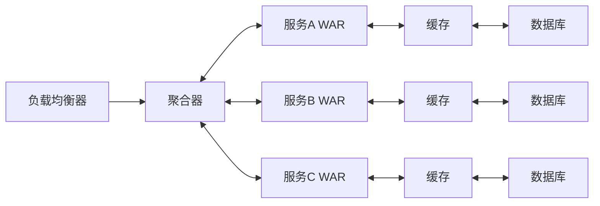
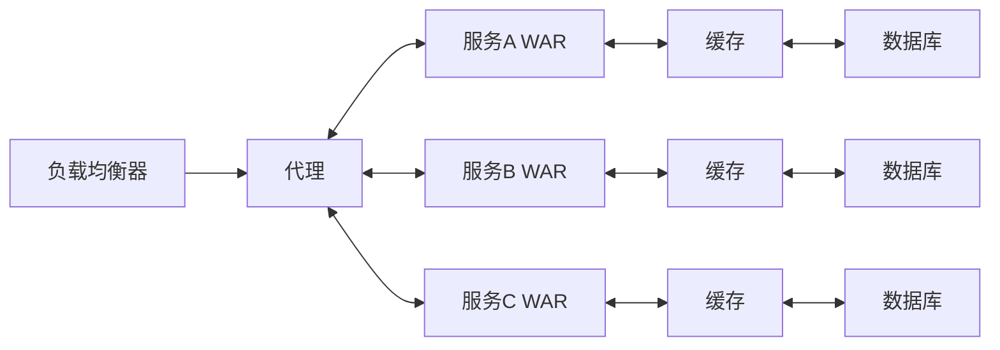
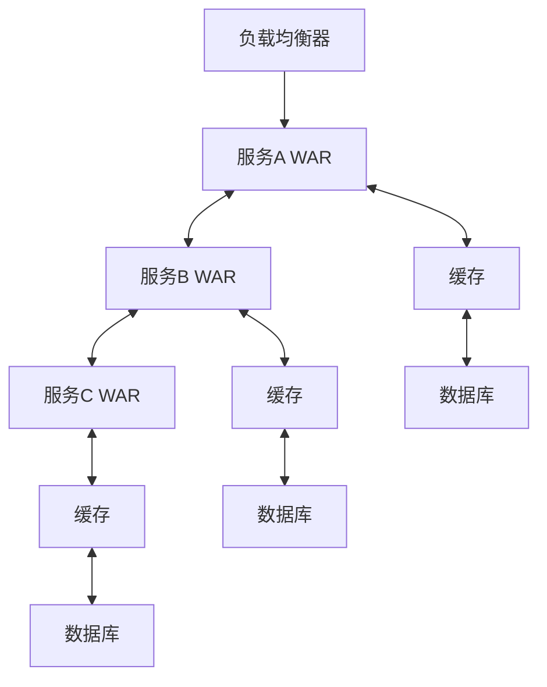
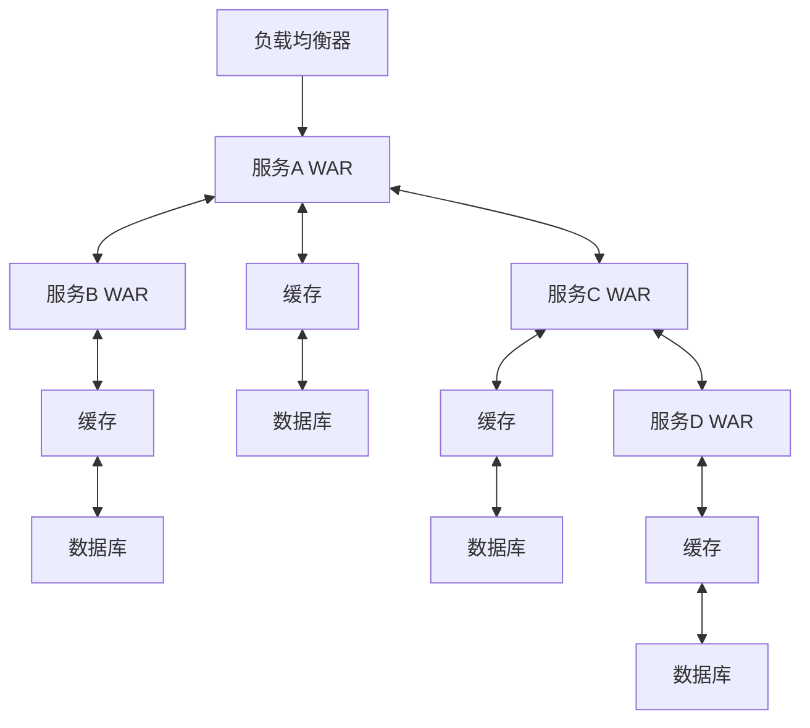
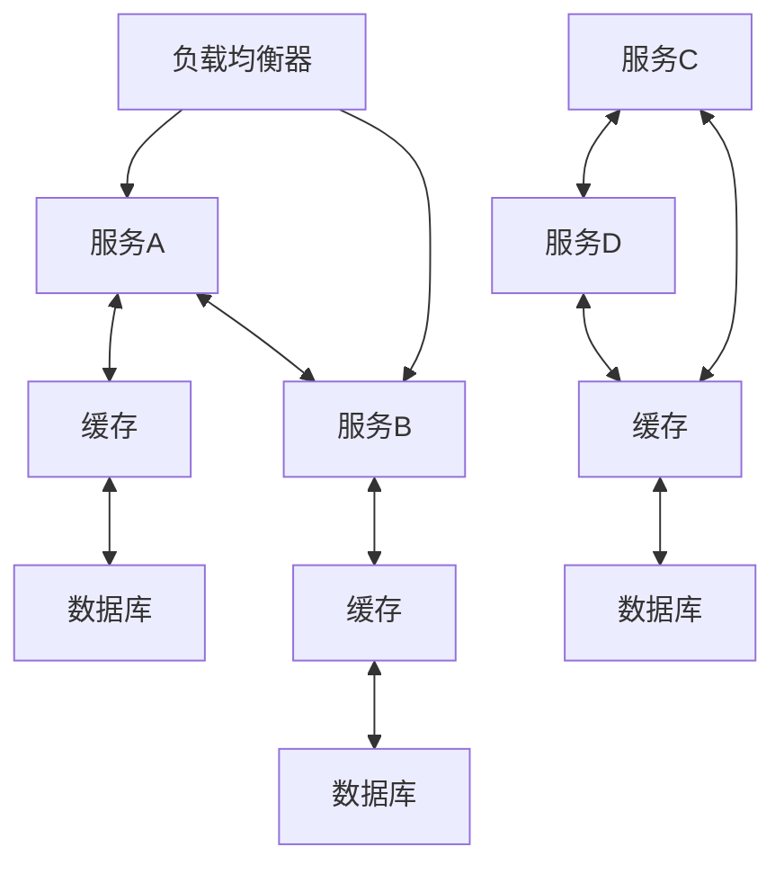
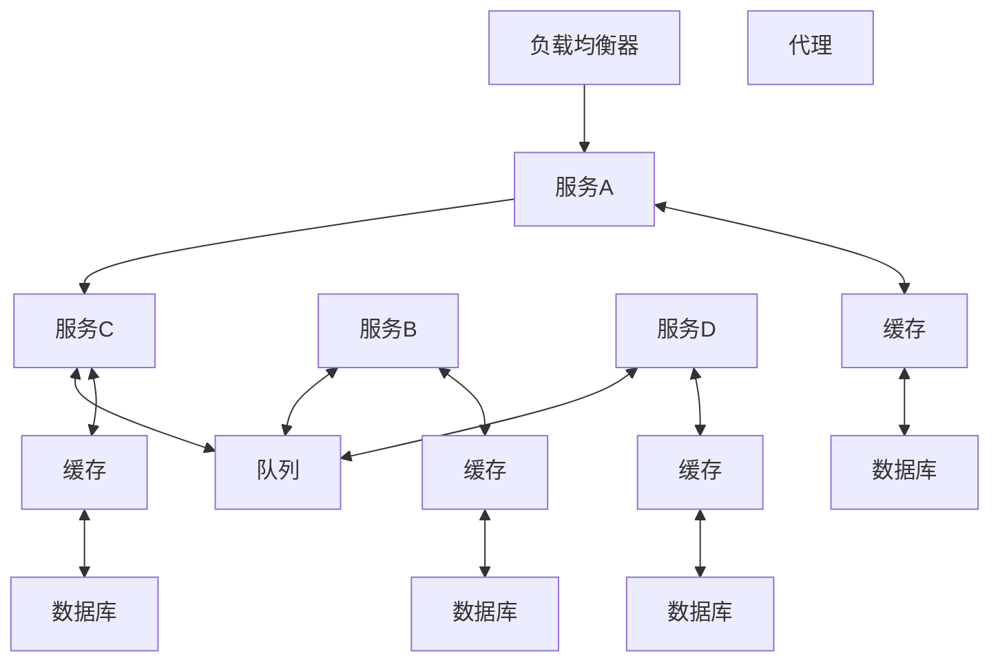
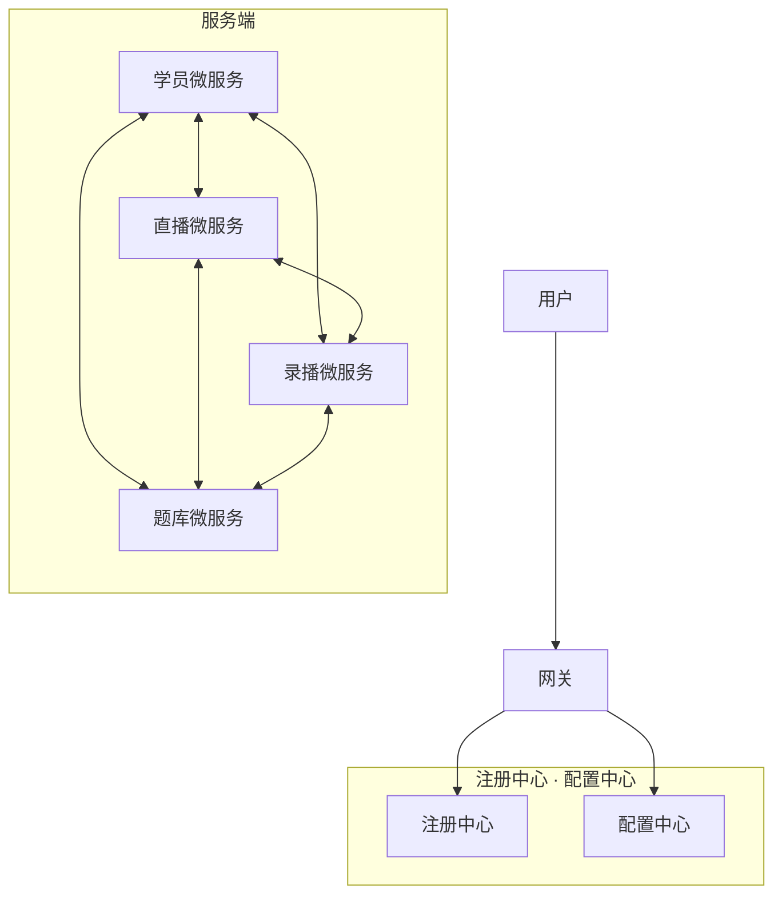

# 第二十章 微服务系统分析与设计

## 一、微服务系统概述

### 1. 概念

微服务顾名思义，就是很小的服务，所以它属于面向服务架构的一种。

微服务在更小的基础上，其实进一步在突显其独立性。

### 2. 单体式系统与微服务系统

| 特性         | 单体式系统         | 微服务系统                     |
| :----------- | :----------------- | :----------------------------- |
| 架构粒度     | 整体应用，功能集中 | 多个自治服务，功能分散         |
| 部署和扩展   | 整体部署，整体扩展 | 服务独立部署，按需扩展         |
| 技术异构性   | 不支持             | 支持                           |
| 数据管理     | 共享数据库         | 服务独立数据库，或分布式数据库 |
| 团队协作     | 适合小团队         | 适当多团队协作，分工明确       |
| 可靠性与容错 | 较差               | 较好                           |
| 开发难度     | 相对简单           | 相对复杂                       |

### 3. 微服务与 SOA 的对比

| 微服务                        | SOA                                         |
| :---------------------------- | :------------------------------------------ |
| 能拆分的就拆分                | 是整体的，服务能放一起的都放一起            |
| 纵向业务划分                  | 是水平分多层                                |
| 由单一组织负责                | 按层级划分不同部门的组织负责                |
| 细粒度                        | 粗粒度                                      |
| 两句话可以解释明白            | 几百字只相当于 SOA 的目录                   |
| 独立的子公司                  | 类似大公司里面划分了一些业务单元（BU）      |
| 组件小                        | 存在较复杂的组件                            |
| 业务逻辑存在于每一个服务中    | 业务逻辑横跨多个业务领域                    |
| 使用轻量级的通信方式，如 HTTP | 企业服务总线（ESB）充当了服务之间通信的角色 |

### 4. 微服务的优势

| 优点               | 解读                                                                                 |
| :----------------- | :----------------------------------------------------------------------------------- |
| 【复杂应用解耦】   | 小服务（且专注于做一件事情） 化整为零，易于小团队开发                             |
| 【独立】           | 独立开发 独立测试及独立部署（简单部署） 独立运行（每个服务独立在其独立进程中） |
| 【技术选型灵活】   | 支持异构（如：每个服务使用不同数据库）                                               |
| 【容错】           | 故障被隔离在单个服务中，通过重试、平稳退化等机制实现应用层容错                       |
| 【松耦合，易扩展】 | 可根据需求独立扩展                                                                   |

### 5. 微服务面临的挑战【缺点】

- 分布式环境下的数据一致性【更复杂】
- 测试的复杂性【服务间依赖测试】
- 运维的复杂性

---

## 二、微服务系统架构

### 1. 聚合器微服务模式

聚合器微服务模式示意图

#### (1) 聚合器的功能

消息转发，数据聚合，数据缓存。

#### (2) 引入聚合器的优点

- 减少网络延迟
- 减少服务之间的依赖
- 提高系统可靠性
- 提高开发效率

### 2. 代理微服务模式

代理微服务模式示意图

(1) 代理可实现：负载均衡、故障熔断、限流等功能，解耦客户端和后端服务，提高系统的可伸缩性和可维护性。

(2) 代理仅委派请求，或进行数据的转换工作，不会从后端服务中聚合数据。

### 3. 链式微服务模式

链式微服务模式示意图

### 4. 分支微服务模式

分支微服务模式示意图

分支微服务是链式微服务的扩展

### 5. 数据共享微服务模式

数据共享微服务模式示意图

不同微服务之间共享数据

### 6. 异步消息微服务模式

异步消息微服务模式示意图

异步消息微服务是一种基于消息传递和事件驱动的微服务架构，它可以实现高性能、可伸缩和可靠的分布式系统。

---

## 三、微服务系统开发

围绕上述核心流程，典型支撑技术包括：

- **服务注册和发现**：[Consul]、[ZooKeeper]、[Eureka]、[Etcd]
- **安全与权限管理**：[OAuth2]、[TLS/SSL]、[API网关]
- **运维监控**：[Prometheus]、[Grafana]、[ELK Stack]、[Zipkin]
- **服务通信**：[HTTP/REST]、[gRPC]、[Thrift]、[Kafka]
- **容器**：[Docker]
- **容器编排**：[Kubernetes(K8s)]
- **持续集成**：[Jenkins]

### 1. 容器化和自动化部署

| 技术 | 说明 |
| :--- | :--- |
| **Docker** | 轻量级虚拟化容器技术，基于 Linux 内核。  【轻量级】秒级启动，具有高可移植性和灵活性。 【快速部署和运行】通过打包可移植镜像实现。 【隔离性】每个容器拥有自己的命名空间、文件系统和网络资源。 【可扩展性】易于进行水平扩展和垂直扩展。 【易于管理】拥有一套易于使用的命令行工具和 API 接口。 |
| **Kubernetes（K8s）** | 开源容器编排平台（对容器化应用进行自动部署、扩展和管理）。  【Master】管理整个集群的状态，决定在集群上的 Node 如何部署容器。 【Node】工作节点，负责运行和管理容器。 【Pod】最小调度单元，可包含一个或多个容器，共享命名空间和存储。 【Service】用于定义一组 Pods 的访问入口。 【Volume】为 Pod 提供持久化存储。 【NameSpace】将集群划分为多个虚拟集群，使团队能够独立管理自己的应用程序。 |
| **Jenkins** | 自动化构建和持续集成（CI）工具。  Docker、Kubernetes、GitLab 等均可作为 Jenkins 插件。 |

### 2. 服务注册和发现

#### 2.1 服务注册工具介绍

| 工具 | 说明 |
| :--- | :--- |
| **Consul** | 分布式服务注册和发现工具。  【服务注册】包含服务名称 + 服务地址 + 端口号。 【服务发现】客户端通过 Consul 提供的 API 查询可用服务，并返回健康的服务列表。通过 DNS 或 HTTP 等多种方式实现。 【健康检查】定期检查，标记不可用服务并从可用列表中移除。 【多数据中心】多数据中心带来更好的可用性和容错能力。 【KV 存储】用于存储配置数据和共享数据。 |
| **ZooKeeper** | 分布式开源协调服务，用于处理分布式应用中的协调问题（分布式锁、选举、配置管理等）。  特点：高可用、高性能、严格一致性。  ZooKeeper 数据存储在内存中。 ZooKeeper 中数据结构称为 Znode。 ZooKeeper 通常用于服务注册和服务发现。 |
| **Eureka** | 基于 REST 的服务治理框架，用于服务注册和发现。  Eureka Server：服务注册中心。 Eureka Client：服务提供方，将自己的服务注册到 Server，并从 Server 获取其它服务注册信息。 |
| **Etcd** | 分布式的、高可用的键值存储系统，主要进行元数据管理和配置共享。  已成为 Kubernetes 的默认数据存储和服务发现组件。  特点： 【高可用性】用 Raft 协议来保证数据的一致性和高可用性。 【快速响应】Go 语言开发，具有高效的性能和快速响应能力。 【可靠性】强大的事务机制。 【灵活性】支持监听，可及时捕捉数据变化，支持多种数据格式。 |

### 3. 服务通信

#### 3.1 服务通信技术介绍

| 技术 | 说明 |
| :--- | :--- |
| **HTTP/REST** | HTTP 特点：简单易用、无状态（每个请求都是独立的）、可扩展。 |
| **gRPC** | 高性能、开源远程过程调用框架。基于 HTTP/2 协议，支持多种编程语言和平台，在微服务架构中有广泛应用。  通过定义服务接口和消息格式来实现远程过程调用。  4 种通信方式： 【Unary RPC】单一请求和响应模式，类似于 HTTP 请求。 【Server Streaming RPC】一次请求，多次响应模式。 【Client Streaming RPC】多次请求，一次响应模式。 【Bidirectional Streaming RPC】双向流模式，同一个连接上双向流方式通信。 |
| **Thrift** | 一种可伸缩、跨语言的远程过程调用（RPC）框架。  三个主要部分：IDL、编译器和运行时库。  特点：【高性能】二进制通信比文本通信强、异步通信更高效。 |
| **Kafka** | 高吞吐量分布式消息队列。  【组件】 **[Topic]**：消息的类别【主题】，消息按主题入队出队。一个主题可分多个分区。 **[Partition]**：分区，里面是有序的消息序列。每个分区可有多个 Broker 副本。 **[Broker]**：服务器节点，每个 Broker 负责处理 1 个或多个分区，多个 Broker 组成一个 Kafka 集群。 **[Producer]**：消息发布者，将消息发送到一个或多个主题中。 **[Consumer]**：消息订阅者，从一个或多个主题中读取消息。 **[Consumer Group]**：一个消费者组由多个消费者组成，它们共同消费一个或多个主题中的消息。 |

#### 3.2 REST

**(1) 概念**

REST（Representational State Transfer，表述性状态转移）是一种通常使用 HTTP 和 XML 进行基于 Web 通信的技术，可以降低开发的复杂性，提高系统的可伸缩性。

**(2) REST 相关概念**

- **资源：** 如架构课程订单
- **表述：** 资源某一时间的状态，呈现形式有 HTML、JSON、XML
- **状态转移：** 使用 GET、POST 等方法
- **超链接：** 通过超链接可与其它资源联系

**(3) REST 的 5 个原则**

- 网络上的所有事物都被抽象为资源。
- 每个资源对应一个唯一的资源标识（反过来不成立）。
- 通过通用的连接件接口对资源进行操作。
- 对资源的各种操作不会改变资源标识。
- 所有的操作都是无状态的。

**(4) REST API**

| 命令 | 用途 |
| :--- | :--- |
| **GET** | 从指定的资源请求数据，只进行**数据检索**，不进行其他操作。 |
| **POST** | 将数据发送到服务器进行**创建**，通常用于上传文件或提交表单。 |
| **PUT** | 更新目标资源的所有当前表示，使用上传的内容进行替换。 |
| **DELETE** | 删除指定的资源。 |
| **HEAD** | 与 GET 方法类似，但只传输状态行和头部信息。 |
| **PATCH** | 对资源进行部分修改。 |

### 4. 安全与权限管理

| 技术 | 说明 |
| :--- | :--- |
| **OAuth2** | 常用的授权协议，广泛用于互联网、移动应用等场景。  **4 大角色**：【资源所有者（用户）】、【客户端（第三方应用）】、【授权服务器】、【资源服务器】。  **4 种授权模式**： 【授权码模式（应用最广）】授权码作为临时访问令牌。 【密码模式】用于受信任的客户端（如本地应用程序），客户端直接通过用户凭据向授权服务器申请访问令牌。 【客户端模式】适用于客户端自身访问资源，客户端直接通过客户端凭据向授权服务器申请访问令牌。 【隐式授权模式】适用于移动应用程序或 Web 应用程序，将访问令牌直接从授权服务器发送到客户端，而不需要授权码。 |
| **JWT** | JWT（JSON Web Token）是一种用于身份验证和授权的开放标准。  它是一种轻量级的、基于 JSON 的令牌，可以在客户端和服务器之间传递信息。  **JWT 由三部分组成**： 【头部】包含令牌类型和所使用的算法。 【载荷】包含用户信息和其它元数据。 【签名】用于验证令牌的完整性和真实性。 |
| **TLS/SSL** | 保护网络通信的协议，TLS 是 SSL 的升级版。  **TLS/SSL 采用**：公钥加密 + 对称加密。  **TLS/SSL 安全性体现在**： 【数据完整性】用消息认证码（MAC）保证数据完整性，防中间人攻击和数据篡改。 【加密】用对称加密使传输过程不容易被窃听和篡改。 【身份验证】通过数据证书验证身份。 【向后兼容】TLS/SSL 可向后兼容 SSL 和早期版本的 TLS 协议。 |
| **API 网关** | 所有请求的入口，可以对请求进行验证、转发、路由、限流、负载均衡、缓存、监控等。  **优势**： 【简化系统架构】API 网关可将多个微服务组合成一个统一的接口。 【提高系统可靠性】通过限流、降级和缓存机制。 【提高系统安全性】可对请求进行校验鉴权。 【提高系统性能】通过缓存、负载均衡和服务发现机制。 |

### 5. 运维监控

| 工具 | 说明 |
| :--- | :--- |
| **Prometheus** | 开源的监控和告警工具。  **4 个核心组件**： 【Prometheus Server】从数据源（应用、主机、数据库等）中摘取指标数据，并将其存储到本地时间序列数据库中。同时提供了 HTTP API，允许用户查询和聚合数据。 【Client Library】一组用于收集指标数据的库，支持 Go、Java、Python 等。提供丰富 API，允许开发者在应用程序中埋点，从而收集数据。 【Push Gateway】可选组件，它允许应用程序主动将指标数据推送到 Server，而不是等待拉取，适用于短周期任务。 【Alertmanager】负责接收 Server 发送的告警通知，将告警发送给指定的接收者。 |
| **Grafana** | 开源的数据可视化和监控平台，支持多种数据源。  **特点**： 【数据源支持广泛】支持 InfluxDB、Prometheus、Graphite、Elasticsearch 等。 【数据可视化灵活】多种面板和图表类型（折线图、表格、仪表盘等），可自由组合。 【报警功能完善】报警可通过邮件、Slack 等方式接收。 【可扩展性强】Grafana 是开源的，用户可编写插件。 |
| **ELK Stack** | 开源的日志管理解决方案，Elasticsearch+Logstash+kibana。  **优点**：开源免费、灵活性和可扩展性、大数据处理、实时性。 |
| **Zipkin** | **【应用场景】**日志管理和分析、监控和警报、业务分析和数据挖掘、安全分析和威胁检测。  分布式应用程序追踪系统。  **优势**： **【collector】**：收集服务调用信息，将其发送到存储后端。 **【Storage】**：存储和检索服务调用信息。 **【API】**：允许用户查询和检索跟踪信息。 **【UI】**：展示跟踪数据和生成可视化图表。 |

---

## 四、微服务系统测试

### 1. 微服务系统测试的特性和面临的挑战

- **(1) 分布式测试：** 服务间交互、跨服务集成、网络延迟和容错测试等。
- **(2) 服务自治性：** 每个服务都需要进行单元测试和集成测试，以确保能协同。
- **(3) 异步通信和消息传递：** 微服务通常采用的异步通信和消息队列使得消息的处理变得复杂，测试也变得复杂。
- **(4) 数据一致性：** 如何确保不同服务之间数据的一致性和同步。
- **(5) 故障恢复和弹性：** 微服务系统有弹性和容错能力，测试时需要验证。

### 2. 测试过程

- **(1) 测试计划制订：** 明确测试目标、范围和计划。制定测试策略、方法和资源分配计划。
- **(2) 测试环境搭建：** 包括：运行时环境、数据库和消息队列等组件的设置和连接。确保测试环境的可靠性、一致性和可重复性。
- **(3) 测试用例设计：** 测试用例应涵盖正常流程、异常流程、边界条件和性能测试等。
- **(4) 测试执行：** 包括：单元测试、集成测试、系统测试和性能测试等。
- **(5) 结果分析：** 根据测试结果，发现和记录问题、缺陷和性能瓶颈，并与开发团队沟通和修复。同时生成报告。

### 3. 功能测试

- **(1) 正常功能测试：** 系统正常情况下的功能是否正确。
- **(2) 异常功能测试：** 测试系统在异常情况下是否能正确处理功能。针对非法输入、异常操作等。
- **(3) 数据一致性测试：** 验证服务之间的数据传输、同步和一致性。
- **(4) 异步通信和消息传递测试：** 验证消息发布、订阅和处理的正确性。
- **(5) 接口和集成测试：** 模拟发送请求和接收响应，以验证接口的正确性和数据的准确传输。
- **(6) 用户界面测试：** 测试 UI 布局、样式、用户输入校验和交互操作。

### 4. 性能测试

- **(1) 负载测试：** 模拟用户或并发请求对系统施加负载，评估负载下的性能。
- **(2) 压力测试：** 在极端条件下进行测试，确定系统在超出正常使用容量时的性能。
- **(3) 并发性测试：** 评估多个并发请求时的系统性能。
- **(4) 延迟测试：** 测量不同操作的延迟时间。
- **(5) 吞吐量测试：** 评估在特定时间内可以处理的请求数量。
- **(6) 性能指标监测与分析：** 监测和收集性能指标进行分析，以发现瓶颈和性能问题。
- **(7) 可扩展性测试：** 评估在不同负载下的可扩展性和性能。

### 5. 容错性测试

- **(1) 异常输入测试：** 对微服务接口和组件进行输入校验测试（边界值、非法输入、异常情况）。
- **(2) 服务宕机测试：** 模拟服务不可用，观察系统的容错能力和快速切换到备份服务的能力。
- **(3) 故障注入测试：** 手动引入故障（如网络中断、数据库故障、硬件故障）以测试系统的容错和恢复能力。
- **(4) 异常负载测试：** 通过增加系统负载模拟异常负载条件，评估在高负载或过载下的容错与性能。
- **(5) 回滚和恢复测试：** 测试失败发生时的回滚和恢复过程。

### 6. 安全性测试

- **(1) 身份认证与授权测试：** 验证系统的用户认证机制。
- **(2) 输入验证与过滤测试：** 检查系统是否正确验证和过滤输入数据，以防止 XSS、SQL 注入等安全漏洞。
- **(3) 数据保护测试：** 检查是否采用加密、数据脱敏等保护措施。
- **(4) 安全配置测试：** 检查安全配置（数据库、服务器、网络等）是否符合安全最佳实践。
- **(5) 漏洞扫描与渗透测试：** 以工具或手动方式对系统进行漏洞扫描。用渗透测试模拟真实攻击，评估防御和恢复能力。
