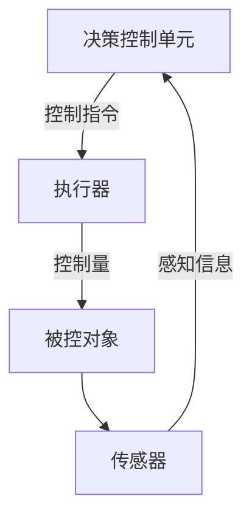
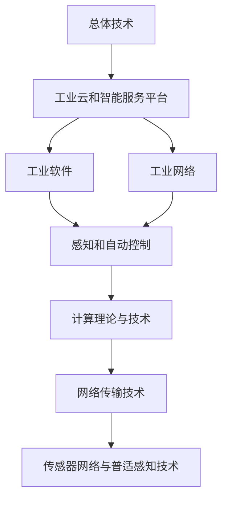
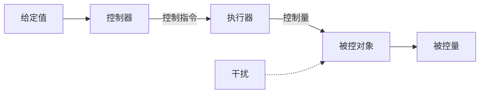
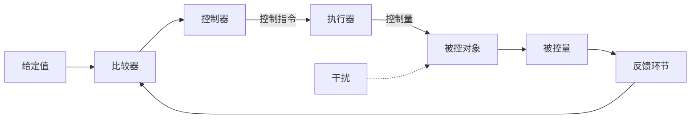

# 第二十一章 信息物理系统分析与设计

## 一、信息物理系统概述

### 1. 物联网与信息物理系统

#### (1) 物联网（Internet of Things，简称 IoT）

物联网是指按照约定的协议，通过射频识别（RFID）、红外传感器、全球定位系统（GPS）、激光扫描器等信息传感设备，将任何物理实体与互联网连接起来，进行信息交换和通信，以实现对物理实体的智能化识别、定位、跟踪、监控和管理的网络系统。

#### (2) 信息物理系统（Cyber-Physical Systems，简称 CPS）

信息物理系统是计算资源与物理资源紧密融合的产物，是一个涉及计算、网络和物理实体的复杂系统。它通过集成先进感知与 3C（**计算、通信、控制**）技术，构建物理空间与信息空间中人、机、物、环境、信息等要素相互映射、实时交互、高效协同的复杂系统，其终极目标是实现资源的最优配置。

数据闭环四个过程：**状态感知**；**实时分析**；**科学决策**；**精准控制和执行的闭环赋能体系**。

### 2. CPS 与物联网关系

CPS 与物联网具有相似的能力，但 CPS 强调**循环反馈**。它要求系统在感知物理世界之后，能够通过通信与计算对物理世界施加反馈控制。

物联网可以看作是 CPS 的一种简化应用，或者说 CPS 使物联网的定义和概念更清晰。

---

## 二、信息物理系统架构

### 1. CPS 分层架构

#### (1) 单元级

**特点：** 不可分割性；软硬件一体化；数据闭环。

**功能：** 可感知；可计算；可交互；可延展；自决策。

#### (2) 系统级

**特点：** “一硬、一软、一网”的有机结合；数据流与资源共享；互联、互通、互操作。

**功能：** 实现多个单元级 CPS 的互联互通互操作，进一步提升**制造资源优化配置**的广度、深度与精度。

#### (3) 系统之系统级（System of Systems Level，SoS）

多个系统级 CPS 的有机结合，涵盖“一硬、一软、一网、一平台”四大核心技术要素。

### 2. CPS 典型系统构成

通常 CPS 由一些基本功能单元组成，这些基本功能单元包括传感器、执行器和决策控制单元等。基本组件结合反馈循环控制机制构成了 CPS 的基本功能逻辑单元，执行 CPS 最基本的监测与控制功能。



### 3. CPS 系统特点

#### (1) 普遍特点

- **封闭系统：** 网络内部子系统或设备互联受限，通信距离短，功能弱。
- **分布式构建：** 系统复杂度高，规模庞大，远程协调、自治及控制对象多样。
- **海量运算：** 接入设备计算能力强大。
- **感知基础：** 通过传感器将物理信息转换为数字信息，实现信息流动。
- **应用广泛：** 涵盖智能家庭、工业控制、智能交通等领域，推动设备发展。

#### (2) 独特特点

- **全局虚拟、局部物理：** 虚拟网络观察控制局部物理世界。
- **深度嵌入：** 计算嵌入物理部件，设备智能化。
- **事件驱动：** 事件、感知、决策、控制闭环。
- **数据为中心：** 数据融合提供服务，信息精炼抽象。
- **时间关键：** 时间性要求高，实时性影响决策。
- **安全关键：** 系统复杂，需防恶意攻击和隐私泄露。
- **异构性：** 子系统各异，需协调通信。
- **高可信赖：** 物理世界不可预测，需鲁棒性、可靠性等。
- **高度自主：** 部件子系统自组织、配置、维护等。
- **领域相关：** 与工程领域密不可分，需满足差异化诉求。

### 4. CPS 逻辑架构

CPS 从逻辑上划分为决策层、网络层和物理层。这三个层次相互协作，共同实现了 CPS 的智能化和自动化功能。决策层通过语义逻辑运算等方式实现用户、感知和控制系统之间的逻辑耦合；网络层通过网络传输处理等过程连接 CPS 在不同空间、时间的子系统；物理层是 CPS 与物理实体的接口，实现感知与控制计算。

---

## 三、信息物理系统技术框架



**总体技术：** 系统架构、异构系统集成、试验验证技术等。

**核心技术：** 智能感知技术和虚实融合控制技术，嵌入式软件技术、MBD技术、CAX/MES/ERP软件技术等，现场总线技术、工业以太网技术、无线技术、SDN等，边缘计算技术、雾计算技术、大数据分析技术等。

**支撑技术：** 普适计算、嵌入式计算、分布式计算、云计算、移动计算、自律计算、可信计算等，下一代互联网NGI、下一代网络NGN、5G等，网络协议、能量管理、数据融合、安全等。

---

## 四、控制系统与网络通信

### 1. CPS 的自动控制系统行为模式

在 CPS 系统中，自动控制无处不在。而控制过程的执行，往往又离不开通信的支撑。

自动控制，即通过自动化方法实现对垂直领域 (Vertical Domain)，或者说是，特定工业领域或企业组织的生产或业务过程、设备、系统的控制。其主要控制功能包括物理量测量、测量结果比较、对测量误差和预期误差的计算，以及为避免后续误差而采取的**过程校正能力**等。参与控制过程的物理设备或装置，即 SCAT (Sensor, Controller, Actuator, Transmitter) 功能单元，包括传感器、控制器、执行器、数据传输设备等。

### 2. 自动控制系统行为模式

#### (1) 开环控制

**开环控制流程**



```text
                                    干扰
                                     │
给定值 → 控制器 ——控制指令——▶ 执行器 ——控制量——▶ 被控对象 ——▶ 被控量
```

#### (2) 闭环控制

**闭环控制流程**



```text
              干扰
               │
给定值 → 比较器 → 控制器 ——控制指令——▶ 执行器 ——控制量——▶ 被控对象 ——▶ 被控量
          ▲                                              │
          └────────────── 反馈环节 ◀──────────────────────┘
```

#### (3) 顺序控制

即按照固定的顺序逐步执行的过程，或按照既定的逻辑有序执行的过程，如基于系统状态和输入而执行不同行为的过程。顺序控制可看作开环控制和闭环控制的扩展，它将若干开环或闭环过程串联起来，整个顺序控制过程通常产生若干输出实例。

#### (4) 批量控制

即批处理过程，是指利用一个或以上设备，对输入的有限数量的材料按照事先预定的处理行为进行加工的控制过程。

### 3. CPS的控制系统通信要求

#### (1) 周期性

周期性 (Periodicity) 是指通信数据的传输间隔是重复的，如传输每 30ms 发生一次，又如位置的周期性变化或物理量重复检测等。

#### (2) 非周期性

比如由某一突发事件触发的数据传输，此类事件可以是控制系统或用户定义的任何事件。通常有如下几种事件类型：过程事件 (如温度、压力超越门限值)、诊断事件 (如供电缺相、超高温)、维护事件 (如设备故障预警)。

#### (3) 确定性通信

确定性通信 (Determinism) 是指消息发送和接收之间的延时时间是稳定的或在一定范围内。就确定性通信来说，此通信时延限制在一个给定的阈值内。

| 通信类型 | 特点/要求 | 应用场景 |
| :-- | :-- | :-- |
| **周期性** | 传输间隔重复 | 传输每 30ms 发生一次，位置周期性变化等 |
| **非周期性** | 突发事件触发 | 过程事件 (如温度、压力超越门限值)、诊断事件 (如供电缺相、超高温)、维护事件 (如设备故障预警) |
| **确定性** | 延时稳定/在一定范围内 | 对通信时延有严格要求的场合，如闭环控制系统 |

#### (4) 通信模式

在工业应用环境中主要有三种典型的业务类型或通信模式：

- **确定性周期通信 (Deterministic Periodic Communication, DPC)**，即周期性通信，并对传输时间有严苛要求。
- **确定性非周期通信 (Deterministic Aperiodic Communication, DAC)**。通信未预设确定的发送时间，如事件驱动的行为指令下发。
- **非确定性通信 (Non-Deterministic Communication, NDC)**。除了上述两种类型通信之外的其它通信，如周期性非实时、非周期非实时的通信。

---

## 五、CPS 应用分析与设计

### 1. CPS 建设路径

#### (1) CPS 体系设计 (CPS Architecture Design)

应用模式的选择；层次架构的设计；安全体系的建立；标准规范体系的制定。

#### (2) 单元级 CPS 建设 (Unit-level CPS Construction)

感控设备的安装；制造工艺与流程数字化；闭环数据流动。

#### (3) 系统级 CPS 建设 (System-level CPS Construction)

工业网络的建设；协同控制机制的设计；数据整合与分析。

#### (4) SoS 级 CPS 建设 (SoS-level CPS Construction)

大数据平台的建设；智能服务平台的建设；系统集成与融合。

### 2. 性能需求

| 性能需求 | 说明 |
| :-- | :-- |
| 计算/信息过程与物理过程紧密结合 | 系统行为特征由物理定律和计算过程共同影响，难以区分 |
| 可靠性 | 系统必须能够应对意外情况和子系统故障，确保稳定运行 |
| 实时性 | 系统需要实时感知物理过程并做出响应 |
| 适时性 | 任务具有最终期限，过期则无需执行 |
| 并发性 | 系统需同时处理多个物理事件和计算任务 |
| 异质性 | 系统能灵活集成不同制造商、软件和编码标准的设备 |
| 自治性 | 系统能在无人干预下自主运行并做出反应 |
| 分布性 | 系统由分布式计算网络组成，每个节点能力有限 |
| 安全性和隐私性 | 系统需保护数据安全和隐私，防止恶意攻击和数据泄露 |
| 动态重组和重配置 | 系统根据任务需求动态调整资源和配置，应对资源失效等情况 |

### 3. 风险分类

**依据产生风险的行为分类，风险可以分为基本风险与特定风险**

| 风险分类 | 说明 | 特点 | 例子 |
| :-- | :-- | :-- | :-- |
| **基本风险** (Fundamental Risk) | 是指非个人行为引起的风险 | 非个人性 (Non-personal)<br>普遍性 (Pervasiveness)<br>不可预防性 (Unpreventability) | 地震、洪水、海啸、经济衰退 |
| **特定风险** (Specific Risk) | 是指个人行为引起的风险<br>环境因素突变 | 个人性 (Personal)<br>局部性 (Locality)<br>可控性 (Controllability) | 火灾、爆炸、盗窃以及对他人物产损失或人身伤害所负的法律责任等 |
