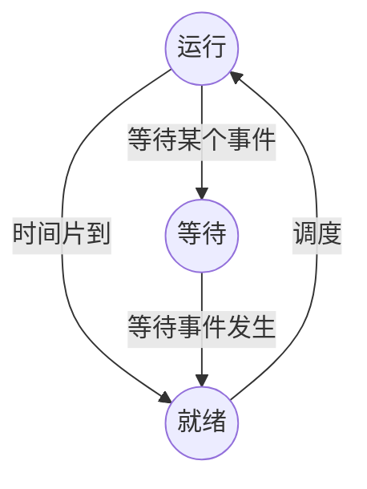

# 第三章 计算机系统

## 一、计算机系统概述

### 1. 计算机系统的多层次结构

```text
                    应用层
┌──────────────────────────────────────────────────────────────┐
│  应用语言机器 / 应用语言                    │  应用软件包         │
└──────────────────────────────────────────────────────────────┘

                  系统层（虚拟机器）
┌────────────────────────── 系统软件 ──────────────────────────┐
│  ┌────────────── 语言处理程序 ──────────────┐                │
│  │  编译程序  │  汇编程序  │  解释程序        │                │
│  └────────────────────────────────────────┘                │
│  操作系统机器 / 作业控制语言等                                 │
└────────────────────────────────────────────────────────────┘

                  硬件层（实际机器）
┌──────────────────────────── 裸机 ────────────────────────────┐
│  传统机器 / 机器指令系统                                        │
│              ↓ 解释                                          │
│  微程序机器 / 微指令系统                                        │
│              ↓ 硬件直接执行                                   │
│  硬联逻辑                                                     │
└─────────────────────────────────────────────────────────────┘
```

硬联逻辑级：这是计算机的内核，由门、触发器等逻辑电路组成。

微程序级：这一级的机器语言是微指令集，程序员用微指令编写的微程序一般直接由硬件执行。

传统机器级：这一级的机器语言是该机的指令集，程序员用机器指令编写的程序可以由微程序进行解释。

操作系统级：从操作系统的基本功能来看，一方面它要直接管理传统机器中的软硬件资源，另一方面它又是传统机器的延伸。

汇编语言级：这一级的机器语言是汇编语言，完成汇编语言翻译的程序称为汇编程序。

高级语言级：这一级的机器语言就是各种高级语言，通常用编译程序来完成高级语言翻译的工作。

应用语言级：这一级是为了使计算机满足某种用途而专门设计的，因此，这一级的机器语言就是各种面向应用的应用语言。

## 二、存储器系统

### 1. 层次化存储体系

```text
                        速度
                         ↑ 快
                         │
              ┌──────────────────────┐
              │ CPU（寄存器）         │
              │ 中央处理器 (CPU,      │
              │ Central Processing    │
              │ Unit)                 │
              └──────────┬───────────┘
                         │
              ┌──────────▼───────────┐
              │ Cache                │
              │ 按内容存取（相联存储器）│
              └──────────┬───────────┘
                         │
              ┌──────────▼───────────┐
              │ 内存（主存）          │
              │ DRAM                 │
              └──────────┬───────────┘
                         │
              ┌──────────▼───────────┐
              │ 外存（辅存）          │
              │ 硬盘、光盘、U盘等      │
              └──────────────────────┘
                         │
                         ↓ 慢
```

| 类型 | 说明                   |
| ---- | ---------------------- |
| RAM  | 断电数据丢失（内存）   |
| ROM  | 断电数据不丢失（BIOS） |

**(1) 局部性原理是层次化存储结构的支撑。**

**(2) 时间局部性：** 指程序中的某条指令一旦执行，不久以后该指令可能再次执行，典型原因是由于程序中存在着大量的循环操作。

**(3) 空间局部性：** 指一旦程序访问了某个存储单元，不久以后，其附近的存储单元也将被访问，即程序在一段时间内所访问的地址可能集中在一定的范围内，其典型情况是程序顺序执行。

**(4) 工作集理论：** 工作集是进程运行时被频繁访问的页面集合。

### 2. Cache

#### 2.1 Cache 的相关概念

**(1) Cache 的功能：** 提高 CPU 数据输入输出的速率，突破冯·诺依曼瓶颈，即 CPU 与存储系统间数据传送带宽限制。

**(2)** 在计算机的存储系统体系中，Cache 是除寄存器以外，访问速度最快的层次。

**(3) Cache 对程序员来说是透明的。**

**(4) 使用 Cache 改善系统性能的依据是程序的局部性原理（时间局部性和空间局部性）。**

#### 2.2 Cache 映像方式 【直接由硬件完成地址映像】

**(1) 直接相联映像：** 硬件电路较简单，但冲突率很高。

**(2) 全相联映像：** 电路难于设计和实现，只适用于小容量的 cache，冲突率较低。

**(3) 组相联映像：** 直接相联与全相联的折中。

#### 2.3 平均存取时间

- **h**：Cache 命中率。
- **t₁**：Cache 周期时间。
- **t₂**：主存周期时间。

**公式：** t₃ = h × t₁ + (1 − h) × t₂

其中 **(1 − h)** 称为失效率（未命中率）。

#### 2.4 Cache 页面淘汰算法

1. **随机算法（RAND）：** 随机算法。
2. **先进先出算法（FIFO）：** 先进先出。
3. **近期最少使用算法（LRU）：** 近期最少使用；采用年龄计数器。
4. **最不经常使用算法（LFU）：** 最不经常使用；计数器位数多，实现较难。

#### 2.5 Cache 的读写过程

1. **写直达（Write-through）：** 同时写入 Cache 与主存。
2. **写回（Write-back）：** 只写入 Cache；页面被替换时才写回主存。
3. **标记法（Marking / Write-around）：** 只写入主存并清除标志位；若后续仍需要该数据，需重新调入。

### 3. 磁盘管理

1. **存取时间：** 存取时间 = 寻道时间 + 等待时间。寻道时间为磁头移动到目标磁道所需时间；等待时间为目标扇区旋转到磁头下方所需时间。
2. **读取时间组成：** 包括三部分：找磁道（寻道时间）、找块/扇区（旋转延迟）、传输时间。
3. **磁盘调度算法：**

- **FCFS：** 先来先服务（First-Come, First-Served）。
- **SSTF：** 最短寻道时间优先（每次选择与当前磁头位置距离最短的请求）。
- **SCAN：** 扫描算法（电梯算法，双向扫描）。
- **CSCAN：** 循环扫描（单向扫描）。

4. **存储容量：** 存储容量 = n × t × s × b

- **n**：记录面数。
- **t**：每面磁道数。
- **s**：每磁道扇区数。
- **b**：每扇区存储容量。

### 4. 磁盘阵列（RAID，Redundant Arrays of Independent Disks）

- **RAID0（条带化）：** 性能最高，并行处理；无冗余，数据损坏后无法恢复。
- **RAID1（镜像）：** 可用性高，可恢复性好；磁盘利用率约 50%。
- **RAID0+1（RAID10）：** 结合 RAID0 与 RAID1 的优点，兼顾效率与可靠性。
- **RAID3（带奇偶校验的并行传送）：** N+1 模式，奇偶校验盘固定；一块盘故障可恢复。
- **RAID5（分布式奇偶校验的独立磁盘）：** N+1 模式，无奇偶校验固定盘；一块盘故障可恢复；磁盘利用率为 (n − 1) / n，具备容错能力。
- **RAID6（两种存储的奇偶校验）：** N+2 模式，无固定的校验盘，坏两个盘可恢复。
- **RAID7（具有最优化的异步高 I/O 速率和高数据传输率的磁盘阵列）：** 是对 RAID6 的改进。在这种阵列中的所有磁盘，都具有较高的传输速度，有着优异的性能，是目前最高档次的磁盘阵列。

**注：** RAID0 磁盘利用率为 100%，访问速度最快；RAID1 磁盘利用率为 50%，具备纠错功能；现在企业采用 RAID0 与 RAID1 结合的方式比较多。

### 5. 网络存储技术

| 分类             | 特点                                                                                                                                                                     |
| ---------------- | ------------------------------------------------------------------------------------------------------------------------------------------------------------------------ |
| **DAS/SAS**      | 通过 SCSI 连接到服务器，本身是硬件的堆叠，不带有任何操作系统。存储器必须被直接连接到应用服务器上，不能跨平台共享文件，各系统平台下文件分别存储。                         |
| **NAS**          | 通过网络接口与网络直接连接，由用户通过网络访问（支持多种 TCP/IP 协议）。NAS 设备有自己的 OS，类似于一个专用的文件服务器，一般存储信息采用 RAID 进行管理。即插即用。      |
| **SAN**          | 通过专用高速网络将一个或多个网络存储设备和服务器连接起来的专用存储系统，采用数据块的方式进行数据和信息的存储。目前主要使用以太网（IP SAN）和光纤通道（FC SAN）两类环境。 |
| **IP-SAN/iSCSI** | 基于 IP 网络实现，设备成本低，配置简单，可共享和使用大量的存储空间。                                                                                                     |

**注：** SAN 和 NAS 都可以用于集中管理存储，并供多主机（服务器）共享存储。但是，NAS 通常是基于以太网，而 SAN 可使用以太网和光纤通道。此外，NAS 注重易用性、易管理性、可扩展性和更低的总拥有成本（TCO），而 SAN 则注重高性能和低延迟。

### 6. 虚拟存储

| 分类方式         | 分类                                       |
| ---------------- | ------------------------------------------ |
| **拓扑结构不同** | 对称式和非对称式                           |
| **实现原理不同** | 数据块虚拟和虚拟文件系统                   |
| **实现方式不同** | 主机级虚拟化 存储设备级虚拟化 网络级虚拟化 |

## 三、指令系统

### 1. CISC 与 RISC

| 指令系统类型     | 指令                                                                                     | 寻址方式   | 实现方式                                             | 其它                       |
| ---------------- | ---------------------------------------------------------------------------------------- | ---------- | ---------------------------------------------------- | -------------------------- |
| **CISC（复杂）** | 数量多，使用频率差别大，可变长格式                                                       | 支持多种   | 微程序控制技术（微码）                               | 研制周期长                 |
| **RISC（精简）** | 数量少，使用频率接近，定长格式，大部分为单周期指令，操作寄存器，只有 Load/Store 操作内存 | 支持方式少 | 增加了通用寄存器；硬布线逻辑控制为主；适合采用流水线 | 优化编译，有效支持高级语言 |

**寻址方式：** 立即寻址、直接寻址、间接寻址、寄存器寻址、寄存器间接寻址。

**CISC：** Complex Instruction Set Computers（复杂指令集计算机）。

**RISC：** Reduced Instruction Set Computers（精简指令集计算机）。

## 四、多处理机系统

### 1. 多处理机及并行处理机概念

**(1) 多处理机：** 具有两个或两个以上的处理器，共享 I/O 子系统；在统一操作系统控制下，通过共享主存或高速网络通信，协同求解复杂问题；通过多任务处理提高速度；系统可重构性提高可靠性、适应性和可用性。

**(2) 并行处理机：** 基于 **SIMD** 结构。通过增加硬件资源，同时对多个数据做同类处理。仅有一个控制器、多个处理单元；在控制器指挥下，各单元执行相同操作、操作对象不同数据。

### 2. 多处理机与并行处理机比较

多处理机与并行处理机的主要差别在于并行性的层次。

| 维度                   | 并行处理机                                                                                                                                       | 多处理机                                                                                                                                                                                                           |
| ---------------------- | ------------------------------------------------------------------------------------------------------------------------------------------------ | ------------------------------------------------------------------------------------------------------------------------------------------------------------------------------------------------------------------ |
| **结构灵活性**         | 并行处理机的结构主要是针对数组（向量）处理算法而设计的，处理单元众多，只需设置有限和固定的处理机之间的互连通路，即可满足高并行性算法的需要。     | 多处理机则应有较强的通用性，能适应更为多样的算法，具备更为灵活多变的系统结构，以实现各种复杂的处理机之间的互连模式，同时，还要解决共享资源的冲突问题。                                                             |
| **程序并行性**         | 操作一级的并行，程序并行性的识别较易实现，可由程序员在编制程序中加以掌握，或由向量化编译程序协助。                                               | 任务级的并行，再加上系统通用性的要求，就使程序并行性的识别难度变大。                                                                                                                                               |
| **并行任务派生**       | 并行处理机采用 SIMD 方式，由指令本身就可以启动多个处理部件并行工作。                                                                             | 多处理机采用 MIMD 方式，一个程序中存在多个并发的程序段，需要专门的指令来表示它们的并发关系以控制并发执行，以便一个任务开始被执行时，就能派生出可与它并行执行的另一些任务。这个过程称为并行任务派生。               |
| **进程同步**           | 并行处理机所有处于活动状态的处理单元同时执行共同的指令操作，受同一个控制器控制，工作自然是同步的。                                               | 多处理机在同一时刻，不同的处理机执行着不同的指令，由于执行时间互不相等，故它们的工作进度不会也不必保持相同。                                                                                                       |
| **资源分配和进程调度** | 并行处理机的处理单元数目是固定的，且受同一控制器的控制，程序员只能利用屏蔽手段来设置部分处理单元为不活动状态，以改变实际参加操作的处理单元数目。 | 多处理机需要使用的处理机数目没有固定要求，各个处理机进入或退出任务的时刻互不相同，所需共享资源的品种、数量又随时变化，因此，存在资源分配和进程调度问题，该问题能否很好地解决，直接影响整个多处理机系统的工作效率。 |

### 3. 多处理机系统的分类

| 类型                      | 耦合度                | 描述                                                                                                                                                                                                        | 特点                                                                                                                                                                                     |
| ------------------------- | --------------------- | ----------------------------------------------------------------------------------------------------------------------------------------------------------------------------------------------------------- | ---------------------------------------------------------------------------------------------------------------------------------------------------------------------------------------- |
| **共享存储方式【SMP】**   | **紧耦合 / 直接耦合** | 共享存储方式的多处理机有公共的共享存储器（SM），各处理机之间通过互连网络共享 SM，并使用 SM 传递共享公共信息和参数等。紧耦合系统的每个处理机可自带局部存储器，也可自带 Cache，存储器模块可采用流水工作方式。 | 紧耦合系统的特点是容易管理和利用资源，程序员没有划分数据的负担，编程比较容易，能加快大程序的运行速度，常适用于多用户的一般应用和分时应用。但是紧耦合系统的处理机数目有限，扩充比较困难。 |
| **分布式存储方式【MPP】** | **松耦合/间接耦合**   | 在分布式存储方式的多处理机中，每个处理机独占本地存储器（LM），各处理机通过互连网络相连，更像计算机网络的结构。松耦合系统的每个处理机带有一个 LM 和一组 I/O 设备。                                           | 松耦合系统结构灵活、容易扩充，但难以在各个处理机之间实现复杂数据结构的数据传送，任务动态分配复杂，现有软件可继承性差，需要设计新的并行算法。松耦合系统较适合粗粒度的并行计算。           |

### 4. 海量并行处理结构——SVM

SVM 是在基于分布式存储器的多处理机上，实现物理上分布但逻辑上共享的存储系统。

**基本思想：** 将物理上分散的各个处理机所拥有的 LM，在逻辑上加以统一编址，形成一个统一的虚拟地址空间来实现存储器的共享。【兼具紧耦合系统和松耦合系统的优点】

每个处理机可以访问全局存储器的任一位置，用户可以把它当成全局 SM。原紧耦合系统上编写的程序可以不加修改地在 SVM 系统上运行，提升可移植性，同时解决了难以对复杂数据结构进行传递和难以进行进程迁移（Process Migration）的问题。

**实现 SVM 系统的途径：** 硬件实现、操作系统和库实现、编译实现。

### 5. 对称多处理机结构

| 类型                               | 描述                                                                                                                                                                                                                                       |
| ---------------------------------- | ------------------------------------------------------------------------------------------------------------------------------------------------------------------------------------------------------------------------------------------ |
| **UMA 多处理机**                   | 物理存储器被所有处理机均匀共享。                                                                                                                                                                                                           |
| **NUMA 多处理机**                  | 其 SM 物理上分布在所有处理机的 LM 上，访问时间随存储字的位置不同而变化（本地较快，远程较慢）。所有 LM 的集合组成了全局地址空间，可被所有的处理机访问。可以降低平均访问时延，并且随处理机数目的增加自动增加存储器带宽，存储带宽是可扩展的。 |
| **COMA 多处理机**                  | COMA 模型是 NUMA 机的一种特例，是将 NUMA 中的分布式主存储器换成了高速缓存，在每个处理机节点上没有存储器层次结构，全部高速缓冲存储器组成了全局地址空间。远程高速缓存访问则需要借助于分布高速缓存目录进行。                                  |
| **S2MP（可扩展共享存储多处理机）** | 与 MPP 相比，S2MP 支持简单的编程模型，系统使用方便，是对 SMP 系统在支持更高扩展能力方面的发展。共享存储系统降低了…                                                                                                                         |

**机）本质：是一种 NUMA 结构**：通信的额外开销，因此，系统也可以运行细粒度的应用。每个节点由处理机和存储器两部分组成，存储器靠近处理机，而不是集中在某个地方，处理机可以访问 LM 获取数据。

### 6. 互连网络

#### 6.1 互连函数

| 互连函数                    | 描述                                                                   | 表达式                          |
| --------------------------- | ---------------------------------------------------------------------- | ------------------------------- |
| **恒等置换**                | 相同编号的输入端与输出端一一对应互连                                   | I(xₙ₋₁…xₖ…x₁x₀) = xₙ₋₁…xₖ…x₁x₀  |
| **交换置换**                | 实现二进制地址编号中第 0 位位值不同的输入端和输出端之间的连接          | E(xₙ₋₁…xₖ…x₁x₀) = xₙ₋₁…xₖ…x₁x̅₀  |
| **方体置换**                | 实现二进制地址编号中第 k 位位值不同的输入端和输出端之间的连接          | Cₖ(xₙ₋₁…xₖ…x₁x₀) = xₙ₋₁…x̅ₖ…x₁x₀ |
| **均匀洗牌置换（Shuffle）** | 将输入端二进制地址循环左移一位，得到对应的输出端二进制地址             | S(xₙ₋₁…xₖ…x₁x₀) = xₙ₋₂…x₁x₀xₙ₋₁ |
| **蝶式置换**                | 将输入端二进制地址的最高位和最低位互换位置，得到对应的输出端二进制地址 | B(xₙ₋₁…xₖ…x₁x₀) = x₀xₙ₋₂…x₁xₙ₋₁ |
| **位序颠倒置换**            | 将输入端二进制地址的位序颠倒过来，得到对应的输出端二进制地址           | B(xₙ₋₁…xₖ…x₁x₀) = x₀x₁…xₙ₋₂xₙ₋₁ |

_注：表达式中的上横线（如 x̅₀）表示对该位取反。_

**例如，** 编号为 0，1，2，…，15 的 16 个处理机，每个处理机均可用 4 位二进制编码来表示。

- 如果采用单级互连网络连接，当互连函数为 Cube（k = 3 时的方体置换）时，则 11 号处理机连接到 3 号处理机。因为 11 号处理机的编码为 1011，它只能与编码为 0011 号的处理机相连接。
- 如果采用 Shuffle 互连函数，则 11 号（编码为 1011）处理机的编码经过变换后为 0111，即 7 号。也就是说，11 号处理机与 7 号处理机连接。

**（注意：此处自右向左，从 0 开始编号，k = 3 为自右向左第 4 个位置）**

#### 6.2 多处理机的互连方式

1. **总线方式。** 这是最简单的方法，通过共享总线把各个处理机连接起来，再配备各处理机都可访问的全局存储器，每个处理机都能访问公共总线。该方式争用最严重。
2. **交叉开关。** 该方式可以把争用现象降到最低程度，但连接复杂度最高。
3. **开关枢纽。** 由仲裁单元和开关单元组成；前者负责冲突处理，后者负责连接。
4. **多端口存储器。** 将交叉点仲裁逻辑前移到存储器侧进行控制的一种方式。每个存储模块具有多个访问端口，由存储器负责消解来自多个处理机的冲突请求。
5. **多级互连网络。** MIMD 与 SIMD 计算机均可采用多级互连网络；差别在于所用的开关模块、控制方式及级间连接模式。它是总线方式与交叉开关方式的折中。主要优点是结构模块化、可扩展性好；缺点是随网络级数增加，延迟增大。

## 五、操作系统

### 1. 操作系统类型

| 分类               | 特点                                                                                                             |
| ------------------ | ---------------------------------------------------------------------------------------------------------------- |
| **分时操作系统**   | 采用时间片轮转方式为多个用户服务，使每个用户都感到自己在独占使用系统。特点：多路性、独立性、交互性、及时性。     |
| **实时操作系统**   | 面向实时控制与实时信息处理；对交互性要求较低，对可靠性要求高（必须在规定时间内响应并完成处理）。                 |
| **网络操作系统**   | 方便、有效地共享网络资源；由服务软件及相关协议等构成。主流系统：Unix、Linux、Windows Server。                    |
| **分布式操作系统** | 任意两台计算机均可通过通信交换信息；是网络操作系统的高级形态，具有透明性、可靠性、高性能等特点。                 |
| **嵌入式操作系统** | 运行于智能芯片环境。特点：微型化、可裁剪（随硬件变化进行配置）、实时性、可靠性、可移植性（由 HAL、BSP 等支持）。 |

### 2. 前驱图

#### 2.1 相关概念

- **互斥：** 如同「千军万马过独木桥」，是对同类资源的竞争关系。（对资源的约束，间接制约。）
- **同步：** 由于速度差异，进程在特定条件下会停下来等待，是进程之间的协作关系。（对进程执行顺序的约束，直接制约。）
- **临界资源：** 必须由进程以互斥方式访问的资源，如打印机、磁带机等。
- **临界区：** 进程中访问临界资源的那段代码称为临界区。

#### 2.2 如何线性记录一个前趋图？

```text
I₁ ────────────────────→ I₂ ────────────────────→ I₃
│                        │                        │
↓                        ↓                        ↓
C₁ ────────────────────→ C₂ ────────────────────→ C₃
│                        │                        │
↓                        ↓                        ↓
P₁ ────────────────────→ P₂ ────────────────────→ P₃
```

关键点：节点、有向弧；(A, B) 表示 A → B。

1 个有向弧对应 1 个前趋关系。直接制约：工序；间接制约：资源。

### 3. 进程的状态



**(1) 运行：** 当一个进程在 CPU 上运行时。（单处理机处于运行态的进程只有一个，**多进程在 CPU 上交替运行**）

**(2) 就绪：** 一个进程获得了除 CPU 外的一切所需资源，一旦得到处理机即可运行。

**(3) 阻塞：** 阻塞也称等待或睡眠状态，一个进程正在等待某一事件发生（例如请求 I/O、等待 I/O 完成等）而暂时停止运行，此时即使把 CPU 分配给进程也无法运行，故称进程处于阻塞状态。

### 4. 进程与线程

传统操作系统中，进程是拥有资源的基本单位，也是独立调度与分派的基本单位。**【进程的组成：PCB，程序，数据。】**

引入线程的现代操作系统中，线程是调度与分派的基本单位，进程是拥有资源的基本单位。**【用户线程、内核支持线程】**

同一进程内的各线程可共享内存地址空间、代码、数据、文件等资源，通信方便。**（程序计数器、寄存器和栈不能共享）**

### 5. 信号量和 PV 操作

#### 5.1 相关概念

**信号量：** 表示某类资源数量的特殊变量；当其值为负时，还可表示排队等待的进程数目。

**P** 为荷兰语 Passeren，**V** 为荷兰语 Verhoog。

#### 5.2 PV 操作对应的过程（如下图所示）

```text
【P 操作】
  进程进入
      ↓
  S ← S − 1
      ↓
   S < 0 ?
   ╱      ╲
  T        F
  │        └──→ 继续执行
  ↓
把当前进程放入阻塞队列
      ↓
┌─────────────────┐
│   阻塞进程队列   │  （示意：多个等待槽位）
│  ┌───┐┌───┐┌───┐ │
│  │   ││   ││   │ │
│  └───┘└───┘└───┘ │
└────────┬──────────┘
         │ 从阻塞队列唤醒一个进程
         ↓
【V 操作】
  进程进入
      ↓
  S ← S + 1
      ↓
   S ≤ 0 ?
   ╱      ╲
  T        F
  │        └──→ 继续执行
  └──→ 唤醒一进程后继续执行
```

#### 5.3 利用 PV 实现进程间的互斥（同类进程）

- 临界资源访问权初值为 1。
- 访问临界资源前 P 操作，访问临界资源后 V 操作。

#### 5.4 利用 PV 实现进程间的同步（不同类进程）

- 信号量为 0 表示希望的消息未产生。
- 信号量为非 0 表示希望的消息已存在。
- 消费前 P 操作测试消息是否到达。
- 生产后 V 操作通知消息已准备好。

### 6. 死锁及银行家算法

所谓死锁，是指两个以上的进程互相都要求对方已经占有的资源导致无法继续运行下去的现象。

**(1) 死锁的四大条件：** 互斥；保持和等待；不剥夺；环路等待。

**(2) 死锁的预防：** 打破四大条件（死锁一般无法打破）。

**(3) 死锁的避免：** 有序资源分配法、银行家算法。

**(4) 死锁资源数计算问题：** 根据题干给出的进程和资源分配，判断形成死锁的最小资源数或其它参数。对于这种情况，分配资源时每个进程得到可以完成进程的资源数减一，此时是形成死锁的最差情况，在此情况下多 1 个资源即可解决死锁问题，即不可能形成死锁。假设 m 个进程各自需要 w 个 R 资源，系统中共有 n 个 R 资源，此时不可能形成死锁的条件是：**m × (w − 1) + 1 ≤ n**。

**(5) 银行家算法：** 判断系统当前剩余资源数；判断各个进程当前所需资源数；当前执行进程仍需资源数超过系统剩余资源则死锁，不超过则执行该进程；执行进程后释放该进程所有资源（当前系统剩余资源数为：系统前期剩余资源 + 当前进程前期已分配资源）。

根据银行家算法判断相关进程序列是否会形成死锁，会形成死锁则是不安全序列，能够正常执行所有进程则是安全序列。

### 7. 存储管理

#### 7.1 分区存储管理

**(1) 固定分区/静态分区**

**(2) 可变分组/动态分区**

- 首次适应算法
- 最佳适应算法
- 最坏适应算法

**(3) 可重定位分区/移动分区使之连续，减少碎片**

#### 7.2 页式存储

**(1) 概念：** 将程序与内存均划分为同样大小的块，以页为单位将程序调入内存。

- **优点：** 利用率高，碎片小，分配及管理简单。
- **缺点：** 增加了系统开销；可能产生抖动现象。

**(2)** 高级程序语言使用逻辑地址；运行状态，内存中使用物理地址。

- **逻辑地址** = 页号 + 页内地址
- **物理地址** = 页帧号 + 页内地址

**(3) 页面置换算法**

**页面淘汰原则：** 页面淘汰时，主要依据原则：先淘汰最近未被访问的（访问位为 0），其次淘汰未被修改的（即修改位为 0，因为修改后的页面淘汰时代价更大）。

#### 7.3 段式存储

**概念：** 按用户作业中的自然段来划分逻辑空间，然后调入内存，段的长度可以不一样。

- **优点：** 多道程序共享内存，各段程序修改交互不影响。
- **缺点：** 内存利用率低，内存碎片浪费大。

#### 7.4 段页式存储

**概念：** 段式与页式的综合体。先分段，再分页。1 个程序有若干个段，每个段中可以有若干页，每个页的大小相同，但每个段的大小不同。

- **优点：** 空间浪费小、存储共享容易、存储保护容易、能动态连接。
- **缺点：** 由于管理软件的增加，复杂性和开销也随之增加，需要的硬件以及占用的内容也有所增加，使得执行速度大大下降。

### 8. 文件管理

#### 8.1 索引文件结构

```text
                              索引节点
        ┌────┬────┬─────┬────┬─────────┬─────────┬─────────┐
        │ 0  │ 1  │ …   │ 9  │   10    │   11    │   12    │
        └──┬─┴──┬─┴──┬──┴──┬┴────┬────┴────┬────┴────┬────┘
           │    │    │     │     │         │         │
   直接索引 │    │    │     │     │         │          └──→ 三级间接索引（再向下多级）
                │    │     │     │         │
           ↓    ↓    ↓     ↓     │        │
        [块0] … [块9]            │         │
                                │         │
                    一级间接索引 ─┘         │
                          ↓               │
                   ┌────────────────┐     │
                   │地址项 141,6,…,21│     │
                   └──────┬─────────┘     │
                          ↓               │
              [块10][块11] … [块 n+9]      │
                                          │
                              二级间接索引 ─┘
                                     ↓
                              ┌──────────────────┐
                              │ 地址项 33,19,…,24 │
                              └──────┬───────────┘
                                     ↓
                              ┌─────────────────────┐
                              │ 再级地址 12,51,…,89  │
                              └──────┬──────────────┘
                                     ↓
                                 [块 n+10]
```

**(1)** 索引节点对应的索引方式一般题干会给出，没有给出的默认按照如图所示方式理解，下面的文件大小依图给出计算过程。

**(2)** 根据物理块大小（假设 1KB）和地址项长度（假设 4B），可以计算存放间接索引的物理块可以存放的地址项个数：物理块大小 / 地址项长度，向下取整（1KB / 4B = 256，注意单位和进制转换）。

**(3) 直接索引**（即索引节点直接指向实际存储文件的物理块），能够表示的逻辑页号范围是 0–9，能够表示的文件大小是 10 × 1KB。【访问 1 次对应磁盘找到数据】

**(4) 一级间接索引**（即索引节点指向的物理块存放的是一级间接索引表的地址项，共 256 个，可以指向 256 个实际存储文件的物理块），能够表示的逻辑页号范围是 10–265，能够表示的文件大小是 256 × 1KB。【访问 2 次对应磁盘找到数据】

**(5) 二级间接索引**（即索引节点指向的物理块存放的是二级间接索引表的地址项，共 256 个，可以指向 256 个一级间接索引表地址项的物理块，每个物理块指向实际存储文件的地址项有 256 个，最终指向的物理块共有 256 × 256 个），能够表示的逻辑页号范围是 266–65801，能够表示的文件大小是 65536KB。【访问 3 次对应磁盘找到数据】

#### 8.2 位示图

**(1)** 对于位示图，每一个 bit 位可以表示一个磁盘的占用情况，"0" 表示空闲，"1" 表示占用。

**(2)** 字的长度取决于机器的字长。对于 16 位机，一个字表示 16 个磁盘块的占用情况。

**(3)** 对于序号为 n 的磁盘块（即第 (n + 1) 个磁盘块），所需字数 **m = ⌈(n + 1) / 16⌉**（向上取整），字下标为 **m − 1**。注意磁盘块号、字下标、位下标通常从 0 开始编号，计算时常涉及加 1 或减 1。

### 9. 设备管理

#### 9.1 I/O 系统

**I/O 系统的层次及各层主要功能**

```text
        I/O 请求 ↓                                    I/O 功能
┌───────────────────────────────┐    ┌─────────────────────────────────────┐
│ 用户级 I/O 软件                 │    │ 进行 I/O 调用、格式化 I/O、Spooling   │
├───────────────────────────────┤    ├─────────────────────────────────────┤
│ 与设备无关的操作系统 I/O 软件   │    │ 命名、保护、阻塞、缓冲、分配         │
├───────────────────────────────┤    ├─────────────────────────────────────┤
│ 设备驱动程序                   │    │ 设置设备寄存器；检查状态             │
├───────────────────────────────┤    ├─────────────────────────────────────┤
│ 中断处理程序                   │    │ 当 I/O 结束时唤醒驱动程序            │
├───────────────────────────────┤    ├─────────────────────────────────────┤
│ 硬件                           │    │ 执行 I/O 操作                        │
└───────────────────────────────┘    └─────────────────────────────────────┘
        I/O 应答 ↑
```

#### 9.2 SPOOLing 技术

```text
  左列：I/O 设备          中列：主存中的缓冲区          右列：磁盘上的井区
  （┌…┐ 为功能块；────→ 为数据连线；连线上为输入/输出进程）

   ┌────────────┐            ┌────────────┐            ┌───────────────────┐
   │  输入设备   │ ──输入进程─→ │  输入缓冲区  │──输入进程─→ │       输入井       │
   └────────────┘            └────────────┘            ├───────────────────┤
                                                       │   （同一磁盘卷）    │
   ┌────────────┐            ┌────────────┐            │       输出井       │
   │  输出设备   │←─输出进程─   │  输出缓冲区  │←─输出进程─  │       输出井       │
   └────────────┘            └────────────┘            └───────────────────┘
```

输入井中的作业有 4 种状态：提交状态；后备状态；执行状态；完成状态。

### 10. 国产操作系统

| 名称                             | 说明                                                                                                                                                                                                                                                         |
| :------------------------------- | :----------------------------------------------------------------------------------------------------------------------------------------------------------------------------------------------------------------------------------------------------------- |
| **银河麒麟操作系统（Kylin OS）** | 其目标是打破国外操作系统的垄断，研发一套中国自主知识产权的服务器操作系统。该系统完全版包括实时版、安全版、服务器版。                                                                                                                                         |
| **深度操作系统（deepin）**       | 基于 Linux 内核，以桌面应用为主的开源 GNU/Linux 操作系统，支持笔记本、台式机和一体机。可支撑广大用户日常的学习和工作。                                                                                                                                       |
| **统信操作系统（UOS）**          | 基于 deepin 进行深度开发，目前已是一款较为完善的系统。                                                                                                                                                                                                       |
| **中标麒麟操作系统**             | 面向桌面应用的操作系统。采用强化的 Linux 内核，分桌面版、通用版、高级版和安全版等。                                                                                                                                                                          |
| **红旗 Linux**                   | 一系列 Linux 发行版，包括桌面版、工作站版、数据中心服务器版、HA 集群版和红旗 Linux 嵌入式版。是国内较大、较成熟的 Linux 发行版，也是比较出名的国产操作系统之一。                                                                                             |
| **安超 OS 2020**                 | 是一套基于服务器架构的通用型云操作系统，具有软硬件解耦、应用优化、支持混合业务负载等特点。为企业提供高性能、高可用、高效率且易于安装维护的 IT 基础设施平台，加速政府和企业上云进程，为推动数字化转型提供完整的一站式企业上云的云操作系统平台和生态解决方案。 |
| **中科方德**                     | 基于核高基（核心电子器件、高端通用芯片及基础软件产品）桌面操作系统基础版，采用核高基安全加固内核，与基于国产兆芯处理器的整机进行全面适配和深度优化，安装简单，易配置。                                                                                       |
| **起点操作系统 (StartOS)**       | 前身是 ylmfos。该系统是从 Linux 底层构建的，拥有完全自主的核心配置及特色。具有全新的包管理、全新的操作界面，是一个非常符合中国人操作习惯的桌面 Linux 操作系统。                                                                                              |
