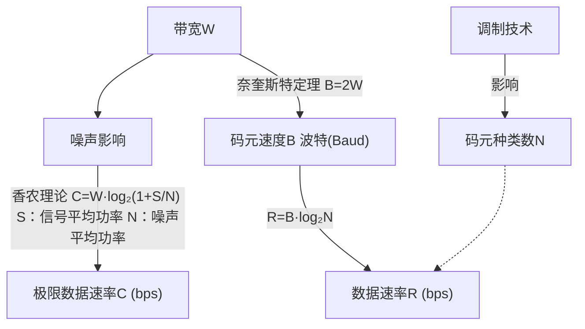
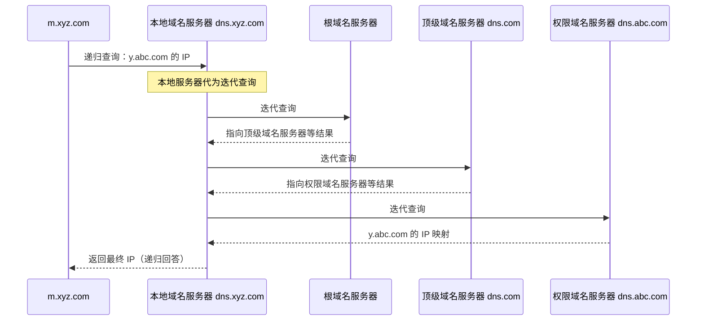

# 第四章 计算机网络

## 一、计算机网络基础

### 1. 数据通信基础

1. **（1）【模拟信道】** 带宽 W = f₂ − f₁。
2. **（2）【数字信道：离散值】** 波特率：单位时间内传递的码元数量。B = 1/T，单位 Baud。
3. **（3）奈奎斯特定理定义：** 最大码元速率 B = 2W，例如，带宽 3000 Hz，最高波特率为 6000 Baud。
4. **（4）码元携带的信息量：** 码元 k 位信息，码元种类即为其离散值 N = 2ᵏ。反过来，已知码元种类数 N，其携带的信息（位）为 k = log₂N。
5. **（5）数据速率：** 单位时间内在信道上传递的信息量（位数）。R = B · log₂N = 2W · log₂N。
6. **（6）引入噪声参数：** 信号的平均功率 S，噪声的平均功率 N，信噪比 S/N，比值太大，故取其分贝数（dB）。dB = 10 log₁₀(S/N)，例如，当 S/N = 1000 时，dB = 30 dB。
7. **（7）香农定理：** 有噪声信道的极限数据速率达不到 2W，可由以下公式计算得出：信道容量 C = W log₂(1 + S/N)。无论何种调制方式和信号离散值定义，只要给定信噪比和带宽，则单位时间内最大的信息传输量就确定了。

### 2. 数据编码

| 信道类型 | 数据类型   | 方法说明                                                                                                             |
| -------- | ---------- | -------------------------------------------------------------------------------------------------------------------- |
| 模拟信道 | 传模拟数据 | 调制方式：调幅（AM）、调频（FM）、调相（PM）等                                                                       |
| 数字信道 | 传模拟数据 | 脉码调制（PCM）过程：取样（2 倍最高频率）- 量化 - 编码                                                               |
| 模拟信道 | 传数字数据 | 调制方式：幅移键控（ASK）、频移键控（FSK）、相移键控（PSK）等                                                        |
| 数字信道 | 传数字数据 | 编码方式：归零性编码（RZ）、不归零编码（NRZ）、曼彻斯特编码（ME）、差分曼彻斯特编码（DME）、多电平编码、4B/5B 编码等 |

### 3. 差错校验

#### 差错校验方法对照

| 方法             | 校验码位数             | 校验码位置       | 检错         | 纠错     | 校验方式                                                       |
| ---------------- | ---------------------- | ---------------- | ------------ | -------- | -------------------------------------------------------------- |
| 奇偶校验         | 1                      | 一般拼接在头部   | 可检奇数位错 | 不可纠错 | 奇校验：最终 1 的个数是奇数个；偶校验：最终 1 的个数是偶数个； |
| CRC 循环冗余校验 | 生成多项式最高次幂决定 | 拼接在信息位尾部 | 可检错       | 不可纠错 | 模二除法求余数，拼接作为校验位                                 |
| 海明校验         | 2ʳ ≥ m + r + 1         | 插入在信息位中间 | 可检错       | 可纠错   | 分组奇偶校验                                                   |

**误码率：** Pₑ = Nₑ / N，Nₑ：出错的位数；N：传送的总位数。一般要求低于 10⁻⁶，即 1Mb 才允许错 1bit。

#### 3.1 奇偶校验码

- **编码方法：** 由若干位有效信息（如一个字节），再加上一个二进制位（校验位）组成校验码。
- **奇校验：** 整个校验码（有效信息位和校验位）中「1」的个数为奇数。
- **偶校验：** 整个校验码（有效信息位和校验位）中「1」的个数为偶数。
- **特点：** 可检查 1 位（奇数位）的错误，不可纠错。

#### 3.2 海明校验码

- **特点：** 可检错，也可纠错。
- **缺点：** 计算复杂。
- **校验位计算公式：** 2ʳ ≥ m + r + 1（r 为校验位数，m 为信息位数）。

#### 3.3 CRC 循环冗余校验码

CRC 校验，可检错，不可纠错。

CRC 的编码方法是：在 k 位信息位之后拼接 r 位校验位。

1. 发送方把 k 位信息位对生成多项式 G(X) 【通信前双方约定好】经过循环模二除法得到 r 位校验位。此时 k+r 位的校验码对生成多项式 G(X) 经过循环模二除法，结果为 0。
2. 接收方拿到校验码后，对生成多项式 G(X) 经过循环模二除法，结果为 0 则数据无误。否则，只要有任意个数据位错误，结果都不为 0。
3. 不同位置的数据出错，结果可能相同，所以无法纠错。

**注意：** CRC 编码和校验过程，使用的都是模二除法（不计其进位和借位，同等于异或运算）。

## 二、网络体系结构与协议

### 1. OSI/RM 七层协议

| 层次 | 名称       | 主要功能                     | 主要设备及协议                                         |
| ---- | ---------- | ---------------------------- | ------------------------------------------------------ |
| 7    | 应用层     | 实现具体的应用功能           |                                                        |
| 6    | 表示层     | 数据的格式与表达、加密、压缩 | POP3、FTP、HTTP、Telnet、SMTP、DHCP、TFTP、SNMP、DNS   |
| 5    | 会话层     | 建立、管理和终止会话         |                                                        |
| 4    | 传输层     | 端到端的连接                 | TCP、UDP                                               |
| 3    | 网络层     | 分组传输和路由选择           | 三层交换机、路由器 IP、ICMP、IGMP、ARP、RARP           |
| 2    | 数据链路层 | 传送以帧为单位的信息         | 网桥、交换机（多端口网桥）、网卡 PPP、PPTP、L2TP、SLIP |
| 1    | 物理层     | 二进制传输                   | 中继器、集线器（多端口中继器）                         |

### 2. TCP/IP 协议簇

**TCP/IP 与 OSI 分层对应**

| TCP/IP 模型 | OSI 七层模型 |
| ----------- | ------------ |
| 应用层      | 应用层       |
|             | 表示层       |
|             | 会话层       |
| 传输层      | 传输层       |
| 网际层      | 网络层       |
| 网络接口层  | 数据链路层   |
|             | 物理层       |

**应用层协议与传输层**

- 基于 **TCP**：POP3（110）、FTP（20/21）、HTTP（80）、Telnet（23）、SMTP（25）。
- 基于 **UDP**：DHCP（67）、TFTP（69）、SNMP（161）、DNS（53）。

#### 2.1 常见协议介绍

TCP 与 UDP 均支持对具体指定端口号进行通信。但连接管理、差错校验、重传等能力只有 TCP 具备。

- TCP: 可靠的传输层协议
- UDP: 不可靠的传输层协议
- DHCP: 67 端口，IP 地址自动分配
- SNMP: 161 端口，简单网络管理协议
- ICMP: 因特网控制协议，PING 命令来自该协议
- IGMP: 组播协议
- Telnet: 23 端口，远程协议。(不安全，SSH 是安全的远程协议)
- HTTP: 80 端口，超文本传输协议，网页传输
- DNS: 53 端口，域名解析协议，记录域名与 IP 的映射关系
- ARP: 地址解析协议，IP 地址转换为 MAC 地址
- RARP: 反向地址解析协议，MAC 地址转 IP 地址
- FTP: 20 数据端口/21 控制端口，文件传输协议
- POP3: 110 端口，邮件收取
- SMTP: 25 端口，邮件发送

IMAP 和 POP3 的区别是：POP3 协议允许电子邮件客户端下载服务器上的邮件，但是在客户端的操作（如移动邮件、标记已读等），不会反馈到服务器上，比如通过客户端收取了邮箱中的 3 封邮件并移动到其它文件夹，邮箱服务器上的这些邮件是没有同时被移动的。而 IMAP 客户端的操作都会反馈到服务器上，对邮件进行的操作，服务器上的邮件也会做相应的动作。

MIME 是多用途互联网邮件扩展标准，与邮件安全无关。MIME/S 与邮件安全相关。

#### 2.2 IP 报文

IP 报文首部由以下部分组成：

1. 版本号、服务类型、段总长度、标识符、标志、段偏移值、首部校验。
2. 首部长度 IHL：IP 头长度，以 32 位字（4 字节）计数，最小为 5，即 20 字节。
3. 生存期（避免无限转发）。
4. 源 IP、目标 IP、上层协议（TCP 或 UDP）。
5. 任选数据：首部 0~40 字节可变长任选数据。
6. 补丁：补齐 32 位边界。
7. 用户数据：和 IP 头加在一起长度不超过 65535 字节。

#### 2.3 DNS

**域名解析过程示意**（客户端查询 **y.abc.com**；① 为递归查询；②—⑦ 为本地域名服务器对外进行的迭代查询；⑧ 为将解析结果返回客户端）

**（1）查询方式**

- **递归查询：** 服务器必须回答目标 IP 与域名的映射关系。
- **迭代查询：** 服务器收到一次迭代查询回复一次结果，这个结果不一定是目标 IP 与域名的映射关系，也可以是其它 DNS 服务器的地址。

**（2）在 Linux 系统中，DNS 配置文件 resolv.conf 的关键字主要有四个，分别是：**

- **nameserver：** 定义 DNS 服务器的 IP 地址
- **domain：** 定义本地域名
- **search：** 定义域名的搜索列表
- **sortlist：** 对返回的域名进行排序

## 三、网络地址

### 3.1 IPv4

| 网络号 | 主机号（非全 0 和非全 1） |
| --- | --- |

**例：** 某公司网络地址为 **192.168.192.0/20**。

- IP 地址（二进制）：`1100 0000. 1010 1000. 1100 0000. 0000 0000`
- 子网掩码（二进制）：`1111 1111. 1111 1111. 1111 0000. 0000 0000`（前 20 位为 1，后 12 位为 0）
- 点分十进制掩码：**255.255.240.0**

**划分需求：** 将上述网络划分为 **32** 个子网。

从主机号的高位取出 **5** 位作为子网号，共有 **2⁵ = 32** 种划分。

划分后网络号长度为 **25** 位（20 + 5）。

新的子网掩码（二进制）：`1111 1111. 1111 1111. 1111 1111. 1000 0000`（前 25 位为 1，后 7 位为 0）

点分十进制掩码：**255.255.255.128**

每个子网可分配的主机地址数为 **2⁷ − 2 = 126**。

**说明：** 在每个子网中，主机号为全 0 或全 1 的地址不能使用，故减去 2。

**特殊 IP 地址**

| IP | 说明 |
| --- | --- |
| 127 网段 | 回播地址，本地环回地址 |
| 主机号非全 0 和非全 1 | 可作为子网中的主机号使用 |
| 主机号全 0 地址 | 代表这个网络本身，可作为子网地址使用 |
| 主机号全 1 地址 | 特定子网的广播地址 |
| 169.254.0.0 | 保留地址，用于 DHCP 失效（Win） |
| 0.0.0.0 | 保留地址，用于 DHCP 失效（Linux） |

### 3.2 IPv6

#### 3.2.1 IPv6 的优势

与 IPv4 相比，IPv6 具有以下优势：

1. **地址空间更大：** IPv4 地址长度为 32 位，IPv6 地址长度为 128 位。
2. **路由表更小：** IPv6 地址分配一开始就遵循聚类（路由聚合）的原则。这使得路由器可以用一条记录表示一个子网，大大减小了路由器中路由表的长度，提高了路由器转发数据包的速度。
3. **增强对组播与流的支持：** IPv6 增强了对组播与流的支持，为多媒体应用与服务质量（QoS）控制提供了更好的平台。
4. **支持自动配置：** IPv6 包含对自动配置的支持，这是对 DHCP 协议的改进与扩展，使网络（尤其是局域网）的管理更加方便、快捷。
5. **安全性更高：** 在使用 IPv6 网络时，用户可以在网络层对数据加密，并对 IP 报文进行校验，从而大大提高网络安全性。

#### 3.2.2 IPv6 地址前缀

IPv6 规定每张网卡至少有 3 个 IPv6 地址：链路本地地址、全球单播地址和环回地址（站点本地地址）。

1. **多播：** 前缀为 `11111111`。
2. **任播：** 固定前缀，其余位为 0。
3. **单播：**
   - **可聚合全球单播地址：** 前缀为 `001`。
   - **本地单播地址：**
     - **链路本地：** 前缀为 `1111111010`（一般以 `fe80` 开头）。
     - **站点本地：** 前缀为 `1111111011`。

#### 3.2.3 IPv6 的地址类型

1. **单播地址：** 单个接口的标识符，用于传统的点对点通信。
2. **组播地址：** 一对多通信的地址，报文会交付给组内每一台计算机。IPv6 不使用「广播」一词，而是将广播视为组播的一种特殊情况。
3. **任播地址：** 一种洪泛地址，是 IPv6 中新增的类型。目的为一组计算机，但报文只交付给其中一台，通常是距离最近的一台。

#### 3.2.4 IPv6 地址的构成

1. IPv6 地址采用冒号十六进制记法，由 8 个 16 位段组成。例如：`2001:0db8:85a3:0000:1319:8a2e:0370:7344`
2. IPv6 地址的缩写：上述 IP 地址等价于：`2001:db8:85a3::1319:8a2e:0370:7344`
3. **缩写规则：**
   - 每一段的前导零可以省略（可多次省略）。
   - 一段全为 0 可以只写一个 `0`（可多次）。
   - 连续多段全 0 可以省略，用 `::` 代替（**只能使用一次**）。

### 3.3 过渡技术

| 技术 | 描述 | 特点 |
| --- | --- | --- |
| 隧道技术 | 隧道技术通过在 IPv4 网络中部署隧道，实现在 IPv4 网络上对 IPv6 业务的承载，保证业务的共存和过渡。隧道技术包括：6to4 隧道；6over4 隧道；ISATAP 隧道。 | IPv6 节点之间通过 IPv4 网络进行通信 |
| 双协议栈技术 | 双栈技术通过节点对 IPv4 和 IPv6 双协议栈的支持，从而支持两种业务的共存。 | IPv4 和 IPv6 共存于同一设备和同一网络 |
| NAT-PT 技术 | NAT-PT 使用网关设备连接 IPv6 和 IPv4 网络。当 IPv4 和 IPv6 节点互相访问时，NAT-PT 网关实现两种协议的转换翻译和地址的映射。 | 纯 IPv6 和纯 IPv4 节点之间可以通信 |

## 四、局域网和广域网

### 1. 有线接入

- 公用交换电话网络（PSTN）
- 数字数据网（DDN）
- 综合业务数字网（ISDN）
- 非对称数字用户线路（ADSL）
- 同轴光纤技术（HFC）

### 2. 无线接入

- WiFi（IEEE 802.11）
- 蓝牙 Bluetooth（IEEE 802.15）
- 红外（IrDA）
- WAPI

**注：** 覆盖范围最小的是蓝牙。

### 3. 网络划分

| 标准网络 | 无线网对应 |
| --- | --- |
| 局域网（LAN） | 无线个人网（WPAN，802.15，Bluetooth） |
| 城域网（MAN） | 无线局域网（WLAN，802.11，Wi-Fi） |
| 广域网（WAN） | 无线城域网（WMAN，802.16，WiMax） |
| 因特网（Internet） | 无线广域网（WWAN，3G/4G） |

### 4. 局域网

#### 4.1 概念：

局域网是指在有限地理范围内将若干计算机通过传输介质互联成的计算机组（即通信网络），通过网络软件实现计算机之间的文件管理、应用软件共享、打印机共享、工作组内的日程安排、电子邮件和传真通信服务等功能。局域网是封闭型的。

#### 4.2 局域网拓扑结构

局域网专用性非常强，具有比较稳定和规范的拓扑结构。常见的局域网拓扑结构有星状结构、树状结构、总线结构、环形结构和网状结构。

## 五、网络工程

#### 1. 网络工程

按照实施过程的先后，网络工程可分为网络规划、网络设计和网络实施 3 个阶段。

**1.1 网络规划**

（1）网络需求分析

功能需求；通信需求；性能需求；可靠性需求；安全需求；运行与维护需求；管理需求

（2）可行性研究

（3）对现有网络的分析与描述

**1.2 网络设计**

（1）网络设计的任务：确定网络总体目标；确定总体设计原则；通信子网设计；资源子网设计；设备选型；网络操作系统与服务器资源设备选择；网络安全设计

（2）分层设计（层次化网络设计）

- **核心层：** 主要是高速数据交换，实现高速数据传输、出口路由，常用冗余机制。
- **汇聚层：** 网络访问策略控制、数据包处理和过滤、策略路由、广播域定义、寻址。
- **接入层：** 主要是针对用户端，实现用户接入、计费管理、MAC 地址认证、MAC 地址过滤、收集用户信息。

**1.3 网络实施**

工程实施计划；网络设备到货验收；设备安装；系统测试；系统试运行；用户培训。

#### 2. 综合布线系统

工作区子系统由信息插座、插座盒、连接跳线和适配器组成。

**水平子系统：** 水平子系统由一个工作区的信息插座开始，经水平布置到管理区的内侧配线架的线缆所组成。

**管理子系统：** 管理子系统由交连、互连配线架组成。管理子系统为连接其它子系统提供连接手段。

**垂直干线子系统：** 垂直干线子系统由建筑物内所有的垂直干线多对数电缆及相关支撑硬件组成，以提供设备间总配线架与干线接线间楼层配线架之间的干线路由。

**设备间子系统：** 设备间子系统是由设备间中的电缆、连接器和有关的支撑硬件组成，作用是将计算机、PBX、摄像头、监视器等弱电设备互连起来并连接到主配线架上。

**建筑群子系统：** 建筑群子系统将一个建筑物的电缆延伸到建筑群的另外一些建筑物中的通信设备和装置上，是结构化布线系统的一部分，支持提供楼群之间通信所需的硬件。它由电缆、光缆和入楼处的过流过压电气保护设备等相关硬件组成，常用介质是光缆。

