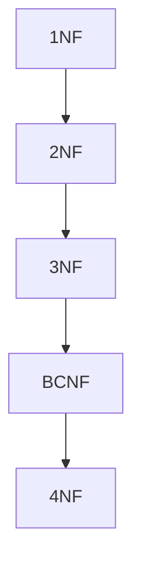
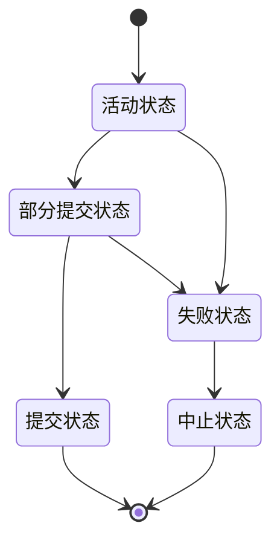
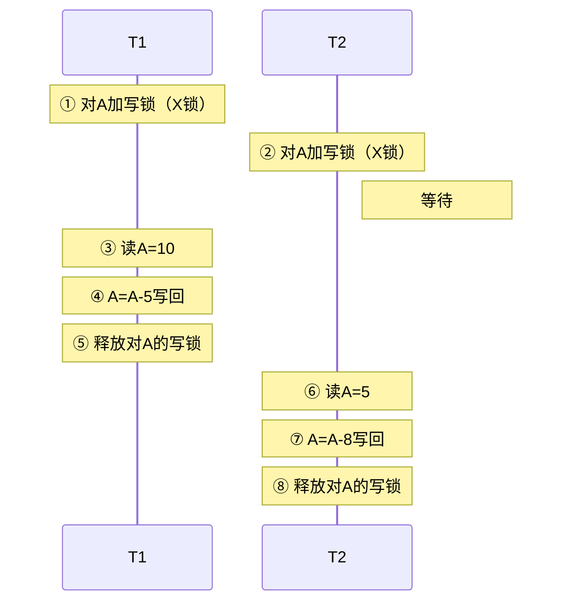
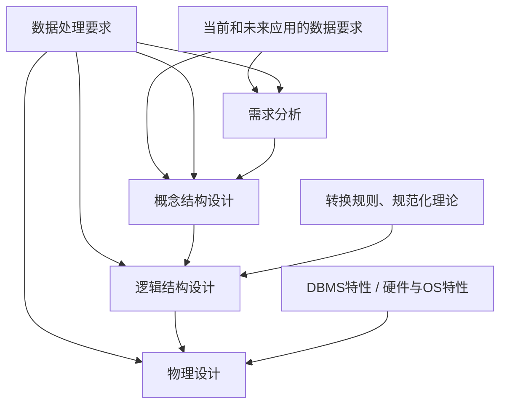
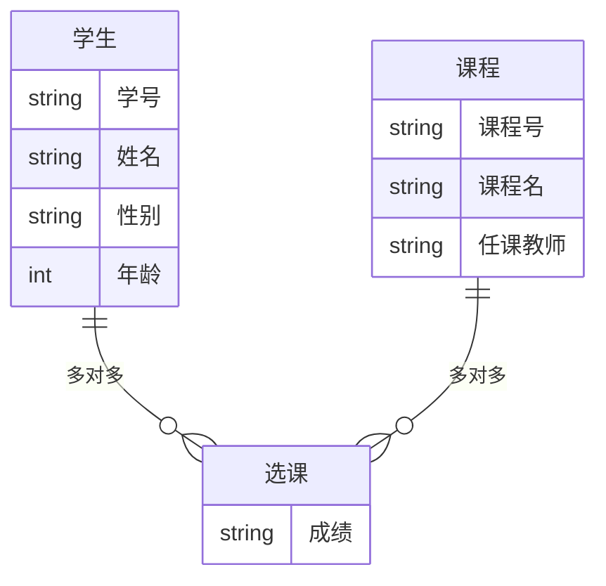
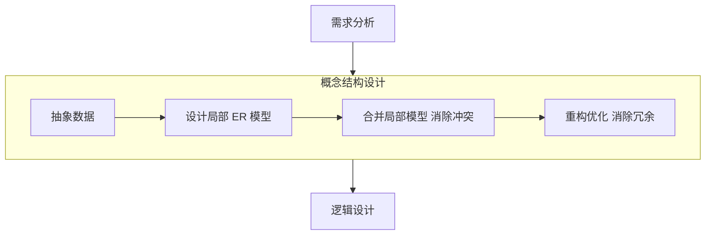
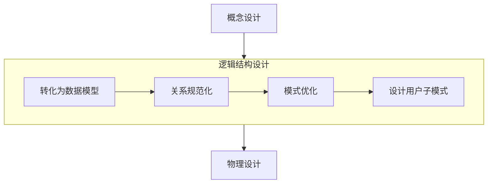
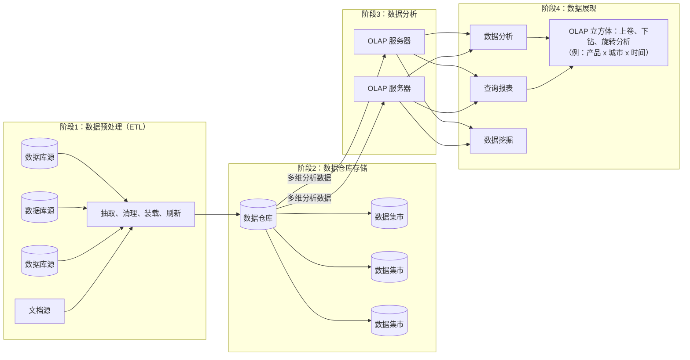

# 第五章 数据库系统

## 一、数据库管理系统

### 1. 三级模式和两级映像

```

用户级数据库
                    ┌─────────┐          ┌─────────┐
      用户 ────────→│ 外模式A  │          │ 外模式B  │←──── 用户
                    └───┬─────┘          └───┬───┘←──── 用户
                        └────────┬───────────┘
                                 ▼
用户视图                   ╭──────────────────────────╮                    外模式
─────────────────────────│   外模式-概念模式映射       │─────────────────────────
概念级数据库               ╰────────────┬─────────────╯
                                      ▼
                          ┌──────────────────────┐
                          │       概念模式        │
                          └──────────┬───────────┘
                                     ▼
 DBA视图                  ╭──────────────────────────╮                  概念模式
─────────────────────────│   概念模式-内模式映射       │─────────────────────────
 物理级数据库              ╰────────────┬─────────────╯
                                      ▼
                          ┌──────────────────────┐
                          │        内模式         │
                          └──────────┬───────────┘
内部视图                              ▼                                    内模式
════════════════════════════════════════════════════════════════════════════════
══════════════════════════════   操作系统   ═════════════════════════════════════
════════════════════════════════════════════════════════════════════════════════
                                   ▼
                          .─────────────.
                         ╱               ╲
                        │   物理数据库     │
                         ╲               ╱
                          `─────────────'
```

1. **（1）三级模式：** 外模式对应视图，模式（也称为概念模式）对应数据库表，内模式对应物理文件。
2. **（2）两层映像：** 外模式-模式映像，模式-内模式映像；两层映像可以保证数据库中的数据具有较高的逻辑独立性和物理独立性。
3. **（3）逻辑独立性：** 数据的逻辑结构发生变化后，用户程序也可以不修改。但是为了保证应用程序能够正确执行，需要修改外模式和概念模式之间的映像。
4. **（4）物理独立性：** 当数据的物理结构发生改变时，应用程序不用改变。但是为了保证应用程序能够正确执行，需要修改概念模式和内模式之间的映像。

## 二、关系数据库

### 1. 数据模型

#### 1.1 数据模型三要素

- 数据结构、数据操作、数据的约束条件。

#### 1.2 数据模型分类

- 层次模型；网状模型；面向对象模型；关系模型。

#### 1.3 关系模型

#### 1.3.1 关系模型相关概念

➢ **目或度：** 关系模式中属性的个数

➢ **候选码（候选键）**

➢ **主码（主键）**

➢ **主属性与非主属性：** 组成候选码的属性就是主属性，其它的就是非主属性

➢ **外码（外键）**

➢ **全码（ALL-Key）：** 关系模式的所有属性组是这个关系的候选码

➢ **简单属性与复合属性、派生属性、多值属性**

#### 1.3.2 候选键、主键、外键之间的关系

```
────────────────────────────────────────────────────────────────────────────────
┌──────────┐          ┌────────────────────────────────┐
│  候选键   │──────────│ 唯一标识元组，且无冗余          │
└────┬─────┘          └────────────────────────────────┘
     │
     ▼
────────────────────────────────────────────────────────────────────────────────
┌──────────┐          ┌────────────────────────────────┐
│  主键    │──────────│ 任选一个                        │
└──────────┘          └────────────────────────────────┘
────────────────────────────────────────────────────────────────────────────────
┌──────────┐          ┌────────────────────────────────┐
│  外键    │──────────│ 其他关系的主键                  │
└──────────┘          └────────────────────────────────┘
────────────────────────────────────────────────────────────────────────────────
```

#### 1.3.3 关系代数

1. **并：** 结果为二者元组之和去除重复行
2. **交：** 结果为二者重复行
3. **差：** （前者去除二者重复行）：以元组行作为整体进行判断，类似于集合运算
4. **笛卡尔积：** 结果列数为二者属性列数之和，行数为二者元组行数的乘积。两个表做笛卡尔积，结果表的元组由前表与后表的元组拼接而成，不同的排列组合形成不同的结果元组
5. **投影：** 筛选符合条件的属性列
6. **选择：** 筛选符合条件的元组：属性名可以依次标序号，直接以数字形式出现在表达式中
7. **自然连接：** 结果列数为二者属性列数之和减去重复列，行数为二者同名属性列其值相同的结果元组。笛卡尔积、选择、投影的组合表示可以与自然连接等价

**注：** 普通连接的条件会写出，没有写出则表示为自然连接

#### 1.3.4 规范化理论

##### 1.3.4.1 函数依赖判断

```
┌──────────────────────────────────────────────────────────────────────────────┐
│ 部分函数依赖                                                                  │
│                                                                               │
│ 关系模式：R1(A, B, C, D)                                                      │
│ 依赖集1：{AB → D, A → C}                                                      │
│                                                                               │
│                                    部分函数依赖                                │
│                         (A) ─────────────────→ (C)                          │
│                          │╲                                                 │
│                          │ ╲                                                │
│                          │  ╲──────────────────────→ (D)                    │
│                         (B) ──────────────────────────↑                     │
├──────────────────────────────────────────────────────────────────────────────┤
│ 传递函数依赖                                                                  │
│                                                                               │
│ 关系模式：R2(A, B, C)                                                         │
│ 依赖集2：{A → B, B → C}                                                       │
│                                                                               │
│                                    传递函数依赖                                │
│                         (A) ──→ (B) ──→ (C)                                 │
│                          ╲                   ▲                                │
│                           ╲······· × ·······╱                                  │
│                                                                               │
│ 由：A → B, B → C, 可得出 A → C。此为传递函数依赖                               │
└──────────────────────────────────────────────────────────────────────────────┘
```

##### 1.3.4.2 Armstrong 公理

对关系模式 R⟨U, F⟩，有如下公理：

- **A1. 自反律：** 若 Y ⊆ X ⊆ U，则 X → Y 成立。
- **A2. 增广律：** 若 Z ⊆ U 且 X → Y，则 XZ → YZ 成立。
- **A3. 传递律：** 若 X → Y 且 Y → Z，则 X → Z 成立。

由上述公理可得到以下推理规则：

- **合并规则：** 由 X → Y、X → Z，有 X → YZ。（A2，A3）
- **伪传递规则：** 由 X → Y、WY → Z，有 XW → Z。（A2，A3）
- **分解规则：** 由 X → Y 及 Z ⊆ Y，有 X → Z。（A1，A3）

##### 1.3.4.3 键与属性

- **候选键（候选码）：** 候选键（候选码）是能够唯一标识元组却无冗余的属性组合，可以有多种不同的候选键，在其中任选一个作为主键。
- **主属性与非主属性：** 组成候选码的属性就是主属性，其它的就是非主属性。
- **外键：** 外键是其它关系模式的主键。

**【解题技巧：判断主键和外键】**

1. **找主键：** 使用图示法找候选键，在候选键中任选一个作为主键。

- 将关系模式的函数依赖关系用“有向图”的方式表示。
- 找入度为 0 的属性（对于入度为 0 在关系依赖集中可以理解为从未在箭头右侧出现），并以该属性集合为起点，尝试遍历有向图，若能正常遍历图中所有节点，则该属性集即为关系模式的候选键。
- 若入度为 0 的属性集不能遍历图中所有节点，则需要尝试性地将一些中间节点（既有入度，也有出度的节点）并入入度为 0 的属性集中，直至该集合能遍历所有节点，集合为候选键。

2. **找外键：** 外键是其它关系模式的主键。

##### 1.3.4.4 范式

**（1）非规范化存在的问题**

规范化用于解决数据冗余、删除异常、插入异常、更新异常等问题。

- **数据冗余：** 过多的重复存储数据，浪费空间。
- **更新异常：** 修改操作不一致。若处理不当，会出现部分数据已更新、部分数据未更新，从而造成数据不一致。
- **插入异常：** 在未提供主键的情况下发生；若主键为空，则无法完成插入。
- **删除异常：** 删除部分信息会导致整条记录被删除，使原有数据无法恢复。

**（2）规范化定义**

- **第一范式（1NF）：** 在关系 R 中，当且仅当所有域都只包含原子值（每个属性都是不可再分的数据项）。
- **第二范式（2NF）：** 若 R 属于 1NF，且每个非主属性都完全函数依赖于候选键（不存在部分函数依赖）。
- **第三范式（3NF）：** 若 R 属于 2NF，且不存在非主属性对候选键的传递函数依赖。
- **BC 范式（BCNF）：** 给定关系 R 与依赖集 F，R 属于 BCNF 当且仅当 F 中每一个函数依赖的决定因素都包含 R 的一个候选键。

**注：** 第四范式（4NF）对「不是函数依赖的非平凡多值依赖」加以限制。



##### 1.3.4.5 模式分解

**（1）无损分解**

指将关系分解为若干子关系，使得通过自然连接、投影等运算仍能把原关系还原出来。

**【公式法】**

**定理：** 若 R 的分解为 p={R1, R2}，F 为函数依赖集，则分解具有无损连接性的充要条件为：

R1∩R2 → (R1-R2) **或** R1∩R2 → (R2-R1)

**（2）保持函数依赖**

设数据库模式 p={R1, R2, …, Rk} 为 R 的一个分解，F 为 R 上的函数依赖集；Fi 为各子模式 Ri 上的函数依赖集。若 F1∪F2∪…∪Fk 与 F 等价（二者相互逻辑蕴涵），则称分解 p 保持函数依赖。

---

## 三、数据控制

### 1. 数据控制功能

1. **安全性**
2. **完整性**
3. **并发控制**
4. **故障恢复**

### 2. 数据安全性控制

安全性是指保护数据库免受恶意存取，防止因非法使用而导致的数据泄露、修改或破坏；应强调用户只能按照规定的权限处理数据（例如只读权限与修改权限的区分）。

| 措施           | 说明                                                                                                                  |
| -------------- | --------------------------------------------------------------------------------------------------------------------- |
| 用户标识和鉴定 | 最外层的安全保护措施，可以使用用户账户、口令及随机校验等方式                                                          |
| 存取控制       | 对用户进行授权，包括操作类型（如查找、插入、删除、修改等动作）和数据对象（主要是数据范围）的权限。（Grant 和 Revoke） |
| 密码存储和传输 | 对远程终端信息用密码传输                                                                                              |
| 视图的保护     | 对视图进行授权                                                                                                        |
| 审计           | 使用一个专用文件或数据库，自动将用户对数据库的所有操作记录下来                                                        |

### 3. 数据完整性控制

完整性是指数据库的正确性与相容性，防止合法用户向数据库加入语义不正确的数据，保证数据是正确的，避免非法更新。

- **实体完整性约束：** 规定基本关系的主属性不能取空值。
- **参照完整性约束：** 关系之间的引用；必须是另一关系的主键或空值。
- **用户自定义完整性约束：** 由应用环境决定。

### 4. 并发控制

#### 4.1 概念

并发控制是指在多用户共享系统中，许多用户可能同时对同一数据进行操作的情况；DBMS 的并发控制子系统负责协调并发事务的执行，保证数据库的完整性，并避免用户得到不正确的数据。

#### 4.2 事务的执行状态

在数据库系统中，事务的执行状态一般分为五种类型。

**事务的状态**

1. **活动状态：** 事务正在执行时的状态。
2. **部分提交状态：** 事务中最后一条语句执行完毕之后所处的状态。
3. **失败状态：** 事务无法继续正常执行时的状态。
4. **提交状态：** 部分提交之后数据写入磁盘；当最后一部分信息写完时进入提交状态，事务成功结束。
5. **中止状态：** 事务回滚之后，数据库已恢复到事务开始之前的状态。



#### 4.3 事务的特性（ACID）

- **原子性：** 事务中的全部操作要么都成功，要么都失败并回滚；这些操作是一个整体，不能部分完成。
- **一致性：** 事务必须使数据库从一个一致状态转变到另一个一致状态；执行前后数据库都必须处于一致状态。
- **隔离性：** 一个事务的执行不能被其它事务干扰；事务内的操作和数据与并发事务相隔离。
- **持久性（永久性）：** 事务一旦提交，对数据的更改就是永久的，不应受任何故障的影响。

#### 4.4 并发产生的问题

**问题 1：丢失更新**

| 时间/步骤 | T1        | T2        |
| --------- | --------- | --------- |
| ①         | 读A=10    |           |
| ②         |           | 读A=10    |
| ③         | A=A-5写回 |           |
| ④         |           | A=A-8写回 |

**问题 2：不可重复读**

| 时间/步骤 | T1                                   | T2                     |
| --------- | ------------------------------------ | ---------------------- |
| ①         | 读A=20, 读B=30, 求和=50              |                        |
| ②         |                                      | 读A=20, A←A+50, 写A=70 |
| ③         | 读A=70, 读B=30, 求和=100（验算不对） |                        |

**问题 3：读“脏”数据**

| 时间/步骤 | T1                     | T2     |
| --------- | ---------------------- | ------ |
| ①         | 读A=20, A←A+50, 写回70 |        |
| ②         |                        | 读A=70 |
| ③         | ROLLBACK，A恢复为20    |        |

#### 4.5 封锁协议

**（1）S 封锁（S-lock）**

**共享锁（读锁）：** 若事务 T 对数据对象 A 加 S 锁，则在 T 释放 A 上的 S 锁之前，其它事务只能再对 A 加 S 锁，不能加 X 锁。

**（2）X 封锁（X-lock）**

**排他锁（写锁）：** 若事务 T 对数据对象 A 加 X 锁，则在 T 释放 A 上的 X 锁之前，其它事务不能对 A 加任何锁。

**（3）一级封锁协议**

事务 T 在修改数据 R 之前必须先对其加 X 锁，直到事务结束才释放。可防止丢失修改。

| 步骤 | 事务 T1            | 事务 T2            |
| ---- | ------------------ | ------------------ |
| 1    | ① 对A加写锁（X锁） |                    |
| 2    |                    | ② 对A加写锁（X锁） |
| 3    | ③ 读A=10           | **等待**           |
| 4    | ④ A=A-5写回        | **等待**           |
| 5    | ⑤ 释放对A的写锁    | **等待**           |
| 6    |                    | ⑥ 读A=5            |
| 7    |                    | ⑦ A=A-8写回        |
| 8    |                    | ⑧ 释放对A的写锁    |



**（4）二级封锁协议**

一级封锁协议加上事务 T 在读取数据 R 之前先对其加 S 锁，读完后即可释放 S 锁。可防止丢失修改，还可防止读“脏”数据。

| 步骤 | 事务 T1            | 事务 T2                   |
| ---- | ------------------ | ------------------------- |
| 1    | ① 对A加写锁（X锁） |                           |
| 2    | ② 读A=20           |                           |
| 3    | ③ A←A+50           |                           |
| 4    | ④ 写回70           | ⑤ 对A加读锁（S锁）        |
| 5    |                    | **等待**                  |
| 6    | ⑥ ROLLBACK         | **等待**                  |
| 7    | ⑦ A恢复为20        | **等待**                  |
| 8    |                    | ⑧ 读A=20；⑨ 释放对A的读锁 |

**（5）三级封锁协议**

一级封锁协议加上事务 T 在读取数据 R 之前先对其加 S 锁，直到事务结束才释放。可防止丢失修改、防止读“脏”数据与防止数据（不可）重复读。

| 步骤 | 事务 T1                                        | 事务 T2                                           |
| ---- | ---------------------------------------------- | ------------------------------------------------- |
| 1    | ① 对A与B加S锁（读锁），读A=20，读B=30，求和=50 |                                                   |
| 2    |                                                | ② 对A加X锁（写锁），注：由于A已加了读锁，所以等待 |
| 3    | ③ 读A=20，读B=30，求和=50，释放对A和B的读锁    | **等待**（持续到T1释放锁）                        |
| 4    |                                                | ④ 读A=20，⑤ A←A+50，⑥ 写A=70，⑦ 释放对A的写锁     |

**（6）两段锁协议（2PL）**

可串行化的。可能发生死锁。

### 5. 故障恢复

数据库的四种故障为：事务内部的故障、系统故障、介质故障与计算机病毒。恢复是指在故障导致数据库不一致之后，将数据库恢复到某一已知的正确状态或一致状态。恢复的基本原理十分简单，就是建立冗余数据。

**（1）冷备份与热备份**

- **冷备份：** 也称静态备份，是指在数据库正常关闭的情况下，备份所有数据库文件。
- **热备份：** 也称动态备份，是指利用备份软件，在数据库正常运行时备份数据文件。

**（2）按备份的数据量情况，可以分为**

- **完全备份：** 备份全部数据。
- **差量备份：** 仅备份自上次完全备份以来发生变化的数据。
- **增量备份：** 仅备份自上一次备份（不论何种类型）以来发生变化的数据。


**（3）日志文件**

事务日志是记录对数据库更新操作的文件，可记录对数据库的任何操作，并将结果保存在独立的文件中。

**（4）数据库故障与恢复**

| 故障关系               | 故障原因               | 解决方法                                                               |
| ---------------------- | ---------------------- | ---------------------------------------------------------------------- |
| 事务本身的可预期故障   | 本身逻辑               | 在程序中预先设置 Rollback 语句                                         |
| 事务本身的不可预期故障 | 算术溢出、违反存储保护 | 由 DBMS 的恢复子系统通过日志，撤销事务对数据库的修改，回到事务初始状态 |
| 系统故障               | 系统停止运转           | 通常使用检查点法                                                       |
| 介质故障               | 外存被破坏             | 一般使用日志重做业务                                                   |

- **撤销事务（UNDO）：** 对故障发生时尚未完成的事务，予以撤销。
- **重做事务（REDO）：** 对故障发生前已提交的事务，予以重做。

## 四、数据库性能优化

### 1. 集中式与分布式数据库优化

**集中式数据库优化**

- **硬件系统：** CPU、内存、I/O（硬盘、阵列）、网络。
- **系统软件：** 参数，如进程优先级，CPU使用权，内存使用。
- **数据库设计：**
  - 分区、分表、分库
  - 物化视图
  - **索引：** 常查询-建索引，常修改-避免索引
  - **SQL优化：**
    1. 以不相关子查询替代相关子查询
    2. 只检索需要的列
    3. 用带IN的条件子句等价替换OR子句
    4. 经常提交COMMIT，以尽早释放锁
    5. 尽可能减少多表查询
- **应用软件：** 数据库连接池

**分布式数据库优化**

- **通信代价：**
  1. 全局查询树的变换
  2. 多副本策略
  3. 查询树的分解
  4. 半连接与直接连接

## 五、数据库设计与建模

### 1. 数据库设计概述

**阶段递进：** 设计活动按 **需求分析 → 概念结构设计 → 逻辑结构设计 → 物理设计** 顺序推进；通常上一阶段的成果作为下一阶段的输入之一，形成自顶向下的细化链。

**数据要求的作用：** 「当前和未来应用的数据要求」同时作用于 **需求分析** 与 **概念结构设计**，使「要存什么、业务边界是什么」在需求与概念两层保持一致。

**数据处理要求的作用：** 「数据处理要求」贯穿各阶段，表示在每一步都要回答「数据如何被处理、被约束」，与阶段成果一起进入后续设计。

**需求分析阶段：** 产出 **数据流图**、**数据字典**、**需求说明书**（教材图中多以虚线表示相对独立的文档/模型产物）。

**概念结构阶段：** 产出 **ER模型**；转入逻辑结构前，强调 **用户的数据模型 (即与DBMS无关的概念模型)**，即先在「与具体数据库产品无关」的抽象层定型，再进入可实现、可规范化的逻辑层。

**逻辑结构阶段：** 在 **转换规则、规范化理论** 指导下，把概念结果落实为 **关系模式**；在进入物理设计前，形成 **视图、完整性约束及应用处理说明书**，把应用侧规则与约束交代清楚，供物理实现与运维衔接。

**物理设计阶段：** 在 **DBMS特性** 与 **硬件、OS特性** 等运行环境约束下，把逻辑方案落到存储、访问与部署层面；**数据处理要求** 仍参与本阶段，使实现层不偏离既定的处理语义。



### 2. E-R 模型



### 3. 概念结构设计



#### 3.1 集成的方法

- 多个局部 E-R 图一次集成；
- 逐步集成，用累加的方式一次集成两个局部 E-R。

#### 3.2 集成产生的冲突及解决办法

- **属性冲突：** 包括属性域冲突和属性取值冲突。
- **命名冲突：** 包括同名异义和异名同义。
- **结构冲突：** 包括同一对象在不同应用中具有不同的抽象，以及同一实体在不同局部 E-R 图中所包含的属性个数和属性排列次序不完全相同。

#### 3.3 两个不同实体集之间联系

- 一对一 (1 : 1)
- 一对多 (1 : n)
- 多对多 (m : n)

### 4. 逻辑结构设计



**（1）E-R 图向关系模式的转换：**

- 实体向关系模式的转换
- 联系向关系模式的转换

**（2）关系模式的规范化**

**（3）确定完整性约束（保证数据的正确性）**

**（4）用户视图的确定（提高数据的安全性和独立性）**

- 根据数据流图确定处理过程使用的视图
- 根据用户类别确定不同用户使用的视图

**（5）应用程序设计**

## 六、分布式数据库

### 1. 分布式数据库特点

- **数据独立性。** 除了数据的逻辑独立性与物理独立性外，还有数据分布独立性（分布透明性）。
- **控制结构。** 集中式与自治相结合：各场地局部 DBMS 可独立管理本地数据库（自治），同时由集中协调机制为全局应用进行协调。
- **数据冗余。** 适当增加冗余（在不同场地存放副本）有利于提高系统的可靠性、可用性与性能；当某一结点发生故障时，仍可从其他场地获得数据，有利于保证数据的完整性。
- **全局性质。** 强调全局一致性、可串行性与可恢复性。

### 2. 透明性分类

| 透明性分类                   | 核心                                                                                   |
| ---------------------------- | -------------------------------------------------------------------------------------- |
| **分片透明**                 | 用户不必关心数据是否分片以及如何分片（水平分片：按记录；垂直分片：按字段；混合分片）。 |
| **位置透明**                 | 用户不必关心数据物理存放在何处。                                                       |
| **复制透明**                 | 用户不必关心各场地数据的复制及同步更新。                                               |
| **逻辑透明【局部映像透明】** | 用户不必关心本地 DBMS 支持何种数据模型或语言。                                         |

数据分片应遵循三条原则：**完整性**、**重构性**、**不相交性**。

### 3. 两阶段提交协议（2PC）

**（1）事务提交的两个阶段**

1. **表决阶段：** 目标是形成一致决议。
2. **执行阶段：** 目标是落实协调者的决议。

**（2）两条全局提交规则**

- 只要 **有一个** 参与者撤销事务，协调者必须做出 **全局撤销** 决定。
- 仅当 **全体** 参与者同意提交时，协调者方可做出 **全局提交** 决定。

**（3）2PC 中参与者进程的故障恢复**

- **写入「建议提交」之前发生故障：** 恢复后，该参与者可 **自行终止** 该事务，无须从其它场地获得信息。
- **写入「建议提交」之后发生故障：** 恢复后，该参与者 **必须** 向协调者或其他参与者了解最终决议，再执行相应的 **提交** 或 **撤销** 动作。

---

## 七、数据库和数据仓库技术

### 1. 数据库和数据仓库对比

| 维度         | 数据库                 | 数据仓库【特点】                                                |
| ------------ | ---------------------- | --------------------------------------------------------------- |
| **面向应用** | 按应用组织数据         | **面向主题：** 按主题组织数据                                   |
| **零散的**   | 一个应用对应一个数据库 | **集成的：** 整个企业对应一个数据仓库                           |
| **增删改查** | 增删改查是常态         | **相对稳定的（非易失的）：** 查询为主，基本无修改与删除         |
| **解决问题** | 解决当下应用问题       | **反映历史变化（时变的）：** 各个阶段信息都有，并可预测未来趋势 |

### 2. 数据仓库体系流程

**阶段1：数据预处理（ETL）** — 从各类文档与数据库等数据源，经 **抽取、清洗、装载、转换** 进入中央 **数据仓库**。

**阶段2：数据仓库存储** — 数据仓库向 **数据集市** 提供数据，由 **OLAP 服务器** 管理。

**阶段3：数据分析** — OLAP 服务器为 **查询工具**、**分析工具**、**数据挖掘** 等提供分析数据。

**阶段4：数据展现** — 以 **OLAP 立方体**（如产品、地区、时间等维度）做多维展示；支持 **上卷、下钻和旋转** 等分析，并借助多维知识开展评价与预测。



### 3. OLTP 与 OLAP 对比

| 维度         | OLTP                                   | OLAP                                   |
| ------------ | -------------------------------------- | -------------------------------------- |
| **用户**     | 操作人员、低层管理                     | 决策者、高层管理                       |
| **功能**     | 日常事务处理                           | 分析决策                               |
| **DB 设计**  | 面向应用                               | 面向主题                               |
| **数据**     | 当前的、最新的、细节的、二维的、分立的 | 历史的、聚集的、多维的、集成的、统一的 |
| **存取**     | 读/写数十条记录                        | 读上百万条记录                         |
| **工作单位** | 简单的事务                             | 复杂的查询                             |
| **用户数**   | 多                                     | 少                                     |
| **DB 大小**  | MB 或 GB 级                            | GB 或 TB 级                            |

### 4. 数据仓库扩展——数据湖

**（1）定义：** 数据湖是一个存储企业的各种各样原始数据的大型仓库，其中的数据可供存取、处理、分析及传输。

**（2）数据仓库与数据湖的差别：** 数据仓库仅支持数据分析处理。数据湖既支持数据分析处理，也支持事务处理。

| 维度         | 数据仓库                                                               | 数据湖                                                                 |
| ------------ | ---------------------------------------------------------------------- | ---------------------------------------------------------------------- |
| **数据**     | 清洗过的数据；结构化的数据                                             | 原始数据；结构化、半结构化数据                                         |
| **模式**     | 数据存储之前定义数据模式；数据集成之前完成大量工作；数据的价值提前明确 | 数据存储之后定义数据模式；提供敏捷、简单的数据集成；数据的价值尚未明确 |
| **存取方法** | 标准 SQL 接口                                                          | 应用程序、类 SQL 的程序                                                |
| **优势**     | 多数据源集成；干净、安全的数据；转换一次，多次使用                     | 无限扩展性；并行执行；支持编程框架；数据经济                           |

---

## 八、数据挖掘技术

### 1. 数据挖掘的流程

1. 问题定义
2. 建立数据挖掘库
3. 分析数据
4. 调整数据
5. 模型化
6. 评价和解释

### 2. 数据挖掘方法分类

- **关联分析：** 挖掘出隐藏在数据间的相互关系。
- **序列模式分析：** 侧重点是分析数据间的前后关系（因果关系）。
- **分类分析：** 为每一个记录赋予一个标记再按标记分类。

---

## 九、非关系型数据库 NoSQL

### 1. CAP 理论

- **一致性（Consistency）：** 指系统在进行了某种操作之后，仍然保持在一致状态下；这一点在分布式系统中尤为明显。
- **可用性（Availability）：** 指对数据进行的所有操作都应该有一个成功的返回。高可用性是指系统在升级（软件或硬件）或网络系统中某些节点出现故障时，系统仍能正常返回。
- **分区容忍性（Partition tolerance）：** 该概念以网络故障为前提。如果因网络连接故障导致原本连接的网络分裂成孤立分区，且系统仍允许继续工作，则系统具有分区容忍性。

### 2. ACID 和 BASE 的对比

| ACID             | BASE                 |
| :--------------- | :------------------- |
| 强一致性         | 弱一致性             |
| 隔离性           | 优先考虑可用性       |
| 关注「操作提交」 | 尽力服务             |
| 允许事务嵌套     | 结果对精确度要求不高 |
| 可用性           | 更简单、更快速       |
| 比较「保守」     | 比较「激进」         |
| 难于演变         | 易于演变             |

### 3. NoSQL 概念

**NoSQL（Not-only SQL）：** 不仅仅是指「没有 SQL」，一般泛指非关系型数据库。

### 4. 与关系数据库对比

| 对比维度     | 关系数据库           | NoSQL        |
| :----------- | :------------------- | :----------- |
| **应用领域** | 面向通用领域         | 特定应用领域 |
| **数据容量** | 有限数据             | 海量数据     |
| **数据类型** | 结构化数据【二维表】 | 非结构化数据 |
| **并发支持** | 支持并发、但性能低   | 高并发       |
| **事务支持** | 高事务性             | 弱事务性     |
| **扩展方式** | 向上扩展             | 向外扩展     |

### 5. 共性

NoSQL 尚无严格统一的定义，但常见产品往往具有以下共性：

- **易扩展：** 去掉关系特性后，数据之间无关联，很容易扩展。
- **大数据量，高性能：** 非关系型、结构简单，读写性能高，尤其在大数据量下表现突出。
- **灵活的数据模型：** 无须事先定义字段，可随时存储自定义数据格式。
- **高可用：** 较容易实现高可用架构，对性能影响不大；部分产品采用复制等模型。

### 6. 分类

| 类型          | 典型产品                   | 典型应用场景         | 数据模型                                | 优点                                 | 缺点                                     |
| :------------ | :------------------------- | :------------------- | :-------------------------------------- | :----------------------------------- | :--------------------------------------- |
| **Key-Value** | Memcached、Redis           | 缓存、日志等         | key-value / 全键值对                    | 扩展性好，灵活性强，大量操作时性能高 | 数据无结构化                             |
| **列式存储**  | BigTable、Hbase、Cassandra | 分布式数据存储和管理 | 列簇式存储                              | 可扩展性强，查找速度快，复杂度低     | 功能相对局限，不支持事务强一致性         |
| **文档型**    | MongoDB、CouchDB           | Web 应用             | key-value，value 为结构化或半结构化数据 | 结构灵活，可以根据 value 构建索引    | 查询性能不高、缺乏统一语言               |
| **图数据库**  | Neo4j、OrientDB            | 社交网络、推荐系统等 | 图存储三个字段：节点，关系和属性        | 支持复杂的图形算法                   | 复杂度高，只能支持一定数据规模，实现困难 |

### 7. 适用场景

在以下条件成立时，较适合采用 NoSQL 数据库：

- 数据模型简单。
- 对信息系统的灵活性要求较高。
- 对数据库性能要求较高。
- 对数据的存储一致性要求不高。
- 给定键较容易映射复杂值的环境。

---

## 十、反规范化

### 1. 概念

规范化可以减少数据冗余，并提高插入、更新与删除等操作的速度；但也会带来表数量过多的问题，从而增加查询时的工作量（往往需要多次连接），显著降低系统效率。

### 2. 技术手段

- **增加冗余列：** 在多个表中增加相同的列，以避免查询时的连接操作。
- **增加派生列：** 增加由其他表中的数据计算得到的列。
- **重新组表：** 若用户经常需要两个表连接后的结果，可将这两张表合并成一张表，以提高性能。
- **分割表：**
  - **水平分割：** 按记录拆分（例如将历史数据与高频查询数据分开存放）。
  - **垂直分割：** 按列拆分（例如将主键与常用字段放在一张表，将主键与其余字段放在另一张表）。

### 3. 优缺点

**优点：** 连接操作更少、检索更快、统计更快、查询涉及的表更少、检索更容易。

**缺点与对策：**

| 反规范化的缺点                           | 解决方案                                              |
| :--------------------------------------- | :---------------------------------------------------- |
| 数据冗余，需要更大存储空间               | 无解                                                  |
| 插入、更新、删除操作开销更大             | 无解                                                  |
| 数据不一致，可能产生添加、修改、删除异常 | 1. 触发器数据同步<br>2. 应用程序数据同步<br>3. 批处理 |
| 更新和插入代码更难写                     | 无解                                                  |

---

## 十一、数据库索引、视图与分区

### 1. 数据库索引

- **作用：** 提高查询效率。
- **代价：** 会降低增加、修改与删除数据的效率。
- **常见结构：** B 树、B+ 树。

### 2. 视图

视图还可带来逻辑上的独立性，并有利于保密数据的安全性。

**（1）数据库视图：** 可视为一种虚拟表（逻辑表），其内容由查询定义（一般只保存 SQL 查询语句）；外观上具有列名与行，但数据由基表动态生成。

**（2）视图的优点：**

- 简化用户操作。
- 使用户能从多种角度看待同一数据。
- 提供一定程度的数据重组与逻辑独立性。

**（3）物化视图：** 并非传统意义上的虚拟视图，而是一种物理视图，自身存储数据。视图内容以物理方式存放，数据随原表变化而同步更新。

### 3. 分区分表

| 类别 | 分区 | 分表 |
| :--- | :--- | :--- |
| **共性** | 1. 均以数据表为对象<br>2. 均采用分布式存储<br>3. 均能提高查询效率<br>4. 均能降低数据库 I/O 压力 | （与分区相同） |
| **差异** | 逻辑上还是一个表 | 逻辑上已是多张表 |

#### 3.1 分区的优点

1. 相较单一文件系统或单块硬盘，分区能存储更多数据。
2. 数据管理更方便；例如要清理或丢弃某一年的数据时，可直接删除该日期对应的分区数据。
3. 能精确定位分区内的查询数据而无需全表扫描，大大提高数据检索效率。
4. 可跨多个分区磁盘进行查询，提高查询吞吐。
5. 在涉及聚合函数查询时，数据合并可以非常简便地完成。

#### 3.2 分区的常见方式

| 分区策略 | 分区方式 | 说明 | 数据管理 | 数据分布 |
| :--- | :--- | :--- | :--- | :--- |
| **范围分区 [RANGE]** | 按数据取值范围分区 | 例：按用户 ID 分区，0～999999 映射到分区 A；1000000～1999999 映射到分区 B | 能力强 | 不均匀 |
| **列表分区 [LIST]** | 按字段的若干离散取值列表分区 | 例：长沙用户一个分区，北京用户另一个分区 | 能力强 | 不均匀 |
| **散列分区 [HASH]** | 对键做散列运算后分区 | 例：数据可分散到不同分区，类似取模运算，余数相同的放在同一分区 | 能力弱 | 均匀 |

### 4. 简单的 SQL 语法了解

**SELECT 语句的一般形式：**

```sql
SELECT [ALL|DISTINCT] <目标表达式> [, <目标表达式>...]
FROM <表名> [, <表名>]...
[WHERE <条件表达式>]
[GROUP BY <列名 1> [HAVING <条件表达式>]]
[ORDER BY <列名 2> [ASC|DESC] ...];
```

**常用子句与集函数（对照表）：**

<table>
<thead>
<tr><th>处理类型</th><th>处理子类</th><th>示例/语法</th></tr>
</thead>
<tbody>
<tr><td><strong>结果排序</strong></td><td>升序或降序</td><td><code>ORDER BY 字段名 DESC|ASC</code></td></tr>
<tr><td rowspan="5"><strong>集函数</strong></td><td>统计</td><td><code>COUNT([DISTINCT|ALL] &lt;列名&gt;)</code></td></tr>
<tr><td>计算一列中值的总和</td><td><code>SUM([DISTINCT|ALL] &lt;列名&gt;)</code></td></tr>
<tr><td>计算一列值的平均值</td><td><code>AVG([DISTINCT|ALL] &lt;列名&gt;)</code></td></tr>
<tr><td>求一列值中的最大值</td><td><code>MAX([DISTINCT|ALL] &lt;列名&gt;)</code></td></tr>
<tr><td>求一列值中的最小值</td><td><code>MIN([DISTINCT|ALL] &lt;列名&gt;)</code></td></tr>
<tr><td><strong>对结果分组</strong></td><td>将查询结果按列值分组</td><td><code>GROUP BY &lt;列名&gt;</code></td></tr>
<tr><td><strong>对分组结果筛选</strong></td><td>对分组结果筛选</td><td><code>HAVING &lt;条件表达式&gt;</code></td></tr>
</tbody>
</table>

