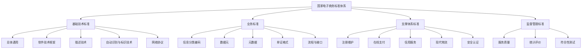

# 第六章 企业信息化

## 一、企业信息化概述

### 1. 信息化的概念

- 信息化是由工业社会向信息社会的演变与发展。
- 信息化的主体是全体社会成员（政府、企业、团体、个人）。
- 时域是一个长期的过程。
- 空域是经济与社会的一切领域。
- 手段是先进的社会生产工具。

### 2. 企业信息化方法

- 业务流程重组方法
- 核心业务应用方法
- 信息系统建设方法
- 主题数据库方法
- 资源管理方法

> **注：企业信息化是螺旋式上升过程！**

---

## 二、信息资源管理（IRM）

### 1. 国民经济和社会发展三大战略资源

- **信息资源**：无限的、可再生的、可共享的【在业务信息化基础上形成的各种信息】。
- **材料与能源**：有限的、不可再生的、不可共享的。

### 2. IRM 基本内容（三个主题）

- 资源管理的方向与控制；
- 建立企业信息资源指导委员会；
- 建立信息资源的组织机构。

### 3. IRM 目的

通过企业内外信息流的畅通与信息资源的有效利用，提高企业的效率与竞争力。

### 4. 数据资源管理和信息处理管理

IRM 包括：**数据资源管理**与**信息处理管理**。

1. **数据资源管理**：强调对数据的控制（维护与安全）。
2. **信息处理管理**：关心企业管理人员如何获取和处理信息（过程与方法），强调信息资源在企业中的重要性。

### 5. 数据管理（IRM 的基础）

- 不同于数据库管理。
- 确定数据规划、数据应用、数据标准、数据内容、数据范围等。

### 6. IRM 基础标准

- 数据元素标准
- 信息分类编码标准
- 用户视图标准
- 概念数据库标准
- 逻辑数据库标准

### 7. IRM 制定和实施的原则

1. 不绝对可灵活，允许例外，但不能例外当正规。
2. 标准必须从实际出发切实可行，容易执行，不迁就落后，标准一致性。
3. 逐步制定而不是一步到位，细节不重要，必须加以宣传。
4. 管理部门必须支持且乐于帮助执行。

### 8. 信息资源的分类

**（1）** 信息资源管理（IRM）起点和基础：建立信息资源目录。遵循简洁、独立和可操作的原则。

**（2）分类**

| 分类维度         | 描述                                                                                                                                                                                                        |
| ---------------- | ----------------------------------------------------------------------------------------------------------------------------------------------------------------------------------------------------------- |
| **管理维度**     | 一般有 2 种情况：一是专门的业务部门所采用的分类体系；二是综合部门从信息资源登记和管理的角度提出的分类。                                                                                                     |
| **信息来源维度** | 比较简单，一般按照信息资源提供部门来设置目录。 优势：从分类信息的赋值角度极大地简化了工作量，无需培训、重复录入，该部门初始化后可以复用；使用者不需要学习或了解特定分类体系的内容，查找过程更加简单和直接。 |
| **应用主题维度** | 最复杂。同一个信息资源根据其服务和应用目标不同，会有不同的分类。                                                                                                                                            |

不同分类体系需要相互转化和映射。（一般希望可以自动转换分类）

### 9. 信息资源规划 IRP

IRP 强调将需求分析与系统建模紧密结合起来，需求分析是系统建模的准备，系统建模是用户需求的定型和规范化表达。

```text
+------------------------------------------------------------------+
|                   征求业务和信息部门初步意见                      |
+----------------------------------+--------------------------------+
                                   |
              +--------------------+--------------------+
              |                                         |
              v                                         v
+---------------------------+             +---------------------------+
| 业务需求分析              |             | 数据需求分析                  |
|   · 职能域分析            |             |   · 用户视图收集              |
|   · 业务域定义            |             |   · 用户视图分组、分析         |
|   · 业务流程梳理          |             |   · 数据元素分析              |
+-------------+-------------+             +-------------+-------------+
              |                                         |
              |                                         |
              v                                         v
+------------------------------------------------------------------+
|                         IRM基础标准                               |
+------------------------------------------------------------------+
                                 |
                  +----------------+------------+
                  |                             |
                  v                             v
+------------------+    +----------------+    +------------------+
| 系统功能建模       |<-->| 业务模型        |<-->| 系统数据建模        |
| · 子系统定义       |    | 数据模型        |    | · 主题数据库定义    |
| · 功能模块定义     |    |                |    | · 基本表定义       |
| · 程序单元定义     |    +--------+-------+    | · 扩展表定义       |
+--------+---------+             |            +--------+---------+
         |                       |                     |
         v                       v                     v
+------------------------------------------------------------------+
|                      关联模型（CU矩阵）                             |
+------------------------------------------------------------------+
```

### 10. 信息资源网建设

#### 10.1 信息通信网和信息资源网（低级到高级、局部到全局）

**（1）信息通信网：** 将信息以某种媒体形式进行传输。一般利用国家公用电信平台构筑的区域性或专业性的通信网。

**（2）信息资源网（高级阶段）：** 包括从信息采集和加工直至最终利用的众多环节，各提供部门和使用部门建立的各种数据库、信息中心和信息应用系统。

#### 10.2 信息资源网的建设

- 数据库和数据仓库的建设
- 信息资源网的数据分布（分散存储、集中存储）
- 分布式数据库的建设

---

## 三、企业信息化规划

### 1. 信息化规划涉及的主要内容和关系

```text
+------------------+     +--------------------------------------+     +------------------------+
|                  |     | 理解关键的企业目标                      | ←→  | 企业战略规划             |
| 业务流程重组       |     +-------------------↓------------------+     |                        |
|                  |     | 企业如何达到目标                        | ←→  | 企业战略规划             |
|                  |     +-------------------↓------------------+     +------------------------+
|                  |     | 信息系统如何支撑这些目标                 | ←→  | 信息系统战略规划          |
|                  |     +-------------------↓------------------+     +------------------------+
|                  |     | 需要哪些信息技术支撑信息系统              | ←→  | 信息技术战略规划         |
|                  |     +-------------------↓------------------+     +------------------------+
| 信息资源规划       |     | 信息化建设具体项目的实施                 | ←→  | 信息资源规划             |
+------------------+     +--------------------------------------+     +------------------------+
```

### 2. 信息化规划工作

1. 明确发展目标和实施重点
2. 成立领导机构
3. 做好企业业务信息化需求分析
4. 确定企业信息化不同发展阶段的投资预算
5. 制定必要的促进企业信息化建设的规章制度
6. 明确信息化实施效果评估方法
7. 信息化方案优化措施
8. ……

### 3. 信息化战略体系规划

```text
   企业战略        <==>        企业信息化战略        <==>        信息系统战略        <==>        单个信息系统开发
      ^                             ^                               ^                            ^
      |                             |                               |                            |
 企业战略规划              企业信息化战略规划                ┌──────────────────────┐              系统规划
                                                        │ 信息系统战略规划        │
                                                        │ 战略数据规划           │
                                                        │ 信息技术战略规划        │
                                                        │ 信息资源规划           │
                                                        └──────────────────────┘
```

### 4. 企业战略与信息化战略集成方法

- **业务与 IT 整合（BITA）：** 重心是找业务与现有 IT 系统之间的不一致，并给出转变计划。【业务路线】
- **企业 IT 架构（EITA）：** 帮助企业建立 IT 的原则、规范、模式和标准。【IT 技术路线】

### 5. 信息系统战略规划（ISSP）

信息系统战略规划（Information System Strategic Planning，ISSP）是从企业战略出发，构建企业基本的信息架构，对企业内、外信息资源进行统一规划、管理与应用，利用信息控制企业行为，辅助企业进行决策，帮助企业实现战略目标。

ISSP 方法经历了三个主要阶段，各个阶段所使用的方法也不一样。

#### 5.1 第一个阶段

**核心：** 以数据处理为中心，围绕职能部门的需求进行信息系统规划。

**主要方法：**

- 企业系统规划法（**BSP**）——含 **CU 矩阵**
- 关键成功因素法（**CSF**）
- 战略目标集转化法（**SST**）
- 其他：投资回收法、征费法、零线预算法、阶石法

| 方法                    | 描述                                                                                                                                     | 结合使用                                                                                                                                                                                                                                       |
| ----------------------- | ---------------------------------------------------------------------------------------------------------------------------------------- | ---------------------------------------------------------------------------------------------------------------------------------------------------------------------------------------------------------------------------------------------- |
| 企业系统规划法（BSP）   | 强调目标，但缺乏清晰的推导过程。通过 **PO、RD 和 CU 矩阵** 将企业目标转化为信息系统目标；其中心是识别企业过程。                          | **CSB 方法：**上述三种方法的组合运用。 **流程：用 CSF 确定企业目标 → 用 SST 补充、完善目标 → 将目标转化为信息系统目标 → 用 BSP 校核企业目标与信息系统目标，并确定信息系统的总体结构**。 **说明：**可弥补各自不足，但会增加复杂度、降低灵活性。 |
| 关键成功因素法（CSF）   | 能够抓住主要矛盾，重点突出；较适合高层目标的设定，与常规方法结合较好。                                                                   |                                                                                                                                                                                                                                                |
| 战略目标集转化法（SST） | 从另一个角度识别管理目标，反映了各类人员的要求，给出按要求的层次结构并转化为信息系统目标，较为全面，但在突出重点方面不如关键成功因素法。 |                                                                                                                                                                                                                                                |

#### 5.2 第二个阶段

**核心：** 以企业内部管理信息系统为中心，围绕企业整体需求进行信息系统规划。

**主要方法：**

- 战略数据规划（**SDP**）——**主题数据库**
- 信息工程法（**IE**）
- 战略栅格法（**SG**）

| 方法                      | 描述                                                                                                                                                                                                                              |
| ------------------------- | --------------------------------------------------------------------------------------------------------------------------------------------------------------------------------------------------------------------------------- |
| 企业战略数据规划法（SDP） | 企业核心竞争力的关键组成部分，具有**异质性**与**专有性**。**规划逻辑：** 自上而下——全局规划；自下而上——详细设计。**全局规划层次：** 可偏「粗」（侧重**主题数据库**），或偏「细」（侧重所有实体或活动）。                          |
| 信息工程法（IE）          | 面向企业信息系统建设的方法，其基础是 BSP 方法和 SDP 方法。信息、过程和技术构成了企业信息系统的三要素，与企业的信息系统密切相关的三个要素是企业的各种信息、企业的业务活动过程和企业采用的信息技术。                                |
| 战略栅格法（SG）          | 该方法创建一个 2×2 的矩阵（战略栅格），从战略影响方面标出企业现有的和将来的信息系统组合的特征，也就是它们对企业生存前景的影响，是一种了解企业中信息系统作用的诊断工具。【4 种规划条件：战略型、转变型、工厂型和支持型（辅助型）】 |

#### 5.3 第三个阶段

第三个阶段的方法在综合考虑企业内外环境的情况下，以集成为核心，围绕企业战略需求进行的信息系统规划，主要的方法包括价值链分析法（VCA）和战略一致性模型（SAM）。

| 方法                                  | 描述                                                                                                                                                                                                                                                                                                          |
| ------------------------------------- | ------------------------------------------------------------------------------------------------------------------------------------------------------------------------------------------------------------------------------------------------------------------------------------------------------------- |
| 价值链分析法（VCA）                   | 该方法视企业为一系列的输入、处理与输出的活动序列集合，每个活动都有可能相对于最终产品产生增值行为，从而增强企业的竞争地位。企业通过在价值链过程中灵活应用信息技术，发挥信息系统的控制作用、杠杆作用和乘数效应，可以增强企业的竞争能力。                                                                        |
| 战略一致性模型（战略对应模型）（SAM） | 可以帮助企业检查企业战略与信息基础架构之间的一致性。SAM 把企业战略规划和信息化战略规划的关系划分为内、外两大部分，模型由企业经营战略、组织与业务流程、信息系统战略、IT 基础架构四大领域构成。描述了信息系统潜在作用的基础性框架，使信息系统战略地位从传统的内部定位提升到从内、外环境获取竞争优势的关键位置。 |

### 6. 企业资源计划（ERP，Enterprise Resource Planning）

#### 6.1 发展过程

```text
+--------------------------------------------------+
| 物料需求计划（Material Requirement Planning，MRP）        |
+--------------------------------------------------+      物料单系统
              |
              v
+--------------------------------------------------+
| 制造资源计划（MRPII，Manufacturing Resource Planning II） |
+--------------------------------------------------+      核心是物流，主线是计划
              |
              v
+--------------------------------------------------+
| 企业资源计划（ERP，Enterprise Resource Planning）         |
+--------------------------------------------------+      打通了供应链
                                                            扩展到了非制造业
                                                            重心转移到财务上
```

**企业资源：** 支持企业业务活动和战略运营的事物。

- 人、财、物和信息资源
- 三流：物流、资金流和信息流

#### 6.2 ERP 结构

- **管理思想：** 他是管理思想的变革。
- **软件产品：** 但不是直接买来就用，需要个性化的开发与部署。
- **管理系统：** 存在众多的子系统，这些子系统有统一的规划，是互联互通的，便于事前事中监控。

ERP 功能模块（三列；左列含财会管理、物流管理）：

| **◆ 财会管理** | **◆ 生产控制管理** | **◆ 人力资源管理** |
| -------------- | ------------------ | ------------------ |
| 会计核算       | 主生产计划         | 人力资源规划       |
| 财务管理       | 物料需求计划       | 招聘管理           |
| **◆ 物流管理** | 能力需求计划       | 工资核算           |
| 分销管理       | 车间控制           | 工时管理           |
| 库存控制       | 制造标准           | 差旅费核算         |
| 采购管理       |                    |                    |

#### 6.3 不成功的原因

ERP 实施不成功的原因主要有以下几个方面：

1. 思想认识不足。
2. 企业的管理思想陈旧，管理手段落后，不能适应 ERP 系统建设的需要。
3. 企业业务流程不规范。
4. 基础数据不准确。
5. 实施计划形同虚设。
6. 资金缺乏。
7. 高层领导不重视。

---

## 四、企业信息系统

### 1. 客户关系管理（CRM）

1. **CRM 定位：** 一种概念、一种理念、新的管理模式、以客户为中心的业务模型等。
2. **CRM 的主要模块：** 销售自动化；营销自动化；客户服务与支持；商业智能。
3. **CRM 的价值：** 提高工作效率，节省开支；提高客户满意度；提高客户的忠诚度。
4. **其它关键概念**

| 关键概念     | 描述                                                                 |
| ------------ | -------------------------------------------------------------------- |
| 目的         | 与客户建立长期和有效的业务关系，接近客户、了解客户，最大限度增加利润 |
| 核心         | 客户价值管理                                                         |
| 核心思想     | 以客户为中心                                                         |
| 中心         | 客户关怀                                                             |
| 关键内容     | 客户服务                                                             |
| 支柱功能     | 市场营销和客户服务                                                   |
| 基础和依托   | 共享的客户资料库                                                     |
| 一个重要方面 | 具有使客户价值最大化的分析能力                                       |
| 构成部分     | 触发中心和挖掘中心                                                   |

### 2. 供应链管理（SCM）

#### 2.1 SCM 理念

强强联合，整合与优化「三流」，打通企业间「信息孤岛」，严格的数据交换标准。将制造商、供应商、分销商、零售商，在计划（策略性）、采购、制造、配送、退货等各方面联系起来。

#### 2.2 信息化的三流

- **信息流**
  - **需求信息流（自需求方向供应方）：** 如客户订单、生产计划、采购合同等。
  - **供应信息流（自供应方向需求方）：** 如入库单、完工报告单、库存记录、可供销售量、提货发运单等。
- **资金流**
- **物流**

### 3. 产品数据管理（PDM）

#### 3.1 概念

产品数据管理（Product Data Management，PDM）是一门用来管理所有与产品相关信息（包括零件信息、配置、文档、计算机辅助设计文件、结构、权限信息等）和所有与产品相关过程（包括过程定义和管理）的技术。

PDM 的核心思想是设计数据的有序、设计过程的优化和资源的共享。

#### 3.2 技术的发展三阶段

（1）配合 CAD 使用的早期简单的 PDM 系统。

（2）专业化的 PDM 产品。

（3）产品协同商务 CPC 或 PDM 标准化集成开发接口。建立在 Internet 平台、CORBA 和 Java 技术等基础之上。

#### 3.3 主要功能

- 数据库和文档管理
- 产品结构与配置管理
- 生命周期管理与过程管理
- 集成开发接口

### 4. 产品生命周期管理（PLM）

#### 4.1 概念

产品生命周期管理（Product Lifecycle Management，PLM）实施一整套的业务解决方案，把人、过程和信息有效地集成在一起，作用于整个企业，遍历产品从概念到报废的全生命周期，支持产品定义信息的创建、管理、分发和使用。

#### 4.2 产品的生命周期

一般包括五个阶段：

1. **培育期（概念期）**
2. **成长期**
3. **成熟期**
4. **衰退期**
5. **结束期（报废期）**

#### 4.3 与 PDM 关系

PLM 包含 PDM 的全部内容，PDM 的功能是 PLM 的一个子集。

#### 4.4 PLM 构成

由多种信息化要素构成：基础技术与标准；信息生成工具；核心功能；应用功能；以及建立在其他系统上的业务解决方案。

#### 4.5 PLM 的功能

- 总体功能
- 核心创造、协同、控制功能
- 细化功能

### 5. 知识管理

#### 5.1 显性知识与隐性知识

| 类型         | 特点                                           |
| ------------ | ---------------------------------------------- |
| **显性知识** | 规范化、系统化、结构化、明晰                   |
| **隐性知识** | 未规范化、零散、非正式、未编码，难以保存与传递 |

#### 5.2 知识管理工具

- **知识生成工具：** 知识的获取、综合与创新。
- **知识编码工具：** 通过标准形式表达知识。
- **知识转移工具：** 使知识在企业内传播与共享。

### 6. 商业智能（BI）

**定义：** **BI = 数据仓库 + 数据挖掘 + OLAP**

- **用途：** 决策分析
- **目标：** 分析历史数据，预判未来

**对照：** 普通应用系统开发 = 应用数据库 + OLTP，**用途：** 支撑业务运作。

### 7. 企业门户

- **企业信息门户（EIP，Enterprise Information Portal）：** 使员工、合作伙伴、客户、供应商都能够访问企业内部网络和因特网存储的各种自己所需的信息。
- **企业知识门户（EKP，Enterprise Knowledge Portal）：** 在企业网站的基础上增加知识性内容。
- **企业应用门户（EAP，Enterprise Application Portal）：** 以商业流程和企业应用为核心，把商业流程中功能不同的应用模块通过门户技术集成在一起。
- **垂直门户（Vertical Portal）：** 为某一特定的行业服务的，传送的信息只属于人们感兴趣的领域。

### 8. 决策支持系统（DSS）

决策支持系统（Decision Support System，DSS）是辅助决策者通过数据、模型和知识，以人机交互方式进行半结构化或非结构化决策的计算机应用系统。

```text
         ---------------------------------------------------------------------
         |                                                                   |
         v                                                                   v
+------------------+            +------------------+            +------------------+
|   数据库子系统     |    <->     |     推理部分      |    <->      |   模型库子系统      |
+--------+---------+            +--------+---------+            +--------+---------+
         ^                                 ^                                 ^
         |                                 |                                 |
         |                                 |                                 |
         |                                 |                                 |
         v                                 v                                 v
  +-----------------------------------------------------------------------------------+
  |       用户接口子系统                                                                |
  +-----------------------------------------------------------------------------------+
                                  ^
                                  |
                                  v
                            +-------------+
                            |    用户     |
                            +-------------+
```

### 9. 信息系统开发方法

#### 9.1 结构化开发方法

1. 自顶向下，逐步分解求精；
2. 严格区分阶段，阶段产出标准化；
3. 应变能力差。

#### 9.2 原型法

**【需求阶段，作用是展示及获取需求】**

1. 针对需求不明确；
2. **按功能分：** 水平原型（界面）、垂直原型（复杂算法）；
3. **按最终结果分：** 抛弃式原型、演化式原型。

#### 9.3 面向对象方法

1. 自底向上；
2. 阶段界限不明；
3. 更好应变、更好复用。

#### 9.4 面向服务的方法

**（1）粗粒度、松耦合**

**（2）标准化和构件化**

**（3）面向服务方法的三个抽象级别**

- **操作（Operation）：** 位于最底层，对标函数方法这个层次。
- **服务（Service）：** 代表操作的逻辑分组。
- **业务流程（Business Process）：** 为实现特定业务目标而执行的一组长期运行的动作或活动。业务流程的例子有：接纳新员工、出售产品或服务和完成订单。

---

## 五、电子商务

**（1）电子商务主要有 2 类角色：** 企业（Business）及个人（Customer）。

**（2）国家电子商务标准体系**



**（3）电子商务的类型**

| 类型                                       | 应用                   |
| ------------------------------------------ | ---------------------- |
| **B2B（企业对企业）**                      | 阿里巴巴，慧聪网       |
| **C2C（消费者对消费者）**                  | 闲鱼                   |
| **B2C（企业对消费者）**                    | 京东，天猫             |
| **C2B（消费者对企业）【非主流】**          | 个人给企业提供咨询服务 |
| **O2O（Online To Offline）【线上对线下】** | 团购                   |

## 六、电子政务

**（1）电子政务主要有 3 类角色：** 政府（Government）、企（事）业单位（Business）及公民（Citizen）。如果有第 4 类就是公务员（Employee）。

| 类型    | 应用                                                                                                       |
| :------ | :--------------------------------------------------------------------------------------------------------- |
| **G2G** | 基础信息的采集、处理和利用，如：人口信息、地理信息；各级政府决策支持                                       |
| **G2E** | 政府内部管理系统                                                                                           |
| **G2B** | 政府给企业单位颁发【各种营业执照、许可证、合格证、质量认证】                                               |
| **B2G** | 企业向政府缴税；企业向政府供应各种商品和服务【含竞/投标】；企业向政府提建议，申诉                          |
| **G2C** | 社区公安和水、火、天灾等与公共安全有关的信息；户口、各种证件和牌照的管理                                   |
| **C2G** | 个人应向政府缴纳的各种税款和费用；个人向政府反馈民意【征求群众意见】；报警服务【盗贼、医疗、急救、火警等】 |

---

## 七、业务流程重组 BPR

### 1. 概念

BPR 是对企业的业务流程进行根本性的再思考和彻底性的再设计，从而获得可以用诸如成本、质量、服务和速度等方面的业绩来衡量的显著性的成就。

BPR 在追求顾客满意度和员工追求自我价值实现的流程中带来降低成本的结果。

### 2. BPR 遵循原则

- 以流程为中心
- 以人为本（团队式管理）
- 以顾客为导向

### 3. 实施 BPR 主要有两种方法

**（1）** 研究和描述企业现有业务流程的基础上进行重新设计。

**（2）** 从一张白纸开始构建企业理想的业务流程。

### 4. 基于 BPR 的信息系统规划

**（1）BPR 与信息系统规划的关系（相互作用，相辅相成）：**

一方面，信息系统规划要以 BPR 为前提，并且在系统规划的整个过程中，以业务流程为主线。

另一方面，面向流程的信息系统规划驱动企业的 BPR。

**（2）主要步骤**

战略规划 → 流程规划 → 数据规划 → 功能规划 → 实施规划

---

## 八、企业应用集成

**不同维度的集成划分：**

**（1）**

| 类别                         | 集成点     | 效果                               | 解题关键点                           |
| :--------------------------- | :--------- | :--------------------------------- | :----------------------------------- |
| **界面集成**                 | 界面层     | 统一入口，产生「整体」感觉         | 「整体」感觉，最小代价实现一体化操作 |
| **数据集成**                 | 数据层     | 不同来源的数据逻辑或物理上「集中」 | 其它集成方法的基础                   |
| **控制集成**                 | 应用逻辑层 | 调用其它系统已有方法，达到集成效果 |                                      |
| **业务流程集成（过程集成）** | 应用逻辑层 | 跨企业，或优化流程而非直接调用     | 企业之间的信息共享能力               |
| **门户集成**                 |            | 将内部系统对接到互联网上           | 发布到互联网上                       |

**（2）**

| 方法           | 特点                                             |
| :------------- | :----------------------------------------------- |
| **消息集成**   | 数据量小，交互频繁，立即地，异步                 |
| **共享数据库** | 交互频繁，立即地，同步                           |
| **文件传输**   | 数据量大，交互频度小，即时性要求低（月末，年末） |

---

## 九、数字化转型

### 1. 数字化

**（1）概念**

数字化是新一代信息技术驱动下，推动商业模式变革、产业链重构，并改善企业与消费者、合作伙伴之间关系的进程。

**（2）企业数字化转型的五个发展阶段**

- **初始级（规范级）发展阶段【数码化】：** 信息的数字化：记录、存储与传输。
- **单元级（场景级）发展阶段【数量化】：** 提升单项业务的规范性与运行效率。
