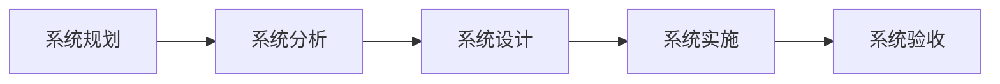
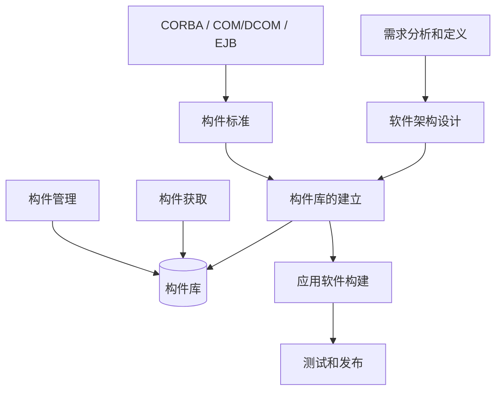
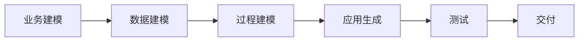
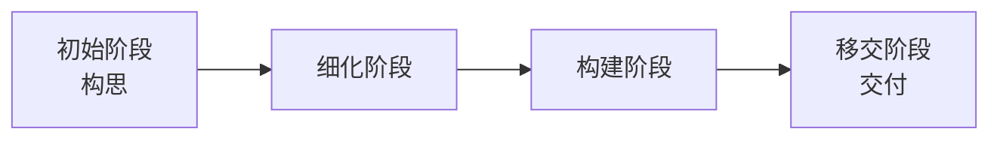
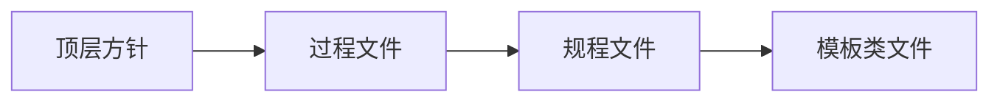
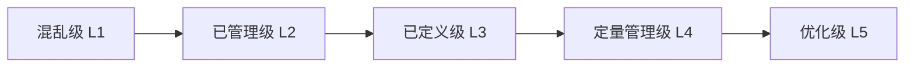

# 第七章 软件工程

## 一、软件生命周期

### 1. 信息系统生命周期



| 系统阶段     | 主要活动内容                                                               | 产出物                                                                                               |
| ------------ | -------------------------------------------------------------------------- | ---------------------------------------------------------------------------------------------------- |
| **系统规划** | 初步调查、分析系统目标、子系统组成、拟建方案、可行性研究、制定系统建设方案 | 系统设计任务书（系统建设方案、实施方案）                                                             |
| **系统分析** | 业务流程分析、数据与数据流分析、软件需求分析、网络需求分析                 | 系统需求说明书、软件需求说明书、确认测试计划、系统测试计划、初步用户手册                             |
| **系统设计** | 软件架构设计、软件概要设计、详细设计、网络设计                             | 架构设计文档、概要设计说明书、详细设计说明书、程序规格说明书、概要测试计划、详细测试计划、各类设计图 |
| **系统实施** | 软件编码、软件单元/集成/系统测试、综合布线                                 | 源代码、单元测试报告、集成测试报告、操作手册                                                         |
| **系统验收** | 确认测试、试运行                                                           | 确认测试报告、项目验收报告                                                                           |

### 2. GB/T 8566-2022 信息技术—软件生存周期过程

基本过程、支持过程、组织过程关系示意（组织过程支撑基本过程，支持过程贯穿/约束基本过程）：

```
┌─────────────────────────────────────────────────────────────────────────────────────────┐
│                            支持过程（横向贯穿，保障质量与可控）                              │
│  文档编制 │ 配置管理 │ 质量保证 │ 验证/确认 │ 联合评审·审核 │ 问题解决 │ 易用性              │
└─────────────────────────────────────────────────────────────────────────────────────────┘
                                        │
                                        ▼ 贯穿/约束
┌─────────────────────────────────────────────────────────────────────────────────────────┐
│                              基本过程（主干：价值交付主线）                                 │
│                                                                                           │
│   获取 ────► 供应 ────► 开发 ────► 运作 ────► 维护                                        │
│  （需方）   （供方）  （开发方）  （操作方）  （维护方）                                     │
│                                                                                           │
└─────────────────────────────────────────────────────────────────────────────────────────┘
                                        ▲
                                        │ 支撑
┌─────────────────────────────────────────────────────────────────────────────────────────┐
│                            组织过程（底座：能力与持续改进）                                 │
│                                                                                           │
│  管理 ── 基础设施 ── 改进 ── 人力资源 ── 资产管理 ── 复用大纲管理 ── 领域工程               │
│                                                                                           │
└─────────────────────────────────────────────────────────────────────────────────────────┘
```

#### 基本过程（5 个）

| 基本过程（5 个） | 参与方 | 说明                               | 开发阶段（10 阶段）                              |
| ---------------- | ------ | ---------------------------------- | ------------------------------------------------ |
| 获取过程         | 需方   | 获取/采购软件产品或服务            | 可行性研究和需求分析                             |
| 供应过程         | 供方   | 向需方提供软件产品或服务           | 可行性研究和需求分析                             |
| 开发过程         | 开发方 | 将需求转化为可交付的软件产品       | 概要设计 → 详细设计 → 实现 → 组装测试 → 确认测试 |
| 运作过程         | 操作方 | 运行软件系统并提供服务             | 使用                                             |
| 维护过程         | 维护方 | 纠错、优化与适配变更，保障持续可用 | 维护 → 退役                                      |

#### 支持过程（9 个）

| 支持过程（9 个） | 说明                                   |
| ---------------- | -------------------------------------- |
| 文档编制过程     | 产生、维护过程/产品相关文档            |
| 配置管理过程     | 标识、控制与跟踪配置项及变更           |
| 质量保证过程     | 建立与评价过程/产品质量保证活动        |
| 验证过程         | 验证工作产品是否满足规定需求           |
| 确认过程         | 确认最终产品是否满足用户需求与预期用途 |
| 联合评审过程     | 组织相关方对工作产品进行评审           |
| 审核过程         | 对过程/产品合规性与有效性进行审计      |
| 问题解决过程     | 记录、分析、解决问题并闭环跟踪         |
| 易用性过程       | 评估与改进可用性/可用体验              |

#### 组织过程（7 个）

| 组织过程（7 个） | 说明                                     |
| ---------------- | ---------------------------------------- |
| 管理过程         | 组织层面的管理与治理活动                 |
| 基础设施过程     | 提供开发/运维所需环境、工具与平台        |
| 改进过程         | 持续改进过程体系与绩效                   |
| 人力资源过程     | 人员能力建设、培训与组织保障             |
| 资产管理过程     | 管理组织级资产（过程资产、知识、工具等） |
| 重用大纲管理过程 | 管理与推进复用策略、资产与机制           |
| 领域工程过程     | 面向领域的共性分析与资产构建             |

---

## 二、软件开发模型

| 模型名称                                          | 描述                                                                                                                                                                                         | 特点与评价                                                                                                                                                               |
| ------------------------------------------------- | -------------------------------------------------------------------------------------------------------------------------------------------------------------------------------------------- | ------------------------------------------------------------------------------------------------------------------------------------------------------------------------ |
| **【瀑布模型】**                                  | 严格定义的方法，将软件开发过程分为 6 阶段：软件计划、需求分析、软件设计、程序编码、软件测试、运行维护。像瀑布一样严格顺序进行，最终得到软件产品。**前提**：基于完全确定的软件需求。          | 依赖需求，无法适应变化；单流向；开发中获得的经验无法反馈到当前过程；风险推迟到开发后期，难以早期纠正；风险控制能力弱。项目常延期、超支。                                 |
| **【V 模型】** 瀑布的变种                         | 从左到右描述基本开发过程和测试行为，明确标明了测试过程中的不同级别，并清楚描述了这些测试阶段与开发过程各阶段的对应关系。                                                                     | 强调协作和速度，将实现与验证有机结合，在保证质量下缩短开发周期。适合企业级软件开发。                                                                                     |
| **【螺旋模型】** 原型+瀑布，强调风险              | 演化式软件过程模型，将原型实现的迭代特征与线性顺序模型中可控、系统化的方面结合，使软件增量版本的快速开发成为可能。每次迭代包括：制订计划、风险分析、实施工程、客户评估。                     | 支持需求动态变化，提高适应能力，便于关键决策和项目管理调整，降低风险。需开发人员具备风险评估经验。迭代过多会增加成本、延迟提交。**特别适用于庞大、复杂且高风险的系统。** |
| **【喷泉模型】** 早期面向对象模型                 | 以用户需求为动力、以对象为驱动的模型，主要用于描述面向对象的软件开发过程。                                                                                                                   | 迭代，无间隙。                                                                                                                                                           |
| **【演化模型】** 需求不完整                       | 在快速开发原型的基础上，根据用户使用原型过程中的反馈对原型改进，获得新版本，重复直至演化成最终软件产品。                                                                                     | 任何功能一经开发即可进入测试以验证产品需求，有助于引导高质量需求。若不加控制地让用户接触未稳定功能，可能对开发和用户产生负面影响。                                       |
| **【变换模型】** 基于形式化规格说明语言和程序变换 | 以形式化规格说明为基础开发软件原型，用户可从人机界面、主要功能和性能等方面评审；必要时可修改需求、形式化规格说明和原型，直至原型被确认。                                                     | 优点：解决代码结构经多次修改而变坏的问题，减少许多中间步骤。局限：需严格数学理论和整套开发环境支持。                                                                     |
| **【智能模型】** 基于知识                         | 综合上述若干模型并与专家系统结合；采用规约和推理机制，应用基于规则的系统，帮助开发人员完成开发，使维护在系统规格说明一级进行。需建立知识库，将模型本身、软件工程知识与特定领域知识分别存入。 | —                                                                                                                                                                        |

### 各模型简要说明

1. **原型模型**：典型原型开发方法模型。适用于**需求不明确**的场景，帮助用户澄清需求。
2. **瀑布模型**：瀑布模型是将软件生存周期中的各个活动规定为依线性顺序连接的若干阶段的模型。瀑布模型的特点是易于理解，管理成本低，每个阶段都有对应的成果产物，各个阶段有明显的界限划分和顺序要求，一旦发生错误，整个项目推倒重新开始。适用于需求明确的项目，一般表达为需求明确或二次开发，或者对数据处理类型的项目。
3. **增量模型**：融合了瀑布模型的基本成分和原型实现的迭代特征，可以有多个可用版本的发布，核心功能往往最先完成，在此基础上，每轮迭代会有新的增量发布，核心功能可以得到充分测试。强调每一个增量均发布一个可操作的产品。
4. **螺旋模型**：典型特点是引入了风险分析。以原型为基础+瀑布模型，最主要的特点在于加入了风险分析。它是由制定计划、风险分析、实施工程、客户评估这一循环组成的，并且从概念项目开始第一个螺旋。
5. **V 模型**：测试贯穿于始终，测试分阶段，测试计划提前。
6. **喷泉模型**：典型的面向对象的模型。特点是迭代、无间隙。会将软件开发划分为多个阶段，但各个阶段无明显界限，并且可以迭代交叉。早期著名的面向对象模型。
7. **构件组装模型**：见下文“基于构件的开发过程”。

---

## 三、基于构件的开发过程（流程图概要）



- **需求分析和定义** → **软件架构设计**：自上而下。
- **CORBA / COM/DCOM / EJB** → **构件标准** → **构件库的建立**，并与 **软件架构设计** 共同作为输入。
- **构件库的建立** 产出并写入 **构件库**；**构件获取**、**构件管理** 向构件库输入并维护。
- **构件库的建立** 之后进入 **应用软件构建** → **测试和发布**。

---

## 四、快速应用开发（RAD）

### 8.1 概念

- RAD 是瀑布模型的高速变种。
- 适用于开发周期远短于传统生命周期的项目。
- 通常采用**基于构件的开发方法**实现快速交付。
- RAD 工具主要利用**可视化技术**。

### 8.2 过程



业务建模 → 数据建模 → 过程建模 → 应用生成 → 测试 → 交付。

### 8.3 RAD 的基本思想（四个方面）

1. 鼓励用户更积极参与系统分析、设计和构建。
2. 将开发组织为一系列有投资者、用户、分析员、设计员、开发人员参与的专题研讨会。
3. 采用**迭代式构建**加速需求分析与设计阶段。
4. 让用户尽早看到可运行的系统。

### 8.4 特点

- **基于构件**：复用已有程序结构/构件，或创建可复用构件以加速开发。
- 广泛使用 **CASE** 工具。
- 每个主要功能可由不同 RAD 团队分别实现再集成一个整体的RAD。

### 8.5 局限性

- 并非所有应用都适合 RAD。
- 要求开发方与客户在很短时间内完成需求分析；缺乏配合会导致失败。
- 最适合管理信息系统的开发；**不适合技术风险高的项目**。

---

## 五、统一过程（UP / RUP）

### （1）典型特点

用例驱动、以架构为中心、迭代与增量。分为四个阶段：



| 阶段                     | 说明                                                       |
| ------------------------ | ---------------------------------------------------------- |
| **初始阶段（构思阶段）** | 确定最终产品愿景与业务模型，确定系统范围。                 |
| **细化阶段**             | 设计并确定系统架构，制定工作计划与资源需求。               |
| **构建阶段**             | 开发其余构件与应用功能，能组装成产品并开展详细测试。       |
| **移交阶段（交付阶段）** | 使软件可供最终用户使用，进行 Beta 测试，形成产品发布版本。 |

### （2）9 个核心工作流

业务建模、需求、分析与设计、实现、测试、部署、配置与变更管理、项目管理、环境。

---

## 六、敏捷方法

### 10.1 传统软件开发 vs 敏捷方法

| 传统软件开发方法                   | 敏捷方法                                    |
| ---------------------------------- | ------------------------------------------- |
| 预设性的（Predictive）             | 适应性的（Adaptive）                        |
| 以开发过程为本（Process-oriented） | 以人为本（People-oriented）                 |
| 整体分阶段（Monolithic phases）    | 增量迭代，小步快跑（Incremental iteration） |
| —                                  | 适合小型项目                                |

### 10.2 概念

敏捷开发是一种**以人为本、迭代、增量**的开发方法，适合小团队、小项目，特点为**“小步快跑”**。

### 10.3 敏捷宣言（四个核心价值）

- 个体与互动 **高于** 流程与工具。
- 可工作的软件 **高于** 详尽的文档。（实现与测试是核心。）
- 客户协作 **高于** 合同谈判。
- 响应变化 **高于** 遵循计划。

### 10.4 敏捷方法论概览

| 方法                         | 特点摘要                                                                              |
| ---------------------------- | ------------------------------------------------------------------------------------- |
| **开放式源码**               | 开发人员地理上分散（其他方法多强调集中办公）。                                        |
| **SCRUM**                    | 流程清晰、可重复，适用于任意复杂度的项目。                                            |
| **功用驱动开发（FDD）**      | 开发人员分为“首席程序员”与“类”程序员。                                                |
| **ASD（自适应软件开发）**    | 核心为三个非线性、重叠的阶段：猜测（Speculate）、合作（Collaborate）、学习（Learn）。 |
| **DSDM（动态系统开发方法）** | 倡导以业务为中心。                                                                    |
| **极限编程（XP）**           | 在成本控制严格的公司中非常有效。                                                      |
| **水晶（Crystal）**          | 探索在最少纪律约束下仍能成功的方法，在易用性与生产率之间取得平衡。                    |

### 10.4 适用与不适用场景

- **适用于**：小团队、小项目；需求变更频繁；高风险环境；认可该结构的组织。
- **不适用于**：对**关键性、可靠性、安全性**要求很高的项目。

### 10.5 敏捷开发方法——XP（极限编程）

#### （1）概念

XP 是一种**轻量级**开发方法，在成本控制严格的公司中非常有效、常用。

#### （2）四大价值观

沟通、简单、反馈、勇气。

#### （3）五大原则

快速反馈、简单性假设、逐步修改、提倡更改、优质工作。

#### （4）十二个最佳实践

计划游戏、隐喻、小型发布、简单设计、测试先行、重构、结对编程、集体代码所有制、持续集成、每周工作 40 小时、现场客户、编码标准。

---

## 七、软件开发环境与工具

### 1. 概念

软件开发环境是用于支持工程开发与维护的一整套软件，由**软件工具集**和**环境集成机制**组成。

- **软件工具集**：指用于支持开发过程、活动与任务的 CASE 工具。
- **环境集成机制**：为工具集成、开发、维护与管理提供统一支持；保证工具按统一数据接口规范访问信息库，并提供统一用户界面（统一界面形式支持一致性及工具/开发活动间的通信、切换、调度与协同）。

### 2. 软件工具划分（按活动分类）

- **软件开发工具**：需求分析工具、设计工具、编码与调试工具。
- **软件维护工具**：版本控制（VSS、CVS、SCCS、SVN）、文档分析、信息库、逆向工程、再工程工具等。
- **软件管理与软件支持工具**：项目管理工具、配置管理工具、软件评价工具等。

### 3. 项目管理工具

- **能做的**：任务调度、成本估算、资源分配、预算跟踪、工时统计、配置控制、关键路径与松弛时间、超前/滞后时间、特定格式报告等。
- **不能做的**：不能指导软件设计人员按软件生命周期各阶段采用适当技术进行设计（即不提供开发技术层面的指导）。

---

## 八、软件过程管理——CMMI

### 1. 概述

- CMMI 有**阶段式**与**连续式**两种表示法，本质内容相同。
- **CMMI 文档层次（4 层）**：



### 2. 成熟度等级与过程域



| 成熟度等级          | 过程域（示例）                                                                                                                                                     | 关键特征               |
| ------------------- | ------------------------------------------------------------------------------------------------------------------------------------------------------------------ | ---------------------- |
| **优化级 [L5]**     | 组织级改革与实施、因果分析和解决方案                                                                                                                               | 持续优化               |
| **定量管理级 [L4]** | 组织级过程性能、定量项目管理                                                                                                                                       | 量化式管理             |
| **已定义级 [L3]**   | 需求开发、技术解决方案、产品集成、验证、确认、组织级过程焦点、组织级过程定义、组织级培训、集成项目管理、风险管理、集成化团队、决策分析与解决方案、组织级集成环境等 | 组织级，文档化、标准化 |
| **已管理级 [L2]**   | 需求管理、项目计划、配置管理、项目监督与控制、供应商合同管理、度量和分析、过程和产品质量保证                                                                       | 项目级可重复           |
| **混乱级 [L1]**     | （不指定）                                                                                                                                                         | 不需要评定             |
