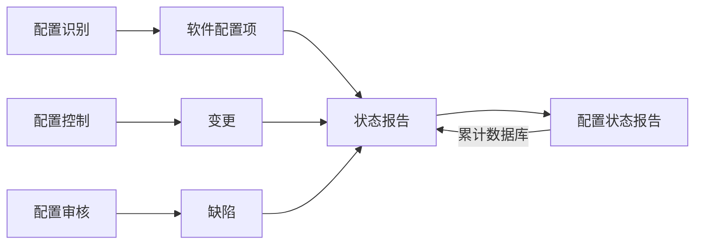
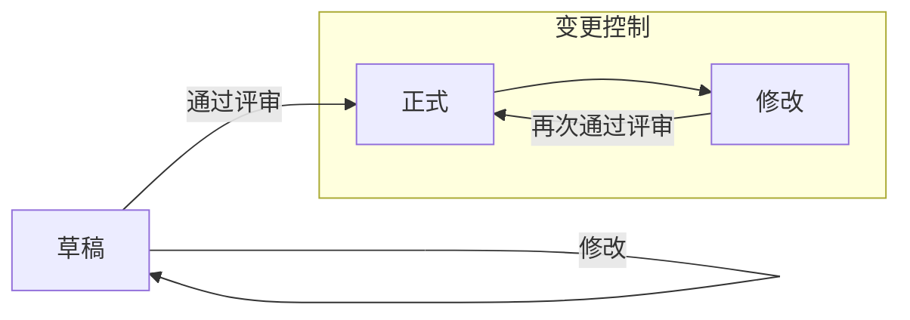

# 第八章 项目管理

## 一、范围管理

### 1. 概念

- 范围管理：确定项目的边界，即哪些工作是项目应做的，哪些工作不应包括在项目中。

### 2. 过程（典型活动）

- 范围管理的流程包括：范围计划编制、范围定义、创建 WBS、范围确认、范围控制。

### 3. 范围定义的输入

- 项目章程、项目范围管理计划、批准的变更申请、组织过程资产。

### 4. WBS 作用

- 便于估算，明确范围，防止需求蔓延。最底层是工作包。

## 二、进度管理

### 1. 概念

进度管理/时间管理：就是采用科学的方法，确定进度目标，编制进度计划和资源供应计划，进行进度控制，在与质量、成本目标协调的基础上，实现工期目标。

### 2. 过程（典型活动）

时间管理的流程包括：活动定义、活动排序、活动资源估算、活动历时估算、制定进度计划、进度控制。

### 3. 三点估算法公式

(乐观时间 + 4×最可能时间 + 悲观时间) / 6

### 4. 进度控制（判断与调整）

（1）需要判断的关键点：

- 第一步：判断延误活动是否为关键活动，若为关键活动，则需要【加快进度】。
- 第二步：若延误活动不是关键活动，则判断【偏差是否大于总时差】，大于，则【加快进度】。
- 第三步：偏差不大于总时差时，进一步判断偏差是否大于自由时差，若大于自由时差，先不调整计划，但要加强监管。

（2）【加快进度】的手段

- 赶工：增加资源，加班，加人。
- 快速跟进：活动并行执行。

### 5. 进度网络图—关键路径法（PERT）

关键路径法是在制订进度计划时使用的一种进度网络分析技术。关键路径法沿着项目进度网络路径进行正向与反向分析，从而计算出所有计划活动理论上的最早开始与完成日期、最迟开始与完成日期，不考虑任何资源限制。

如下图：单代号网络图（示意）

```text
节点框（九宫格）字段含义：
┌────┬────────┬────┐
│ ES │ 持续时间 │ EF │
├────┼────────┼────┤
│    │ 活动编号 │    │
├────┼────────┼────┤
│ LS │  总时差  │ LF │
└────┴────────┴────┘

单代号网络图（按图复现，含 ES/EF/LS/LF/总时差）：

┌────┬────┬────┐         ┌────┬────┬────┐         ┌────┬────┬────┐         ┌────┬────┬────┐
│  0 │  5 │  5 │         │  5 │  2 │  7 │         │ 13 │ 10 │ 23 │         │ 23 │ 10 │ 33 │
├────┼────┼────┤         ├────┼────┼────┤         ├────┼────┼────┤         ├────┼────┼────┤
│    │  A │    │ ─────▶  │    │  B │    │ ─────▶  │    │  D │    │ ─────▶  │    │  F │    │
├────┼────┼────┤         ├────┼────┼────┤         ├────┼────┼────┤         ├────┼────┼────┤
│  0 │  0 │  5 │         │ 11 │  6 │ 13 │         │ 13 │  0 │ 23 │         │ 28 │  5 │ 38 │
└────┴────┴────┘         └────┴────┴────┘         └────┴────┴────┘         └────┴────┴────┘
      │                                            ╱  │                         │
      │                                       ╱       │                         │
      ▼                                  ╱            ▼                         ▼
┌────┬────┬────┐         ┌────┬────┬────┐         ┌────┬────┬────┐         ┌────┬────┬────┐
│  5 │  8 │ 13 │         │ 13 │  5 │ 18 │         │ 23 │ 15 │ 38 │         │ 38 │ 10 │ 48 │
├────┼────┼────┤         ├────┼────┼────┤         ├────┼────┼────┤         ├────┼────┼────┤
│    │  C │    │ ─────▶  │    │  E │    │ ─────▶  │    │  G │    │ ─────▶  │    │  H │    │
├────┼────┼────┤         ├────┼────┼────┤         ├────┼────┼────┤         ├────┼────┼────┤
│  5 │  0 │ 13 │         │ 18 │  5 │ 23 │         │ 23 │  0 │ 38 │         │ 38 │  0 │ 48 │
└────┴────┴────┘         └────┴────┴────┘         └────┴────┴────┘         └────┴────┴────┘

```

常用参数定义：

- ES：最早开始时间 = 所有紧前活动最早结束时间的最大值。
- EF：最早完成时间 = 最早开始时间 + 持续时间。
- LS：最迟开始时间 = 最迟完成时间 − 持续时间。
- LF：最迟完成时间 = 所有紧后活动最迟开始时间的最小值。
- 总时差（松弛时间）：在不延误总工期的前提下，该活动的机动时间。活动的总时差等于该活动最迟完成时间与最早完成时间之差，或该活动最迟开始时间与最早开始时间之差。

### 6. Gantt 图

```text

工作编号  工作名称    工作时间(M) |                项目进度
                              |  1  2  3  4  5  6  7  8  9 10
------------------------------+------------------------------
1       需求分析        3      |  ███████
2       设计建模        3      |        ███████
3       编码           3.5    |             █████████████▌
4       测试            3     |                   ████████
5       实施部署        2      |                        ██████
------------------------------+------------------------------
                            ↑
                          检查日期
```

（1）优点：甘特图直观、简单、容易制作，便于理解，能很清晰地标识出每一项任务的起始与结束时间，一般适用于比较简单的小型项目，可用于 WBS 的任何层次。

（2）缺点：不能系统地表达一个项目所包含的各项工作之间的复杂关系，难以进行定量的计算和分析，以及计划的优化等。

（3）与 PERT 图对比

- PERT 图以网络图为基础，能表达活动间复杂逻辑关系。主要描述不同任务之间的依赖关系；
- Gantt 图简单直观，但不能表达活动间的复杂逻辑关系。主要描述不同任务之间的重叠关系。

## 三、预算与成本管理

### 1. 概念

- 成本管理：在整个项目的实施过程中，为确保项目在批准的预算条件下尽可能保质按期完成，而对所需的各个过程进行管理与控制。

### 2. 过程

- 成本管理的过程包括：成本估算、成本预算、成本控制。

### 3. 成本估算方法（图片要点）

- 自下而上的估算
- 自顶向上的估算
- 差别估算法

## 四、质量管理 - 质量保证与质量控制

### 1. 质量保证（QA）

- 质量保证一般是每隔一定时间（例如，每个阶段末）进行的，主要通过系统的质量审计和过程分析来保证项目的质量。独特工具包括：质量审计和过程分析。

### 2. 质量控制（QC）

- 质量控制是实时监控项目的具体结果，以判断它们是否符合相关质量标准，制订有效方案以消除产生质量问题的原因。

### 3. 质量保证与质量控制的关系

- 一定时间内质量控制的结果也是质量保证的质量审计对象。质量保证的成果又可以指导下一阶段的质量工作，包括质量控制和质量改进。

## 五、软件配置管理

### 1. 配置项

（1）基线配置项与非基线配置项：

- 基线配置项（可交付成果）：需求文档、设计文档、源代码、可执行代码、用户手册/运行软件所需数据等。
- 非基线配置项：各类计划（如项目管理计划、进度管理计划）、各类报告。

（2）配置状态报告

配置状态报告的目的及及时准确地给出配置项的当前状况，供相关人员了解。

配置状态报告流程图（按图补齐）：




### 2. 配置库

- （1）开发库（动态库、程序员库、工作库）：保存正在开发的配置实体。
- （2）受控库（主库）：管理基线。
- （3）产品库（静态库、产品库、软件仓库）：最终产品。
- （4）检查点：指定规定的时间间隔内（如周例会）对项目进行检查，比对实际与计划之间差异，并根据差异进行调整。
- （5）里程碑：完成阶段性工作的标志；不同类型项目里程碑不同。
- （6）基线：一些重要的里程碑；相关交付成果需通过正式评审，并作为后续工作的基础与出发点。基线一旦建立，其变化需要受控。

### 3. 版本控制与版本号（图片要点）

版本控制流程图（按图补齐）：




状态与版本号格式：

- 草稿状态：版本号格式为 `0.YZ`，其中 `YZ` 数字范围 `01~99`；随草稿完善逐步递增；`YZ` 初值与增幅由开发者自行把握。
- 正式发布状态：版本号格式为 `X.Y`，其中 `X` 为主版本号（范围 `1~9`），`Y` 为次版本号（范围 `0~9`）。第一次正式发布通常为 `1.0`。
  - 若升级幅度较小：一般只增 `Y`，`X` 保持不变。
  - 若升级幅度较大：才允许增 `X`。
- 正在修改状态：版本号格式为 `X.YZ`。在修改配置项时，一般只增大 `Z` 值，`X.Y` 值保持不变。

