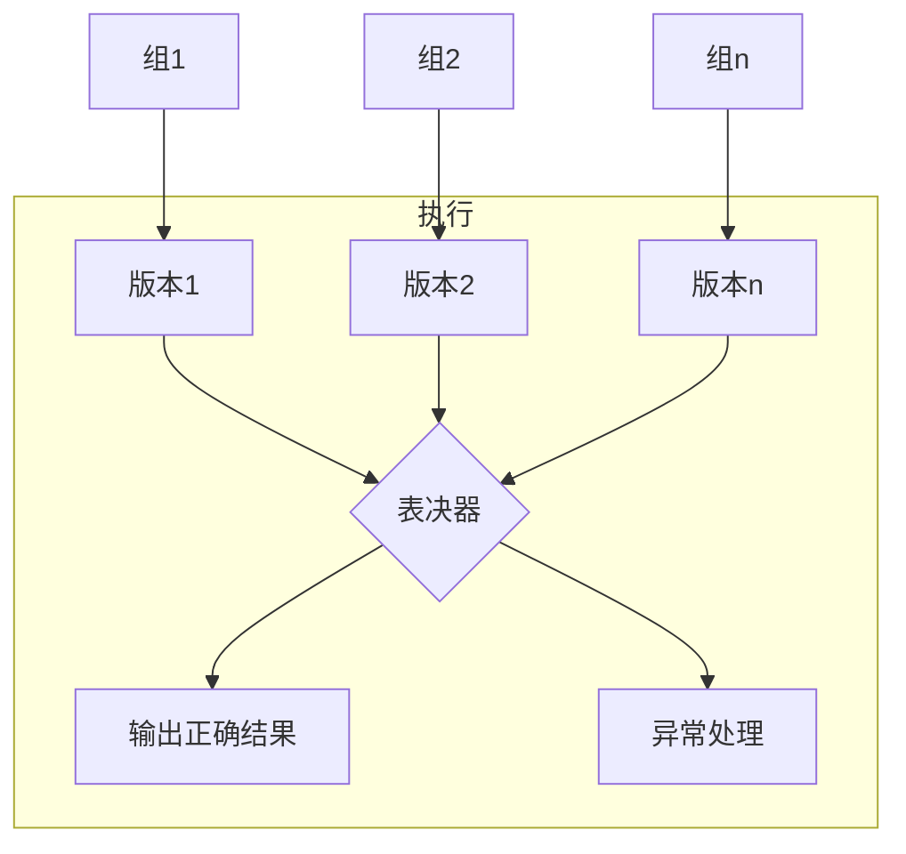
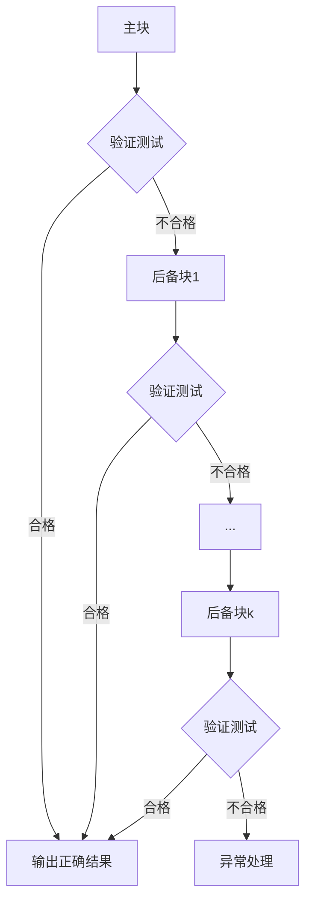

# 第九章 信息安全技术基础知识（摘录整理）

## 一、信息系统安全体系

### 1. 系统安全分类

（1）**实体安全**

- 为保护计算机设备、设施及其他媒体免遭地震、水灾、火灾、有害气体及其他环境事故（如电磁辐射等）的危害而采取的措施与过程。
- 可细分为：**环境安全**、**设备安全**、**媒体安全**。

（2）**运行安全**

运行安全包括以下四个方面：

- **系统风险管理**
- **审计跟踪**
- **备份与恢复**
- **应急**

运行安全是计算机信息系统安全的重要环节，保障系统正常运行与可靠性，防止因偶然或恶意原因对系统造成损害，保障系统**连续、不间断地**提供服务。

（3）**信息安全**

信息安全是指防止信息遭受**非法授权访问**、**修改**、**破坏**或**非法识别和控制**。

信息安全应确保信息的**保密性**、**完整性**、**可用性**和**可控性**。

信息安全可分为七个方面：

1. **操作系统安全**
2. **数据库安全**
3. **网络安全**
4. **病毒防护**
5. **访问控制**
6. **数据加密**
7. **认证（鉴别）**

（4）**人员安全**

- 主要包括使用计算机的人员的**安全意识**、**法律意识**、**安全技能**。

### 2. 系统安全体系结构

（1）**物理环境的安全性**

- 包括通信线路、**物理设备和机房的安全**等。

（2）**操作系统的安全性**

操作系统的安全性主要体现在三个方面：

- 操作系统自身的缺陷，包括**身份认证**、**访问控制**、**系统漏洞**等；
- 操作系统的**安全配置**问题；
- **病毒**对操作系统的威胁。

（3）**网络系统的安全性**

网络系统的安全性侧重于**网络层**的安全，主要包括：

- **网络层身份认证**；
- **网络资源的访问控制**；
- **数据传输的保密性与完整性**；
- **远程访问**的安全；
- **域名系统（DNS）**的安全；
- **路由系统**的安全；
- **入侵检测**的方法与**网络设施**的病毒防护等。

（4）**应用的安全性**

- 由**应用软件和数据**产生的安全问题，包括 Web 服务、电子邮件、DNS 等；还包括病毒对系统（如**数据库系统**）的威胁。

（5）**管理的安全性**

- 包括**安全技术**、**设备**的管理，**安全管理制度**，以及**部门和人员**的组织规章等。

### 3. 安全保护等级

**计算机信息系统安全保护等级划分准则（GB 17859-1999）**

（1）**用户自主保护级：** 适用于普通内联网用户。

系统被破坏后，**对公民、法人和其它组织权益有损害，但不损害国家安全社会秩序和公共利益。**

（2）**系统审计保护级：** 适用于通过内联网或国际网进行商务活动，需要保密的非重要单位。

系统被破坏后，**对公民、法人和其它组织权益有严重损害，或损害社会秩序和公共利益，但不损害国家安全。**

（3）**安全标记保护级：** 适用于地方各级国家机关、金融机构、邮电通信、能源与水源供给部门、交通运输、大型工商与信息技术企业、重点工程建设等单位。

系统被破坏后，**对社会秩序和公共利益造成严重损害，或对国家安全造成损害。**

（4）**结构化保护级：** 适用于中央级国家机关、广播电视部门、重要物资储备单位、社会应急服务部门、尖端科技企业集团、国家重点科研机构和国防建设等部门。

系统被破坏后，**对社会秩序和公共利益造成特别严重损害，或对国家安全造成严重损害。**

（5）**访问验证保护级：** 适用于国防关键部门和依法需要对计算机信息系统实施特殊隔离的单位。

系统被破坏后，**对国家安全造成特别严重损害。**

## 二、数据安全与保密

### 1. 数据加密技术

加密机制有助于保护信息的机密性和完整性，有助于识别信息的来源，它是最广泛使用的安全机制。

#### 1.1 对称加密

（1）**对称加密（又称为私人密钥加密/共享密钥加密）：** 加密与解密使用同一密钥。

（2）**特点：** 加密强度不高，但效率高，易破解；密钥分发困难。

（3）**用途：** 对消息明文进行加密传送。

（4）**常见对称密钥加密算法：**

- **DES：** 替换+移位、56 位密钥、64 位数据块、速度快、密钥易产生。
- **3DES（三重 DES）：** 密钥长度 112 【两个 56 位的密钥 K1、K2】
  - 加密：K1 加密 -> K2 解密 -> K1 加密
  - 解密：K1 解密->K2 加密->K1 解密
- **IDEA：** 128 位密钥、64 位明文/密文，PGP 采用该算法。
- **其它：** RC-5、AES。

#### 1.2 非对称加密

（1）**非对称加密（又称为公开密钥加密）：** 密钥必须成对使用（公钥加密，相应的私钥解密）。

（2）**特点：** 加密强度高，但效率低，极难破解；密钥分发容易。

（3）**用途：** 对密钥加密，做数字签名。

（4）**常见非对称密钥加密算法：**

- **RSA：** 2048 位（或 1024 位）密钥。
- **Elgamal：** 安全性依赖于计算有限域上离散对数这一难题。
- **ECC：** 椭圆曲线算法。

### 2. 认证技术

#### 2.1 概念

认证（authentication）又称为鉴别或确认，它是证实某事物是否名符其实或是是否有效的一个过程。鉴别的基本目的是防止其它实体占用和独立操作被鉴别实体的身份。（第一道设防）

#### 2.2 鉴别的方式

- 已知的
- 拥有的
- 不改变的特性
- 相信可靠的第 3 方建立的鉴别
- 环境

#### 2.3 认证和加密的区别

- 加密用以确保数据的保密性，阻止对手的被动攻击，例如，截取和窃听等；
- 认证用以确保数据发送者和接收者的真实性和报文的完整性，阻止对手的主动攻击，例如，冒充、篡改和重放等。

#### 2.4 信息摘要

- **信息摘要：** 单向散列函数【不可逆】、固定长度的散列值。
- **摘要用途：** 确保信息【完整性】，防篡改。
- 常用的消息摘要算法有 MD5，SHA，HMAC 等，市场上广泛使用的 MD5，SHA-1。

算法的散列值分别为 128 和 160 位，由于 SHA-1 通常采用的密钥长度较长，因此安全性高于 MD5。

#### 2.5 数字签名

发送者使用自己的私钥对摘要签名，接收者利用发送者的公钥对接收到的摘要进行验证。

**数字签名过程分析**

```text
                        数字签名过程分析

    发送方                                              接收方

┌─────────────────────────┐            传输           ┌─────────────────────────┐
│  专业的职业教育平台        │ ─────────────────────▶   │         专业的职业教育平台 │
└───────────┬─────────────┘                          └───────────┬─────────────┘
            │ 产生【信息摘要】                                      │ 产生【信息摘要】
            ▼                                                    ▼
┌─────────────────────────┐                ┌─────────────────────┐   ┌──────────────────────┐
│ a3eaa9850273621f7082e   │                │ a3eaa9850273621f7082e│  │ a3eaa9850273621f7082e│
│ da29f08c6a3             │                │ da29f08c6a3         │◀─▶│ da29f08c6a3          │
└───────────┬─────────────┘                └─────────────────────┘   └───────────┬──────────┘
            │ 【A的私钥】签名                    比对【信息摘要】是否一致              │ 【A的公钥】验证签名
            ▼                                                                    ▼
┌─────────────────────────┐                          ┌──────────────────────────┴┐
│ (*#@&(*&#@#             │            传输          │ (*#@&(*&#@#              │
└─────────────────────────┘ ─────────────────────▶ └────────────────────────────┘
```

#### 2.6 数字证书

数字证书内容：

- 证书的版本信息；
- 证书的序列号，每个证书都有一个唯一的证书序列号；
- 证书所使用的签名算法；
- 证书的发行机构名称，命名规则一般采用 X.500 格式；
- 证书的有效期，现在通用的证书一般采用 UTC 时间格式，它的计时范围为 1950-2049；
- 证书所有人的名称，命名规则一般采用 X.500 格式；
- 证书所有人的公开密钥；
- 证书发行者对证书的签名。

### 3. 密钥管理体制

#### 3.1 密钥管理体制类型

| 类型名称 | 内容                                                                                                                                                                                                                                                                  |
| -------- | --------------------------------------------------------------------------------------------------------------------------------------------------------------------------------------------------------------------------------------------------------------------- |
| PKI      | 公钥基础设施，利用公钥理论和技术建立的提供安全服务的基础设施，其适用于开放网。                                                                                                                                                                                        |
| KMI      | 密钥管理基础设施，是一种密钥统一集中式管理机制，适用于各种专用网。传统密钥管理中心 KMC，适用于封闭网。                                                                                                                                                                |
| SPK      | SPK（Self-Extracting Public-Key）密钥管理是一种结合了对称加密和非对称加密的密钥管理方法。它通过使用一个对称密钥来加密一段数据，同时使用非对称密钥来确保数据的安全性，其适用于规模化专用网。其包括多重公钥（双钥）（LPK/LDK）和组合公钥（双钥）（CPK/CDK）等密钥算法。 |
| PMI      | 授权管理基础设施，其以资源管理为核心，对资源的访问控制权统一交由授权机构统一处理，其适用于封闭网，以传统的密钥管理中心为代表的机制。                                                                                                                                  |

#### 3.2 PKI 和 KMI 比较

| 比较项目     | PKI                        | KMI                        |
| ------------ | -------------------------- | -------------------------- |
| **作用特性** | 良好的扩展性，适于开放业务 | 很好的封闭性，适于专用业务 |
| **服务功能** | 只提供数字签名服务         | 提供数据加密和数字签名功能 |
| **信任逻辑** | 第三方管理模式             | 集中式的主管方管理模式     |
| **负责性**   | 个人负责的技术体系         | 单位负责制                 |
| **应用角度** | 主外                       | 主内                       |

#### 3.3 国产密码算法

| 算法名称 | 算法特性描述                                             | 备注                                                         |
| -------- | -------------------------------------------------------- | ------------------------------------------------------------ |
| **SM1**  | 对称加密，分组长度和密钥长度都为 128 比特                | 广泛应用于电子政务、电子商务及国民经济的各个应用领域         |
| **SM2**  | 非对称加密，用于公钥加密算法、密钥交换协议、数字签名算法 | 国家标准推荐使用素数域 256 位椭圆曲线                        |
| **SM3**  | 杂凑算法，杂凑值长度为 256 比特                          | 适用于商用密码应用中的数字签名和验证                         |
| **SM4**  | 对称加密，分组长度和密钥长度都为 128 比特                | 适用于无线局域网产品                                         |
| **SM9**  | 标识密码算法                                             | 不需要申请数字证书，适用于互联网应用的各种新兴应用的安全保障 |

## 三、通信与网络安全技术

### 1. 防火墙

隔离内网与外网，阻挡对网络的非法访问和不安全数据传递。

- **[应用层防火墙]** 效率低，安全性高。
- **[网络层防火墙]** 效率高，安全性低。

### 2. 虚拟专用网 VPN

**关键技术：**

- 隧道技术（VPN 基本技术）
- 加解密技术
- 密钥管理技术
- 身份认证技术
- 访问控制技术

### 3. 安全协议

```text
┌──────┐ ┌──────┐ ┌────────────────┐          ┌──────────────────┐
│ PGP  │ │ Https│ │                │          │     应用层        │
└──────┘ └──────┘ │                │          ├──────────────────┤
                  │                │          │     表示层        │
                  │                │          ├──────────────────┤
                  │      SSL       │          │     会话层        │
                  │                │          └──────────────────┘
- - - - - - - - - - - - - - - - - - - - - - - - - - - - - - - - - - - - - - - - - -
┌──────┐ ┌──────┐ │                │           ┌──────────────────┐
│ TLS  │ │ SET  │ │      SSL       │           │     传输层        │
└──────┘ └──────┘ └────────────────┘           └──────────────────┘
- - - - - - - - - - - - - - - - - - - - - - - - - - - - - - - - - - - - - - - - - -
┌────────┐ ┌────────┐                          ┌──────────────────┐
│ 防火墙  │ │ IPSec  │                          │     网络层        │
└────────┘ └────────┘                          └──────────────────┘
- - - - - - - - - - - - - - - - - - - - - - - - - - - - - - - - - - - - - - - - - -
┌────────┐ ┌──────┐ ┌──────┐                   ┌──────────────────┐
│链路加密 │ │ PPTP │ │ L2TP │                   │   数据链路层       │
└────────┘ └──────┘ └──────┘                   └──────────────────┘
- - - - - - - - - - - - - - - - - - - - - - - - - - - - - - - - - - - - - - - - - -
┌──────┐ ┌──────┐                              ┌──────────────────┐
│ 隔离 │  │ 屏蔽 │                              │     物理层         │
└──────┘ └──────┘                              └──────────────────┘
```

- **PGP（Pretty Good Privacy）：** 针对邮件和文件的混合加密系统。
- **SSL（Secure Sockets Layer）：** 工作在传输层至应用层。
- **TLS（Transport Layer Security）：** 传输层安全协议。
- **SET（Secure Electronic Transaction）：** 安全电子交易协议。电子商务，身份认证。普遍的说法是将其归为应用层。
- **IPsec（Internet Protocol Security）：** 对 IP 包加密。

#### 3.1 SSL（传输层的安全协议）

（1）用于在 Internet 上传送机密文件。

（2）SSL 协议由握手协议、记录协议和警报协议组成。

- SSL 握手协议用来在客户与服务器真正传输应用层数据之前建立安全机制。
- SSL 记录协议根据握手协议协商的参数，对应用层送来的数据进行加密、压缩和计算消息鉴别码，然后经传输层发送给对方；
- SSL 警报协议用来在客户和服务器之间传递 SSL 出错信息。

**（3）SSL 主要提供三个方面的服务**

- 用户和服务器的合法性认证；
- 加密数据以隐藏被传送的数据；
- 保护数据的完整性。

**（4）SSL 使用 40 位关键字作为 RC4 流加密算法（适合商业信息加密）**

**（5）SSL 是一个保证计算机通信安全的协议，对通信对话过程进行安全保护，其实现过程主要经过如下几个阶段：**

接通阶段 => 密码交换阶段 => 会谈密码阶段 => 检验阶段 => 客户认证阶段 => 结束阶段

#### 3.2 IPSec（网络层的安全协议）---针对 IPv4 和 IPv6 的

（1）是一个工业标准网络安全协议，为 IP 网络通信提供透明的安全服务，保护 TCP/IP 通信免遭窃听和篡改，可以有效抵御网络攻击，同时保持易用性。

（2）其主要特征是可以支持 IP 级所有流量的加密和/或认证，增强所有分布式应用的安全性。

（3）IPSec 在 IP 层提供安全服务，使得系统可以选择所需要的安全协议，确定该服务所用的算法，并提供安全服务所需任何加密密钥。

（4）IPSec 基于一种端对端的安全模式。（基本前提假设：数据通信的传输媒介是不安全的）

（5）使用 IPSec 可以显著地减少或防范网络攻击。

- Sniffer
- 数据篡改
- 身份欺骗，盗用口令，应用层攻击
- 中间人攻击
- 拒绝服务攻击

（6）IPSec 有两个基本目标：

- 保护 IP 数据包安全
- 为抵御网络攻击提供防护措施

（7）结合密码保护服务、安全协议组和动态密钥管理三者来实现。

### 4. 单点登录技术

（1）**单点登录（Single Sign-On, SSO）** 技术是通过用户的一次性认证登录，即可获得需要访问系统和应用软件的授权，在此条件下，管理员不需要修改或干涉用户登录，就能方便地实现希望得到的安全控制。

（2）基于数字证书的加密和数字签名技术。

（3）基于统一策略的用户身份认证和授权控制功能。

（4）对用户实行集中、统一的管理和身份认证。——以区别不同的用户和信息访问者，并作为各应用系统的统一登录入口。

（5）为通过身份认证的合法用户签发针对各个应用系统的登录票据 (ticket) —— “一点登录，多点漫游”。

（6）必要时，单点登录系统能够与统一权限管理系统实现无缝结合，签发合法用户的权限票据，从而能够使合法用户进入其权限范围内的各应用系统，并完成符合其权限的操作。

（7）一个理想的 SSO 产品应该具备以下的特征和功能：

- **常规特征。**支持多种系统、设备和接口。
- **终端用户管理灵活性。**包括通常的账号创建、口令管理和用户识别。口令管理包括口令维护、历史记录和文法规则等；支持各种类型的令牌设备和生物学设备。
- **应用管理灵活性。**若多个会话同时与一个公共主体相关，设备场景管理能保证若其中一个会话发生改变，其它相关会话自动更新；能监控特定信息的使用；可将各种应用绑定在一起，来保证应用的一致性。
- **移动用户管理。**保证用户在不同的地点对信息资源进行访问。
- **加密和认证。**加密保证信息在终端用户和安全服务器之间传输时的安全性；认证保证用户的真实性。
- **访问控制。**保证只有用户被授权访问的应用可以提供给用户。
- **可靠性和性能。**包括 SSO 和其它访问控制程序之间的接口的可靠性和性能，以及接口的复杂度等。

**注：**单点登录的实施可以 Kerberos 机制和外壳脚本机制来实现，也可以采用通用的安全服务 API 和分布式计算环境。

## 四、系统访问控制技术

### 1. 概念

访问控制技术是系统安全防范和保护的主要核心策略，它的主要任务是保证系统资源不被非法使用和访问。访问控制规定了主体对客体访问的限制，并在身份识别的基础上，根据身份对提出资源访问的请求加以控制。

### 2. 访问控制的目标

- 防止非法用户进入系统；
- 阻止合法用户对系统资源的非法使用，即禁止合法用户的越权访问。

### 3. 访问控制的三要素

- **主体（Subject）：** 可以对其它实体施加动作的主动实体【组织/用户组、用户本身，用户使用的终端，应用服务程序或进程。】
- **客体（Object）：** 是接受其它实体访问的被动实体【信息、文件或记录等的集合体，硬件设施等资源，终端等对象。】
- **控制策略：** 是主体对客体的操作行为集和约束条件集。主体对客体的访问规则集。

### 4. 访问控制策略包括

- 登录访问控制
- 操作权限控制
- 目录安全控制
- 属性安全控制
- 服务器安全控制

### 5. 安全模型

| 安全模型                     | 类别   | 规则                                                                     |
| :--------------------------- | :----- | :----------------------------------------------------------------------- |
| **Bell-LaPadula (BLP) 模型** | 机密性 | • 不可上读<br>• 不可下写<br>• 不允许跨级别进行读写<br>• 使用访问控制矩阵 |
| **Lattice 模型**             | 机密性 | 同“安全集束”：<br>• 不可上读<br>• 不可下写                               |
| **Biba 模型**                | 完整性 | • 不可上写<br>• 不可下读<br>• 不可上调                                   |

### 6. 访问控制分类

| 控制类型                                                | 说明                                                                                                                                                                                                                                                                                                                                     |
| :------------------------------------------------------ | :--------------------------------------------------------------------------------------------------------------------------------------------------------------------------------------------------------------------------------------------------------------------------------------------------------------------------------------- |
| **基于对象的访问控制** (Object-Based Access Control)    | OBAC 访问控制系统是从信息系统的数据差异变化和用户需求出发，有效地解决了信息数据量大、数据种类繁多、数据更新变化频繁的大型管理信息系统的安全管理。控制策略和控制规则是 OBAC 访问控制系统的核心所在。                                                                                                                                      |
| **基于角色的访问控制** (Role-Based Access Control)      | RBAC 就是指根据完成某些职责任务所需要的访问权限来进行授权和管理。RBAC 由用户 (U)、角色 (R)、会话 (S) 和权限 (P) 四个基本要素组成。                                                                                                                                                                                                       |
| **基于任务的访问控制** (Task-Based Access Control)      | TBAC 是从应用和企业层角度来解决安全问题，以面向任务的观点，从任务 (活动) 的角度来建立安全模型和实现安全机制，在任务处理的过程中提供动态实时的安全管理。<br>TBAC 模型由工作流、授权结构体、受托人集和许可集四部分组成。<br>其一般用五元组 (S, O, P, L, AS) 来表示，其中 S 表示主体，O 表示客体，P 表示许可，L 表示生命期，AS 表示授权步。 |
| **基于属性的访问控制** (Attribute-Based Access Control) | ABAC 是根据主体的属性、客体的属性、环境的条件以及访问策略对主体的请求操作进行授权许可或拒绝。                                                                                                                                                                                                                                            |

## 五、容灾与业务持续

### 1. 灾难恢复技术

#### 1.1 灾难恢复的两个关键概念

- **恢复点目标（Recovery Point Objective, RPO）：** 指灾难发生后，容灾系统能将数据恢复到灾难发生前时间点的数据，它是衡量企业在灾难发生后会丢失多少数据的指标；(企业能容忍的最大数据丢失量)
- **恢复时间目标（Recovery Time Objective, RTO）：** 是指灾难发生后，从系统宕机导致业务停顿之时刻开始，到系统恢复至可以支持业务部门运作，业务恢复运营之时，此两点之间的时间。(企业能容忍的恢复时间)

#### 1.2 理想状态与实际状态

- **理想状态下：** 希望 RTO=0, RPO=0，即灾难发生对企业生产毫无影响。
- **实际状态：** 尽量减少灾难造成的损失：在 RTO 目标定义下，用于灾难备份的投入应不大于对应的业务损失。

#### 1.3 《信息系统灾难恢复规范》的 6 个等级

《信息系统灾难恢复规范》将灾难恢复划分为 6 个等级

| 级别    | 支持                                 |
| :------ | :----------------------------------- |
| 第 1 级 | 基本支持                             |
| 第 2 级 | 备用场地支持                         |
| 第 3 级 | 电子传输和部分设备支持               |
| 第 4 级 | 电子传输及完整设备支持               |
| 第 5 级 | 实时数据传输及完整设备支持           |
| 第 6 级 | 数据零丢失和远程集群支持（最高级别） |

#### 1.4 容灾系统的实现

容灾系统的实现可以采用不同的技术：

- 采用硬件进行远程数据复制
- 采用软件实现远程的实时数据复制，并且实现远程监控和切换

#### 1.5 容灾技术的分类

按对系统的保护程度来分：数据容灾和应用容灾（高可用性级别逐渐提高）

**（1）数据容灾：关注点在于数据，确保用户原有的数据不会丢失或遭到破坏。(较为基础)**

- 较低级别的数据容灾方案仅利用磁带库和管理软件就能实现数据异地备份，达到容灾的功效；
- 较高级别的数据容灾方案是依靠数据复制工具，例如卷复制软件，或者存储系统的硬件控制器，实现数据的远程复制。

**（2）应用容灾：在数据容灾的基础上，将执行应用处理能力复制一份，即在备份站点同样构建一套应用系统。**

应用容灾系统能提供不间断的应用服务，用户感受不到灾难的发生（透明），保证信息系统提供的服务完整、可靠和安全。

一般来说，应用容灾系统需要通过更多软件来实现，快速切换，确保业务的连续性。

### 2. 灾难恢复规划

**2.1 信息系统的灾难恢复工作包括：**

（1）灾难恢复规划（一个周而复始、持续改进的过程）

1. 灾难恢复需求的确定：

- 风险分析
- 业务影响评估
- 确定灾难恢复目标

2. 灾难恢复策略的制定：支持灾难恢复各个等级所需的资源可分为 7 个要素：数据备份系统、备用数据处理系统、备用网络系统、备用基础设施、技术支持能力、运行维护管理能力和灾难恢复预案。

3. 灾难恢复策略的实现：

- 灾难备份系统技术方案的实现
- 灾难备份中心的选择和建设
- 技术支持能力的实现
- 运行维护管理能力的实现
- 灾难恢复预案的实现

4. 灾难恢复预案的制定（起草-评审-测试-修订-审核和批准）、落实和管理

（2）灾难备份中心的日常运行

（3）灾难发生后的应急响应

（4）关键业务功能在灾难备份中心的恢复和重续运行

（5）主系统的灾后重建和回退工作

## 六、安全管理措施

### 1.安全管理的内容

安全管理应当涉及系统安全的各个方面，包括制定安全策略、风险评估、控制目标与方式选择、制定规范的操作流程、对人员进行安全培训等一系列工作。

| 管理内容     | 说明                                                                                                                                           |
| :----------- | :--------------------------------------------------------------------------------------------------------------------------------------------- |
| **密码管理** | 被保护信息的机密性和完整性等安全特性由相应密码模块的功能来实现。因此，将密码模块置于系统中，以及相应的密码管理就显得尤为重要。                 |
| **网络管理** | 网络管理一般包括配置管理、性能管理、安全管理、计费管理和故障管理等。（理想的网络管理需要建立一个整体网络安全管理解决方案）                     |
| **设备管理** | 设备安全管理包括设备的选型、检测、安装、登记、使用、维护和存储管理等多方面的内容。                                                             |
| **人员管理** | 人始终是影响信息系统安全的最大因素，人员管理也就成为信息系统安全管理的关键。<br>（管理核心：要确保有关业务人员的思想素质、职业道德和业务素质） |

### 2. 安全审计

**（1）安全审计四要素**

- 控制目标
- 安全漏洞
- 控制措施
- 控制测试

**（2）安全审计功能（6 个部分）**

- 安全审计自动响应
- 安全审计自动生成
- 安全审计分析
- 安全审计浏览
- 安全审计事件选择
- 安全审计事件存储

### 3. 私有信息保护

**个人私有信息泄漏的途径：**

（1）利用操作系统和应用软件的漏洞

（2）网络系统设置

（3）程序的安全性

（4）拦截数据包

（5）假冒正常的商业网站

（6）用户自身因素

（7）其它

## 七、区块链技术

### 1. 概念

- 【区块链】≠ 比特币
- 比特币底层采用了区块链技术。但是比特币交易在我国定性为【非法运用】。

### 2. 区块链分类

**（1）公有链（PublicBlockChains）**

无官方组织及管理机构，无中心服务器，参与的节点按照系统规则自由接入网络、不受控制，节点间基于共识机制开展工作。如比特币、以太坊、Hyperledger、大多数山寨币以及智能合约等；公有链的始祖是比特币区块链。

**（2）私有链（PrivateBlockChains）**

在特定企业内部建立，规则根据企业需求设定，修改或读取权限仅限于少数节点，同时仍保留区块链的真实性和部分去中心化。

**（3）联盟链（ConsortiumBlockChains）**

由若干机构共同发起，介于公有链与私有链之间，具有部分去中心化特征。

### 3. 特点

| 特点                 | 描述                                                                                                                                                                                    |
| :------------------- | :-------------------------------------------------------------------------------------------------------------------------------------------------------------------------------------- |
| **去中心化**         | 由于采用分布式记账和存储，不存在中心化的硬件或管理机构，任意节点的权利和义务相等，系统中的数据区块由具有维护功能的节点共同维护。                                                        |
| **开放性**           | 系统是开放的，例如，【区块链上的交易信息是公开的】，而【账户身份信息高度加密】。                                                                                                        |
| **自治性**           | 区块链采用基于共识的规范与协议（例如一套公开透明的算法），使系统中所有节点能在可信环境中自由、安全地交换数据；对“人”的信任转变为对机器的信任，人为干预不起作用。                        |
| **安全性（防篡改）** | 数据在多个节点上以多份副本存储，篡改数据需要改变 51% 以上节点的数据，难度很大。同时还有其它安全机制；例如，每一笔比特币交易均由付款人使用私钥签名，证明其同意向某人付款，他人无法伪造。 |
| **匿名性（去信任）** | 由于节点之间的交换遵循固定算法，数据交互是无需信任的（区块链中的程序规则会自动判断活动是否有效），因此无需通过披露身份来建立信任，对信用的积累很有帮助。                                |

### 4. 区块链的核心技术

| 技术           | 描述                                                                                                                                                     |
| :------------- | :------------------------------------------------------------------------------------------------------------------------------------------------------- |
| **分布式存储** | 简单地说，它是一种将数据分散存储在多个地点的数据存储技术。存储的数据可在多个参与者之间共享；每个人都可以参与并平等地共同记录数据，主要承担数据存储功能。 |
| **共识机制**   | 由于在区块链的分布式网络中没有中心机构，需要一种决策机制来促进参与者之间达成一致。共识机制是协调大家如何处理数据的机制，它决定谁获得数据的记账权。       |

| 概念         | 说明                                                                                                                                                                                                                                                               |
| :----------- | :----------------------------------------------------------------------------------------------------------------------------------------------------------------------------------------------------------------------------------------------------------------- |
| **智能合约** | 智能合约，是一种旨在以信息化方式传播、验证或执行合同的计算机协议。智能合约可以在没有第三方的情况下，也能进行可信的交易，而且这些交易可追踪且不可逆转。所以，智能合约在系统中，主要起到了数据的执行作用。【执行智能合约的机制：去中心化网络+共识机制+受激励的矿工】 |
| **密码学**   | 密码学，是一种特殊的加密和解密技术，区块链系统中，应用了多种多样的密码学技术，包括哈希算法、公钥私钥、数字签名等等，以此来保证整个系统的数据安全，并且证明了数据的归属。                                                                                           |

## 八、系统可靠性

### 1. 可靠性相关基本概念

**（1）可靠性与可用性**

- **可靠性**是软件系统在应用或系统错误面前，在意外或错误使用的情况下维持软件系统的功能特性的基本能力。
- **可用性**是系统能够正常运行的时间比例。

**（2）软件可靠性 ≠ 硬件可靠性**

**（3）复杂性：** 软件复杂性比硬件高，大部分失效来源于软件失效。

**（4）物理退化：** 硬件失效主要是物理退化所致，软件不存在物理退化。

**（5）唯一性：** 软件是唯一的，每个 COPY 版本都一样，而两个硬件不可能完全一样。

**（6）版本更新周期：** 硬件较慢，软件较快。

**（7）系统可靠性四个特性：**

- 成熟性（避免失效）
- 容错性（维持性能）
- 易恢复性（重建与恢复）
- 可靠性的依从性（标准约束）

### 2. 系统可靠性模型

| 模型                         | 说明                                                                                                                               |
| :--------------------------- | :--------------------------------------------------------------------------------------------------------------------------------- |
| **时间模型**                 | 系统中的故障数目在 t=0 时是常数，随着故障被纠正，故障数目逐渐减少。系统经过一段时间的调试后剩余故障的数目可用公式来估计。          |
| **故障植入模型（面向错误）** | 以系统中的错误数作为衡量可靠性的标准。<br>（1）系统中的固有错误数是一个未知的常数。<br>（2）系统中的人为错误数按均匀分布随机植入。 |
| **误数的数学模型**           | （3）系统中的固有错误数和人为错误被检测到的概率相同。<br>（4）检测到的错误立即改正。                                               |
| **数据模型**                 | 对于一个预先确定的输入环境，系统的可靠性定义为在 n 次连续运行中系统完成指定任务的概率。                                            |

### 3. 可靠性分析

**（1）串联系统计算**

- 可靠性：$R = R1 _ R2 _ ... \* R_n
- 失效率近似公式：λ = λ1 + λ2 + ... + λn

**（2）并联系统计算**

$R = 1 - (1 - R1) _ (1 - R2) _ ... \* (1 - Rn)

**（3）N 模混联系统**

先将整个系统划分为多个部分串联 R1、R2…等，再计算 R1、R2 内部的并联可靠性，代入原公式。

### 4. 影响可靠性的主要因素

1. 软件的开发方法和开发环境；
2. 运行环境；
3. 软件规模；
4. 软件内部结构；
5. 软件的可靠性投入。

## 九、冗余技术

结构示意（ASCII）：

```text
                    +---------------------------------------+
                    | 出错后报警，人工处理，成本较低。            |
                    +-------------------+-------------------+
                                        ^
                                        | (检错技术 向上)
  避错技术                               |
  降低复杂度设计                          |
  检错技术 ------------------------------+

  容错技术 ==================================================> +----------------------------------+
                                        |                     | N版本程序设计（静态冗余）            |
                                        |                     | 恢复块设计（动态冗余）              |
                                      [冗余]                   | 防卫式程序设计                     |
                                        |                     +----------------------------------+
                                        V
                    +-------------------------------------------------------+
                    | 结构冗余（硬件冗余、软件冗余）                             |
                    | 信息冗余（校验码）                                       |
                    | 时间冗余（重复多次进行相同的计算）                          |
                    +-------------------------------------------------------+
```

### 1. 双机容错系统

**工作模式：**

（1）双机热备模式（主系统、备用系统）

（2）双机互备模式（同时提供不同的服务，心不跳则接管）

（3）双机双工模式（同时提供相同的服务，集群的一种）

**注：**双机模式是集群的前身

## 十、软件容错技术

### 1. N 版本程序设计



与通常软件开发过程不同的是，N 版本程序设计增加了三个新的阶段：相异成分规范评审、相异性确认、背对背测试

N 版本程序的同步、N 版本程序之间的通信、表决算法（全等表决、非精确表决、Cosmetie 表决）、一致比较问题、数据相异性

### 2. 恢复块方法



设计时应保证实现主块和后备块之间的独立性，避免相关错误的产生，使主块和备份块之间的共性错误降到最低程度。

必须保证验证测试程序的正确性。

### 3. 防卫式程序设计

对于程序中存在的错误和不一致性，通过在程序中包含错误检查代码和错误恢复代码，使得一旦错误发生，程序能撤销错误状态，恢复到一个已知的正确状态中去。

实现策略：错误检测、破坏估计、错误恢复。
